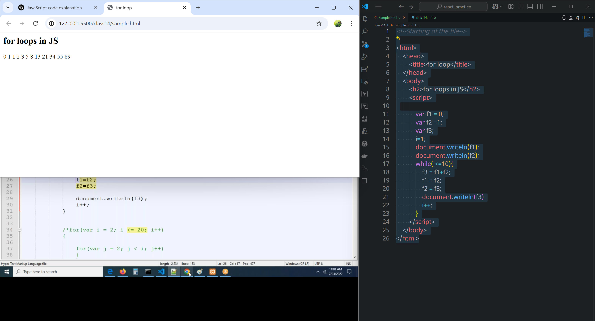

# class 14
# Loops
```html
<!--Starting of the file-->

<html>
    <head>
        <title>for loop</title>
    </head>
    <body>
        <h2>for loops in JS</h2>
        <script>
            
            for (var i = 2; i <= 2000; i++) {

                    var isPrime = true;
                    for (var j = 2; j < i; j++) {
                            if (i % j === 0) {
                                isPrime = false;
                                break;
                            }
                    }
                    
                    if (isPrime) {
                        document.write(i + "<br />");
                    }
                }

        
        </script>
    </body>
</html>
```
## fibobacci series number

fibonacci series = 0 1 1 2 3 5  8 13            21 34 55
```html
<!--Starting of the file-->

<html>
    <head>
        <title>for loop</title>
    </head>
    <body>
        <h2>for loops in JS</h2>
        <script>

            var f1 = 0;
            var f2 =1;
            var f3;
            i=1;
            document.writeln(f1);
            document.writeln(f2);
            while(i<=10){
                f3 = f1+f2;
                f1 = f2;
                f2 = f3;
                document.writeln(f3)
                i++;
            }
        </script>
    </body>
</html>

```


# Events

# Arrary's
```html
<!--Starting of the file-->

<html>
    <head>
        <title>for loop</title>
    </head>
    <body>
        <h2>for loops in JS</h2>
        <script>


            var items = ['apple', 'banana', 'jack fruit', 'grapes'];


            //modifying
            items[2] = 'vinay';
            console.log(items)

            //finding lenght
            console.log(items.length)

            //push  // adding component to last
            items.push('akhil')
            console.log(items)

            //pop()
            items.pop();
            console.log(items)

            //shift() //removing first value
            items.shift()
            console.log(items)

            //unshift() //adding elements to the beginning
            items.unshift('first');
            console.log(items);

            //index() 
            console.log(items.indexOf('banana'));

            //include() //true or false
            console.log(items.includes('vinay'))

            //array of for loop
            for(i=0;i<items.length;i++){

                console.log(items[i]);
            }

            //for of  loop
            for(let item of items){
                console.log(item)
            }


        </script>
    </body>
</html>

```