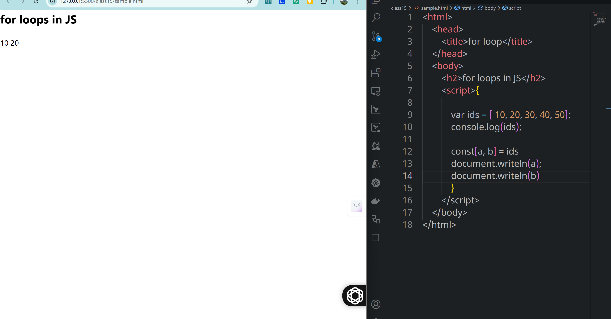
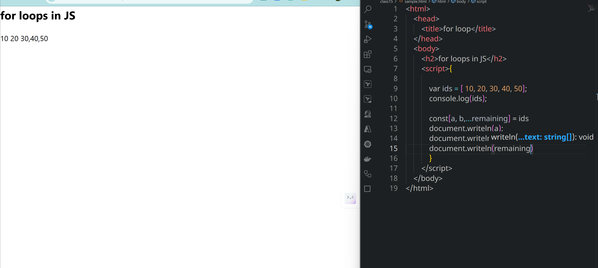

# class 15
# Arrays
## syntax
```js
const arr = ['value1', value2, ......'valuen'];
const ids = [ 1, 3, 3, 5,6];
cosnt names = ['akhil', 'sai'];
const mixed = [ 1, 'akhil', {name: akhil}];

```
```js
const users = [
    {firstname: 'akhil', lastname: 'konduri'},
    {firstname: 'sai', lastname: 'konduri'},
    {firstname: 'varshath', lastname: 'konduri'},
]
```
### note:
* the value of an array may be a number, string, null, undefined, array, object.
* We can store multiple values in a array
### purpose
* To store multiple values in a single variable.
### accessing array
```js
const ids = [1, 2, 3, 4, 5, {name: 'akhil', village: 'martur'}];
console.log(ids[0]);
console.log(ids[5].name);
```
### Object Destructuring
* The destructuring assignment syntax is a JS expression that makes it possible to unpack properties from objtects, into distinct variables. 
or 

converting object properties into variables
```js
            var obj = {firstname: 'akhil', lastname: 'konduri', city: 'Hyd'};
            document.writeln(obj.firstname)
            document.writeln(obj['lastname'])
            /* Object  Destructuring
            ====================*/

            const {firstname, lastname} = obj;
            document.writeln(firstname, lastname, Hyd);

```

### Array Destructuring
* The destructuring assignment syntax is a JS expression that makes it possible to unpack properties from array into distinct variables. 

```js
            var ids = [ 10, 20, 30, 40, 50];
            console.log(ids);

            const[a, b] = ids
            document.writeln(a);
            document.writeln(b); 
```
#### using rest operator with the array destructuring
```html
<html>
    <head>
        <title>for loop</title>
    </head>
    <body>
        <h2>for loops in JS</h2>
        <script>{

            var ids = [ 10, 20, 30, 40, 50];
            console.log(ids);

            const[a, b,...remaining] = ids
            document.writeln(a);
            document.writeln(b)
            document.writeln(remaining)
            }
        </script>
    </body>
</html>
```

