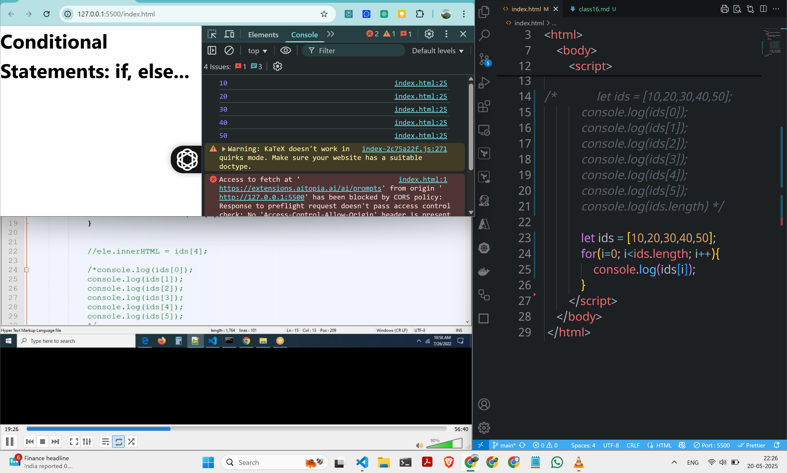
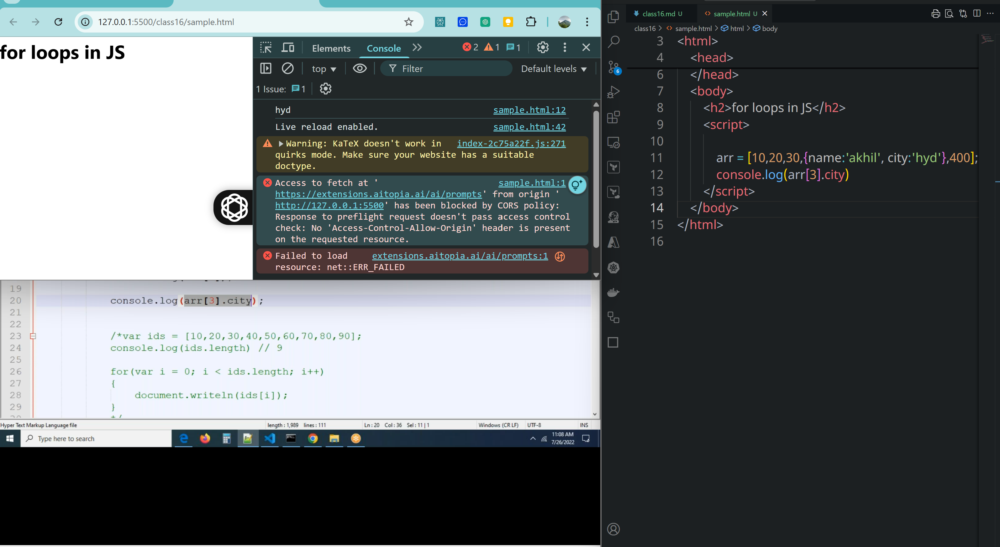
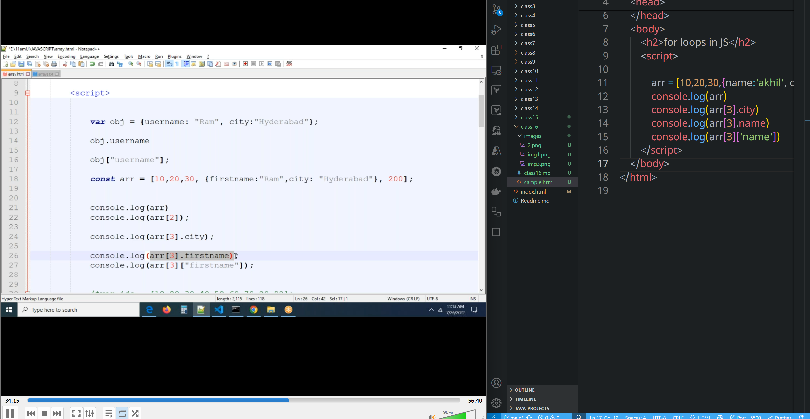
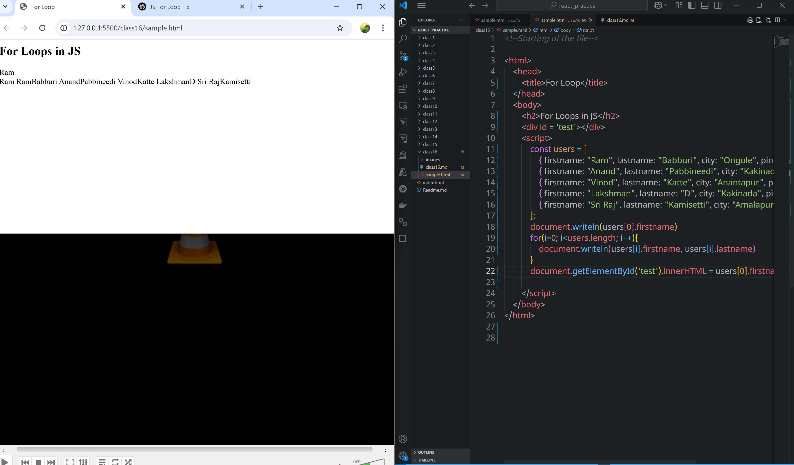

# class16
# Arrray Destructing and object Destructuring
### How can you find no of elements in a array?
*By using `length` property we can find it




```html
<!--Starting of the file-->

<html>
    <head>
        <title>for loop</title>
    </head>
    <body>
        <h2>for loops in JS</h2>
        <script>
            let obj = {
                firstname:  'akhil',
                lastname: 'konduri',
                address: ['maithrivanam', 'ameerpet'],
                country: 'india'
            }
            console.log(obj.address[0])
        </script>
    </body>
</html>

```
```html
<!--Starting of the file-->

<html>
    <head>
        <title>For Loop</title>
    </head>
    <body>
        <h2>For Loops in JS</h2>
        <script>
            const users = [
                { firstname: "Ram", lastname: "Babburi", city: "Ongole", pincode: 500032 },
                { firstname: "Anand", lastname: "Pabbineedi", city: "Kakinada", pincode: 533001 },
                { firstname: "Vinod", lastname: "Katte", city: "Anantapur", pincode: 515671 },
                { firstname: "Lakshman", lastname: "D", city: "Kakinada", pincode: 533006 },
                { firstname: "Sri Raj", lastname: "Kamisetti", city: "Amalapuram", pincode: 533249 }
            ];
            document.writeln(users[0].firstname)
        </script>
    </body>
</html>

```

```js
          const users = [
                { firstname: "Ram", lastname: "Babburi", city: "Ongole", pincode: 500032 },
                { firstname: "Anand", lastname: "Pabbineedi", city: "Kakinada", pincode: 533001 },
                { firstname: "Vinod", lastname: "Katte", city: "Anantapur", pincode: 515671 },
                { firstname: "Lakshman", lastname: "D", city: "Kakinada", pincode: 533006 },
                { firstname: "Sri Raj", lastname: "Kamisetti", city: "Amalapuram", pincode: 533249 }
            ];
            document.writeln(users[0].firstname)
            for(i=0; i<users.length; i++){
                document.writeln(users[i].firstname, users[i].lastname)
            }
```
