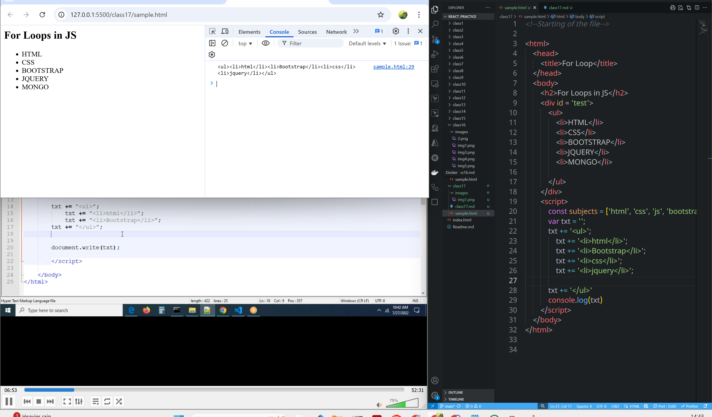

# class 17
# array destructuring and object destructuring
```html
<!--Starting of the file-->

<html>
    <head>
        <title>For Loop</title>
    </head>
    <body>
        <h2>For Loops in JS</h2>
        <div id = 'test'>
            <ul>
                <li>HTML</li>
                <li>CSS</li>
                <li>BOOTSTRAP</li>
                <li>JQUERY</li>
                <li>MONGO</li>
            </ul>
        </div>
        <script>
            const subjects = ['html', 'css', 'js', 'bootstrap']
        </script>
    </body>
</html>
```
* Here names are static through div element

Great question!

In HTML:

### 🔸 `<ul>` — Unordered List

* Stands for **"unordered list"**.
* It creates a **bulleted list** (each item is marked with a bullet point).
* Used to group a list of items that don’t need to be in a specific order.

### 🔹 `<li>` — List Item

* Stands for **"list item"**.
* Used **inside** a `<ul>` (or `<ol>`) to define each individual item in the list.

---

### ✅ Example:

```html
<ul>
  <li>HTML</li>
  <li>CSS</li>
  <li>JavaScript</li>
</ul>
```

🔹 **This will display as:**

* HTML
* CSS
* JavaScript

---

### Other List Types:

* `<ul>` = unordered list (bullets)
* `<ol>` = ordered list (numbered)
* `<li>` = list item (used inside both)

Would you like to see an example using `<ol>` for comparison?

#### we need to dynamically insert those elements


```html
<!--Starting of the file-->

<html>
    <head>
        <title>For Loop</title>
    </head>
    <body>
        <h2>For Loops in JS</h2>
        <div id = 'test'>

        </div>
        <script>
            const subjects = ['html', 'css', 'js', 'bootstrap']
            var txt = '';

                txt += '<ul>';
                    for(i=0; i<subjects.length;i++){
                        txt+= '<li>'+subjects[i]+'</li>'
                    }
            txt += '</ul>'
            


            console.log(txt)
            document.getElementById('test').innerHTML = txt
        </script>
    </body>
</html>
```


**Note:-**
* **`<tr>`**- table row
* **`<th>`**- table header
* **`<td>`**- table data

```html
<!--Starting of the file-->

<html>
    <head>
        <title>For Loop</title>
    </head>
    <body>
        <h2>For Loops in JS</h2>
        <div id = 'test'>
        </div>
        <script>
        const users = [
        { firstname: "Ram", lastname: "Babburi", city: "Ongole", pincode: 500032 },
        { firstname: "Anand", lastname: "Pabbineedi", city: "Kakinada", pincode: 533001 },
        { firstname: "Vinod", lastname: "Katte", city: "Anantapur", pincode: 515671 },
        { firstname: "Lakshman", lastname: "D", city: "Kakinada", pincode: 533006 },
        { firstname: "Sri Raj", lastname: "Kamisetti", city: "Amalapuram", pincode: 533249 }
    ];    
    var txt = ''    ;
    txt += "<table border='1' cellspacing='1' cellpadding='10'>";
        txt += '<tr><th>ID</th><th>firstname</th><th>lastname</th><th>pincode</th><th>city</th></tr>'
        txt += '<tr>'
            for(i=0;i<users.length;i++){
                txt += '<tr>'
                    txt += '<td>'+(i+1)+'</td>'
                    txt += '<td>'+users[i].firstname+'</td>'
                    txt += '<td>'+users[i].lastname+'</td>'
                    txt += '<td>'+users[i].city+'</td>'
                    txt += '<td>'+users[i].pincode+'</td>'
                txt += '</tr>'
            }
        txt += '</tr>'
    txt += '</table>'
    
    document.getElementById('test').innerHTML = txt;
 
        </script>
    </body>
</html>


```

# array of object of object
```html
<!--Starting of the file-->

<html>
    <head>
        <title>For Loop</title>
    </head>
    <body>
        <h2>For Loops in JS</h2>
        <div id = 'test'>
        </div>
        <script>
        const users = [
        { id: 1,firstname: "Ram", lastname: "Babburi", city: "Ongole", pincode: 500032, address: {street: 'mlap street', landmark: 'mlap company'} },
        { id: 2,firstname: "Anand", lastname: "Pabbineedi", city: "Kakinada", pincode: 533001, address: {street: 'mlap street', landmark: 'mlap company'}  },
        { id: 3,firstname: "Vinod", lastname: "Katte", city: "Anantapur", pincode: 515671 , address: {street: 'mlap street', landmark: 'mlap company'} },
        { id: 4,firstname: "Lakshman", lastname: "D", city: "Kakinada", pincode: 533006 , address: {street: 'mlap street', landmark: 'mlap company'} },
        { id: 5,firstname: "Sri Raj", lastname: "Kamisetti", city: "Amalapuram", pincode: 533249 , address: {street: 'mlap street', landmark: 'mlap company'} }
    ];    
/*     var txt = ''    ;
    txt += "<table border='1' cellspacing='1' cellpadding='10'>";
        txt += '<tr><th>ID</th><th>firstname</th><th>lastname</th><th>pincode</th><th>city</th></tr>'
        txt += '<tr>'
            for(i=0;i<users.length;i++){
                txt += '<tr>'
                    txt += '<td>'+users[i].id+'</td>'
                    txt += '<td>'+users[i].firstname+'</td>'
                    txt += '<td>'+users[i].lastname+'</td>'
                    txt += '<td>'+users[i].city+'</td>'
                    txt += '<td>'+users[i].pincode+'</td>'
                txt += '</tr>'
            }
        txt += '</tr>'
    txt += '</table>'
    
    document.getElementById('test').innerHTML = txt; */
    console.log(users[0].address.landmark)
 
        </script>
    </body>
</html>


```

```html
<!--Starting of the file-->

<html>
    <head>
        <title>For Loop</title>
    </head>
    <body>
        <h2>For Loops in JS</h2>
        <div id = 'test'>
        </div>
        <script>
        const users = [
        { id: 1,firstname: "Ram", lastname: "Babburi", city: "Ongole", pincode: 500032, address: {street: 'mlap street', landmark: 'mlap company'} },
        { id: 2,firstname: "Anand", lastname: "Pabbineedi", city: "Kakinada", pincode: 533001, address: {street: 'mlap street', landmark: 'mlap company'}  },
        { id: 3,firstname: "Vinod", lastname: "Katte", city: "Anantapur", pincode: 515671 , address: {street: 'mlap street', landmark: 'mlap company'} },
        { id: 4,firstname: "Lakshman", lastname: "D", city: "Kakinada", pincode: 533006 , address: {street: 'mlap street', landmark: 'mlap company'} },
        { id: 5,firstname: "Sri Raj", lastname: "Kamisetti", city: "Amalapuram", pincode: 533249 , address: {street: 'mlap street', landmark: 'mlap company'} }
    ];    
    var txt = ''    ;
    txt += "<table border='1' cellspacing='1' cellpadding='10'>";
        txt += '<tr><th>ID</th><th>firstname</th><th>lastname</th><th>city</th><th>pincode</th><th>street</th><th>landmark</th></tr>'
        txt += '<tr>'
            for(i=0;i<users.length;i++){
                txt += '<tr>'
                txt += '<td>'+users[i].id+'</td>'
                txt += '<td>'+users[i].firstname+'</td>'
                txt += '<td>'+users[i].lastname+'</td>'
                txt += '<td>'+users[i].city+'</td>'
                txt += '<td>'+users[i].pincode+'</td>'
                txt += '<td>'+users[i].address.street+'</td>'
                txt += '<td>'+users[i].address.landmark+'</td>'
                txt += '</tr>'
            }
        txt += '</tr>'
    txt += '</table>'
    
    document.getElementById('test').innerHTML = txt;
    console.log(users[0].address.landmark)
 
        </script>
    </body>
</html>
```

