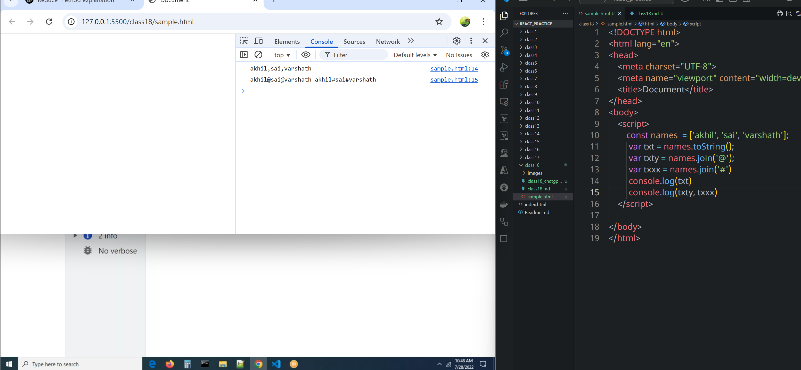
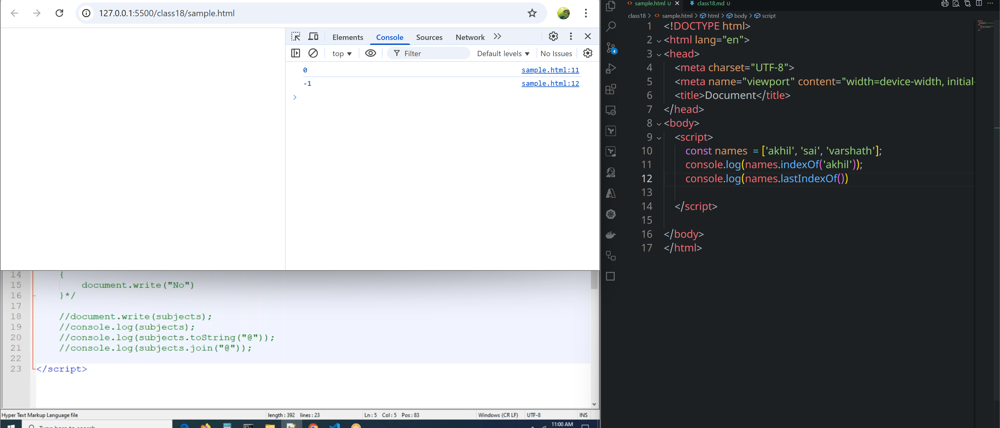
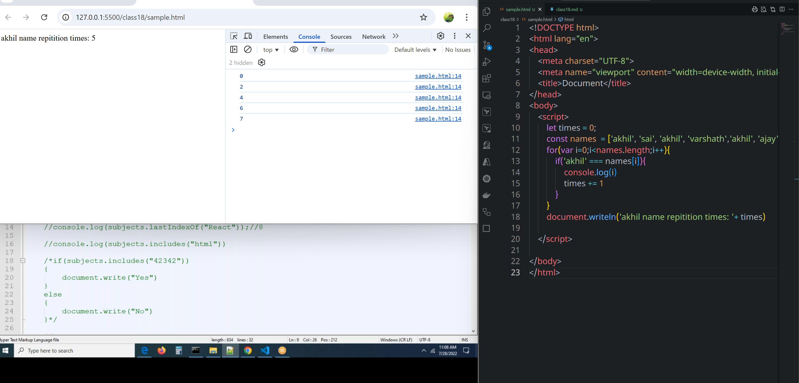
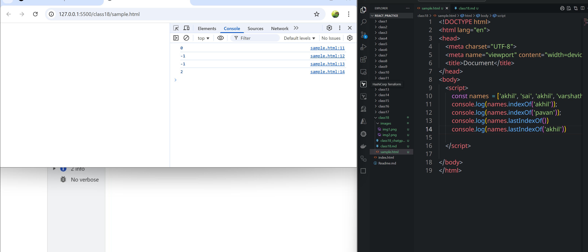
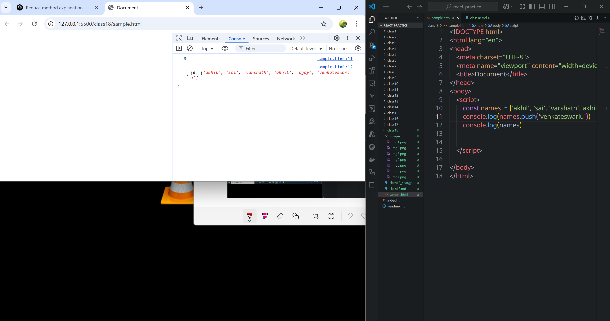
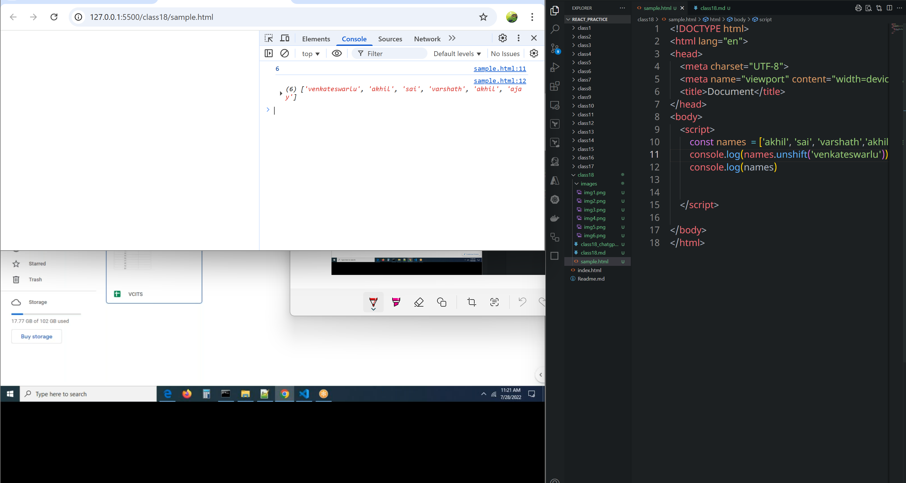
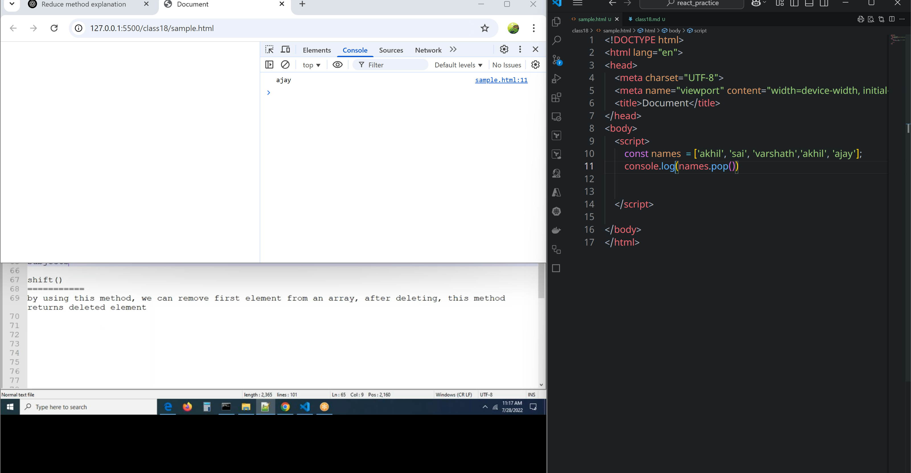
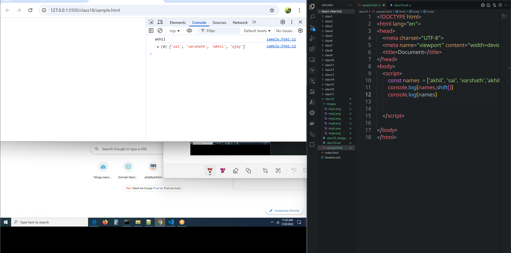

# class 18
# Array methods
**Not:e**:
* In general if we have `()` that is called as method. `arr.sort()`
* If we have  `.` that is called as property. `arr.length`
## toString():
* By using this we can convert an array into a string
* It does not accept parameters
```js

        const names  = ['akhil', 'sai', 'varshath'];
         var txt = names.toString();
         console.log(txt)
```

##  join()
* In this we can separate the elements by using special symbols(@,# etc...), that we can not seen in `getSepare()`
* It accept parameters
```js

        const names  = ['akhil', 'sai', 'varshath'];
         var txt = names.toString();
         var txty = names.join('@');
         var txxx = names.join('#')
         console.log(txt)
         console.log(txty)
```

* Both methods used to convert an array into string
* join() accepts parameter.
* toString() does not accept parameter.
* If we are using` join() `invariably we have to use` split()`
## includes
* whether specific element is available or not
* if available in the array it returns `true` otherwise returns `false`.
* we can use it with the if conditions 
      * if we got zero, null, false, undefined block of code does not execute.
```js
        const names  = ['akhil', 'sai', 'varshath'];
        console.log(names.includes('akhil')) //true
        console.log(names.includes('pavan')) // false
```
## index()
* To check index of an element.
* If element exists, it returns the index of the element.
* If the element does not exist it returns `-1`.
* It returns first occurance of the element. if we have same values.
* 
```html
<!DOCTYPE html>
<html lang="en">
<head>
    <meta charset="UTF-8">
    <meta name="viewport" content="width=device-width, initial-scale=1.0">
    <title>Document</title>
</head>
<body>
    <script>
        const names  = ['akhil', 'sai', 'varshath'];
        console.log(names.indexOf('akhil'));
        console.log(names.lastIndexOf())

    </script>
    
</body>
</html>
```


```html
<!DOCTYPE html>
<html lang="en">
<head>
    <meta charset="UTF-8">
    <meta name="viewport" content="width=device-width, initial-scale=1.0">
    <title>Document</title>
</head>
<body>
    <script>
        let times = 0;
        const names  = ['akhil', 'sai', 'akhil', 'varshath','akhil', 'ajay', 'akhil', 'akhil'];
        for(var i=0;i<names.length;i++){
            if('akhil' === names[i]){
                console.log(i)
                times += 1
            }
        }
        document.writeln('akhil name repitition times: '+ times)

    </script>
    
</body>
</html>
```



## lastIndexOf()
* It will check last occurance of the element

```html
<!DOCTYPE html>
<html lang="en">
<head>
    <meta charset="UTF-8">
    <meta name="viewport" content="width=device-width, initial-scale=1.0">
    <title>Document</title>
</head>
<body>
    <script>
        const names  = ['akhil', 'sai', 'akhil', 'varshath'];
        console.log(names.indexOf('akhil'));
        console.log(names.indexOf('pavan'));
        console.log(names.lastIndexOf())
        console.log(names.lastIndexOf('akhil'))

    </script>
    
</body>
</html>
```
## push()
* adding element into last position of the array, after adding it will return all the elements in array.

## unshift()
* we can add element into first position of the array.after adding, this method returns total no of elements in a array

## pop()
* remove element from last position, after deleting, this method returns deleted element

## shift()
* remove element from first position, after deleting, this method returns deleted element

