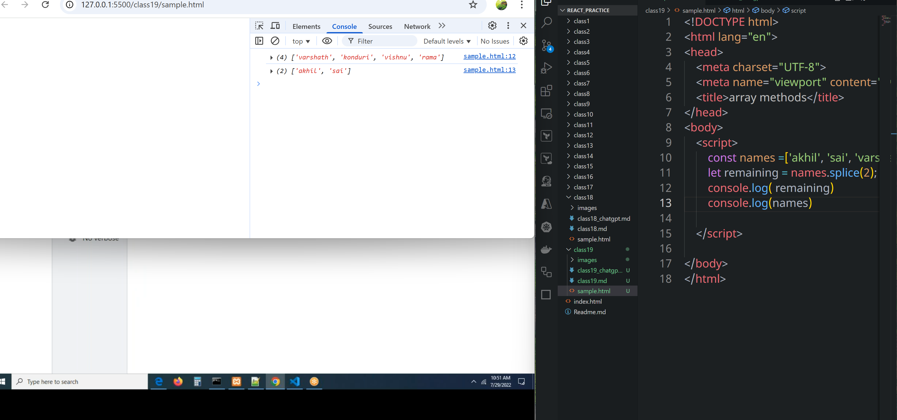
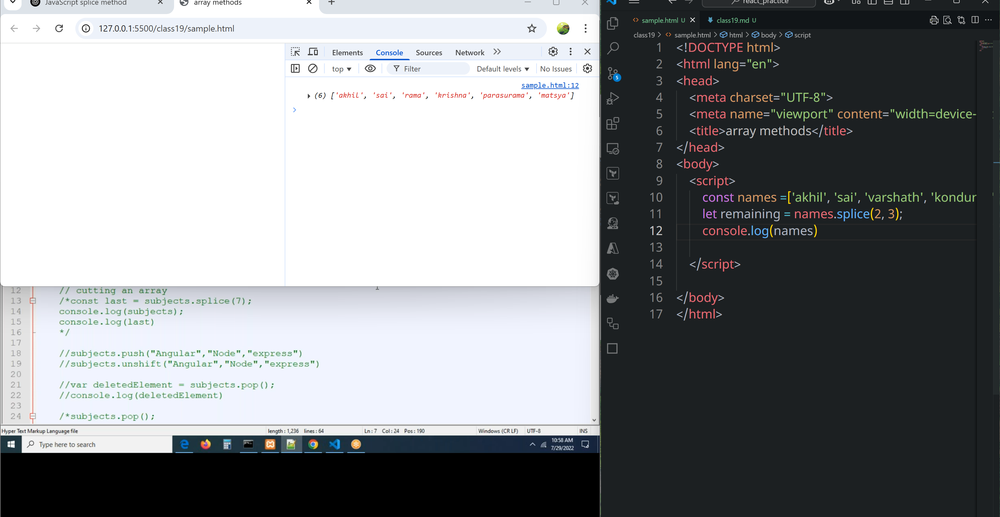
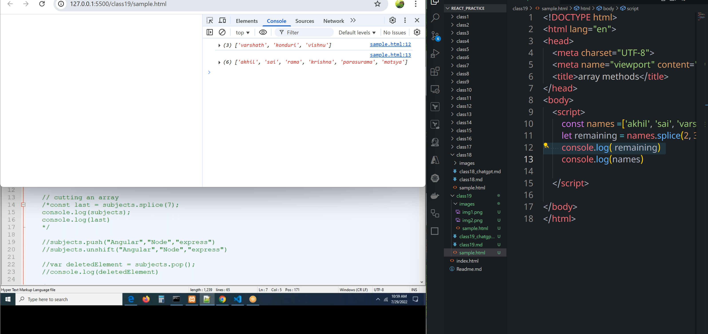
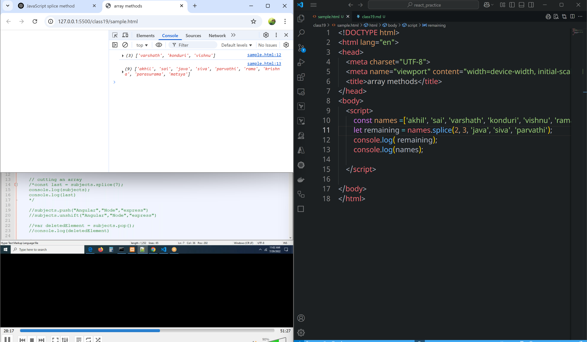
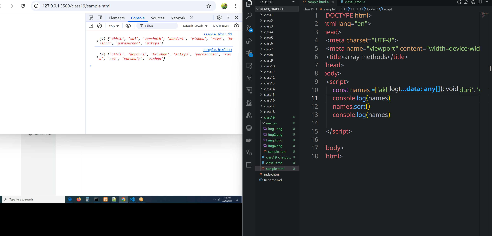
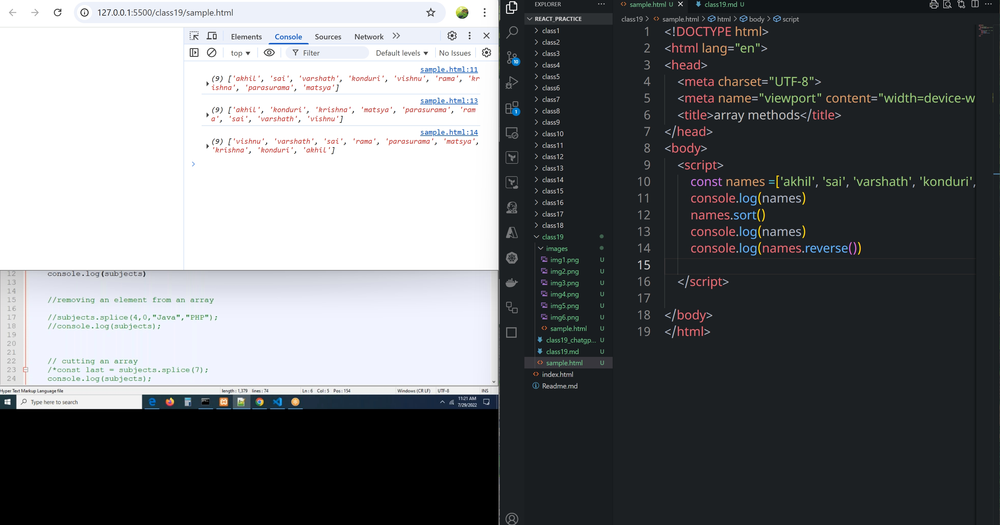
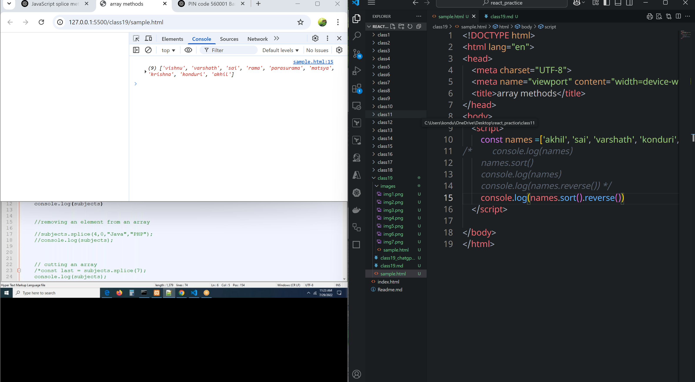

# class 19
# push, unshift, pop, splice
## splice
* we can cut the array into peices or two parts
* we can divide array lnto parts or peices
* we can remove element from selector position
* we can add element in the selected position
#### Syntax:

```javascript
array.splice(start, deleteCount, item1, item2, ...)
```
### cutting array
```javascript
let fruits = ["apple", "banana", "cherry", "date"];
fruits.splice(1, 2);  // removes 2 elements starting from index 1
console.log(fruits);  // ["apple", "date"]
```
* spliting array into 2 arrays
```html
<!DOCTYPE html>
<html lang="en">
<head>
    <meta charset="UTF-8">
    <meta name="viewport" content="width=device-width, initial-scale=1.0">
    <title>array methods</title>
</head>
<body>
    <script>
        const names =['akhil', 'sai', 'varshath', 'konduri', 'vishnu', 'rama'];
        let remaining = names.splice(2);
        console.log( remaining)
        console.log(names)

    </script>
    
</body>
</html>
```

### removing an element 
```js
        const names =['akhil', 'sai', 'varshath', 'konduri', 'vishnu', 'rama', 'krishna', 'parasurama', 'matsya'];
        let remaining = names.splice(2, 3);
        console.log( remaining);
        console.log(names);

```



### adding elements
```js
        const names =['akhil', 'sai', 'varshath', 'konduri', 'vishnu', 'rama', 'krishna', 'parasurama', 'matsya'];
        let remaining = names.splice(2, 3, 'java', 'siva', 'parvathi');
        console.log( remaining);
        console.log(names);
```

## sort()
* By using this method, we can array values on ascending order
```html 
<!DOCTYPE html>
<html lang="en">
<head>
    <meta charset="UTF-8">
    <meta name="viewport" content="width=device-width, initial-scale=1.0">
    <title>array methods</title>
</head>
<body>
    <script>
        const names =['akhil', 'sai', 'varshath', 'konduri', 'vishnu', 'rama', 'krishna', 'parasurama', 'matsya'];
        console.log(names)
        names.sort()
        console.log(names)
         
    </script>
    
</body>
</html>
```

## reverse()
* It prints the elements in reverse order.
* Not descending order but reverse order of an array
```html
<!DOCTYPE html>
<html lang="en">
<head>
    <meta charset="UTF-8">
    <meta name="viewport" content="width=device-width, initial-scale=1.0">
    <title>array methods</title>
</head>
<body>
    <script>
        const names =['akhil', 'sai', 'varshath', 'konduri', 'vishnu', 'rama', 'krishna', 'parasurama', 'matsya'];
        console.log(names)
        console.log(names.reverse())
         
    </script>
    
</body>
</html>
```

### descending order
* if we want to descending order first we have to `sort()` it to ascending order and then by using this `reverse()` we can achieve descending order.
* But directly we don't have descending order
* By using `names.sort().reverse()` we can acheive descending order.
```html
<!DOCTYPE html>
<html lang="en">
<head>
    <meta charset="UTF-8">
    <meta name="viewport" content="width=device-width, initial-scale=1.0">
    <title>array methods</title>
</head>
<body>
    <script>
        const names =['akhil', 'sai', 'varshath', 'konduri', 'vishnu', 'rama', 'krishna', 'parasurama', 'matsya'];
        console.log(names)
/*         names.sort()
        console.log(names)
        console.log(names.reverse()) */
        names.sort().reverse()

         
    </script>
    
</body>
</html>
```




