# class 22
# Array Iteration Methods
```html
<!DOCTYPE html>
<html lang="en">
<head>
    <meta charset="UTF-8">
    <title>Document</title>
</head>
<body>
    <div id = 'test'>
    </div>
    <script>
        const users = [
        { id: 1,firstname: "Ram", lastname: "Babburi", city: "Ongole", pincode: 500032, dob: '02-06-1998'},
        { id: 2,firstname: "Anand", lastname: "Pabbineedi", city: "Kakinada", pincode: 533001, dob: '05-06-1998'},
        { id: 3,firstname: "Vinod", lastname: "Katte", city: "Anantapur", pincode: 515671 , dob: '07-06-1990'},
        { id: 4,firstname: "Lakshman", lastname: "D", city: "Kakinada", pincode: 533006 , dob: '01-06-1997'},
        { id: 5,firstname: "Sri Raj", lastname: "Kamisetti", city: "Amalapuram", pincode: 533249, dob: '12-06-1989'}];    

                // Function to calculate age
        function calculateAge(dob) {
            const birthDate = new Date(dob.split('-').reverse().join('-')); // Convert 'dd-mm-yyyy' to 'yyyy-mm-dd'
            const ageDiff = Date.now() - birthDate.getTime();
            const ageDate = new Date(ageDiff);
            return Math.abs(ageDate.getUTCFullYear() - 1970);
        };


        const modifiedUsers = users.map((item) =>{
            let fullname = item.firstname+' '+item.lastname
            return {...item, status: 'active', age: calculateAge(item.dob), fullname: fullname}
        })
        console.log(modifiedUsers)


        var div = document.getElementById('test');
        var txt =  '';
        if(users.length >0){
            txt += "<table border='1' cellpadding ='10'>"
                txt += '<tr>'
                    txt += '<tr><th>ID</th><th>firstname</th><th>lastname</th><th>FullName</th><th>city</th><th>pincode</th> <th>Status</th><th>dob</th><th>Age</th></tr>'
                    modifiedUsers.map((item) => {
                        txt += '<tr>'
                            txt += '<td>'+item.id+'</td>'
                            txt += '<td>'+item.firstname+'</td>'
                            txt += '<td>'+item.lastname+'</td>'
                            txt += '<td>'+item.fullname+'</td>'
                            txt += '<td>'+item.city+'</td>'
                            txt += '<td>'+item.pincode+'</td>'
                            txt += '<td>'+item.status+'</td>'
                            txt += '<td>'+item.dob+'</td>'
                            txt += '<td>'+item.age+'Years Old'+'</td>'
                        txt += '</tr>'
                    })
                txt += '</tr>'
            txt += '</table>'
        }


        div.innerHTML = txt
    </script>
</body>
</html>
```
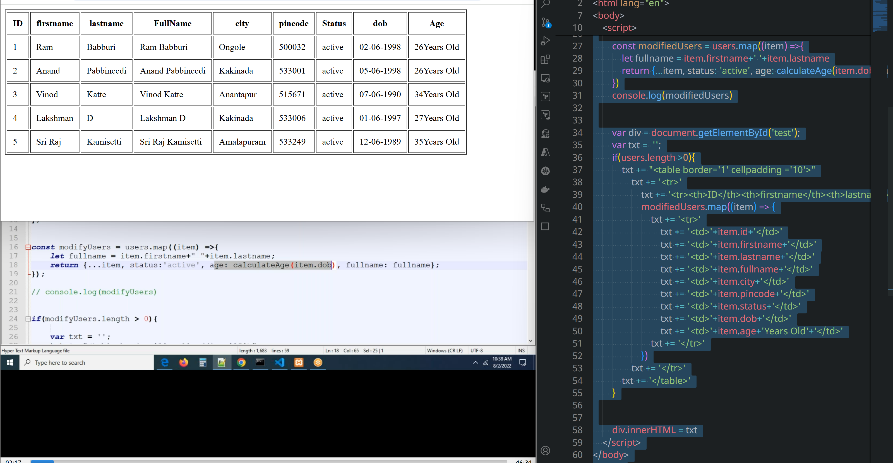
## filter()
* By using this method, we can iterate each and every element of an array to filter, after filtering this method returns a new array.
* This method has call back function as a parameter and this accepts three parameters
```js
users.forEach(function(item, index, array){})
users.map(function(item, index, array){})
users.filter(function(item, index, array){})
```
 * All iteration methods has call back functions.
```js
<!DOCTYPE html>
<html lang="en">
<head>
    <meta charset="UTF-8">
    <title>Document</title>
</head>
<body>
    <div id = 'test'>
    </div>
    <script>
        const users = [
        { id: 1,firstname: "Ram", lastname: "Babburi", city: "Ongole", pincode: 500032, dob: '02-06-1998'},
        { id: 2,firstname: "Anand", lastname: "Pabbineedi", city: "Kakinada", pincode: 533001, dob: '05-06-1998'},
        { id: 3,firstname: "Vinod", lastname: "Katte", city: "Anantapur", pincode: 515671 , dob: '07-06-1990'},
        { id: 4,firstname: "Lakshman", lastname: "D", city: "Kakinada", pincode: 533006 , dob: '01-06-1997'},
        { id: 5,firstname: "Sri Raj", lastname: "Kamisetti", city: "Amalapuram", pincode: 533249, dob: '12-06-1989'}];    

                // Function to calculate age
        function calculateAge(dob) {
            const birthDate = new Date(dob.split('-').reverse().join('-')); // Convert 'dd-mm-yyyy' to 'yyyy-mm-dd'
            const ageDiff = Date.now() - birthDate.getTime();
            const ageDate = new Date(ageDiff);
            return Math.abs(ageDate.getUTCFullYear() - 1970);
        };


        const modifiedUsers = users.filter((item) =>{
            return item.firstname === 'Ram'
        })
        console.log(modifiedUsers)


        // div.innerHTML = txt
    </script>
</body>
</html>
```
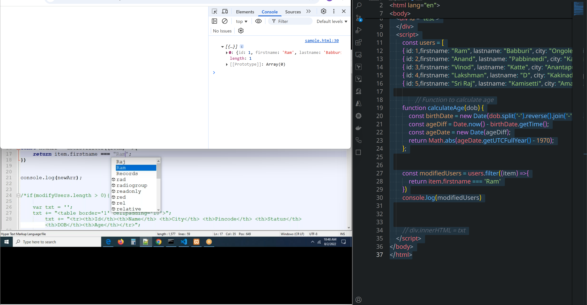

### calculating whose age is less than 30;
```html
<!DOCTYPE html>
<html lang="en">
<head>
    <meta charset="UTF-8">
    <title>Document</title>
</head>
<body>
    <div id = 'test'>
    </div>
    <script>
        const users = [
        { id: 1,firstname: "Ram", lastname: "Babburi", city: "Ongole", pincode: 500032, dob: '02-06-1998'},
        { id: 2,firstname: "Anand", lastname: "Pabbineedi", city: "Kakinada", pincode: 533001, dob: '05-06-1998'},
        { id: 3,firstname: "Vinod", lastname: "Katte", city: "Anantapur", pincode: 515671 , dob: '07-06-1990'},
        { id: 4,firstname: "Lakshman", lastname: "D", city: "Kakinada", pincode: 533006 , dob: '01-06-1997'},
        { id: 5,firstname: "Sri Raj", lastname: "Kamisetti", city: "Amalapuram", pincode: 533249, dob: '12-06-1989'}];    

                // Function to calculate age
        function calculateAge(dob) {
            const birthDate = new Date(dob.split('-').reverse().join('-')); // Convert 'dd-mm-yyyy' to 'yyyy-mm-dd'
            const ageDiff = Date.now() - birthDate.getTime();
            const ageDate = new Date(ageDiff);
            return Math.abs(ageDate.getUTCFullYear() - 1970);
        };


        const modifiedUsers = users.filter((item) =>{
            // return item.firstname === 'Ram';        
            return calculateAge(item.dob) <= 30;

        });

        const fineModifiedUsers= modifiedUsers.map((item) =>{
            var fullname = item.firstname+' '+item.lastname;
            return{...item, fullname: fullname, status: 'active', age: calculateAge(item.dob)}
        });

        var div = document.getElementById('test');
        var txt = '';
        if(users.length >0){
            txt += "<table border='1' cellpadding ='10'>"
                txt += '<tr>'
                    txt += '<tr><th>ID</th><th>firstname</th><th>lastname</th><th>FullName</th><th>city</th><th>pincode</th> <th>Status</th><th>dob</th><th>Age</th></tr>'
                    fineModifiedUsers.forEach((item) =>{
                        txt += '<tr>'
                            txt += '<td>'+item.id+'</td>'
                            txt += '<td>'+item.firstname+'</td>'
                            txt += '<td>'+item.lastname+'</td>'
                            txt += '<td>'+item.fullname+'</td>'
                            txt += '<td>'+item.city+'</td>'
                            txt += '<td>'+item.pincode+'</td>'
                            txt += '<td>'+item.status+'</td>'
                            txt += '<td>'+item.dob+'</td>'
                            txt += '<td>'+item.age+'</td>'
                        txt += '</tr>'
                    })
                txt += '</tr'
            txt += "</table>"

                }


        div.innerHTML = txt
    </script>
</body>
</html>
```
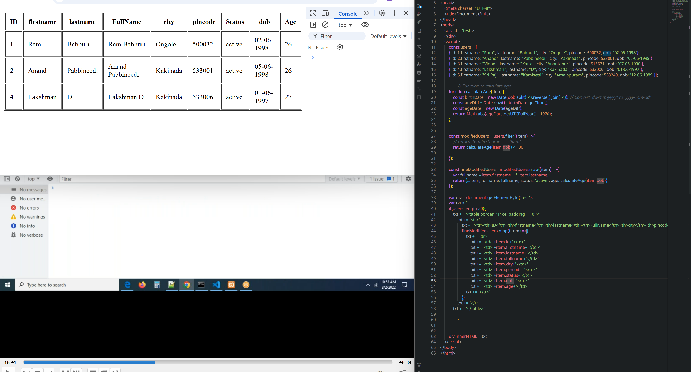
# some() and every()
---

### ✅ `.some()` Method

* **Purpose:** Checks if **at least one** element in the array passes the test implemented by the callback function.
* **Returns:** `true` if **any** element satisfies the condition; otherwise, `false`.

**Syntax:**

```javascript
array.some(callback(element, index, array), thisArg)
```

**Example:**

```javascript
const numbers = [1, 2, 3, 4, 5];

const hasEven = numbers.some(num => num % 2 === 0);
console.log(hasEven); // true (because 2 and 4 are even)
```

---

### ✅ `.every()` Method

* **Purpose:** Checks if **all** elements in the array pass the test implemented by the callback function.
* **Returns:** `true` if **every** element satisfies the condition; otherwise, `false`.

**Syntax:**

```javascript
array.every(callback(element, index, array), thisArg)
```

**Example:**

```javascript
const numbers = [2, 4, 6, 8];

const allEven = numbers.every(num => num % 2 === 0);
console.log(allEven); // true
```

---

### 🔁 Key Differences

| Feature           | `.some()`                        | `.every()`                     |
| ----------------- | -------------------------------- | ------------------------------ |
| Returns `true` if | **At least one** element matches | **All** elements match         |
| Stops iterating   | After the first `true` result    | After the first `false` result |
| Use case          | “Is there any match?”            | “Do all  elements match?”       |

---

Let me know if you’d like examples involving objects, arrays of users, or integration with `filter()` or `map()`!
## some() 
* By using this method, we can iterate each and every item of the array
* If some of the satisfies the condition this method returns true, otherwise it return's false.
```js

        var arr = [10, 20, 30, 45, 55];
        const check = arr.some((item) =>{
            console.log(item)
        })  
        console.log(check)
```
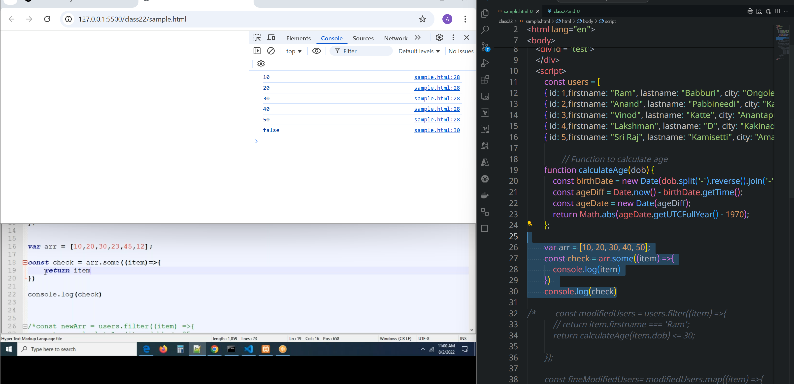
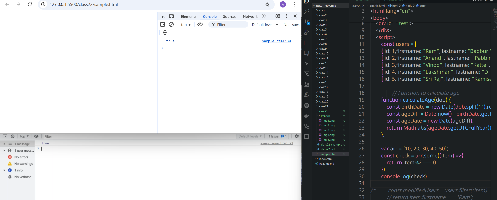
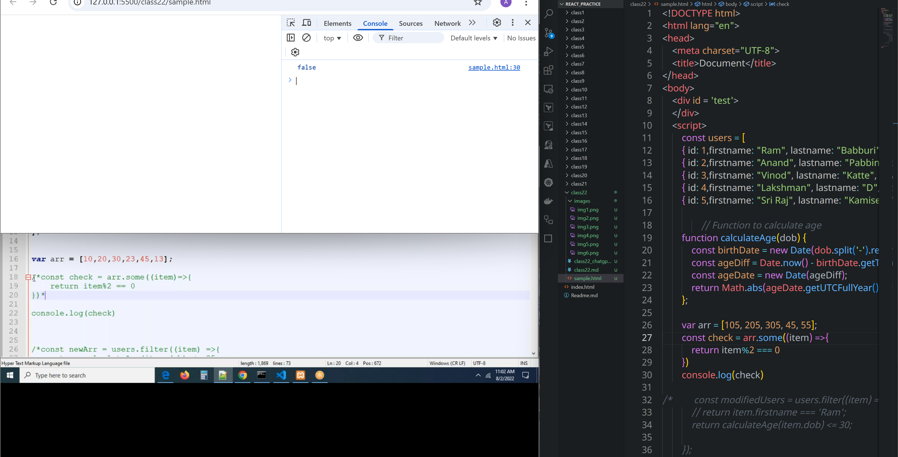


## every()
* By using this method, we can iterate each and every item of the array
* If some of the satisfies the condition this method returns true, otherwise it return's false.
In JavaScript, `.some()` and `.every()` are array methods used to test whether elements in an array meet a specified condition. They return Boolean values (`true` or `false`) based on the results of testing each element with a provided callback function.
 ```html
<!DOCTYPE html>
<html lang="en">
<head>
    <meta charset="UTF-8">
    <title>Document</title>
</head>
<body>
    <div id = 'test'>
    </div>
    <script>
        const users = [
        { id: 1,firstname: "Ram", lastname: "Babburi", city: "Ongole", pincode: 500032, dob: '02-06-1998'},
        { id: 2,firstname: "Anand", lastname: "Pabbineedi", city: "Kakinada", pincode: 533001, dob: '05-06-1998'},
        { id: 3,firstname: "Vinod", lastname: "Katte", city: "Anantapur", pincode: 515671 , dob: '07-06-1990'},
        { id: 4,firstname: "Lakshman", lastname: "D", city: "Kakinada", pincode: 533006 , dob: '01-06-1997'},
        { id: 5,firstname: "Sri Raj", lastname: "Kamisetti", city: "Amalapuram", pincode: 533249, dob: '12-06-1989'}];    

                // Function to calculate age
        function calculateAge(dob) {
            const birthDate = new Date(dob.split('-').reverse().join('-')); // Convert 'dd-mm-yyyy' to 'yyyy-mm-dd'
            const ageDiff = Date.now() - birthDate.getTime();
            const ageDate = new Date(ageDiff);
            return Math.abs(ageDate.getUTCFullYear() - 1970);
        };

        var arr = [105, 205, 305, 45, 55];
        const check = arr.every((item) =>{
            return item%2 === 0 
        })  
        console.log(check)

/*         const modifiedUsers = users.filter((item) =>{
            // return item.firstname === 'Ram';        
            return calculateAge(item.dob) <= 30;

        });

        const fineModifiedUsers= modifiedUsers.map((item) =>{
            var fullname = item.firstname+' '+item.lastname;
            return{...item, fullname: fullname, status: 'active', age: calculateAge(item.dob)}
        });

        var div = document.getElementById('test');
        var txt = '';
        if(users.length >0){
            txt += "<table border='1' cellpadding ='10'>"
                txt += '<tr>'
                    txt += '<tr><th>ID</th><th>firstname</th><th>lastname</th><th>FullName</th><th>city</th><th>pincode</th> <th>Status</th><th>dob</th><th>Age</th></tr>'
                    fineModifiedUsers.forEach((item) =>{
                        txt += '<tr>'
                            txt += '<td>'+item.id+'</td>'
                            txt += '<td>'+item.firstname+'</td>'
                            txt += '<td>'+item.lastname+'</td>'
                            txt += '<td>'+item.fullname+'</td>'
                            txt += '<td>'+item.city+'</td>'
                            txt += '<td>'+item.pincode+'</td>'
                            txt += '<td>'+item.status+'</td>'
                            txt += '<td>'+item.dob+'</td>'
                            txt += '<td>'+item.age+'</td>'
                        txt += '</tr>'
                    })
                txt += '</tr' 
            txt += "</table>"

                }
 */

        // div.innerHTML = txt
    </script>
</body>
</html>
 ```
 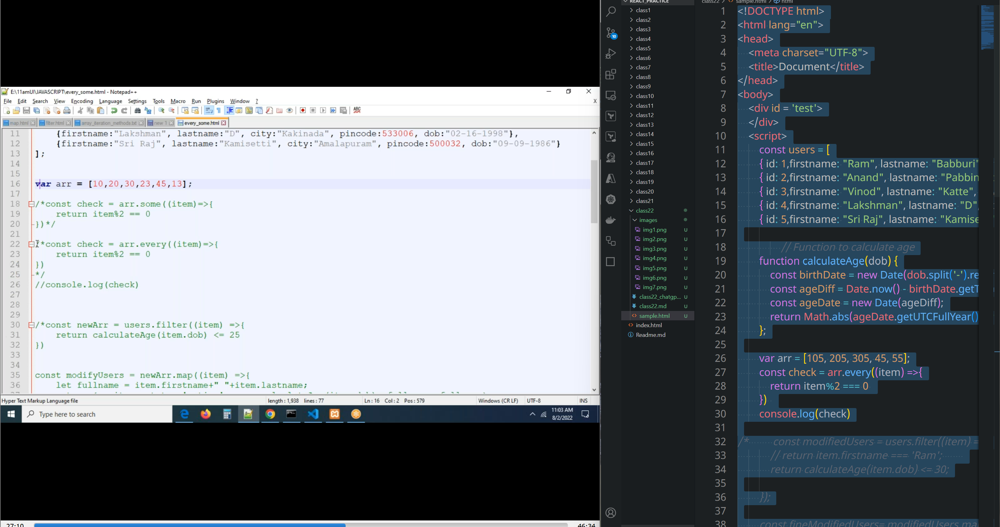
 # findIndex(callback(item, index, arr), thisArg)
The `.findIndex()` method in JavaScript is used to find the **index** of the **first element** in an array that satisfies a provided **testing function**. If no elements satisfy the condition, it returns `-1`.

---

### ✅ `.findIndex()` Syntax

```javascript
array.findIndex(callback(element, index, array), thisArg)
```

* **callback:** A function to execute on each element.

  * `element`: The current element being processed.
  * `index`: The index of the current element (optional).
  * `array`: The array `findIndex` was called on (optional).
* **thisArg:** (Optional) Value to use as `this` when executing `callback`.

---

### ✅ Example 1: Basic Usage

```javascript
const numbers = [10, 20, 30, 40];

const index = numbers.findIndex(num => num > 25);
console.log(index); // 2 (because 30 is the first number > 25)
```

---

### ✅ Example 2: With Objects

```javascript
const users = [
  { id: 1, name: "Alice" },
  { id: 2, name: "Bob" },
  { id: 3, name: "Charlie" }
];

const index = users.findIndex(user => user.name === "Bob");
console.log(index); // 1
```

---

### 🔁 Comparison with `find()`

* `.findIndex()` returns the **index**.
* `.find()` returns the **element** itself.

```javascript
const arr = [5, 12, 8, 130, 44];

const found = arr.find(el => el > 10);       // returns the value (12)
const index = arr.findIndex(el => el > 10);  // returns the index (1)
```

---

Let me know if you want to combine `.findIndex()` with deletion, conditional updates, or real-world use cases like form validation or search!
```html
<!DOCTYPE html>
<html lang="en">
<head>
    <meta charset="UTF-8">
    <title>Document</title>
</head>
<body>
    <div id = 'test'>
    </div>
    <script>
        const users = [
        { id: 1,firstname: "Ram", lastname: "Babburi", city: "Ongole", pincode: 500032, dob: '02-06-1998'},
        { id: 2,firstname: "Anand", lastname: "Pabbineedi", city: "Kakinada", pincode: 533001, dob: '05-06-1998'},
        { id: 3,firstname: "Vinod", lastname: "Katte", city: "Anantapur", pincode: 515671 , dob: '07-06-1990'},
        { id: 4,firstname: "Lakshman", lastname: "D", city: "Kakinada", pincode: 533006 , dob: '01-06-1997'},
        { id: 5,firstname: "Sri Raj", lastname: "Kamisetti", city: "Amalapuram", pincode: 533249, dob: '12-06-1989'}];    
        
        const itemExists = users.findIndex((item)=>{
            return item.lastname === 'Katte'
        })
        console.log(itemExists)
    </script>
</body>
</html>
```
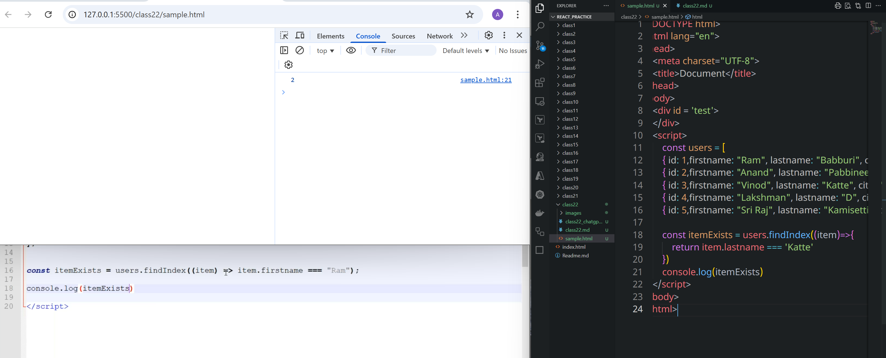
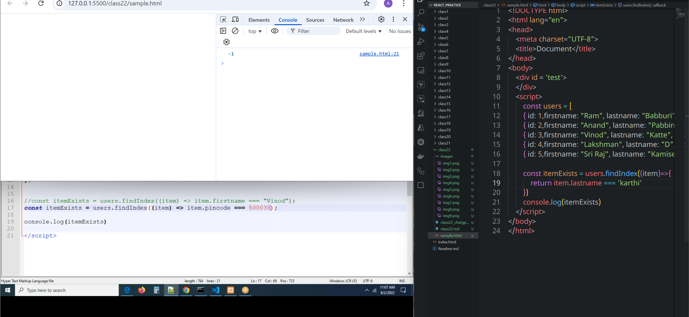
## reduce()
The `.reduce()` method in JavaScript is a **powerful array method** used to **accumulate** or **reduce** an array into a **single value**—like a sum, object, or even another array.

---

### ✅ Syntax

```javascript
array.reduce(callback(accumulator, currentValue, index, array), initialValue)
```

* `accumulator`: Stores the accumulated result across iterations.
* `currentValue`: The current item being processed.
* `initialValue`: (Optional but recommended) The initial value for the accumulator.

---

### 🔢 Example 1: Sum of Numbers

```javascript
const numbers = [10, 20, 30];

const total = numbers.reduce((acc, curr) => {acc + curr}, 0);
console.log(total); // 60
```

* Starts at 0.
* Adds 10 → 10, then 20 → 30, then 30 → 60.

---

### 🧾 Example 2: Counting Occurrences

```javascript
const fruits = ['apple', 'banana', 'apple', 'orange', 'banana', 'apple'];

const count = fruits.reduce((acc, fruit) => {
    acc[fruit] = (acc[fruit] || 0) + 1;
    return acc;
}, {});

console.log(count);
// { apple: 3, banana: 2, orange: 1 }
```

---

### 📦 Example 3: Flatten an Array

```javascript
const nested = [[1, 2], [3, 4], [5]];

const flat = nested.reduce((acc, curr) => acc.concat(curr), []);
console.log(flat); // [1, 2, 3, 4, 5]
```

---

### ⚠️ Notes

* If you don’t pass an `initialValue`, `.reduce()` uses the **first element** as the starting value. This can cause issues if the array is empty or if you're expecting a certain type (e.g., object or number).
* Always use an `initialValue` for safety and clarity.

---

Would you like to see `.reduce()` used with an array of objects (e.g., total salaries or grouping by city)

```html
<!DOCTYPE html>
<html lang="en">
<head>
    <meta charset="UTF-8">
    <title>Document</title>
</head>
<body>
    <div id = 'test'>
    </div>
    <script>
        const products = [
        { id: 1, name: 'shirt', price: 200},
        { id: 1, name: 'belt', price: 580},
        { id: 1, name: 'jeans', price: 900},
        { id: 1, name: 'socks', price: 900}];

        const total = products.reduce((acc, item) =>{
            return acc + item.price
        }, 0)
        console.log(total)
    </script>
</body>
</html>
```
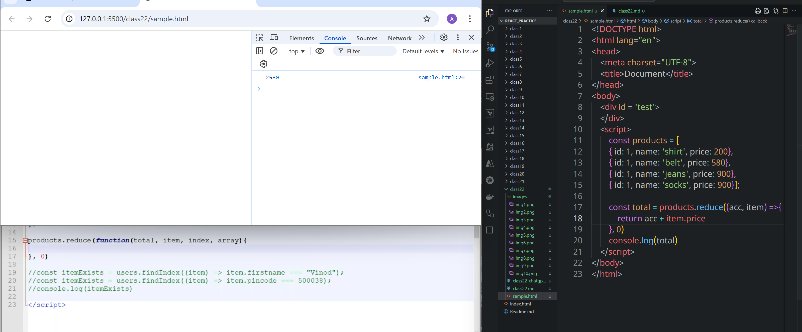
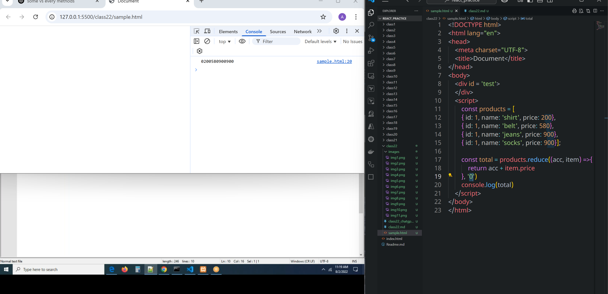

