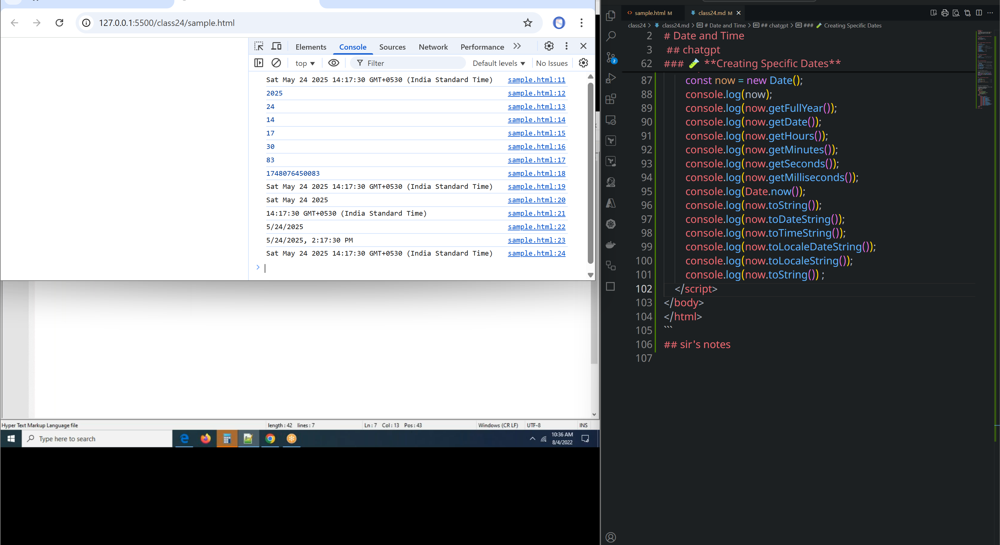
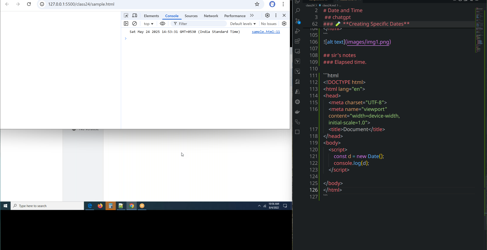
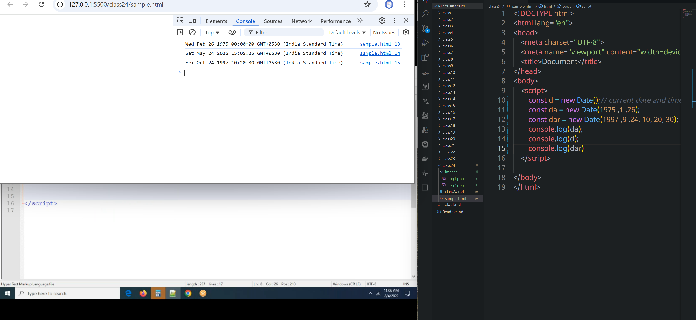

# class 24
# Date and Time
 ## chatgpt
 In JavaScript, you can work with **date and time** using the built-in `Date` object. Here’s a quick guide to the most useful features:

---

### 📅 **Getting the Current Date and Time**

```javascript
const now = new Date();
console.log(now);  // e.g., "2025-05-24T14:35:22.456Z"
```

---

### 🕒 **Common Methods to Extract Parts**

```javascript
const now = new Date();

now.getFullYear();     // 2025
now.getMonth();        // 4 (Months are 0-indexed: 0 = Jan, 11 = Dec)
now.getDate();         // 24 (day of the month)
now.getDay();          // 6 (0 = Sunday, 6 = Saturday)
now.getHours();        // 14
now.getMinutes();      // 35
now.getSeconds();      // 22
now.getMilliseconds(); // 456
```

---

### ⏱ **Getting Timestamps**

```javascript
Date.now();         // milliseconds since Jan 1, 1970
new Date().getTime(); // same as Date.now()
```

---

### 📆 **Formatting Dates**

JavaScript `Date` has basic formatting options:

```javascript
now.toString();         // "Sat May 24 2025 14:35:22 GMT+0000 (UTC)"
now.toDateString();     // "Sat May 24 2025"
now.toTimeString();     // "14:35:22 GMT+0000 (UTC)"
now.toLocaleString();   // "5/24/2025, 2:35:22 PM" (format depends on locale)
now.toISOString();      // "2025-05-24T14:35:22.456Z" (ISO 8601)
```

For custom formatting, you can:

* Manually build the string using the `get` methods.
* Or use libraries like **[date-fns](https://date-fns.org/)** or **[Moment.js](https://momentjs.com/)** for easier and more powerful formatting.

---

### 🧪 **Creating Specific Dates**

```javascript
new Date("2025-12-25");               // From string
new Date(2025, 11, 25);               // Year, Month (0-indexed), Day
new Date(2025, 11, 25, 10, 30, 0);    // With time
```

---

Let me know if you want help with:

* Formatting in `DD/MM/YYYY` or `HH:mm` styles
* Calculating time differences
* Setting countdowns/timers
```html
<!DOCTYPE html>
<html lang="en">
<head>
    <meta charset="UTF-8">
    <meta name="viewport" content="width=device-width, initial-scale=1.0">
    <title>Document</title>
</head>
<body>
    <script>
        const now = new Date();
        console.log(now);
        console.log(now.getFullYear());
        console.log(now.getDate());
        console.log(now.getHours());
        console.log(now.getMinutes());
        console.log(now.getSeconds());
        console.log(now.getMilliseconds());
        console.log(Date.now());
        console.log(now.toString());
        console.log(now.toDateString());
        console.log(now.toTimeString());
        console.log(now.toLocaleDateString());
        console.log(now.toLocaleString());
        console.log(now.toString()) ;     
    </script>
</body>
</html>
```


## sir's notes
### Elapsed time.
* In real time we have issues like time and date are simultaniously differnt for differnt places(India, Dubai, USA etc..)

```html
<!DOCTYPE html>
<html lang="en">
<head>
    <meta charset="UTF-8">
    <meta name="viewport" content="width=device-width, initial-scale=1.0">
    <title>Document</title>
</head>
<body>
    <script>
        const d = new Date();
        console.log(d);
    </script>
    
</body>
</html>
```

* month indexes start with 11
* Days indexes start from 0 to 6(sunday - saturday)



