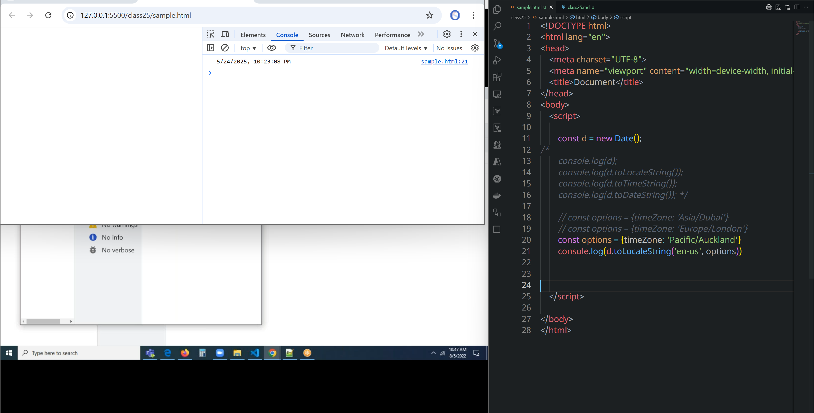
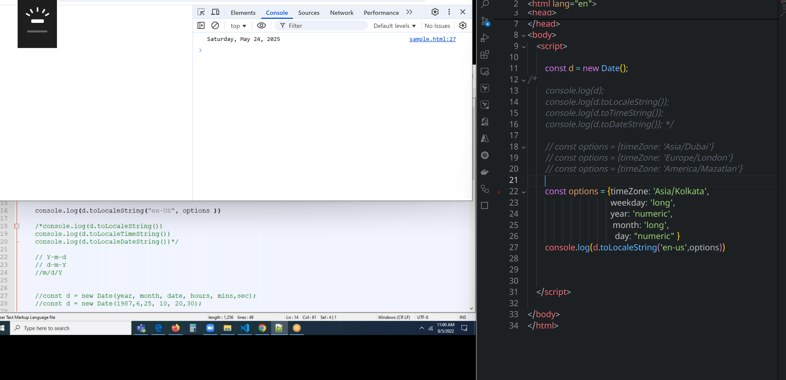
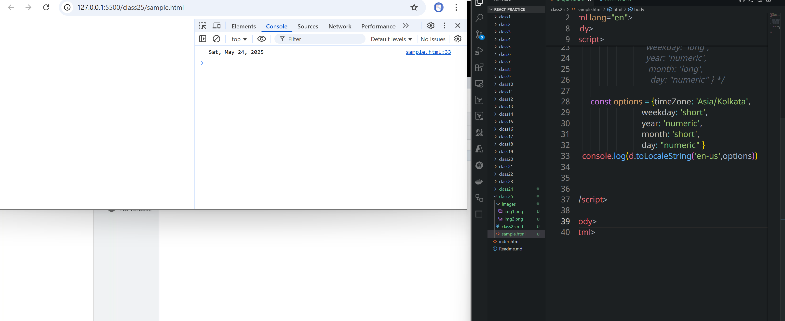
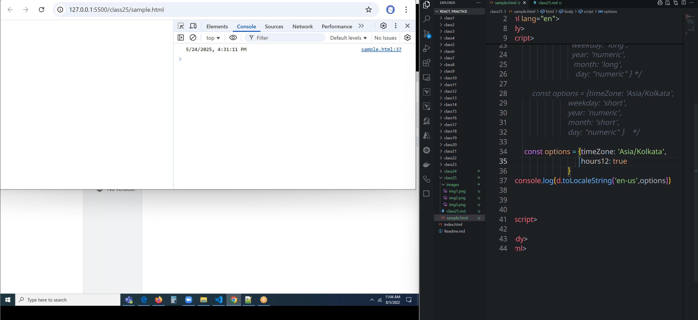
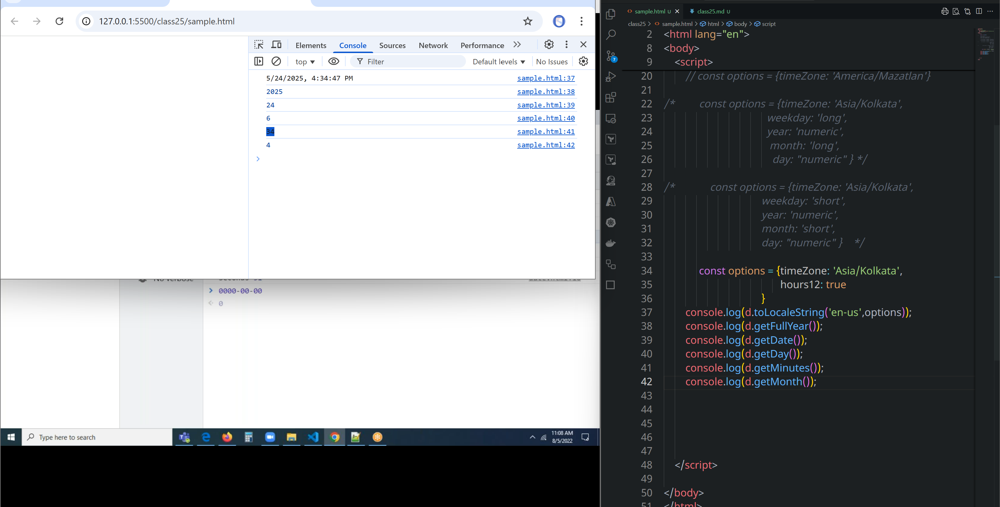
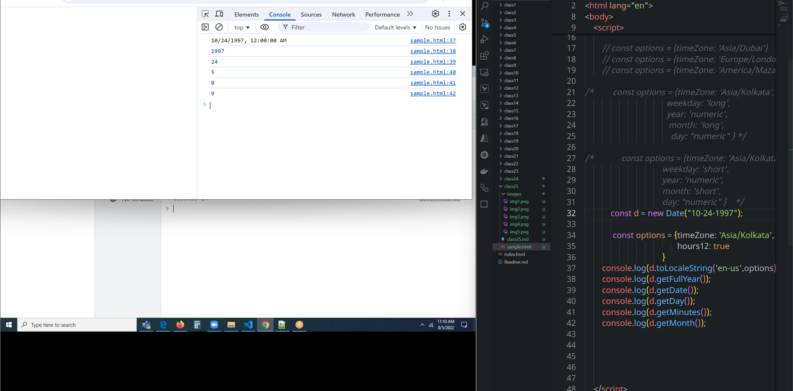
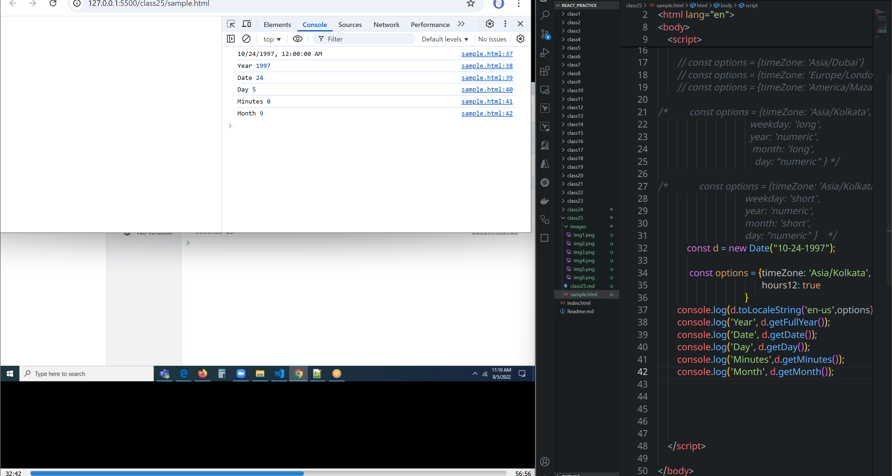
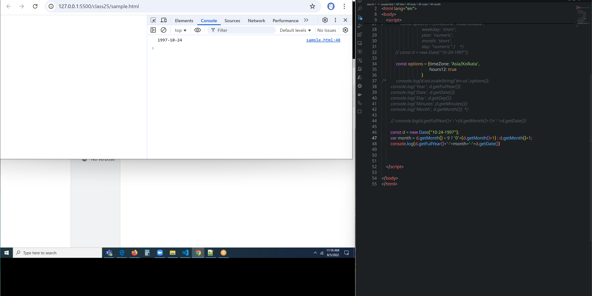
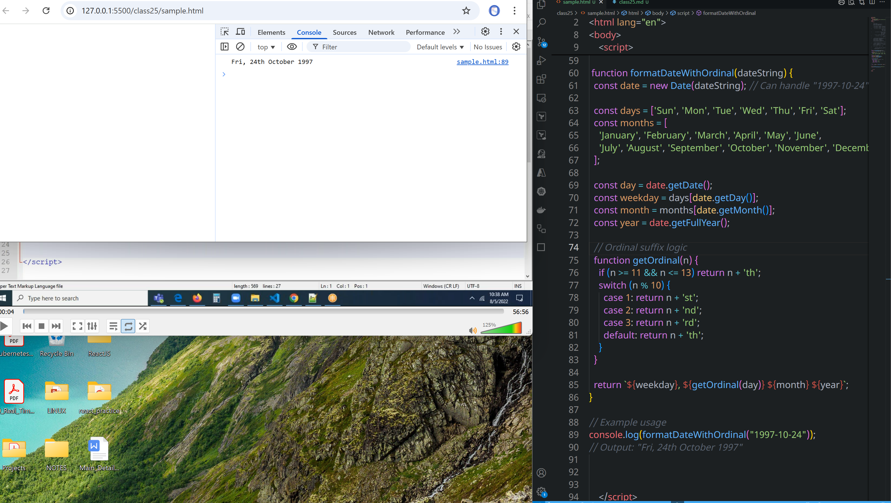

# class25
## Date and Time
### To get the time of other locations(california)

```js
        // const options = {timeZone: 'Asia/Dubai'}
        // const options = {timeZone: 'Europe/London'}
        const options = {timeZone: 'Pacific/Auckland'}
        console.log(d.toLocaleString('en-us', options))
```
* To know time zone codes search in google for time zone identifies
[refer_here](https://en.wikipedia.org/wiki/List_of_tz_database_time_zones)

```html
<!DOCTYPE html>
<html lang="en">
<head>
    <meta charset="UTF-8">
    <meta name="viewport" content="width=device-width, initial-scale=1.0">
    <title>Document</title>
</head>
<body>
    <script>

        const d = new Date();
/* 
        console.log(d);
        console.log(d.toLocaleString());
        console.log(d.toTimeString());
        console.log(d.toDateString()); */

        // const options = {timeZone: 'Asia/Dubai'}
        // const options = {timeZone: 'Europe/London'}
        // const options = {timeZone: 'America/Mazatlan'}
        
        const options = {timeZone: 'Asia/Kolkata', 
                                      weekday: 'long',
                                      year: 'numeric',
                                       month: 'long',
                                        day: "numeric" }
        console.log(d.toLocaleString('en-us',options))


    </script>
    
</body>
</html>
```







### how to get date in 1997-10-24 format?
```html
<!DOCTYPE html>
<html lang="en">
<head>
    <meta charset="UTF-8">
    <meta name="viewport" content="width=device-width, initial-scale=1.0">
    <title>Document</title>
</head>
<body>
    <script>

/* 
        console.log(d);
        console.log(d.toLocaleString());
        console.log(d.toTimeString());
        console.log(d.toDateString()); */

        // const options = {timeZone: 'Asia/Dubai'}
        // const options = {timeZone: 'Europe/London'}
        // const options = {timeZone: 'America/Mazatlan'}
        
/*         const options = {timeZone: 'Asia/Kolkata', 
                                      weekday: 'long',
                                      year: 'numeric',
                                       month: 'long',
                                        day: "numeric" } */

/*             const options = {timeZone: 'Asia/Kolkata', 
                                    weekday: 'short',
                                    year: 'numeric',
                                    month: 'short',
                                    day: "numeric" }    */                                     
            const d = new Date("10-24-1997");

             const options = {timeZone: 'Asia/Kolkata',
                                           hours12: true
                                    }                                     /*       
        console.log(d.toLocaleString('en-us',options));
        console.log('Year', d.getFullYear());
        console.log('Date', d.getDate());
        console.log('Day', d.getDay());
        console.log('Minutes',d.getMinutes());
        console.log('Month', d.getMonth()); */
        console.log(d.getFullYear()+'-'+(d.getMonth()+1)+'-'+d.getDate())
    </script>
    
</body>
</html>
```

```js
        const d = new Date("10-24-1997");
        var month = d.getMonth() < 9 ? '0'+(d.getMonth()+1) : d.getMonth()+1;
        var Date = d.getDate()
        var year = d.getFullYear()

        console.log(year+'-'+month+'-'+Date)

```
```js
        const d = new Date("6-24-1997");
        var month = d.getMonth() < 9 ? '0'+(d.getMonth()+1) : d.getMonth()+1;
        var Date = d.getDate() <10 ? '0'+(d.getDate()) : d.getDate()
        var year = d.getFullYear()

        console.log(year+'-'+month+'-'+Date)

```


### `Fri, 24th October 1997` display like this
```js
function formatDateWithOrdinal(dateString) {
  const date = new Date(dateString); // Can handle "1997-10-24"

  const days = ['Sun', 'Mon', 'Tue', 'Wed', 'Thu', 'Fri', 'Sat'];
  const months = [
    'January', 'February', 'March', 'April', 'May', 'June',
    'July', 'August', 'September', 'October', 'November', 'December'
  ];

  const day = date.getDate();
  const weekday = days[date.getDay()];
  const month = months[date.getMonth()];
  const year = date.getFullYear();

  // Ordinal suffix logic
  function getOrdinal(n) {
    if (n >= 11 && n <= 13) return n + 'th';
    switch (n % 10) {
      case 1: return n + 'st';
      case 2: return n + 'nd';
      case 3: return n + 'rd';
      default: return n + 'th';
    }
  }

  return `${weekday}, ${getOrdinal(day)} ${month} ${year}`;
}

// Example usage
console.log(formatDateWithOrdinal("1997-10-24")); 
// Output: "Fri, 24th October 1997"


```



