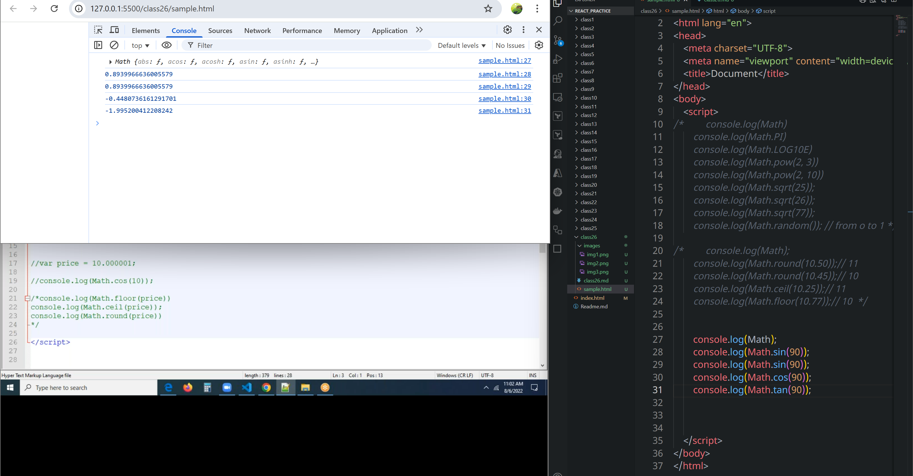

# class 25
# Math() and Number()
# Math()
## chatgpt 
In JavaScript, `Math` is a built-in **object** that provides a collection of mathematical constants and functions. It is **not a constructor**, so you can't use `new Math()` — instead, you access its properties and methods directly.

### Common Use of `Math`

Here are some frequently used `Math` properties and methods:

---

### 🔢 **Constants**

* `Math.PI` – The value of π (\~3.14159)
* `Math.E` – Euler's number (\~2.718)
* `Math.LN2` – Natural logarithm of 2
* `Math.SQRT2` – Square root of 2

---

### 🔧 **Methods**

#### Rounding

* `Math.round(x)` – Rounds to the nearest integer
* `Math.floor(x)` – Rounds **down**
* `Math.ceil(x)` – Rounds **up**
* `Math.trunc(x)` – Trims off the decimal part

#### Arithmetic

* `Math.abs(x)` – Absolute value
* `Math.pow(x, y)` – x to the power of y
* `Math.sqrt(x)` – Square root
* `Math.cbrt(x)` – Cube root

#### Trigonometry

* `Math.sin(x)`, `Math.cos(x)`, `Math.tan(x)` – Trigonometric functions (in radians)
* `Math.asin(x)`, `Math.acos(x)`, `Math.atan(x)`, `Math.atan2(y, x)` – Inverse trigonometric functions

#### Random and Min/Max

* `Math.random()` – Returns a float between 0 (inclusive) and 1 (exclusive)
* `Math.min(a, b, ...)` – Returns the smallest of the arguments
* `Math.max(a, b, ...)` – Returns the largest of the arguments

#### Logarithmic

* `Math.log(x)` – Natural log (base e)
* `Math.log10(x)` – Log base 10
* `Math.log2(x)` – Log base 2
* `Math.exp(x)` – Returns eˣ

---

### Example

```javascript
console.log(Math.PI);         // 3.141592653589793
console.log(Math.round(4.7)); // 5
console.log(Math.pow(2, 3));  // 8
console.log(Math.random());   // e.g., 0.678
console.log(Math.max(1, 5, 3)); // 5
```

Let me know if you want examples for a specific `Math` method or how to use `Math.random()` to generate a random number in a range!
Great follow-up — let's clarify that point about `Math` **not being a constructor** in JavaScript.

### 🔠What does “not a constructor†mean?

In JavaScript, some built-in objects like `Date`, `Array`, or `RegExp` can be used with the `new` keyword to create instances:

```js
let arr = new Array();  // OK
let date = new Date();  // OK
```

However, `Math` is **not** meant to be instantiated — it's a **static object** that just holds methods and properties. So trying this:

```js
let m = new Math();  // ⌠TypeError: Math is not a constructor
```

will throw an error.

### ✅ Correct Usage

Use `Math` directly:

```js
let x = Math.sqrt(16);     // 4
let y = Math.random();     // e.g., 0.723
let z = Math.PI * 2;       // ~6.283
```

Think of `Math` more like a toolbox rather than a blueprint for creating new objects.
## classNotes:-
### Mathematical functions
* **sqrt()** : square root
* **pow(2,6)**: 2^6
* **cos()**
* **probability**
        * If you want to learn AI, it is mandatory to learn.
        * This is that much importance.
* **statistics**
* **trignometri**

#### regularly used methods
* **min** 
* **max**
* **ceil**
* **round**
* **floor**
* **random**
* **PI**

* **round** will give you lowest value if decimal below `50` and heightst value if decimal value above `49`
* **ceil** always takes upper value
* * **floor** always give lowest value
```js

        console.log(Math);
        console.log(Math.round(10.50));// 11
        console.log(Math.round(10.45));// 10
        console.log(Math.ceil(10.25));// 11
        console.log(Math.floor(10.77));// 10 
```

```js
        console.log(Math);     
        console.log(Math.sin(90));     
        console.log(Math.sin(90));     
        console.log(Math.cos(90));
        console.log(Math.tan(90));
```


## Generate random number between two numbers(1, 100)
To generate a random number between **1 and 100** in JavaScript, you can use:

```javascript
const randomNumber = Math.floor(Math.random() * 100) + 1;
console.log(randomNumber);
```

### 🔠How it works:

* `Math.random()` generates a number between **0 (inclusive)** and **1 (exclusive)** — e.g., 0.572.
* Multiply by 100 → gives a number between 0 and just under 100.
* `Math.floor()` rounds it down to an integer between 0 and 99.
* Add 1 → shifts the range to **1 through 100**.

### 💡 Function Version

You can create a reusable function like this:

```javascript
function getRandomBetween(min, max) {
  return Math.floor(Math.random() * (max - min + 1)) + min;
}

console.log(getRandomBetween(1, 100)); // e.g., 42
```

Let me know if you want a floating-point version or a random number without repeats.

#### why do we have to add 1
Great question!

We add `+1` **to shift the range** of possible random numbers from starting at **0 to starting at 1**.

### Here's the breakdown:

```javascript
Math.random()         // → 0 (inclusive) to <1 (exclusive)
Math.random() * 100   // → 0 to <100
Math.floor(...)       // → 0 to 99 (since Math.floor rounds down)
```

So without adding 1, the result would be between **0 and 99**.

---

### ✅ What we want:

A number between **1 and 100**, inclusive.

To fix this:

```javascript
Math.floor(Math.random() * 100) + 1
```

Now the result is:

* Minimum: `Math.floor(0) + 1` → 1
* Maximum: `Math.floor(99.999...) + 1` → 100

So the `+1` is there to **shift the entire range up** by 1 — from `[0–99]` to `[1–100]`.

Let me know if you want a visual demo or a custom range explanation!

## find the high and low values from array using Math object

You can find the **highest** and **lowest** values in an array using the `Math.max()` and `Math.min()` methods, combined with the **spread operator (`...`)**.

### ✅ Example:

```javascript
const numbers = [23, 5, 78, 1, 99, 45];

const highest = Math.max(...numbers);
const lowest = Math.min(...numbers);

console.log("Highest:", highest); // 99
console.log("Lowest:", lowest);   // 1
```

---

### 🔠Why use `...numbers`?

* `Math.max()` and `Math.min()` expect individual arguments, **not an array**.
* The spread operator `...` **expands the array into separate arguments**.

So this:

```javascript
Math.max(...[1, 2, 3])  // same as Math.max(1, 2, 3)
```

---

### âš ï¸ Without spread (wrong way):

```javascript
Math.max([1, 2, 3]); // ⌠NaN
```

## Number
### convert a string into an array => join('') and toString()
### convert a string into an Number
* **parseInt()**
* **parseFloat()**
* **Number()**
```js
/*
        var num1 = '10';
        var num2 = '20';
        var sum = num1 + num2;
        console.log(sum);// 1020
 */

        // var num1 = '10';
        // var num2 = '20';
        // var sum = parseInt(num1) + parseFloat(num2);
        // console.log(sum);// 30

        // var num1 = '10.008';
        // var num2 = '20.979';
        // var sum = parseFloat(num1) + parseFloat(num2);
        // console.log(sum) // 30.987

        var num1 = '10.008';
        var num2 = '20';
        var sum = Number(num1) + Number(num2);
        console.log(sum) // 30.008


```
### chatgpt
Great question! Let's break this down in two parts:

---

## 🔠1. **"Parse is a global method" — What does that mean?**

In JavaScript, when we say something is a **global method**, it means it’s available **without needing to be attached to an object**. It belongs to the **global scope**, provided by the `window` object in browsers or the global object in Node.js.

### 🌠Example: `parseInt()` and `parseFloat()`

These are **global parsing functions**:

```js
parseInt("123abc");     // 123
parseFloat("3.14pi");   // 3.14
```

You don't write:

```js
Number.parseInt("123"); // also valid
```

But the global `parseInt()` and `parseFloat()` are the **same functions** as `Number.parseInt()` and `Number.parseFloat()` — they’re just available globally too.

---

### 🔢 2. **"Number is an object" — What does that mean?**

In JavaScript, **`Number` is a built-in object** that:

* Wraps numeric values.
* Provides **methods** and **properties** for working with numbers.
* Can also be used with `new` (though that's not recommended).

### Examples of `Number` as an object:

```js
Number.isInteger(42);        // true (a static method)
Number.MAX_VALUE;            // 1.7976931348623157e+308 (a static property)

let x = new Number(5);       // creates a Number object (object wrapper)
typeof x;                    // "object"
```

> Even when you use a number like `42`, JavaScript temporarily wraps it in a `Number` object to allow methods like `.toFixed()` to work:

```js
let n = 42;
n.toFixed(2);  // "42.00"
```

---

### ✅ Summary:

| Concept                      | Meaning                                                         |
| ---------------------------- | --------------------------------------------------------------- |
| `parseInt()`, `parseFloat()` | **Global functions** — available without needing an object      |
| `Number`                     | A **built-in object** — provides methods/properties for numbers |
| `new Number(5)`              | Creates a Number **object** (not a primitive — rarely needed)   |
| `Number.isInteger(5)`        | Uses a method **on the Number object**                          |

---

Let me know if you want visuals or code comparisons for these!


```js

        console.log(Math.PI.toFixed(3))// 3.142
        console.log(Math.PI.toPrecision(3))//3.14
```