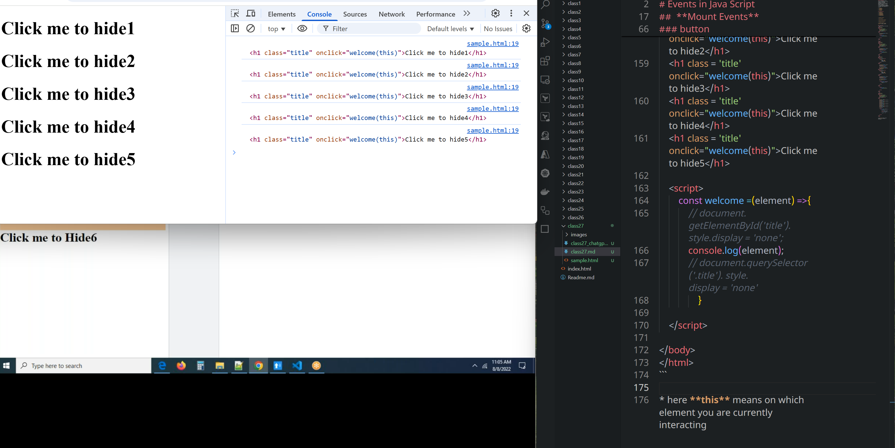
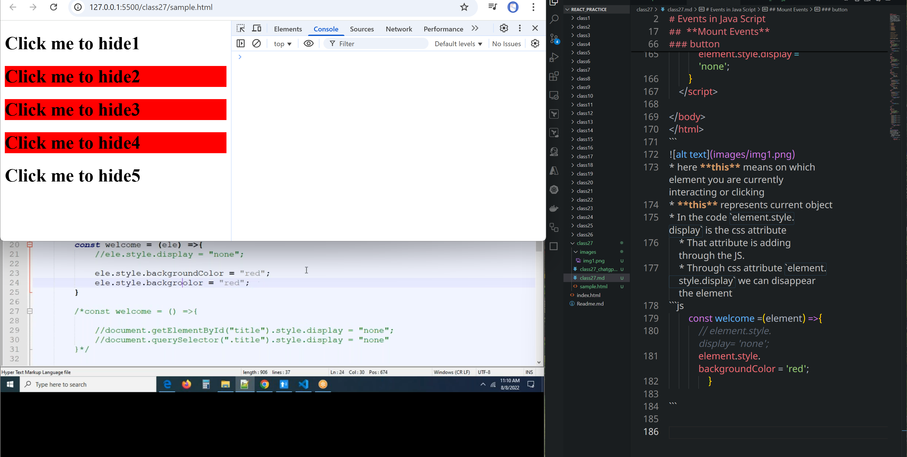
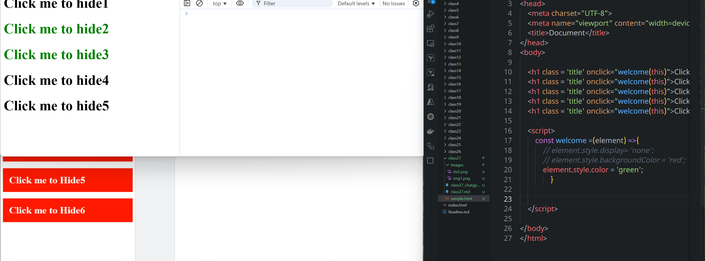
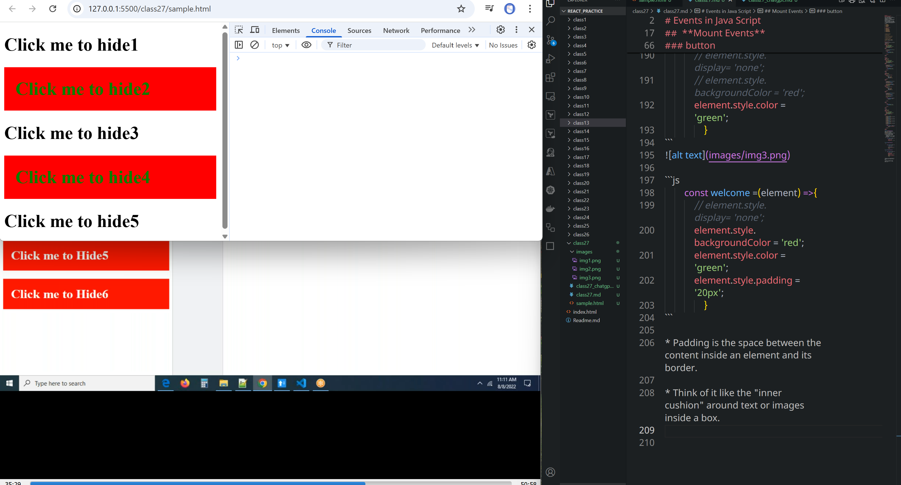
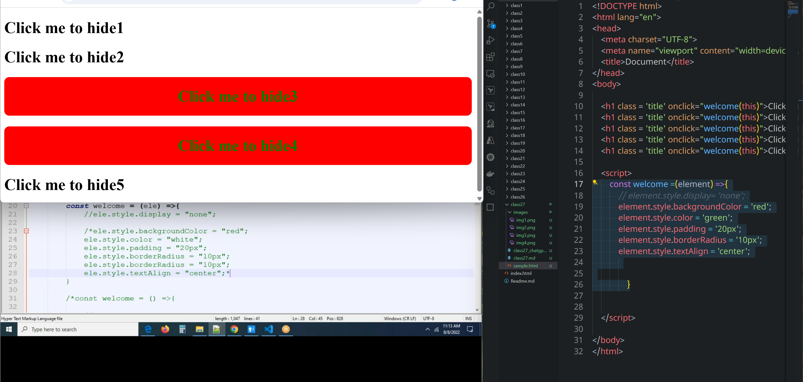
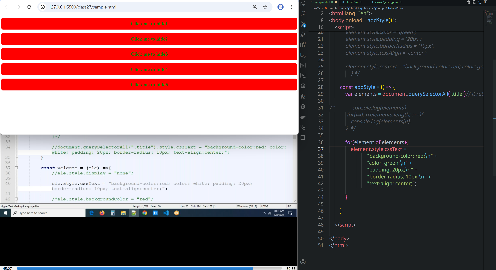
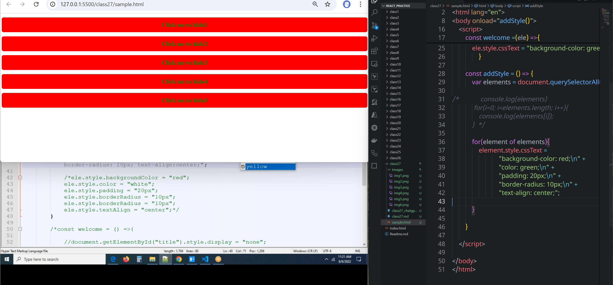
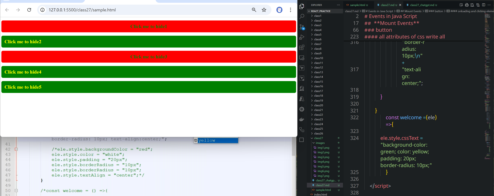

# Class 27
# Events in Java Script
## what is an event?
* It is nothing but a function, action, work, something is an event.
* Events are nothing but interactions on web page.
* Whenever, we are interacting with html elements, we will call some actions or functions.
* Events are added to html element in the starting tag of the element.
* All event attributes are predefined
*  `<element event='someAction'></element> `

*  **onload**
*  **onsubmit**
*  **onchange**
*  **onblur**
*  **onkeyup**

##  **Mount Events**
*  **onclick**
*  **ondbclick**
*  **onmouseover**
*  **onmouseout**
*  **onmousemove**
*  **onmouseenter**
*  **onmouseleave**


* **Keyboard Events**

* **Form Events**

* **video and audio events**

* **drag and drop events**

* **Animation Events**

* **window envents or global events** => onload, onresize


### onclick event
* we attached function to the event
```html
<!DOCTYPE html>
<html lang="en">
<head>
    <meta charset="UTF-8">
    <meta name="viewport" content="width=device-width, initial-scale=1.0">
    <title>Document</title>
</head>
<body>

    <h1 onclick="welcome()">This is an Heading</h1>
    
    <script>
        const welcome =() =>{
            alert('hello world')
        }

    </script>
    
</body>
</html>
```

### button
```html
<!DOCTYPE html>
<html lang="en">
<head>
    <meta charset="UTF-8">
    <meta name="viewport" content="width=device-width, initial-scale=1.0">
    <title>Document</title>
</head>
<body>

    <h1 onclick="welcome()">This is an Heading</h1>
    <button onclick="welcome()">click here!</button>
    
    <script>
        const welcome =() =>{
            alert('hello world')
        }
    </script>
    
</body>
</html>
```
```html
<!DOCTYPE html>
<html lang="en">
<head>
    <title>Document</title>
    <style>
        .block{
            height: 100px;
            width: 100px;
            background: red;
        }
    </style>
</head>
<body>

    <h1 onclick="welcome()">This is an Heading</h1>
    <button onclick="welcome()">click here!</button>

    <div onmouseover="welcome()" class="block">this is div</div>
    <!DOCTYPE html>
<html lang="en">
<head>
    <title>Document</title>
    <style>
        .block{
            height: 100px;
            width: 100px;
            background: red;
        }
    </style>
</head>
<body>

    <h1 onclick="welcome()">This is an Heading</h1>
    <button onclick="welcome()">click here!</button>

    <div onmouseout="welcome()" class="block"></div>
    
    <script>
        const welcome = function(){
            return alert('hello world');;
        };

    </script>
    
</body>
</html>
    
    <script>
        const welcome =() =>{
            alert('hello world')
        }

    </script>
    
</body>
</html>
```
```html
<!DOCTYPE html>
<html lang="en">
<head>
    <meta charset="UTF-8">
    <meta name="viewport" content="width=device-width, initial-scale=1.0">
    <title>Document</title>
</head>
<body>

    <h1 class = 'title' onclick="welcome(this)">Click me to hide1</h1>
    <h1 class = 'title' onclick="welcome(this)">Click me to hide2</h1>
    <h1 class = 'title' onclick="welcome(this)">Click me to hide3</h1>
    <h1 class = 'title' onclick="welcome(this)">Click me to hide4</h1>
    <h1 class = 'title' onclick="welcome(this)">Click me to hide5</h1>
    
    <script>
        const welcome = (element) =>{
            element.style.display = 'none';
        }
    </script>
    
</body>
</html>
```

* here **this** means on which element you are currently interacting or clicking
* **this** represents current object
* In the code `element.style.display` is the css attribute
    * That attribute is adding through the JS.
    * Through css attribute `element.style.display` we can disappear the element
```js
        const welcome =(element) =>{
            // element.style.display= 'none';
            element.style.backgroundColor = 'red';
                }

```


```js

        const welcome =(element) =>{
            // element.style.display= 'none';
            // element.style.backgroundColor = 'red';
            element.style.color = 'green';
                }
```


```js
        const welcome =(element) =>{
            // element.style.display= 'none';
            element.style.backgroundColor = 'red';
            element.style.color = 'green';
            element.style.padding = '20px';
                }
```

* Padding is the space between the content inside an element and its border.

* Think of it like the "inner cushion" around text or images inside a box.

```js
        const welcome =(element) =>{
            // element.style.display= 'none';
            element.style.backgroundColor = 'red';
            element.style.color = 'green';
            element.style.padding = '20px';
            element.style.borderRadius = '10px';
            element.style.textAlign = 'center';
            

                }
```

#### all attributes of css write all at a time
```js
element.style.cssText = "background-color: red; color: green; padding: 20px; border-radius: 10px; text-align: center";
```

```html
<!DOCTYPE html>
<html lang="en">
<head>
    <meta charset="UTF-8">
    <meta name="viewport" content="width=device-width, initial-scale=1.0">
    <title>Document</title>
</head>
<body onload="addStyle()">

    <h1 class = 'title' onclick="welcome(this)">Click me to hide1</h1>
    <h1 class = 'title' onclick="welcome(this)">Click me to hide2</h1>
    <h1 class = 'title' onclick="welcome(this)">Click me to hide3</h1>
    <h1 class = 'title' onclick="welcome(this)">Click me to hide4</h1>
    <h1 class = 'title' onclick="welcome(this)">Click me to hide5</h1>
    
    <script>
/*         const welcome =(element) =>{
            // element.style.display= 'none';
            element.style.backgroundColor = 'red';
            element.style.color = 'green';
            element.style.padding = '20px';
            element.style.borderRadius = '10px';
            element.style.textAlign = 'center';

            element.style.cssText = "background-color: red; color: green; padding: 20px; border-radius: 10px; text-align: center"
                } */

        const addStyle = () => {
            var elements = document.querySelectorAll('.title')// it returns array

/*             console.log(elements)
             for(i=0; i<elements.length; i++){
                console.log(elements[i]);
            }  */

            for(element of elements){
                element.style.cssText = 
                            "background-color: red;\n" +
                            "color: green;\n" +
                            "padding: 20px;\n" +
                            "border-radius: 10px;\n" +
                            "text-align: center;";


            }

        }

    </script>
    
</body>
</html>
```


```html
<!DOCTYPE html>
<html lang="en">
<head>
    <meta charset="UTF-8">
    <meta name="viewport" content="width=device-width, initial-scale=1.0">
    <title>Document</title>
</head>
<body onload="addStyle()">

    <h1 class = 'title' onclick="welcome(this)">Click me to hide1</h1>
    <h1 class = 'title' onclick="welcome(this)">Click me to hide2</h1>
    <h1 class = 'title' onclick="welcome(this)">Click me to hide3</h1>
    <h1 class = 'title' onclick="welcome(this)">Click me to hide4</h1>
    <h1 class = 'title' onclick="welcome(this)">Click me to hide5</h1>
    
    <script>


        const addStyle = () => {
            var elements = document.querySelectorAll('.title')// it returns array

/*             console.log(elements)
             for(i=0; i<elements.length; i++){
                console.log(elements[i]);
            }  */

            for(element of elements){
                element.style.cssText = 
                            "background-color: red;\n" +
                            "color: green;\n" +
                            "padding: 20px;\n" +
                            "border-radius: 10px;\n" +
                            "text-align: center;";

            }

        }
                const welcome =(ele) =>{

            ele.style.cssText = "background-color: green; color: yellow; padding: 20px; border-radius: 10px;"
                } 
    </script>

</body>
</html>
```
#### onloading and without clicking
* By using `querySelectorAll` we can find class and applying changes

#### onloading and clicking elements



