# class 28
# Events in JS
```html
<!DOCTYPE html>
<html lang="en">
<head>
    <meta charset="UTF-8">
    <title>Document</title>
</head>
<body>

    <h1  onclick="hideElement()">Click me to hide1</h1>
    <h1   onclick="hideElement()">Click me to hide2</h1>
    <h1  onclick="hideElement()" >Click me to hide3</h1>
    <h1   onclick="hideElement()">Click me to hide4</h1>
    <h1   onclick="hideElement()">Click me to hide5</h1>
    
    <script>

        const hideElement =()=>{
/*             ele.style.display = 'none';
            console.log(ele) */

            console.log(event)
        }

        const test = () =>{
            console.log(event)

            
        }

        test();

    </script>
    
</body>
</html>
```
* If we call a event function, in that funciton, by default event is there.
* event object will available for every event function automatically.

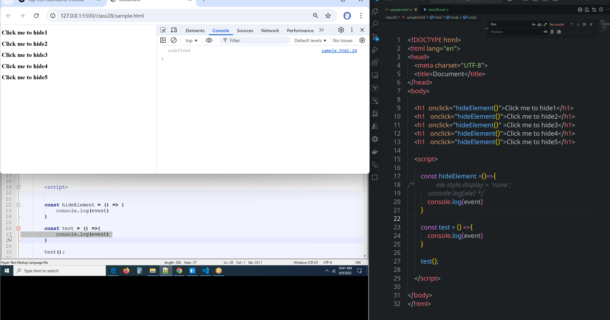
* here test() is not an event function
* event object will available for every event function automatically.

```html
<!DOCTYPE html>
<html lang="en">
<head>
    <meta charset="UTF-8">
    <title>Document</title>
    <style>
        .block{
            height: 400px;
            width: 400px;
            background-color: red;
        }
    </style>
</head>
<body>

    <div class="block" onclick="changeBgColor(this)" onmouseover="addBgColor(this)" onmouseout="revertBgColor(this)"></div>
    <script>
          /**
   * @param {HTMLElement} ele
   */
        const addBgColor=(ele)=>{
            ele.style.backgroundColor='blue';
        }

        const revertBgColor=(ele) =>{
            ele.style.backgroundColor = 'red';
        }

        const changeBgColor=(ele) =>{
            ele.style.backgroundColor = 'yellow';
        }

    </script>
    
</body>
</html>

```
* We can apply two events for a single element
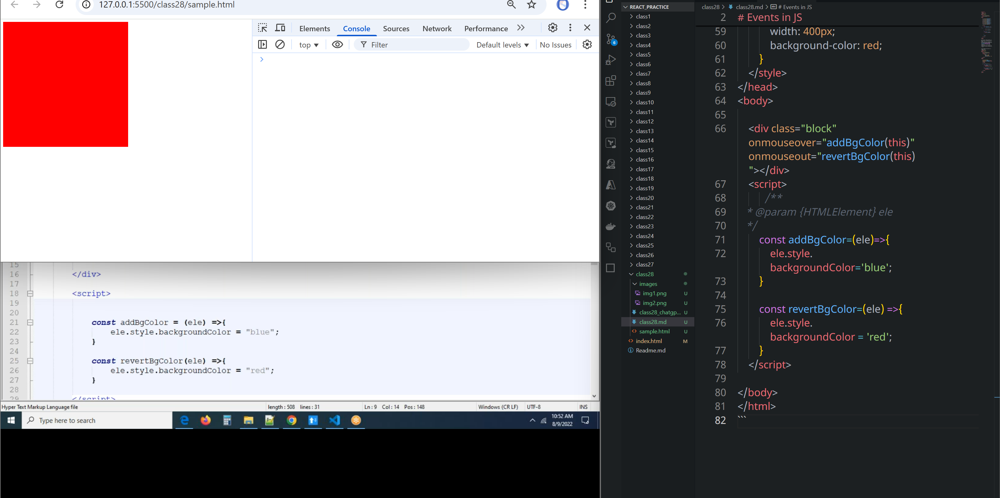
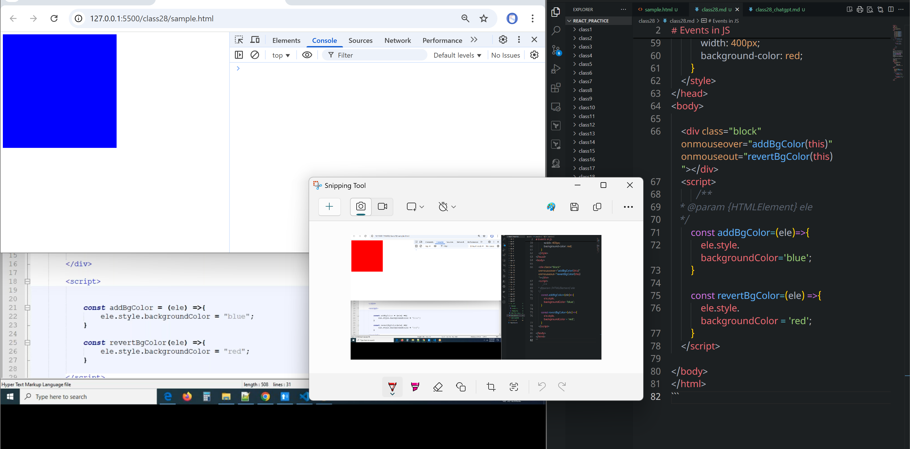

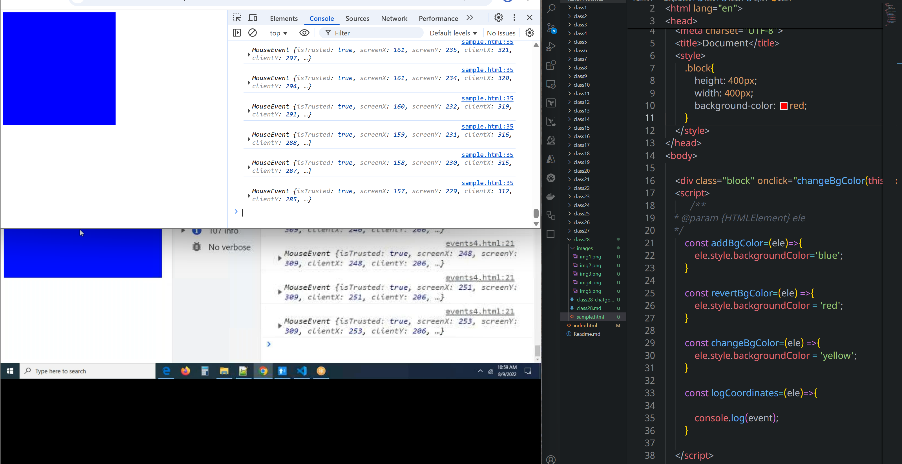
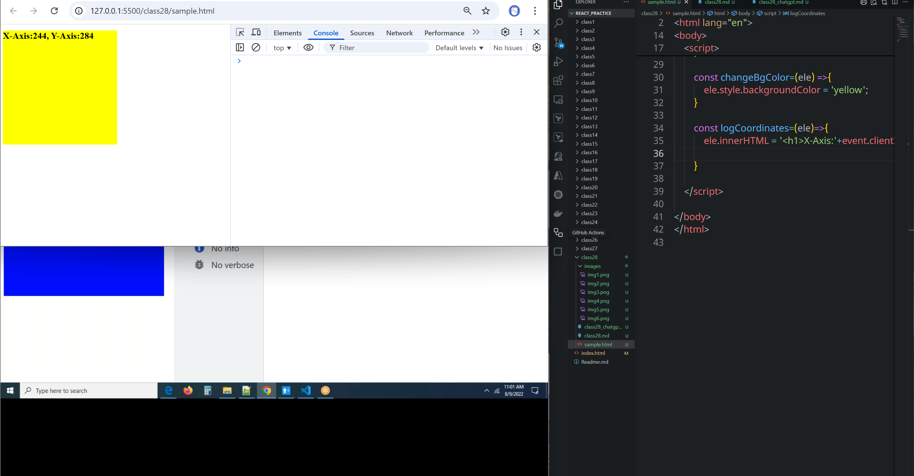
# keyboard events 
* **onkeydown**
```html
<!DOCTYPE html>
<html lang="en">
<head>
    <meta charset="UTF-8">
    <title>Document</title>
    <style>
        .block{
            height: 400px;
            width: 400px;
            background-color: red;
        }
    </style>
</head>
<body>

    <div>
        <input type="text" id = 'uname'  onkeydown="someAction(this)"/>
    </div>
    <script>
        const someAction =(ele)=>{
            console.log(ele);
            
        }

    </script>
    
</body>
</html>
```
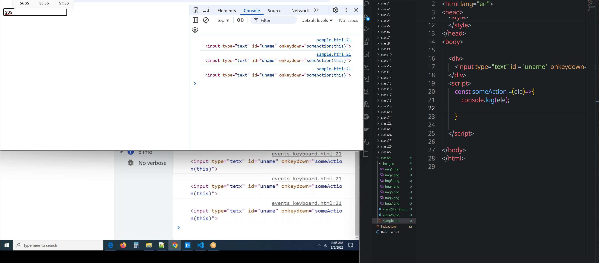

* **onkeyup**
```html
<!DOCTYPE html>
<html lang="en">
<head>
    <meta charset="UTF-8">
    <title>Document</title>
    <style>
        .block{
            height: 400px;
            width: 400px;
            background-color: red;
        }
    </style>
</head>
<body>
    <div>
        <input type="text" id = 'uname'  onkeyup="someAction(this)"/>
    </div>
    <script>
        const someAction =(ele)=>{
            // console.log(ele);
            console.log(event);

        }
    </script>    
</body>
</html>
```
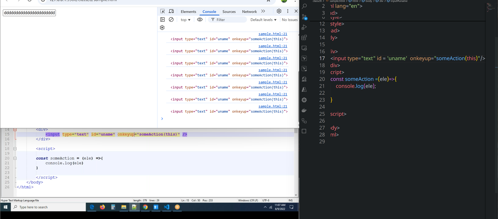
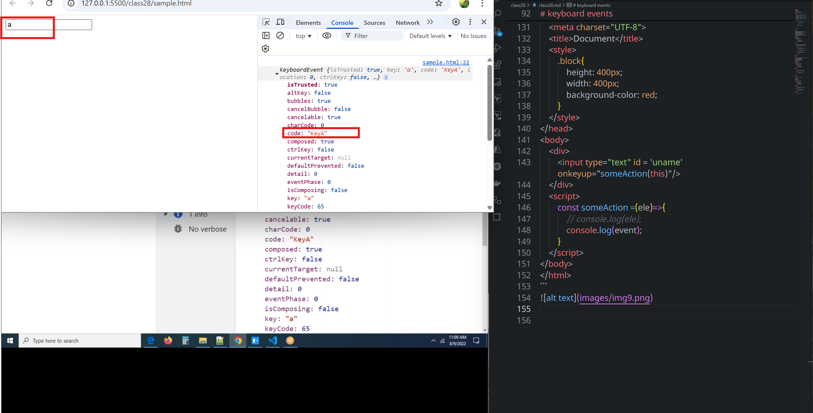
```html
<!DOCTYPE html>
<html lang="en">
<head>
    <meta charset="UTF-8">
    <title>Document</title>
    <style>
        .block{
            height: 400px;
            width: 400px;
            background-color: red;
        }
    </style>
</head>
<body>

    <div>
        <input type="text" id = 'uname'  onkeyup="someAction(this)"/>
    </div>
    <script>
        const someAction =(ele)=>{
            // console.log(ele)
            console.log(event.key)
            console.log(event.which)
            console.log(event.keyCode);//aski value
        }
    </script>
    
</body>
</html>
```
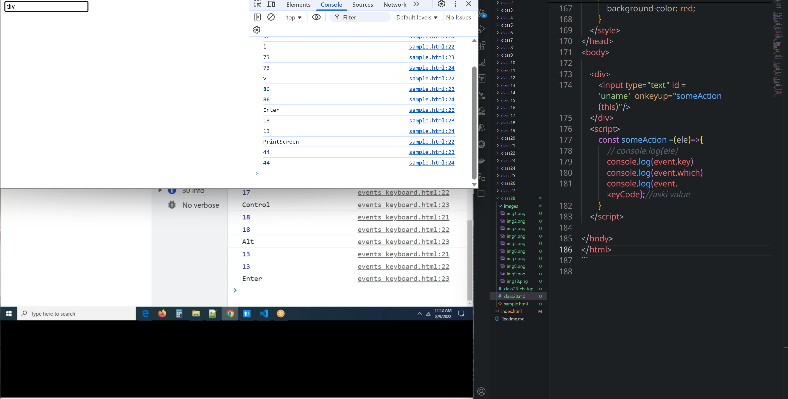
```html
<!DOCTYPE html>
<html lang="en">
<head>
    <meta charset="UTF-8">
    <title>Document</title>
    <style>
        .block{
            height: 400px;
            width: 400px;
            background-color: red;
        }
    </style>
</head>
<body>

    <div>
        <input type="text" id = 'uname'  onkeyup="someAction(this)"/>
    </div>
    <script>
        const someAction =(ele)=>{
/*             // console.log(ele)
            console.log(event.key)
            console.log(event.which)
            console.log(event.keyCode);//aski value */

            if (event.which === 13){
                console.log(ele.value);
            }
        }
    </script>
    
</body>
</html>
```
* it prints value when we press enter only
* here `13` represents aski value of enter.
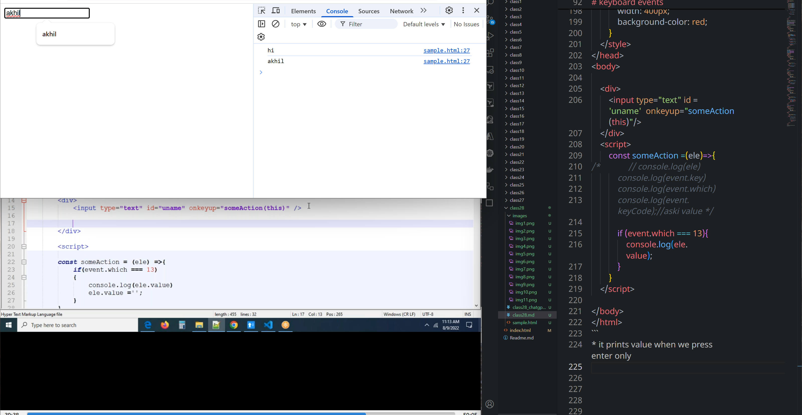
```html
<!DOCTYPE html>
<html lang="en">
<head>
    <meta charset="UTF-8">
    <title>Document</title>
    <style>
        .block{
            height: 400px;
            width: 400px;
            border: 2px solid red;
        }
    </style>
</head>
<body>

    <div>
        <input type="text" id = 'uname'  onkeyup="someAction(this)"/>
        <div class="block"></div>
    </div>
    <script>

        var div = document.querySelector('.block');
        const someAction =(ele)=>{
/*             // console.log(ele)
            console.log(event.key)
            console.log(event.which)
            console.log(event.keyCode);//aski value */

            if (event.which === 13){
                // console.log(ele.value);
                div.innerHTML ='<p>'+ele.value+'</p>'
                ele.value = '';
            }

        }
    </script>
    
</body>
</html>

```
* The line ele.value = '' is clearing the input field after the user presses Enter (event.which === 13).
```html
<!DOCTYPE html>
<html lang="en">
<head>
    <meta charset="UTF-8">
    <title>Document</title>
    <style>
        .block{
            height: 400px;
            width: 400px;
            border: 2px solid red;
        }
    </style>
</head>
<body>

    <div>
        <input type="text" id = 'uname'  onkeyup="someAction(this)"/>
        <div class="block"></div>
    </div>
    <script>

        var div = document.querySelector('.block');
        const someAction =(ele)=>{
/*             // console.log(ele)
            console.log(event.key)
            console.log(event.which)
            console.log(event.keyCode);//aski value */

            if (event.which === 13){
                // console.log(ele.value);
                div.innerHTML +='<p>'+ele.value+'</p>'
                ele.value = '';
            }

        }
    </script>
    
</body>
</html>
```
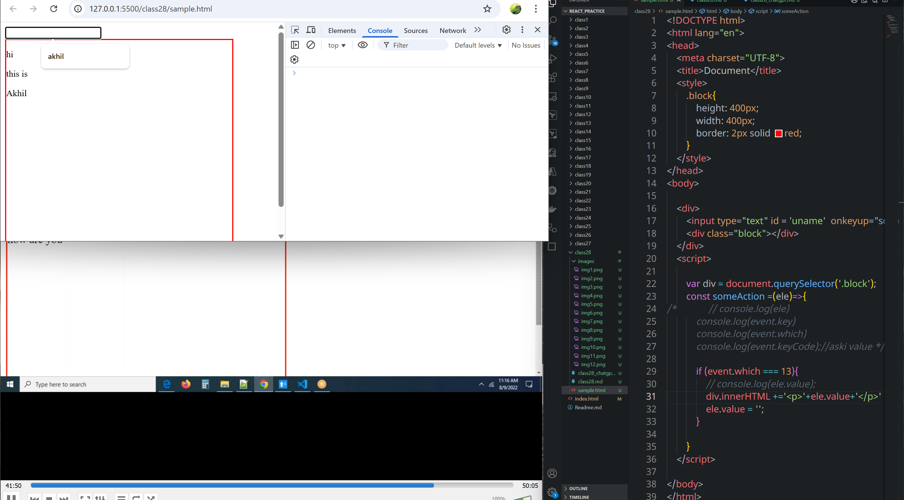
### submit with `enter` and `ctrl` keys
```html
<!DOCTYPE html>
<html lang="en">
<head>
    <meta charset="UTF-8">
    <title>Document</title>
    <style>
        .block{
            height: 400px;
            width: 400px;
            border: 2px solid red;
        }
    </style>
</head>
<body>

    <div>
        <input type="text" id = 'uname'  onkeyup="someAction(this)"/>
        <div class="block"></div>
    </div>
    <script>

        var div = document.querySelector('.block');
        const someAction =(ele)=>{
/*             // console.log(ele)
            console.log(event.key) //aski value
            console.log(event.which)// aski value
            console.log(event.keyCode);// key code*/

/*             if (event.which === 13 ){
                // console.log(ele.value);
                div.innerHTML +='<p>'+ele.value+'</p>'
                ele.value = '';
            }
 */
            
            if (event.which === 13 && event.ctrlKey === true){
                // console.log(ele.value);
                div.innerHTML +='<p>'+ele.value+'</p>'
                ele.value = '';
            }
        }
    </script>    
</body>
</html>
```


