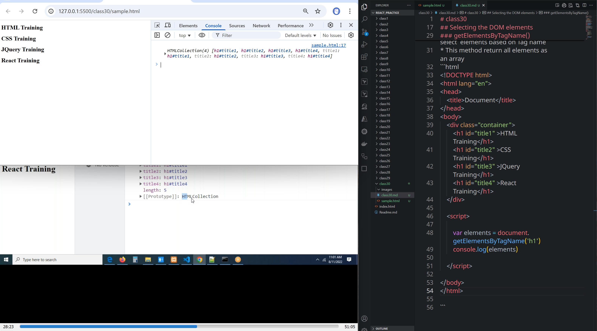
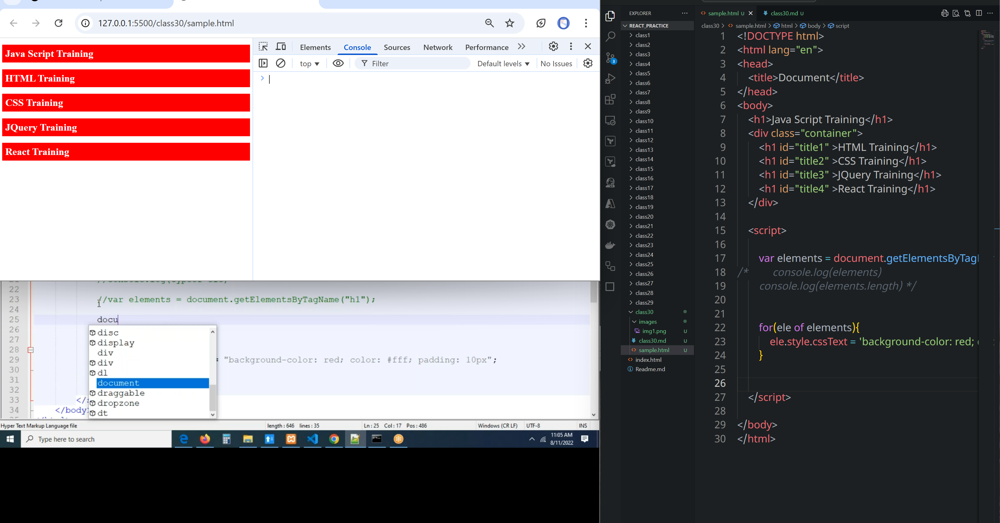
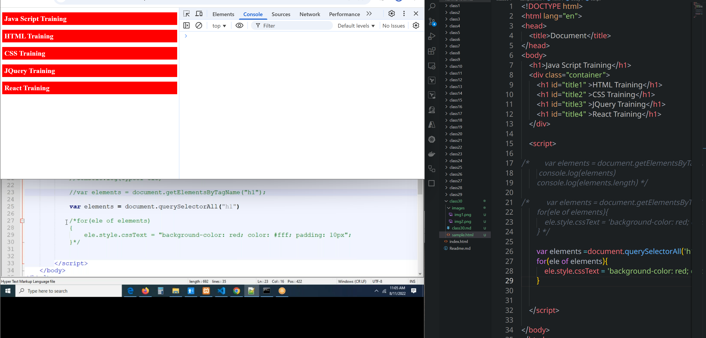
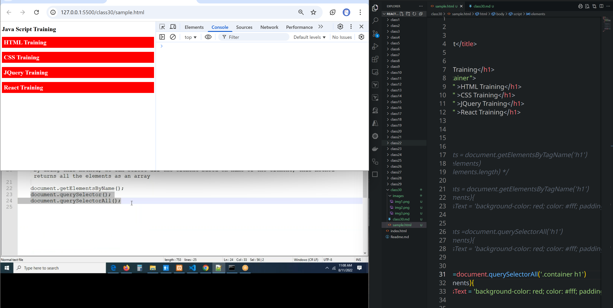
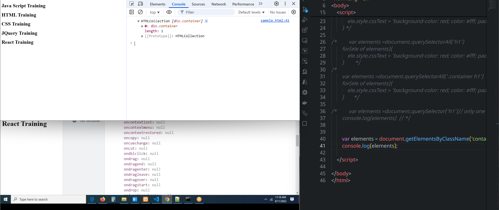

# class30
## Document Object Mode(DOM)
* Manipulating the DOM elements is called DOM
* 
* `document `  is the predefined object.
    * **queryByselector()**
    * **write()**
    * **writeln()**
    * **getElementById()**
## Document Object Manipulation
* `Manipulation ` means 
* Selecting the DOM elements
* Creating DOM elements
* Inserting an element into the DOM
* Updating the DOM element
* Remove elements from the DOM
## Selecting the DOM elements
```js
document.getElementById();
document.getElementsByClassName();
document.getElementsByTagName();
document.getElementByName();
document.querySelector();
document.querySelectorAll();
```
### getElementById()
* By using this method, we can select an element based on ID
* This method return only one element
### getElementsByTagName()
* By using this method, we can select  elements based on Tag name
* This method return all elements as an array
```html
<!DOCTYPE html>
<html lang="en">
<head>
    <title>Document</title>
</head>
<body>
    <div class="container">
        <h1 id="title1" >HTML Training</h1>
        <h1 id="title2" >CSS Training</h1>
        <h1 id="title3" >JQuery Training</h1>
        <h1 id="title4" >React Training</h1>
    </div>

    <script>

        var elements = document.getElementsByTagName('h1')
        console.log(elements)

    </script>
    
</body>
</html>

```

1. Selecting the DOM Elements

document.getElementById() : by using this method, we can select an element based on id, this method
returns only one element

document.getElementsByClassName ():
by using this method, we can select all the element based on class of the element, this method
returns all the elements as an array

document.getElementsByTagName ():
by using this method, we can select all the element based on name of the element, this method
returns all the elements as an array

document.getElementsByName ();

by using this method, we can select all the element based on attribute name of the element, this
method returns all the elements as an array

document.querySelector ();

by using this method, we can select an element based on selector, this method returns only one element.

document.querySelector ();
by using this method, we can select an element based on selector, this method returns all the elements as an array as (NodeList).





```html
<!DOCTYPE html>
<html lang="en">
<head>
    <title>Document</title>
</head>
<body>
    <h1>Java Script Training</h1>
    <div class="container">
        <h1 id="title1" >HTML Training</h1>
        <h1 id="title2" >CSS Training</h1>
        <h1 id="title3" >JQuery Training</h1>
        <h1 id="title4" >React Training</h1>
        <h1 id="title6" name='item6'  class="data">JS</h1>
        <h1 id="title7" name='item6'  class="data">JS</h1>
        
    </div>

    <script>

/*        var elements = document.getElementsByTagName('h1')
         console.log(elements)
        console.log(elements.length) */

/*         var elements = document.getElementsByTagName('h1')
        for(ele of elements){
            ele.style.cssText = 'background-color: red; color: #fff; padding: 10px'
        } */

/*         var elements =document.querySelectorAll('h1')
        for(ele of elements){
            ele.style.cssText = 'background-color: red; color: #fff; padding: 10px'
        }        */  
/* 

        var elements =document.querySelectorAll('.container h1')
        for(ele of elements){
            ele.style.cssText = 'background-color: red; color: #fff; padding: 10px'
        }       */

/*         var elements =document.querySelector('h1')// only one element is selected
        console.log(elements)  // */

/*         elements = document.getElementsByName('item6')
        console.log(elements); */

        var elements = document.getElementsByClassName('container')
        console.log(elements);

    </script>    
</body>
</html>
```
