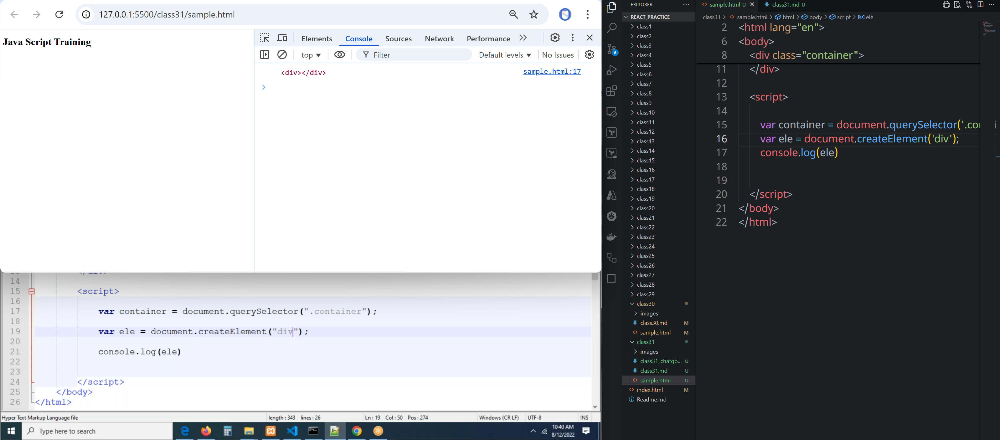
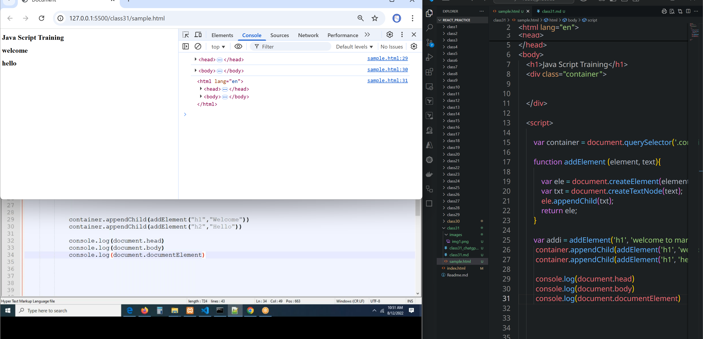
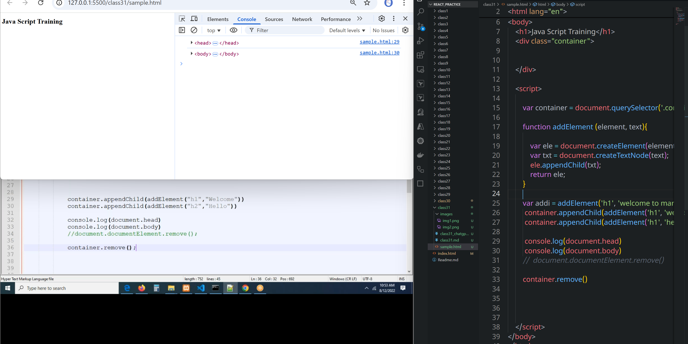
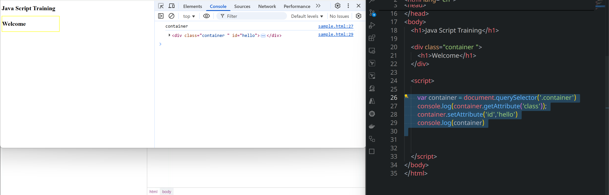
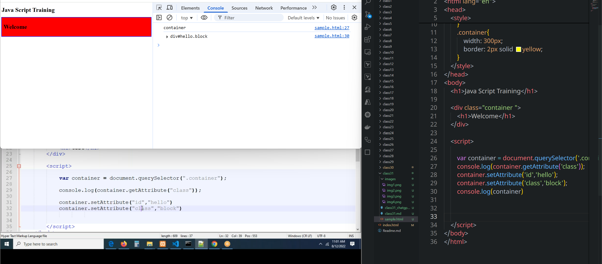
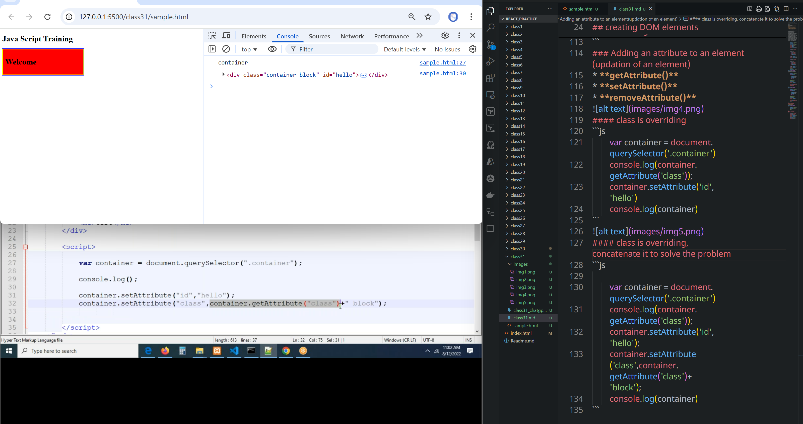

Document Object Model - DOM

dom nothing but Manipulating the dom elements

Manipulation means
* **selecting/accessing the dom elements**
* **creating the dom elements**
* **inserting an element into the DOM**
* **Updating the dom elmenets**
* **remove elements from the DOM**

1. Selecting the DOM Elements

document.getElementById() : by using this method, we can select an element based on id, this method
returns only one element

document.getElementsByClassName ():
by using this method, we can select all the element based on class of the element, this method
returns all the elements as an array

document.getElementsByTagName ():
by using this method, we can select all the element based on name of the element, this method
returns all the elements as an array
## creating DOM elements
* By using `document.createElement('p')` we can create element
* Which is a predefined method.

```js
        var container = document.querySelector('.container');
        var ele = document.createElement('h1');
        var txt = document.createTextNode('Welcome to HTML');
        console.log(ele, txt);
        ele.appendChild(txt);
        console.log(ele);

        container.appendChild(ele);
```

```js
        var container = document.querySelector('.container');

        function addElement (element, text){

            var ele = document.createElement(element);
            var txt = document.createTextNode(text);
            ele.appendChild(txt);
            return ele;
        }
        
        var addi = addElement('h1', 'welcome to martur')
         container.appendChild(addi);
```

```js
        var container = document.querySelector('.container');

        function addElement (element, text){

            var ele = document.createElement(element);
            var txt = document.createTextNode(text);
            ele.appendChild(txt);
            return ele;
        }
        
        var addi = addElement('h1', 'welcome to martur')
         container.appendChild(addElement('h1', 'welcome'));
         container.appendChild(addElement('h1', 'hello'));
```

* Through `document.documentElement`  we can have all body.
```js
        var container = document.querySelector('.container');

        function addElement (element, text){

            var ele = document.createElement(element);
            var txt = document.createTextNode(text);
            ele.appendChild(txt);
            return ele;
        }
        
        var addi = addElement('h1', 'welcome to martur')
         container.appendChild(addElement('h1', 'welcome'));
         container.appendChild(addElement('h1', 'hello'));

         console.log(document.head)
         console.log(document.body)
         console.log(document.documentElement)

```
### removing element


```js
        var container = document.querySelector('.container');

        function addElement (element, text){

            var ele = document.createElement(element);
            var txt = document.createTextNode(text);
            ele.appendChild(txt);
            return ele;
        }
        
        var addi = addElement('h1', 'welcome to martur')
         container.appendChild(addElement('h1', 'welcome'));
         container.appendChild(addElement('h1', 'hello'));

         console.log(document.head)
         console.log(document.body)
        //  document.documentElement.remove();
        container.remove()
```
### Adding an attribute to an element(updation of an element)
* **getAttribute()**
* **setAttribute()**
* **removeAttribute()**

#### class is overriding
```js
        var container = document.querySelector('.container')
        console.log(container.getAttribute('class'));
        container.setAttribute('id','hello')
        console.log(container)
```

#### class is overriding, concatenate it to solve the problem
```js

        var container = document.querySelector('.container')
        console.log(container.getAttribute('class'));
        container.setAttribute('id','hello');
        container.setAttribute('class',container.getAttribute('class')+ 'block');
        console.log(container)
```


#### removing attribute for an element

```html
<!DOCTYPE html>
<html lang="en">
<head>
    <title>Document</title>
    <style>
        .block{
            background: red;
            padding: 10px;
            outline: 2px solid blue;
        }
        .container{
            width: 300px;
            border: 2px solid yellow;
        }
    </style>
</head>
<body>
    <h1>Java Script Training</h1>

    <div class="container " style="margin: 40px;">
        <h1>Welcome</h1>
    </div>

    <script>

        var container = document.querySelector('.container')
        console.log(container.getAttribute('class'));
        container.setAttribute('id','hello');
        container.setAttribute('class',container.getAttribute('class')+ 'block');
        console.log(container)
        container.removeAttribute('style')

    </script>    
</body>
</html>
```


```html
<!DOCTYPE html>
<html lang="en">
<head>
    <title>Document</title>
    <style>
        .block{
            background: red;
            padding: 10px;
            outline: 2px solid blue;
        }
        .container{
            width: 300px;
            border: 2px solid yellow;
        }
    </style>
</head>
<body>
    <h1>Java Script Training</h1>

    <div class="container " style="margin: 40px;">
        <h1>Welcome</h1>
    </div>

    <button onclick="removeDiv()">Remove Div element</button>

    <script>

        const removeDiv =()=>{

            var container = document.querySelector('.container');
            if (container){
            container.remove()
            }
        }


    </script>    
</body>
</html>
```
33:00