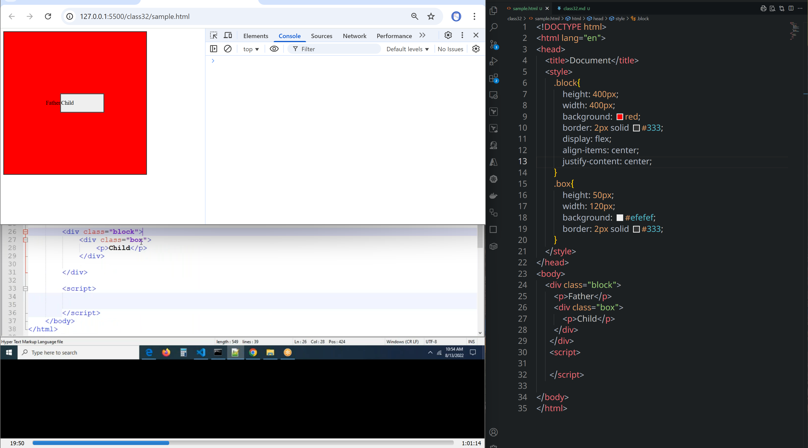
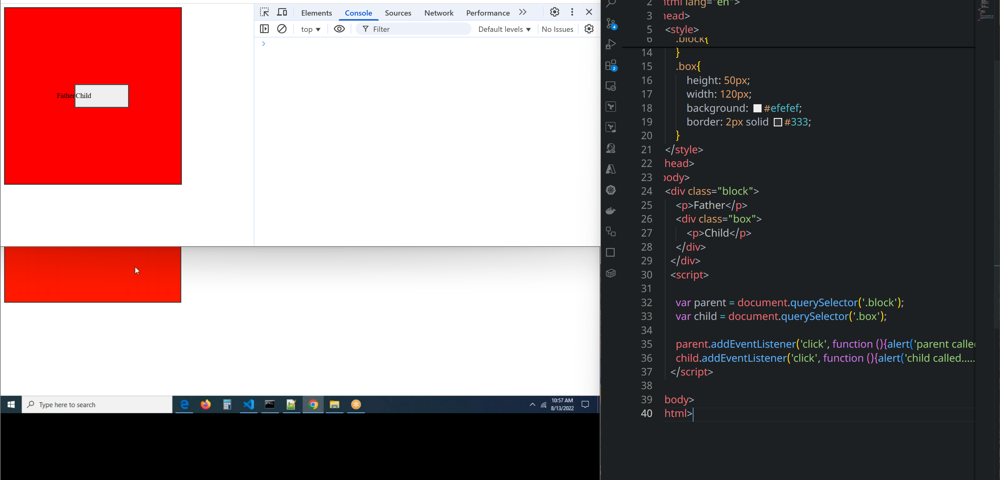
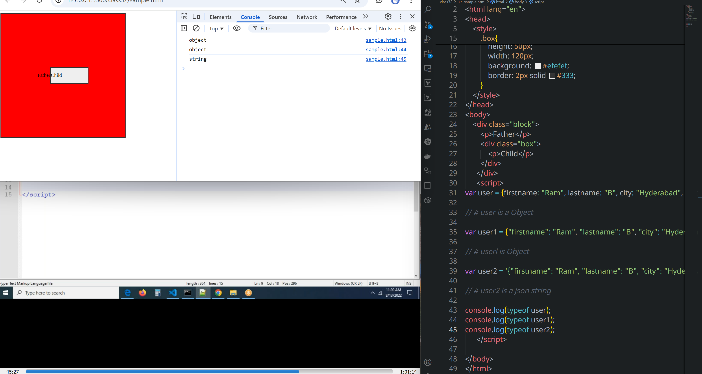
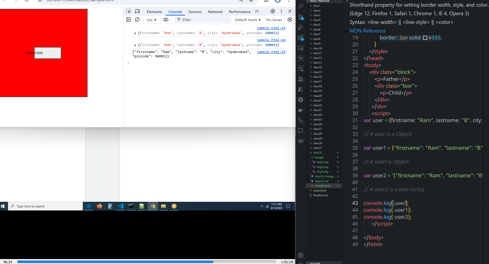
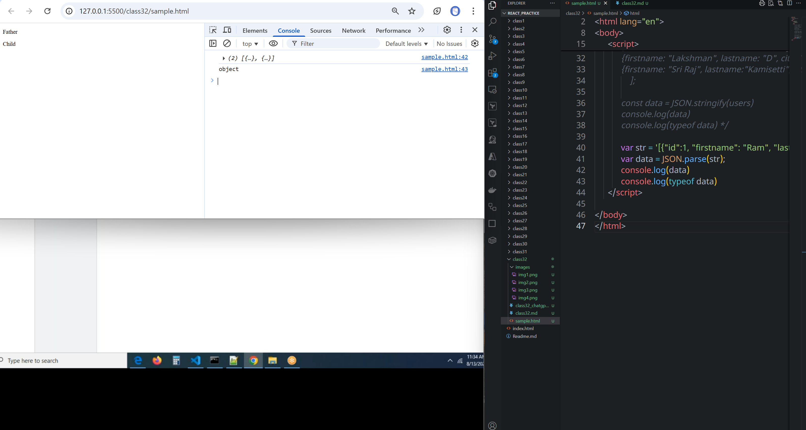

# class 32
# Event Listeners
## How can we add an Event to an element at the time of loading.
```sh

        addEventListener('event', function, useCapture);
# useCapture true| false.
```
```html
<!DOCTYPE html>
<html lang="en">
<head>
    <title>Document</title>
</head>
<body>
    <div id="parent">
        <button id="child">Click Here</button>
      </div>
      <script>
            var btn = document.getElementById('child');
            btn.addEventListener('click', someFunction)
             function someFunction(){
                alert('Hello World');

                
            btn.addEventListener('click', function(){
                alert('Hello World');
            })
            }
      </script>
</body>
</html>
```

## How can we remove event from an element in run time? or How can we remove an event from an element at the time of loading the page?

```sh

removeEventListener('event', funciton);

```
```html
<!DOCTYPE html>
<html lang="en">
<head>
    <title>Document</title>
</head>
<body>
    <div id="parent">
        <button id="child">Click Here</button>
      </div>
      <script>
            // var btn = document.getElementById('child');
/*             btn.addEventListener('click', someFunction)
             function someFunction(){
                alert('Hello World');
            } */
/* 
            btn.addEventListener('click', function(){
                alert('Hello World');
                console.log(this)
                console.log(event);
            }) */

            let someFunction =()=>{
                alert('Hello World');
                btn.removeEventListener('click', someFunction)
            }

            var btn = document.getElementById('child');
            btn.addEventListener('click', someFunction);
            
      </script>
        
</body>
</html>
```

## Event bubbling and Event Capturing
```html
<!DOCTYPE html>
<html lang="en">
<head>
    <title>Document</title>
    <style>
        .block{
            height: 400px;
            width: 400px;
            background: red;
            border: 2px solid #333;
            display: flex;
            align-items: center;
            justify-content: center;
        }
        .box{
            height: 50px;
            width: 120px;
            background: #efefef;
            border: 2px solid #333;
        }
    </style>
</head>
<body>
    <div class="block">
        <p>Father</p>
        <div class="box">
            <p>Child</p>
        </div>
      </div>
      <script>

      </script>
        
</body>
</html>
```


### Event bubbling
* If you innermost event handled first then that is called as event bubbling, by default useCapture value is `false`
```html
<!DOCTYPE html>
<html lang="en">
<head>
    <title>Document</title>
    <style>
        .block{
            height: 400px;
            width: 400px;
            background: red;
            border: 2px solid #333;
            display: flex;
            align-items: center;
            justify-content: center;
        }
        .box{
            height: 50px;
            width: 120px;
            background: #efefef;
            border: 2px solid #333;
        }
    </style>
</head>
<body>
    <div class="block">
        <p>Father</p>
        <div class="box">
            <p>Child</p>
        </div>
      </div>
      <script>

        var parent = document.querySelector('.block');
        var child = document.querySelector('.box');

        parent.addEventListener('click', function (){alert('parent called.....')});
        child.addEventListener('click', function (){alert('child called.....')});
      </script>
        
</body>
</html>
```
* Here if we click child child is called first and then automatically parent is also called
* child is the part of parent
* if we click parent, parent only called not child.
 
 ### Event Capturing
 * If the outermost event handled first then that is called as event capturing, by default useCapture value is `false` we have to make it `true`
 #### if you click child, parent called first and child call next
 * By using `true ` we can achieve it.
 ```js
<!DOCTYPE html>
<html lang="en">
<head>
    <title>Document</title>
    <style>
        .block{
            height: 400px;
            width: 400px;
            background: red;
            border: 2px solid #333;
            display: flex;
            align-items: center;
            justify-content: center;
        }
        .box{
            height: 50px;
            width: 120px;
            background: #efefef;
            border: 2px solid #333;
        }
    </style>
</head>
<body>
    <div class="block">
        <p>Father</p>
        <div class="box">
            <p>Child</p>
        </div>
      </div>
      <script>

        var parent = document.querySelector('.block');
        var child = document.querySelector('.box');

        parent.addEventListener('click', function (){alert('parent called.....')}, true);
        child.addEventListener('click', function (){alert('child called.....')});
      </script>
        
</body>
</html>
 ```
# JSON
* It is a part of JS.
* Java script string notation
* It is a global object
* It is a standard object in JS
* It is used to exchange the data between the programing languages.
* JS <============== >DATA=> - JSON - <==DATA><========= > .Net
* It is a universal data format to communicate over network
```js
var user = {firstname: "Ram", lastname: "B", city: "Hyderabad", pincode: 500032};
// # user is a Object
var user1 = {"firstname": "Ram", "lastname": "B", "city": "Hyderabad", "pincode": 500032};
// # userl is Object
var user2 = '{"firstname": "Ram", "lastname": "B", "city": "Hyderabad", "pincode": 500032}';
// # user2 is a json string
var employees = '[{"id":1, "firstname": "Ram", "lastname": "Babburi"} , {"id":2, "firstname": "Siva", "lastname": "Kumar"} ] ' ;
console.log( user);
console.log( user1);
console.log( user2);
console.log( typeof employees);
```


### How to convert Javascript object to JSON?
* By using `JSON.stringify()` we can acheive this
```html
<!DOCTYPE html>
<html lang="en">
<head>
    <title>Document</title>
    <style>
    </style>
</head>
<body>
    <div class="block">
        <p>Father</p>
        <div class="box">
            <p>Child</p>
        </div>
      </div>
      <script>
            /* var user = {firstname: "Ram", lastname: "B", city: "Hyderabad", pincode: 500032};
            // # user is a Object
            var user1 = {"firstname": "Ram", "lastname": "B", "city": "Hyderabad", "pincode": 500032};
            // # userl is Object
            var user2 = '{"firstname": "Ram", "lastname": "B", "city": "Hyderabad", "pincode": 500032}';
            // # user2 is a json string
            var employees = '[{"id":1, "firstname": "Ram", "lastname": "Babburi"} , {"id":2, "firstname": "Siva", "lastname": "Kumar"} ] ' ;
            console.log( user);
            console.log( user1);
            console.log( user2);
            console.log( typeof employees); */

            const users = [
            {firstname: "Ram", lastname: "Babburi", city: "Ongole", pincode: 500032, dob: "07-25-1987"},
            {firstname: "Anand", lastname: "Pabbineedi", city: "Kakinada", pincode: 533001, dob: "04-16-2000"},
            {firstname: "Vinod", lastname: "Katte", city: "Anantapur", pincode: 515671, dob: "06-25-2002"},
            {firstname: "Lakshman", lastname: "D", city: "Kakinada", pincode: 533006, dob: "02-16-1998"},
            {firstname: "Sri Raj", lastname:"Kamisetti", city: "Amalapuram", pincode: 533249, dob: "09-09-1997"}
                ];

            const data = JSON.stringify(users)
            console.log(data)
            console.log(typeof data)
      </script>
        
</body>
</html>
```
#### converting JSON string to Java Script object
* By using `JSON.parse()`
```html
<!DOCTYPE html>
<html lang="en">
<head>
    <title>Document</title>
    <style>
    </style>
</head>
<body>
    <div class="block">
        <p>Father</p>
        <div class="box">
            <p>Child</p>
        </div>
      </div>
      <script>
            /* var user = {firstname: "Ram", lastname: "B", city: "Hyderabad", pincode: 500032};
            // # user is a Object
            var user1 = {"firstname": "Ram", "lastname": "B", "city": "Hyderabad", "pincode": 500032};
            // # userl is Object
            var user2 = '{"firstname": "Ram", "lastname": "B", "city": "Hyderabad", "pincode": 500032}';
            // # user2 is a json string
            var employees = '[{"id":1, "firstname": "Ram", "lastname": "Babburi"} , {"id":2, "firstname": "Siva", "lastname": "Kumar"} ] ' ;
            console.log( user);
            console.log( user1);
            console.log( user2);
            console.log( typeof employees); */

/*             const users = [
            {firstname: "Ram", lastname: "Babburi", city: "Ongole", pincode: 500032, dob: "07-25-1987"},
            {firstname: "Anand", lastname: "Pabbineedi", city: "Kakinada", pincode: 533001, dob: "04-16-2000"},
            {firstname: "Vinod", lastname: "Katte", city: "Anantapur", pincode: 515671, dob: "06-25-2002"},
            {firstname: "Lakshman", lastname: "D", city: "Kakinada", pincode: 533006, dob: "02-16-1998"},
            {firstname: "Sri Raj", lastname:"Kamisetti", city: "Amalapuram", pincode: 533249, dob: "09-09-1997"}
                ];

            const data = JSON.stringify(users)
            console.log(data)
            console.log(typeof data) */

            var str = '[{"id":1, "firstname": "Ram", "lastname": "Babburi"} , {"id":2, "firstname": "Siva", "lastname": "Kumar"} ] ' 
            var data = JSON.parse(str);
            console.log(data)
            console.log(typeof data)
      </script>        
</body>
</html>
```

