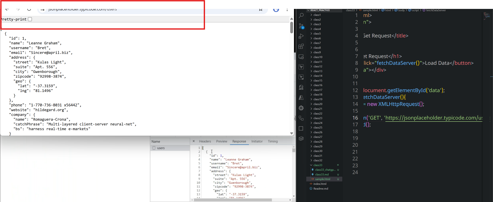
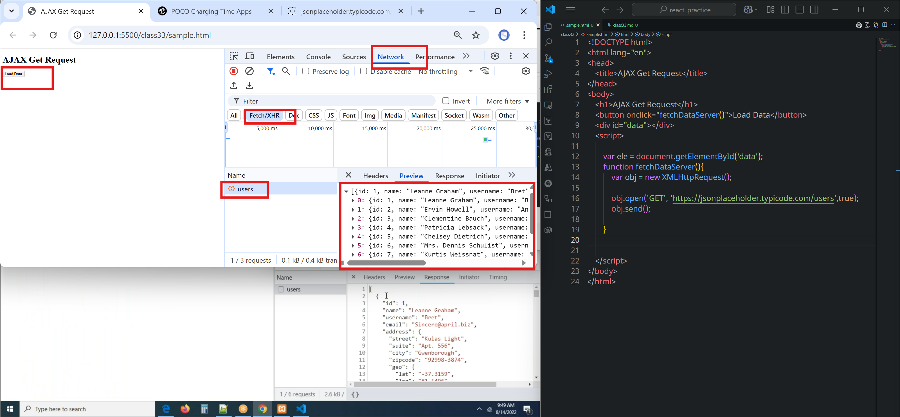
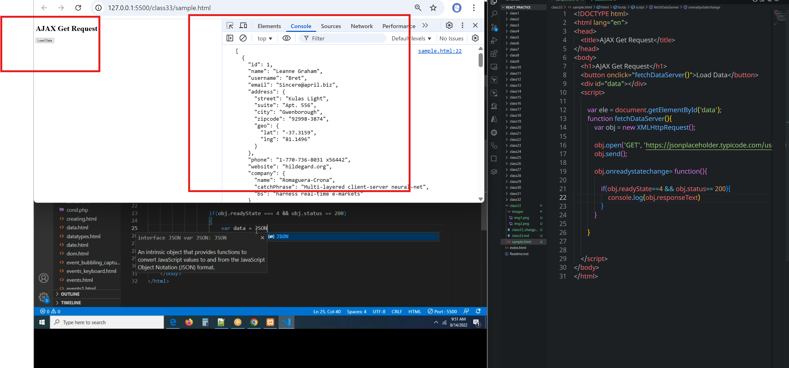
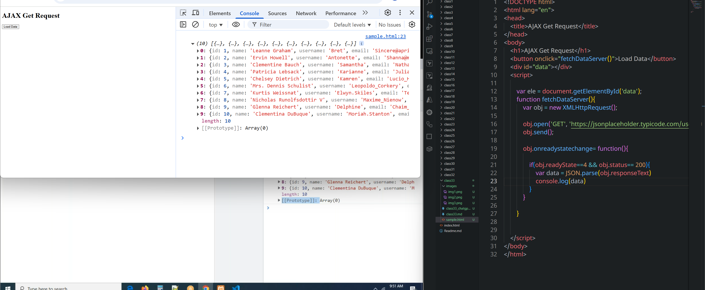
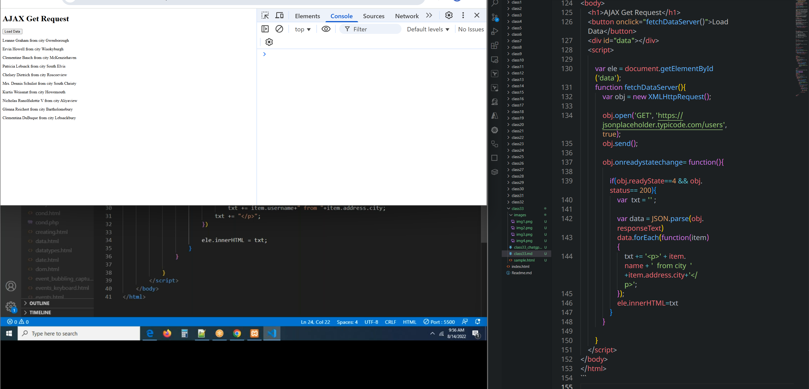

# class 33
# AJAX
* Without refreshing or without reloading 
      * **getting data from a server.**
      * **posting data to server**
      * **updating the data to server**
      * **deleting the data**
* Updating a particular portion of a web page only.(cricbuzz for example).
### To work with AJAX, we have to create AJAX object called XMLHttpRequest
`var obj = new  XMLHttpRequest`
### Sending request to server
```js
var obj = new XMLHttpRequest();
obj.open('GET', 'https://api.example.com/data', true); // Method, URL, async
obj.send(); // Sends the request

```
* **Synchronus:** one by one => send one by one request to server is synchronus request, one request is completed then we can send one more request
* **Asynchronus:** sending multiple request to server at a time. we can send multiple requests to server without waiting for the response
#### **obj.open()**
* By using open method we can establish connection to the server.
#### **obj.send()**
* By using this we can send the connection to server
Based on your image, here's a corresponding `.md` (Markdown) documentation version for **Response Handling** in `XMLHttpRequest`:

````markdown
## 3. Response Handling
=======================

When working with `XMLHttpRequest`, you can handle responses using the following key properties and events:

### 🔁 `onreadystatechange`
An event handler that is triggered whenever the `readyState` changes.
* This is an event property
* When server receives the request this property will call a funciton

```js
obj.onreadystatechange = function () {
    if (obj.readyState === 4 && obj.status === 200) {
        console.log(obj.responseText);
    }
};
````

---

### 📶 `readyState`
* By using this property we can know the status of the request in the server
* This property returns below

Represents the state of the request:

* `0` - UNSENT(request not initialised)
* `1` - OPENED(request initialised)
* `2` - HEADERS\_RECEIVED(request send to server)
* `3` - LOADING(request is processed by the server)
* `4` - DONE(response is ready)

---

### ✅ `status`

The HTTP response status code (e.g., `200` for success, `404` for not found).

---

### 📝 `responseText`

The response body returned as a text string from the server.

You can use:

```js
console.log(obj.responseText);
```
### Final AJAX CODE IS 

```js
var obj = new XMLHttpRequest();
obj.open('GET', 'https://api.example.com/data', true); // Method, URL, async

obj.send(); // Sends the request
obj.onreadystatechange = function () {
    if (obj.readyState === 4 && obj.status === 200) {
        console.log(obj.responseText);
    }
}
```
```html
<!DOCTYPE html>
<html lang="en">
<head>
    <title>AJAX Get Request</title>
</head>
<body>
    <h1>AJAX Get Request</h1>
    <button onclick="fetchDataServer()">Load Data</button>
    <div id="data"></div>
    <script>

        var ele = document.getElementById('data');
        function fetchDataServer(){
            var obj = new XMLHttpRequest();

            obj.open('GET', 'https://jsonplaceholder.typicode.com/users',true);
            obj.send();

        }    
    </script>
</body>
</html>
```
* request sent to server and data gets loaded there.




```html
<!DOCTYPE html>
<html lang="en">
<head>
    <title>AJAX Get Request</title>
</head>
<body>
    <h1>AJAX Get Request</h1>
    <button onclick="fetchDataServer()">Load Data</button>
    <div id="data"></div>
    <script>

        var ele = document.getElementById('data');
        function fetchDataServer(){
            var obj = new XMLHttpRequest();

            obj.open('GET', 'https://jsonplaceholder.typicode.com/users',true);
            obj.send();

            obj.onreadystatechange= function(){

                if(obj.readyState==4 && obj.status== 200){
                    var  txt = '' ;

                    var data = JSON.parse(obj.responseText)
                    data.forEach(function(item) {
                        txt += '<p>' + item.name + '  from city  '+item.address.city+'</p>';
                    });
                    ele.innerHTML=txt
                }
            }

        }         
    </script>
</body>
</html>
```

### post data to sever


```html
<!DOCTYPE html>
<html lang="en">
<head>
    <title>AJAX Get Request</title>
</head>
<body>
    <h1>AJAX POST Request</h1>

    <form method="post" action="" onsubmit="postDataToServer()">
        <div class="formgroup">
            <label>UserName</label>
            <input type="text" id="uname" class="formcontrol" />
        </div>
        <div class="formgroup">
            <label>Email</label>
            <input type="text" id="email" class="formcontrol" />
        </div>
        <div class="formgroup">
            <input type="submit" class="formcontrol" value="Register" />
        </div>
    </form>

    <div id="data"></div>
    <script>

        function postDataToServer(){

            event.preventDefault();

            var uname = document.getElementById('uname');
            var email = document.getElementById('email');

            var obj = new XMLHttpRequest();
            obj.open('POST', 'https://jsonplaceholder.typicode.com/users',true);

            const data = 'username='+uname.value+'&useremail='+email.value
            obj.send(data)

            obj.onreadystatechange= function(){

                if(obj.readyState==4 && obj.status== 200){
                    console.log(obj.responseText)
                        }
                }   
            }
    </script>
</body>
</html>
```