# class 35
# Objects and Inheritence
# `this` key word
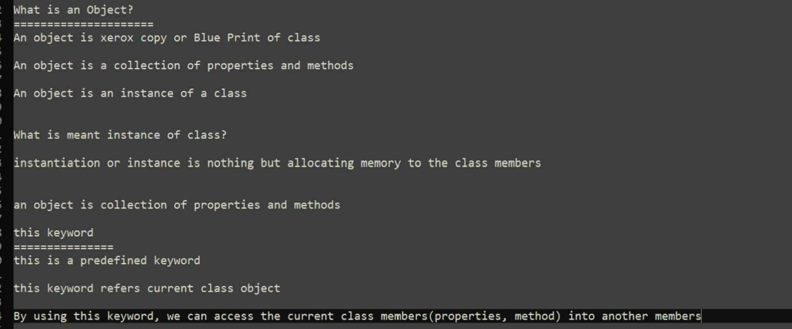
```html
<!DOCTYPE html>
<html lang="en">
<head>
    <title>Document</title>
</head>
<body>
    <script>

        class Welcome
        {
            x= 100;
            y=200;

            addTwo()
            {
                 let z = this.x+this.y;
                 return z;
            }
        }

        obj = new Welcome();
        console.log(obj.addTwo())


    </script>
    
</body>
</html>
```
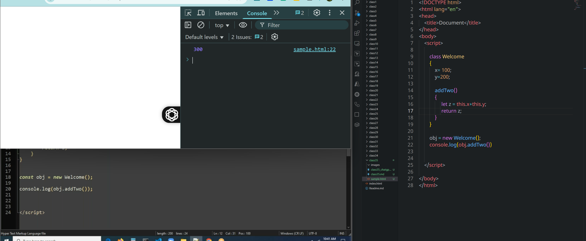
## accessing one method in other method in class
```html
<!DOCTYPE html>
<html lang="en">
<head>
    <title>Document</title>
</head>
<body>
    <script>

        class Welcome
        {
            x= 100;
            y=200;

            addTwo()
            {
                 let z = this.x+this.y;
                 return z;
            }

            display(){
               return  this.addTwo();
            }
        }
        obj = new Welcome();

    </script>
</body>
</html>
```
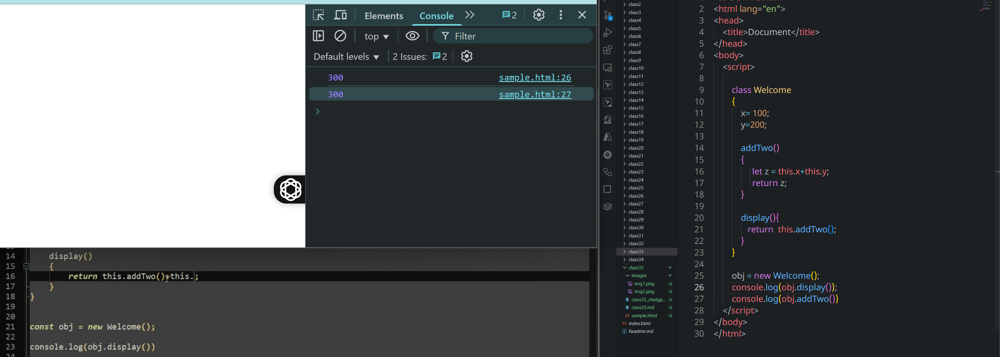
# Constructor
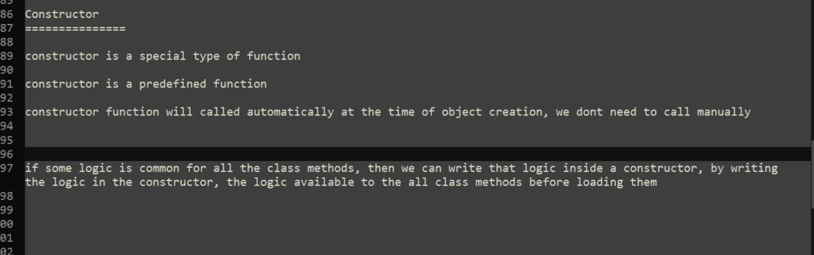
```html
<!DOCTYPE html>
<html lang="en">
<head>
    <title>Document</title>
</head>
<body>
    <script>

        class Employee
        {
            constructor()
            {
                document.writeln('<p>Employee Details</p>')
            }
            addEmployee()
            {
                document.writeln('<p>Adding Employee</p>');
            }
            viewEmployee()
            {
                document.writeln('<p>View All Employee</p>');
            }
            updateEmployee(id)
            {
                document.writeln('<h1>Updating '+id+' Employee</h1>');
            }
        }

        const emp = new Employee();

    </script>
</body>
</html>
```
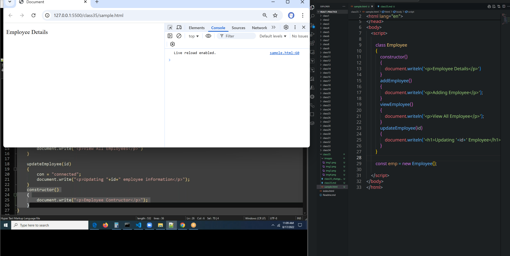
# Inheritence
* By using **`extends`** key word we can establish connection between child function and father function
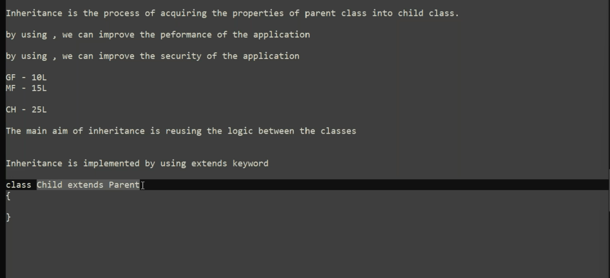

```html
<!DOCTYPE html>
<html lang="en">
<head>
    <title>Document</title>
</head>
<body>
    <script>

        class Father
        {
            money()
            {
                document.writeln('<h1>I have 10L money</h1>');
            }
            veichels()
            {
                document.writeln('<h1>Car and Bike</h1>');
            }            
        }

        class Child extends Father
        {

        }

        const child = new Child();
        
        child.money();
        
    </script>
</body>
</html>
```
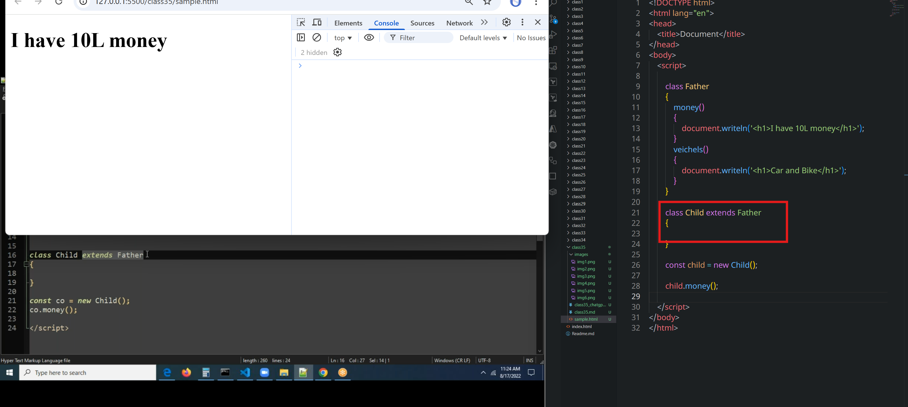
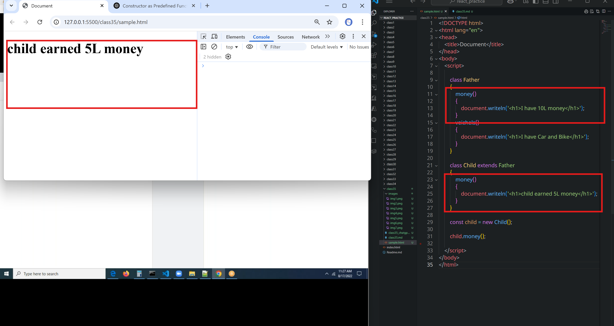
### super
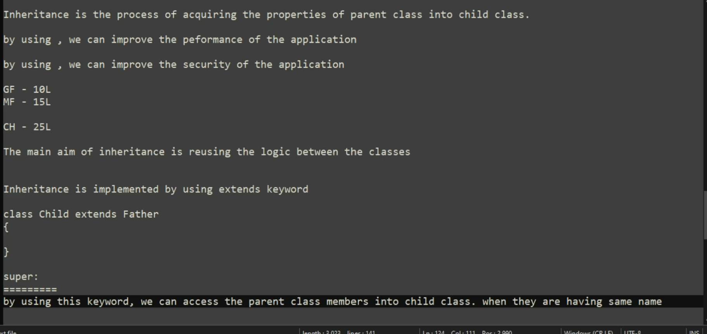
* If we want to access same function in both class. we use **super** keyword to acheive it.
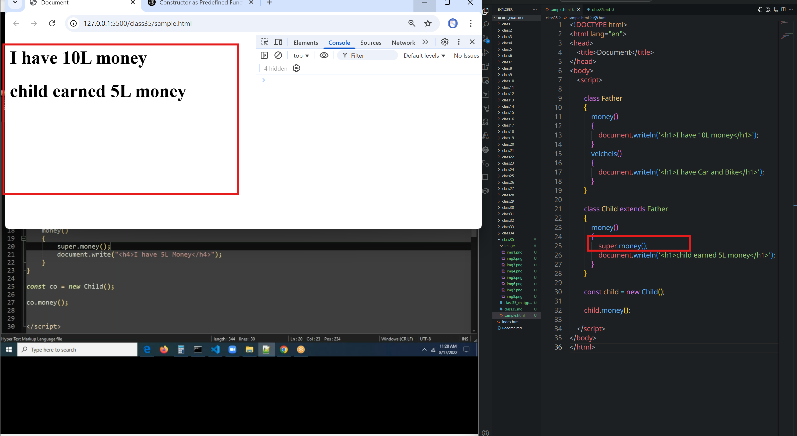
```html
<!DOCTYPE html>
<html lang="en">
<head>
    <title>Document</title>
</head>
<body>
    <script>

        class Father
        {
            money()
            {
                document.writeln('<h1>I have 10L money</h1>');
            }
            veichels()
            {
                document.writeln('<h1>I have Car and Bike</h1>');
            }            
        }

        class Child extends Father
        {
            money()
            {
                super.money();
                this.veichels(); // or super.veichels()
                document.writeln('<h1>child earned 5L money</h1>');
            }
        }

        const child = new Child();
        
        child.money();
        
    </script>
</body>
</html>
```
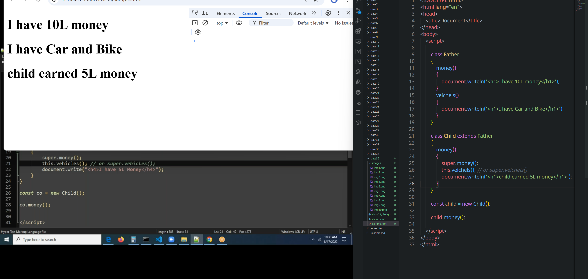
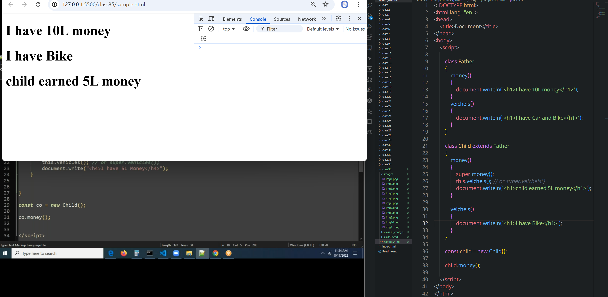


