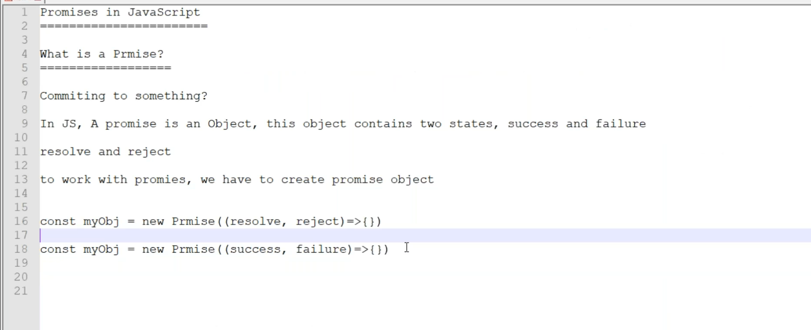
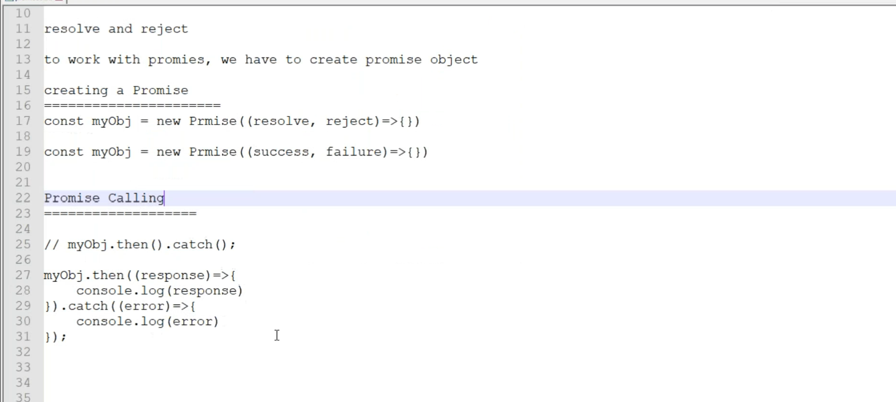
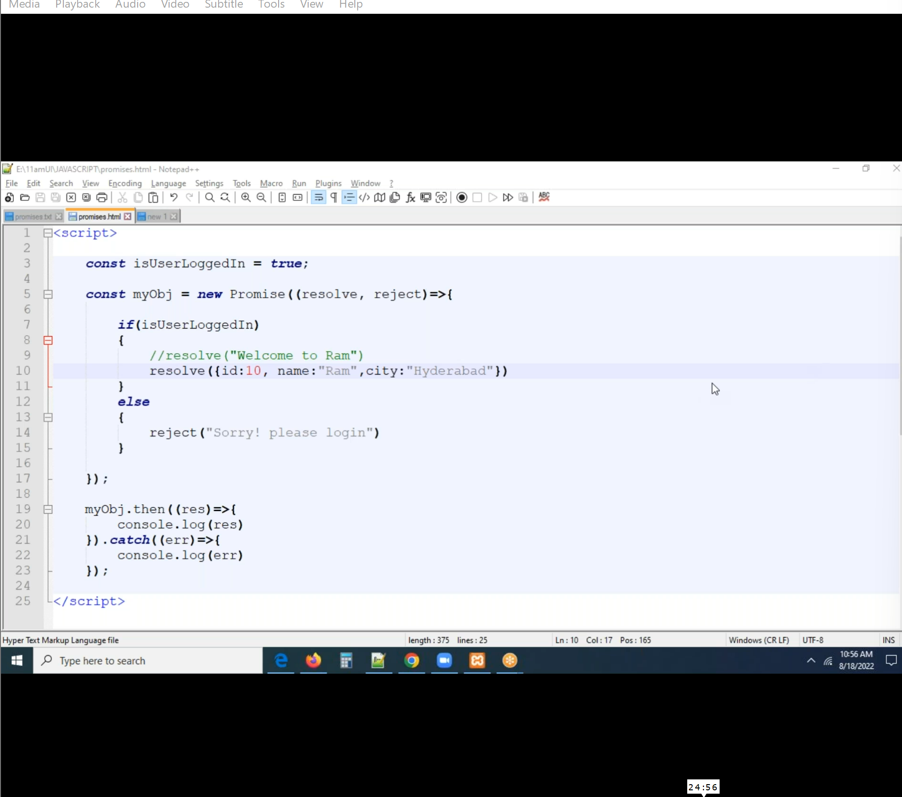
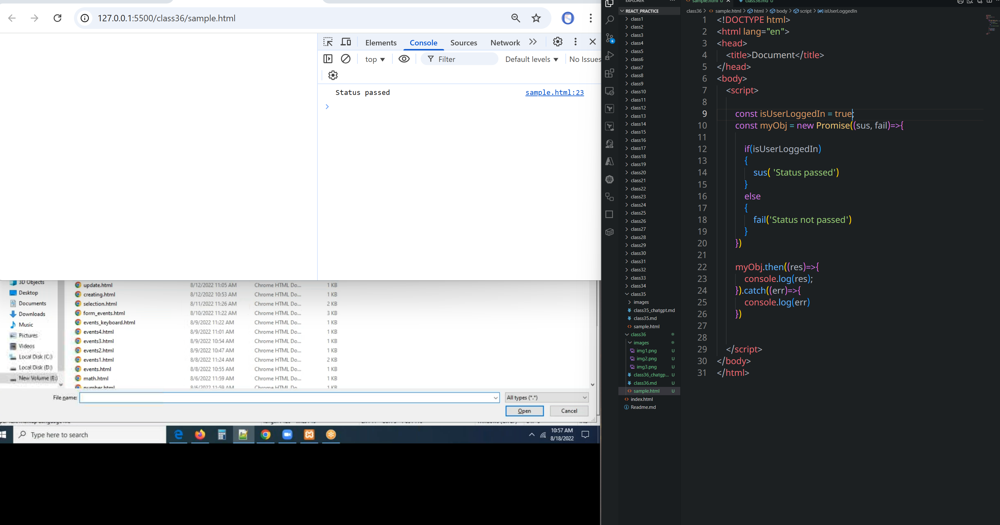
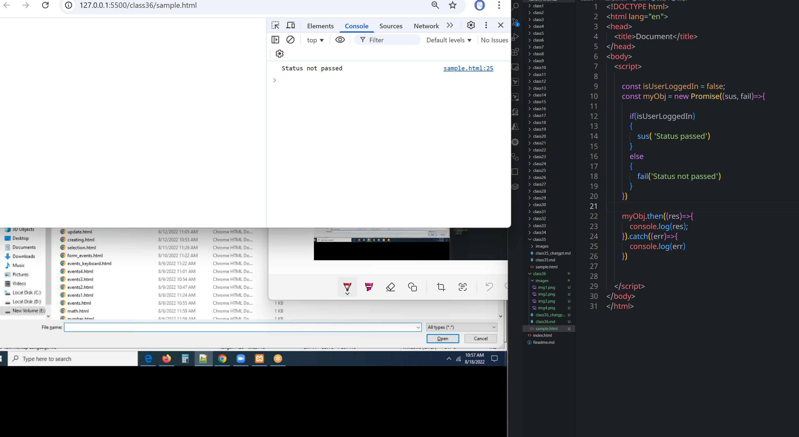
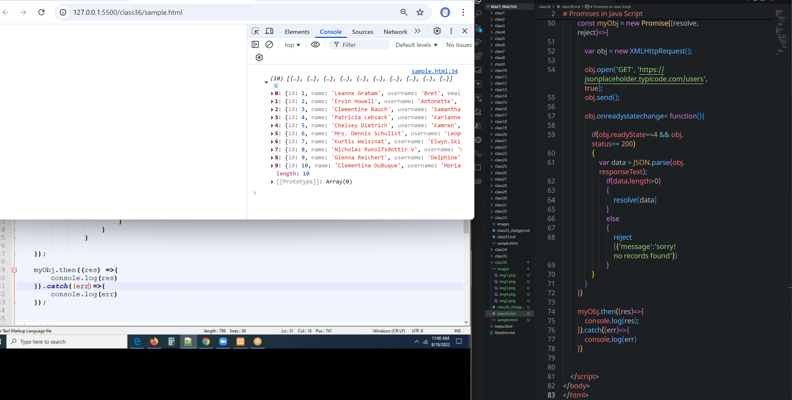
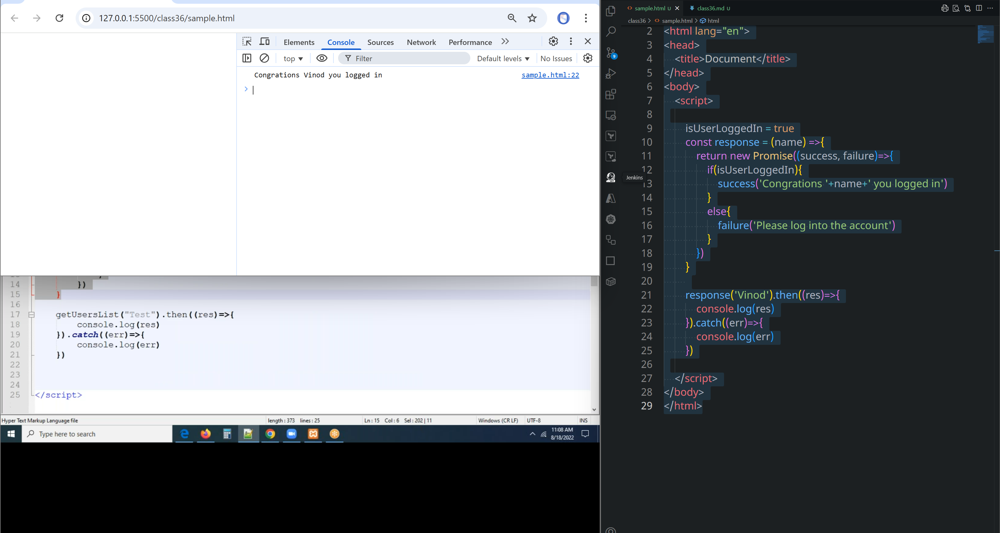

# class38
# Promises in Java Script



```html
<!DOCTYPE html>
<html lang="en">
<head>
    <title>Document</title>
</head>
<body>
    <script>

        const isUserLoggedIn = true;
        const myObj = new Promise((sus, fail)=>{

            if(isUserLoggedIn)
            {
                sus( 'Status passed')
            }
            else
            {
                fail('Status not passed')
            }
        })

        myObj.then((res)=>{
            console.log(res);
        }).catch((err)=>{
            console.log(err)
        })


    </script>    
</body>
</html>
```


```html
<!DOCTYPE html>
<html lang="en">
<head>
    <title>Document</title>
</head>
<body>
    <script>

        const myObj = new Promise((resolve, reject)=>{

            var obj = new XMLHttpRequest();

            obj.open('GET', 'https://jsonplaceholder.typicode.com/users',true);
            obj.send();

            obj.onreadystatechange= function(){

                if(obj.readyState==4 && obj.status== 200)
                {
                    var data = JSON.parse(obj.responseText);
                        if(data.length>0)
                        {
                            resolve(data)
                        }
                        else
                        {
                            reject({'message':'sorry! no records found'})
                        }
                }
            }
        })

        myObj.then((res)=>{
            console.log(res);
        }).catch((err)=>{
            console.log(err)
        })
    </script>    
</body>
</html>
```

### Promise inside a function or method
```html
<!DOCTYPE html>
<html lang="en">
<head>
    <title>Document</title>
</head>
<body>
    <script>

        isUserLoggedIn = true
        const response = (name) =>{
            return new Promise((success, failure)=>{
                if(isUserLoggedIn){
                    success('Congrations '+name+' you logged in')
                }
                else{
                    failure('Please log into the account')
                }
            })
        }
        
        response('Vinod').then((res)=>{
            console.log(res)
        }).catch((err)=>{
            console.log(err)
        })

    </script>
</body>
</html>
```



