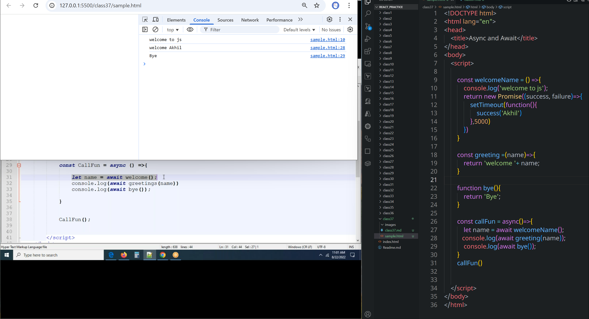
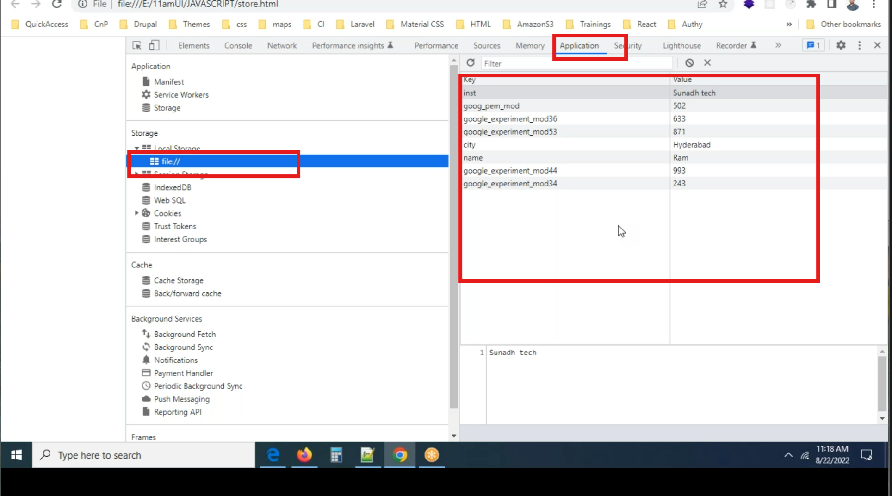
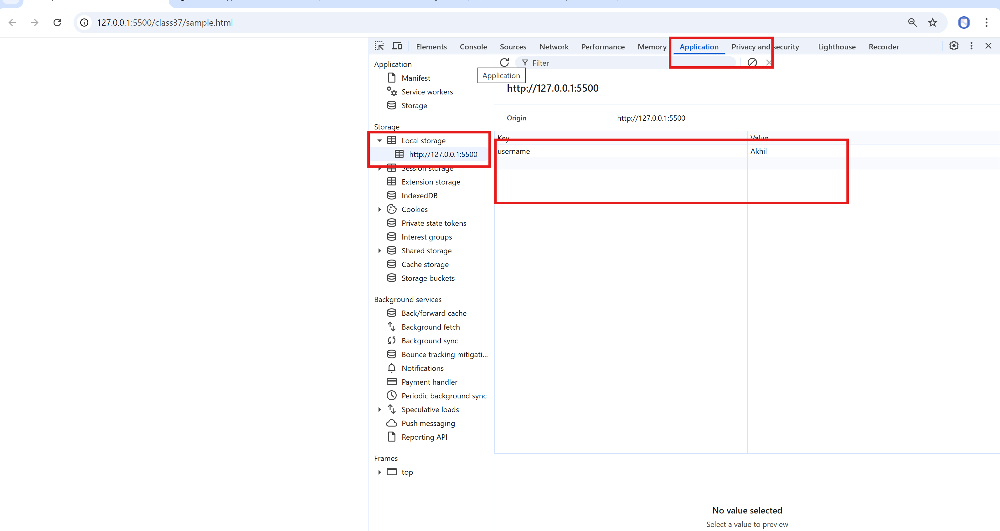

# class 37
# Async and Await
* We will use **Promise**, **async** and **await** together generally.
* It executes one after one and with the useof **setTimeout** it is being executed after 5 sec
 ```html
<!DOCTYPE html>
<html lang="en">
<head>
    <title>Async and Await</title>
</head>
<body>
    <script>

        const welcomeName = () =>{
            console.log('welcome to js');
            return new Promise((success, failure)=>{
                setTimeout(function(){
                    success('Akhil')
                },5000)
            })
            //success('Akhil')
        }

        const greeting =(name)=>{
            return 'welcome '+ name;
        }

        function bye(){
            return 'Bye';
        }

        const callFun = async()=>{
            let name = await welcomeName();
           console.log(await greeting(name));
            console.log(await bye());
        }
        callFun()


    </script>    
</body>
</html>
 ```
 
#  Local storage

---

### 🔐 `localStorage` — What is it?

`localStorage` is a **Web Storage API** that allows you to **store data in the browser**. This data:

* Persists **even after page reload or browser restart**.
* Is stored as **key-value pairs**.
* Only stores strings.

---

### 📘 Method Explanations:

```js
localStorage.setItem()
```

👉 **To save/store data**

```js
localStorage.setItem('username', 'Akhil');
```

---

```js
localStorage.getItem()
```

👉 **To read/get data**

```js
let name = localStorage.getItem('username');
console.log(name); // Akhil
```

---

```js
localStorage.removeItem()
```

👉 **To delete a specific item**

```js
localStorage.removeItem('username');
```

---

```js
localStorage.clear()
```

👉 **To delete everything** from localStorage

```js
localStorage.clear();
```

---

### ✅ Example Usage Together

```js
localStorage.setItem("role", "developer");

let role = localStorage.getItem("role");
console.log(role); // developer

localStorage.removeItem("role");

localStorage.clear(); // removes all items
```

---


* If you store **key, value** pair through one file you can access them in any file.
* That's it is called global variable.
* To access data through entire application.
```html
<!DOCTYPE html>
<html lang="en">
<head>
    <title>Async and Await</title>
</head>
<body>
    <script>

        localStorage.setItem('username', 'Akhil')        
        localStorage.setItem('village', 'Martur')  
        console.log(localStorage.getItem('username'))
        console.log(localStorage.getItem('village'))
        console.log(localStorage)
        localStorage.removeItem('village')
        console.log(localStorage)
        localStorage.clear()
        console.log(localStorage)

    </script>    
</body>
</html>
```
In JavaScript, variables have different **scopes** depending on how and where they are declared. Here's a breakdown of **local**, **global**, and **super global** variables:

---

### ✅ **1. Local Variables**

* **Scope:** Limited to the block, function, or module where they are declared.
* **Declared using:** `let`, `const`, or `var` (inside a function or block).
* **Not accessible outside their scope.**

#### Example:

```js
function greet() {
  let name = "Akhil"; // local to greet function
  console.log(name);
}
greet();
// console.log(name); // ❌ Error: name is not defined
```

---

### ✅ **2. Global Variables**

* **Scope:** Available throughout the entire code (across functions and blocks).
* **Declared outside any function or block.**
* In browsers, global variables become properties of the `window` object.

#### Example:

```js
let site = "OpenAI"; // global variable

function showSite() {
  console.log(site); // ✅ Accessible here
}
showSite();
```

---

### ✅ **3. Super Global Variables** *(Not an official term in JavaScript)*

In JavaScript, the term **"super global"** is **not standard** (it's more commonly used in PHP).
But people sometimes loosely refer to:

#### 🔹 **Browser context:**

* `window` – the global object for the browser.
* Variables declared globally using `var` attach to `window`:

  ```js
  var x = 10;
  console.log(window.x); // 10
  ```

#### 🔹 **Node.js context:**

* `global` – Node.js's global object (like `window` in browsers).

  ```js
  global.x = 20;
  console.log(global.x); // 20
  ```

---

### 🔍 Summary Table:

| Type            | Scope                             | Declared In                     | Accessibility                        |
| --------------- | --------------------------------- | ------------------------------- | ------------------------------------ |
| Local           | Function / Block / Module         | Inside a function/block         | Only within that scope               |
| Global          | Whole program                     | Outside functions/blocks        | Everywhere in the code               |
| Super Global 🔸 | Global Object (`window`/`global`) | Implicit or explicitly assigned | Across files (if imported), globally |

---

Let me know if you want visuals or real code demos!


