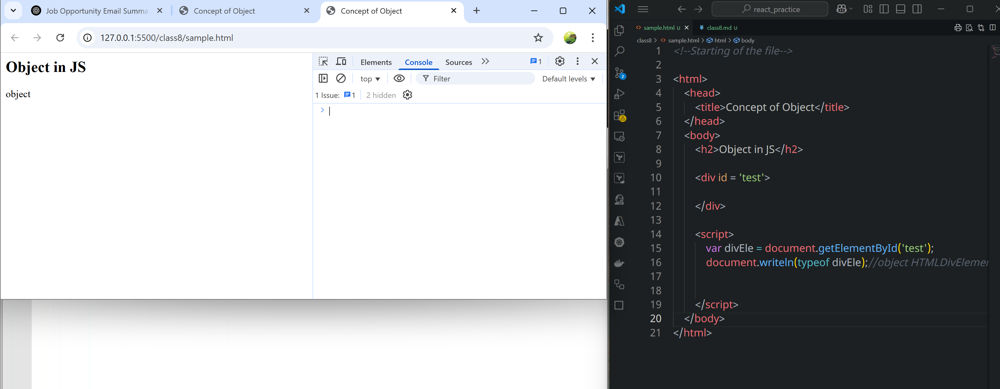
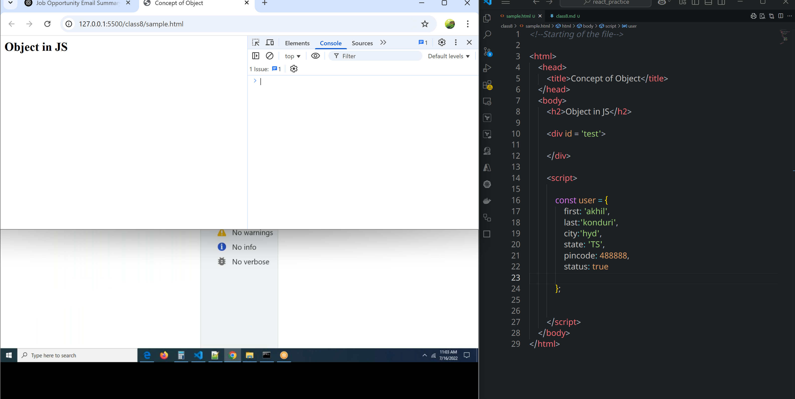
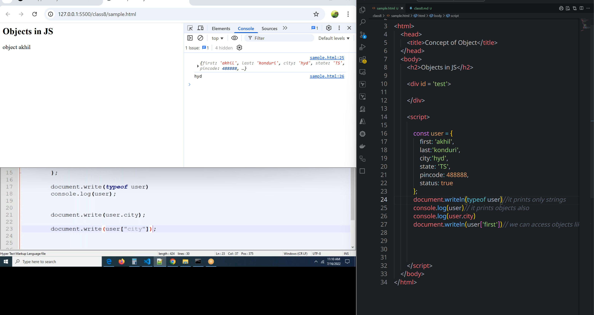

# Class 8
## Objects 
* This concept is heart of JS
* JS is a object based programming language
      * In JS, it provides collection of predefined objects to implement the functionality.
* JS is  a Object Oriented programming language
      * We can create our own objects
* In html every thing is treated as element
* In JS every element we are accessing is object.

* With the help of class we can create our own objects
* In JS, it provides collection of predefined objects to implement the functionality.
* in Js, every html element will be treated as object

```html
<!--Starting of the file-->

<html>
    <head>
        <title>Concept of Object</title>
    </head>
    <body>
        <h2>Object in JS</h2>

        <div id = 'test'>

        </div>

        <script>
            var divEle = document.getElementById('test');
            document.writeln(typeof divEle);//object HTMLDivElement


        </script>
    </body>
</html>
```
### what is an object?
* An object is a collection of properties or attributes(variables) and methods or functions.
      * parameters store values
* object may contain's only properties or only methods or both properties and methods.
* an object is  a collection of key and value pair combination.
### HTML and JS
`<input tpye='text' name='akhil' id='3773' />`
* in HTML `<input />` is an element
* in html type, name, id are called attributes of an input element.
* in JS, `<input />` is called as object.
* in JS, type, name, id is called as properties of an object.
### Syntax for creating an object
*  Objects represnted with{ }
```javascript
keyword name = { property1: 'value', property2: 'value2', property3: function()(),.........};

const obj = { firstname: 'akhil', secondname:'konduri', city:'Hyd', };// an object is  a collection of key and value pair combination.]
```
```html
<!--Starting of the file-->

<html>
    <head>
        <title>Concept of Object</title>
    </head> 
    <body>
        <h2>Objects in JS</h2>

        <div id = 'test'>

        </div>

        <script>

            const user = {
                first: 'akhil ',
                last:'konduri',
                city:'hyd',
                state: 'TS',
                pincode: 488888,
                status: true                 
            };
            document.writeln(typeof user)//it prints only strings            
            console.log(user)// it prints objects also
            console.log(user.city)
            document.writeln(user['first'])// we can access objects like this also.
            document.getElementById('test').innerHTML = user.first + user.last

        </script>
    </body>
</html>
```

* No error is there in console


