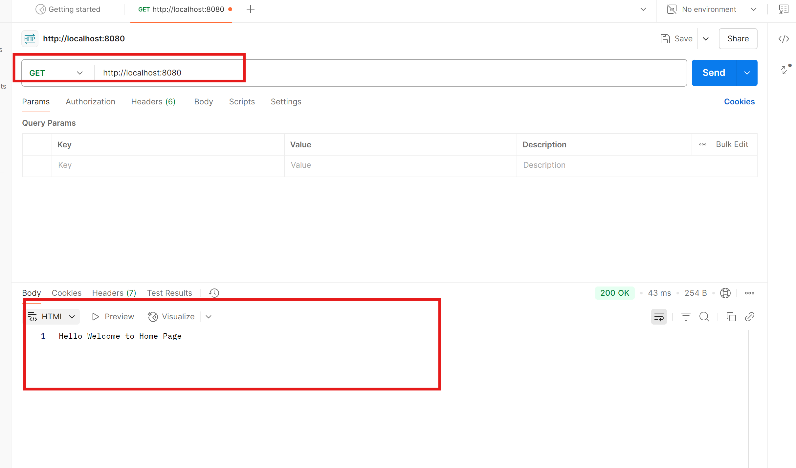
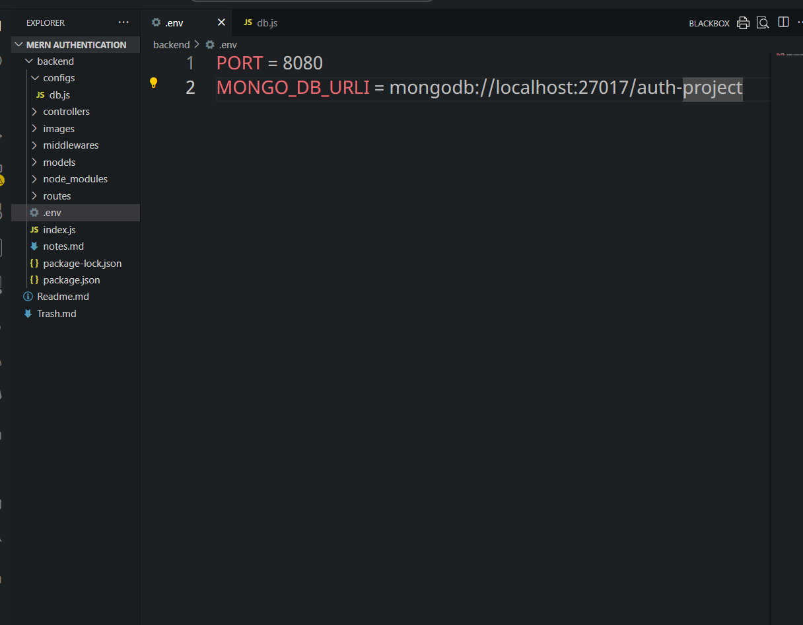
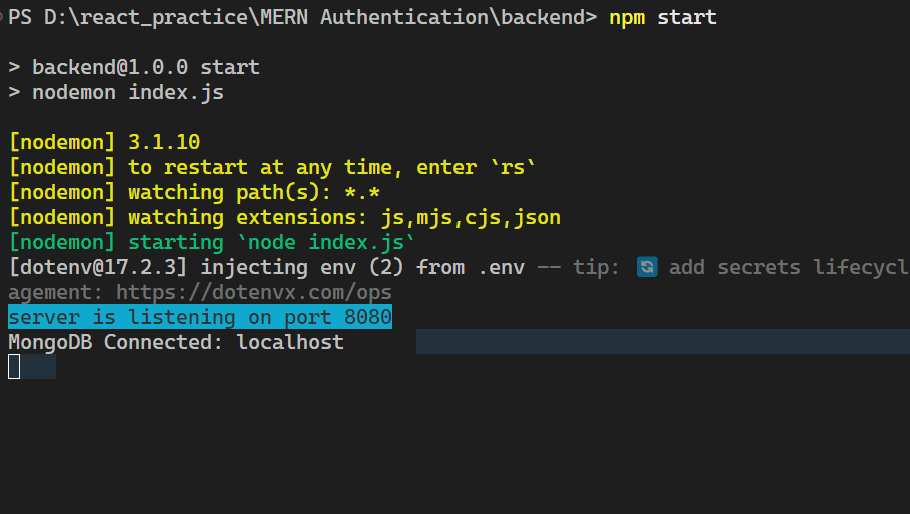

# Creating backend Part

```sh
npm init -y
```

- After that install necessary packages as below

```sh
npm i express dotenv body-parser colors joi jsonwebtoken mongoose cors nodemon
npm i bcrypt
```

- make the necessary changes in the package.json as follows
  

* Create .env file and mention port there

## Postman

**Postman** is a **popular API testing tool** that helps developers interact with, test, and debug APIs (Application Programming Interfaces).

It’s available as a **desktop app on Windows** (and other platforms) as well as a **web app**.

Think of it like a sandbox where you can send HTTP requests to a server (like `GET`, `POST`, `PUT`, `DELETE`) and view the responses easily — without needing to write any frontend or backend code first.

---

### ⚙️ How Postman Works (Basic Idea)

When you use Postman:

1. You specify an **API endpoint (URL)** — e.g. `https://api.example.com/users`
2. Choose an **HTTP method** — like:

   - `GET` → to fetch data
   - `POST` → to create data
   - `PUT/PATCH` → to update data
   - `DELETE` → to remove data

```jsx
import express from "express";
import dotenv from "dotenv";
import colors from "colors";
dotenv.config();

const app = express;

const PORT = process.env.PORT || 3000;

app.listen(PORT, () => {
  console.log(`server is listening on port ${PORT}`.bgCyan.white);
});
```

- Installed Postman on the laptop through choco
- Which is the

```sh
choco install postman -y
```



- Create **configs, controllers, middlewares, models, routes**
  in the **backend** folder
- Install **mongodb compass** in the laptop

## 🧩 What is MongoDB Compass?

**MongoDB Compass** is the **official GUI (Graphical User Interface)** for MongoDB.

- It allows you to **visualize, explore, and manipulate MongoDB databases** without writing commands in the terminal.
- You can see your **databases, collections, and documents** in a friendly interface.
- Supports **querying, filtering, indexing, aggregation, and validation**.

In short: it makes MongoDB easier to use for developers who don’t want to rely solely on CLI commands.

---

### 🔹 Key Features

1. **Visual Data Exploration**: Browse your documents in a collection like a spreadsheet.
2. **Query Builder**: Create queries visually or write them in MongoDB’s query language.
3. **CRUD Operations**: Insert, update, and delete documents easily.
4. **Schema Analysis**: Analyze your collections’ schema to understand the structure.
5. **Index Management**: View, create, or delete indexes.
6. **Aggregation Pipeline Builder**: Build complex aggregation queries visually.

This is especially useful if your frontend app consumes data from MongoDB through an API.

---

```sh
choco install mongodb-compass -y
```



- create **db.js** in the configs folder
  
