# Creating backend Part

```sh
npm init -y
```

- After that install necessary packages as below

```sh
npm i express dotenv body-parser colors joi jsonwebtoken mongoose cors nodemon
npm i bcrypt
```

- make the necessary changes in the package.json as follows
  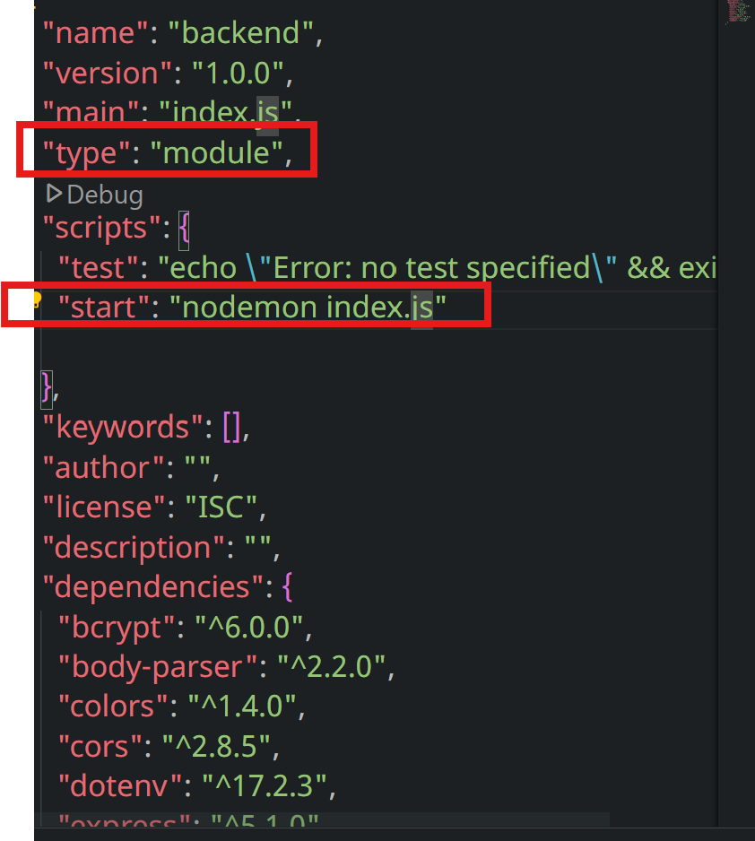

* Create .env file and mention port there

## Postman

**Postman** is a **popular API testing tool** that helps developers interact with, test, and debug APIs (Application Programming Interfaces).

It’s available as a **desktop app on Windows** (and other platforms) as well as a **web app**.

Think of it like a sandbox where you can send HTTP requests to a server (like `GET`, `POST`, `PUT`, `DELETE`) and view the responses easily — without needing to write any frontend or backend code first.

---

### ⚙️ How Postman Works (Basic Idea)

When you use Postman:

1. You specify an **API endpoint (URL)** — e.g. `https://api.example.com/users`
2. Choose an **HTTP method** — like:

   - `GET` → to fetch data
   - `POST` → to create data
   - `PUT/PATCH` → to update data
   - `DELETE` → to remove data

```jsx
import express from "express";
import dotenv from "dotenv";
import colors from "colors";
dotenv.config();

const app = express;

const PORT = process.env.PORT || 3000;

app.listen(PORT, () => {
  console.log(`server is listening on port ${PORT}`.bgCyan.white);
});
```

- Installed Postman on the laptop through choco
- Which is the

```sh
choco install postman -y
```


- Create **configs, controllers, middlewares, models, routes**
  in the **backend** folder
- Install **mongodb compass** in the laptop

## 🧩 What is MongoDB Compass?

**MongoDB Compass** is the **official GUI (Graphical User Interface)** for MongoDB.

- It allows you to **visualize, explore, and manipulate MongoDB databases** without writing commands in the terminal.
- You can see your **databases, collections, and documents** in a friendly interface.
- Supports **querying, filtering, indexing, aggregation, and validation**.

In short: it makes MongoDB easier to use for developers who don’t want to rely solely on CLI commands.

---

### 🔹 Key Features

1. **Visual Data Exploration**: Browse your documents in a collection like a spreadsheet.
2. **Query Builder**: Create queries visually or write them in MongoDB’s query language.
3. **CRUD Operations**: Insert, update, and delete documents easily.
4. **Schema Analysis**: Analyze your collections’ schema to understand the structure.
5. **Index Management**: View, create, or delete indexes.
6. **Aggregation Pipeline Builder**: Build complex aggregation queries visually.

This is especially useful if your frontend app consumes data from MongoDB through an API.

---

```sh
choco install mongodb-compass -y
```


- create **db.js** in the configs folder
  

* Written **authController.js** along with **authroute.js**

```jsx
import userModel from "../models/userModel.js";
import bcrypt from "bcrypt";

export const Signup = async (req, res) => {
  try {
    const { name, email, password } = req.body;
    if (!name || !email || !password) {
      return res.status(400).json({
        message: "Please fill all the fields",
        success: false,
        error: true,
      });
    }

    const existingUser = await userModel.findOne({ email });
    if (existingUser) {
      return res.status(400).json({
        message: "User Already Existed",
        success: false,
        error: true,
      });
    }

    const user = await userModel({
      name,
      email,
      password,
    });

    user.password = await bcrypt.hash(password, 12);

    await user.save();

    res.status(200).json({
      message: "User is Created",
      success: true,
      error: false,
    });
  } catch (error) {
    console.log(error);
    res.send(401).json({
      message: "Error in regestering the user",
      success: false,
      error: true,
    });
  }
};

export const Login = async (req, res) => {
  res.send("Login is called");
};
```

- user inputs are stored in the mongodb database and tested with postman
  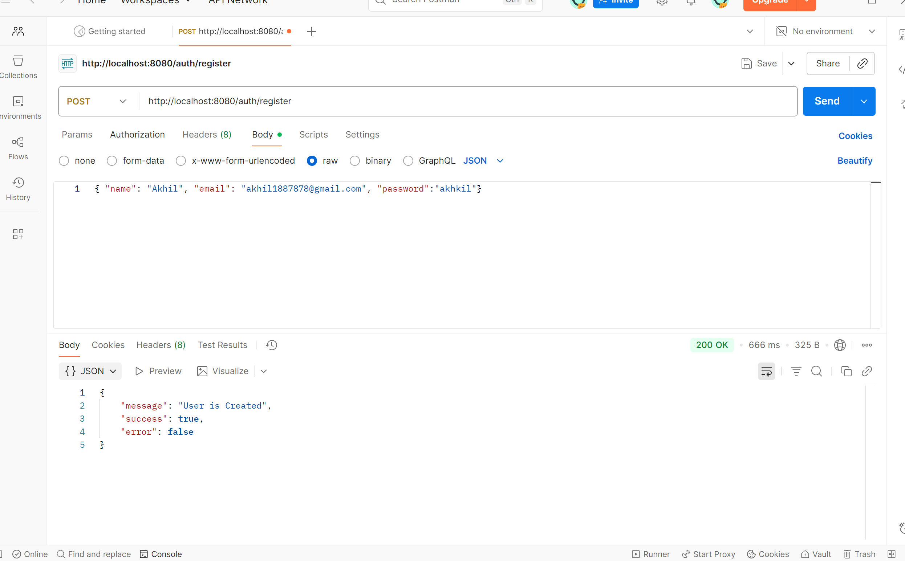
  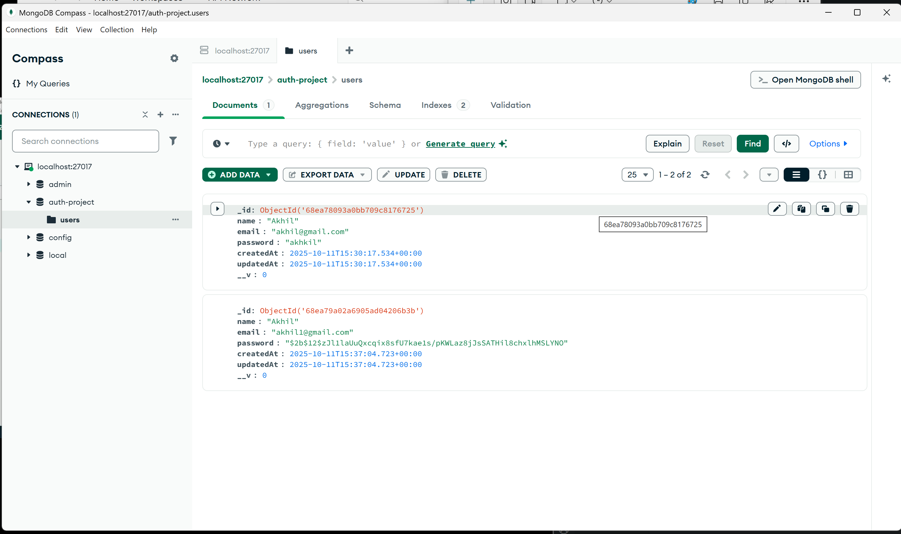
- Now the users are created and stored in the databases, now need to authenticate the requests

* Now create authValidation in middleware folder

```jsx
import Joi from "joi";

const signUpValidation = (req, res, next) => {
  const schema = Joi.object({
    name: Joi.string().max(30).required(),
    email: Joi.string().email().required(),
    password: Joi.string().min(4).max(30).required(),
  });
  const { error } = schema.validate(req.body);
  if (error) {
    return res.status(400).json({
      message: error.details[0].message,
      success: false,
      error: true,
    });
  }
  next();
};
```

```jsx
import express from "express";
import { Login, Signup } from "../controllers/authController.js";
import { signUpValidation } from "../middlewares/authValidation.js";

const router = express.Router();

router.post("/register", signUpValidation, Signup);

router.post("/login", Login);

export default router;
```

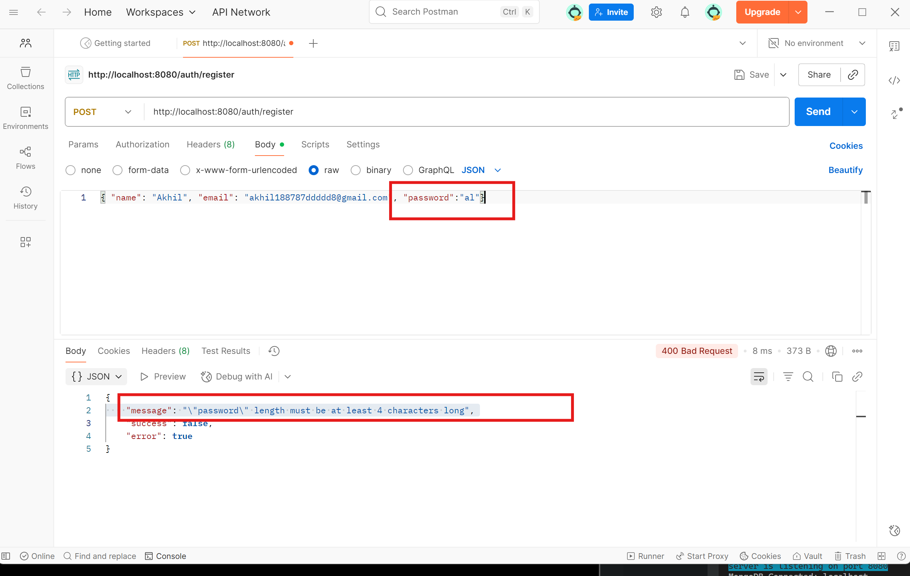
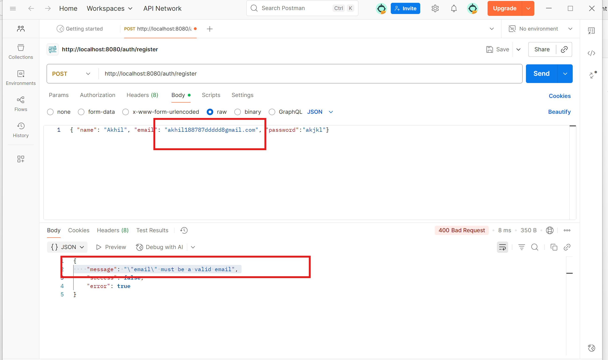

- We hashed the password by using bcrypt

```jsx
import userModel from "../models/userModel.js";
import bcrypt from "bcrypt";

export const Signup = async (req, res) => {
  try {
    const { name, email, password } = req.body;
    if (!name || !email || !password) {
      return res.status(400).json({
        message: "Please fill all the fields",
        success: false,
        error: true,
      });
    }

    const existingUser = await userModel.findOne({ email });
    if (existingUser) {
      return res.status(400).json({
        message: "User Already Existed",
        success: false,
        error: true,
      });
    }

    const user = await userModel({
      name,
      email,
      password,
    });

    user.password = await bcrypt.hash(password, 12);

    await user.save();

    res.status(200).json({
      message: "User is Created",
      success: true,
      error: false,
    });
  } catch (error) {
    console.log(error);
    res.send(401).json({
      message: "Error in regestering the user",
      success: false,
      error: true,
    });
  }
};

export const Login = async (req, res) => {
  res.send("Login is called");
};
```

## Now we need to solve the login page setup as signup setup is already done

```jsx
import userModel from "../models/userModel.js";
import bcrypt from "bcrypt";

export const Signup = async (req, res) => {
  try {
    const { name, email, password } = req.body;
    if (!name || !email || !password) {
      return res.status(400).json({
        message: "Please fill all the fields",
        success: false,
        error: true,
      });
    }

    const existingUser = await userModel.findOne({ email });
    if (existingUser) {
      return res.status(400).json({
        message: "User Already Existed",
        success: false,
        error: true,
      });
    }

    const user = await userModel({
      name,
      email,
      password,
    });

    user.password = await bcrypt.hash(password, 12);

    await user.save();

    res.status(200).json({
      message: "User is Created",
      success: true,
      error: false,
    });
  } catch (error) {
    console.log(error);
    res.send(401).json({
      message: "Error in regestering the user",
      success: false,
      error: true,
    });
  }
};

export const Login = async (req, res) => {
  try {
    const { email, password } = req.body;

    if (!email || !password) {
      res.send(400).json({
        message: "Please fill all the fields",
        success: false,
        error: true,
      });
    }

    const user = await userModel.findOne({ email });

    if (!user) {
      res.send(400).json({
        message: "user does not exist",
        success: false,
        error: true,
      });
    }

    const isMatched = await bcrypt.compare(password, user.password);
    if (!isMatched) {
      res.send(400).json({
        message: "Invalid Email or Password",
        success: false,
        error: true,
      });
    }

    res.status(200).json({
      message: "User Logged in Successfully",
      success: true,
      error: false,
    });
  } catch (error) {
    console.log(error);
    res.send(401).json({
      message: "Error in Login",
      success: false,
      error: true,
    });
  }
};
```

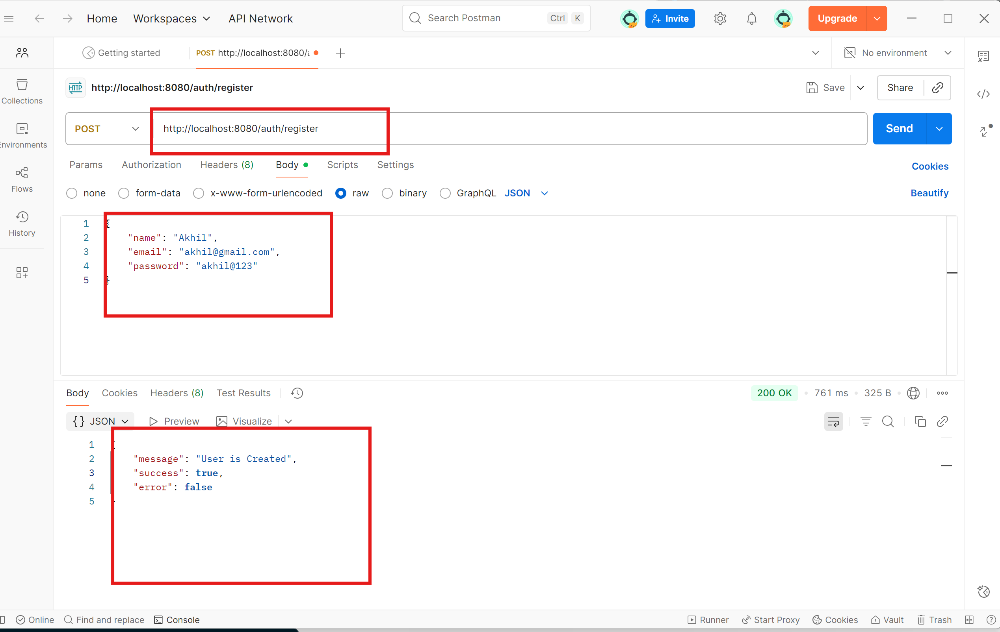
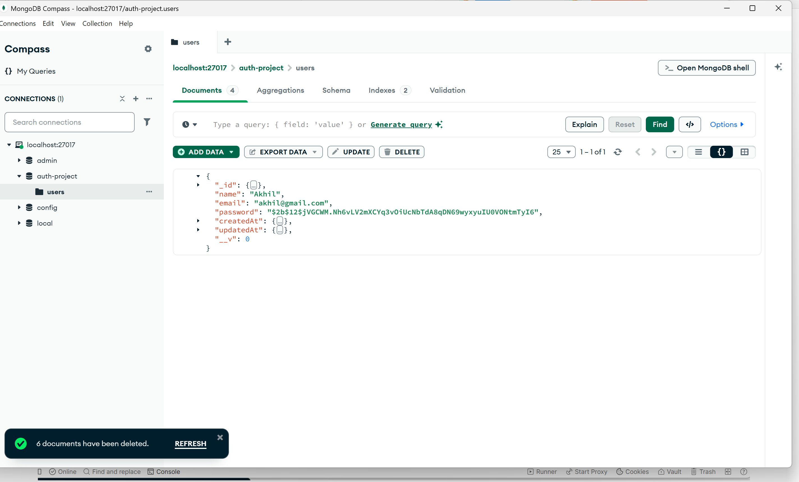
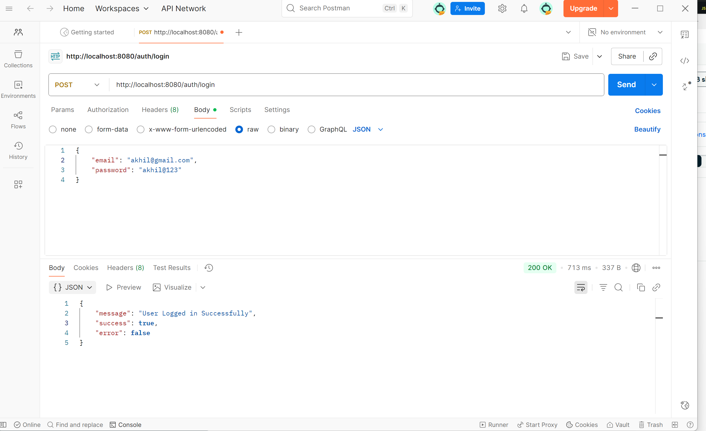
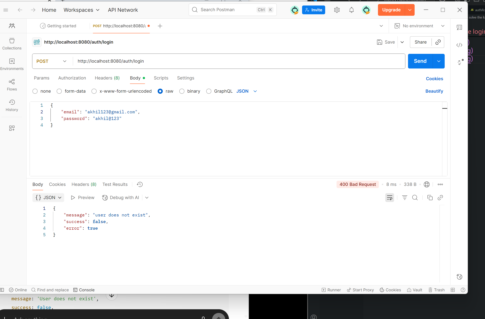
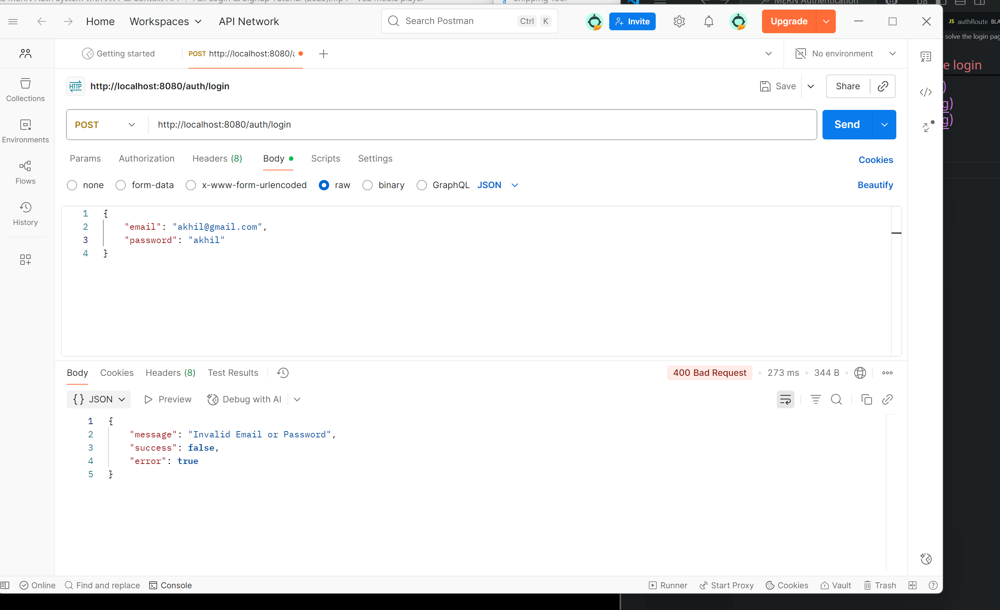

## JWT Implementation

### JWT Tocken generation

```.env
PORT = 8080
MONGO_DB_URI = mongodb://localhost:27017/auth-project
JWT_SECRET = Akhil
```

```jsx
import userModel from "../models/userModel.js";
import bcrypt from "bcrypt";
import jwt from "jsonwebtoken";

export const Signup = async (req, res) => {
  try {
    const { name, email, password } = req.body;
    if (!name || !email || !password) {
      return res.status(400).json({
        message: "Please fill all the fields",
        success: false,
        error: true,
      });
    }

    const existingUser = await userModel.findOne({ email });
    if (existingUser) {
      return res.status(400).json({
        message: "User Already Existed",
        success: false,
        error: true,
      });
    }

    const user = await userModel({
      name,
      email,
      password,
    });

    user.password = await bcrypt.hash(password, 12);

    await user.save();

    res.status(200).json({
      message: "User is Created",
      success: true,
      error: false,
    });
  } catch (error) {
    console.log(error);
    res.send(401).json({
      message: "Error in regestering the user",
      success: false,
      error: true,
    });
  }
};

export const Login = async (req, res) => {
  try {
    const { email, password } = req.body;

    if (!email || !password) {
      res.send(400).json({
        message: "Please fill all the fields",
        success: false,
        error: true,
      });
    }

    const user = await userModel.findOne({ email });

    if (!user) {
      res.status(400).json({
        message: "user does not exist",
        success: false,
        error: true,
      });
    }

    const isMatched = await bcrypt.compare(password, user.password);
    if (!isMatched) {
      res.status(400).json({
        message: "Invalid Email or Password",
        success: false,
        error: true,
      });
    }

    const jsonwebtoken = jwt.sign(
      { email: user.email, _id: user._id },
      process.env.JWT_SECRET,
      { expiresIn: "1d" }
    );

    res.status(200).json({
      message: "User Logged in Successfully",
      success: true,
      error: false,
      jsonwebtoken,
      email,
      name: user.name,
    });
  } catch (error) {
    console.log(error);
    res.status(401).json({
      message: "Error in Login",
      success: false,
      error: true,
    });
  }
};
```

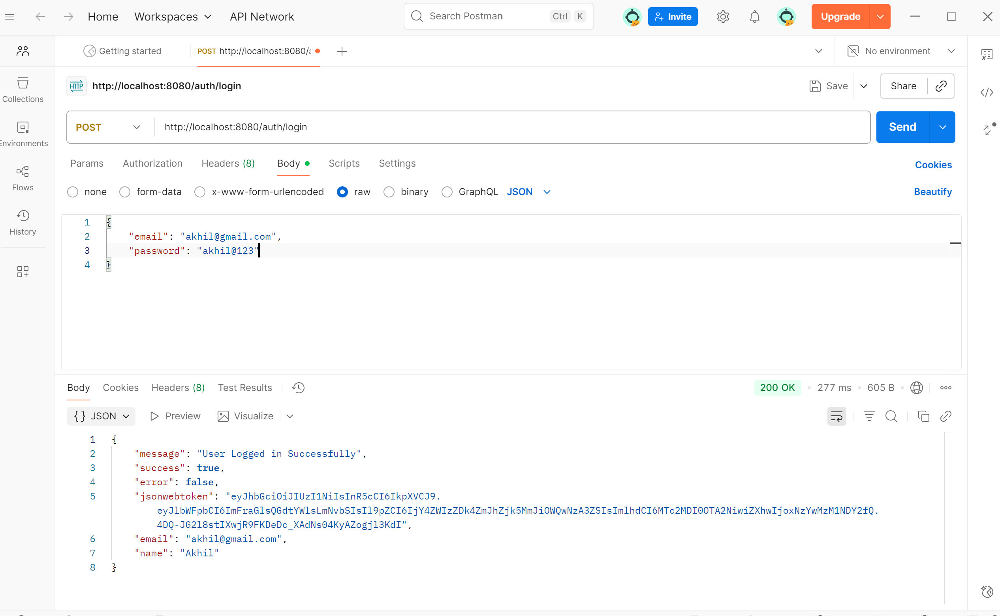

### JWT Authentication

- Lets create one productRoute.js in routes folder

```jsx
import express from "express";

const productRouter = express.Router();

productRouter.get("/", (req, res) => {
  res.status(200).json([
    {
      name: "product1",
      description: "Product1 description",
      price: 100,
    },
    {
      name: "product2",
      description: "Product2 description",
      price: 200,
    },
  ]);
});

export default productRouter;
```

- Make the changes in the index.js file to add product route

```jsx
import express from "express";
import dotenv from "dotenv";
import colors from "colors";
import connectDB from "./configs/db.js";
import bodyParser from "body-parser";
import cors from "cors";
import router from "./routes/authRoutes.js";
import productRouter from "./routes/productRouter.js";

dotenv.config();

connectDB();

const app = express();

const PORT = process.env.PORT || 3000;

app.use(bodyParser.json());
app.use(cors());
app.use("/auth", router);
app.use("/product", productRouter);

app.get("/", (req, res) => {
  res.send("Hello Welcome to Home Page");
});

app.listen(PORT, () => {
  console.log(`server is listening on port ${PORT}`.bgCyan.white);
});
```

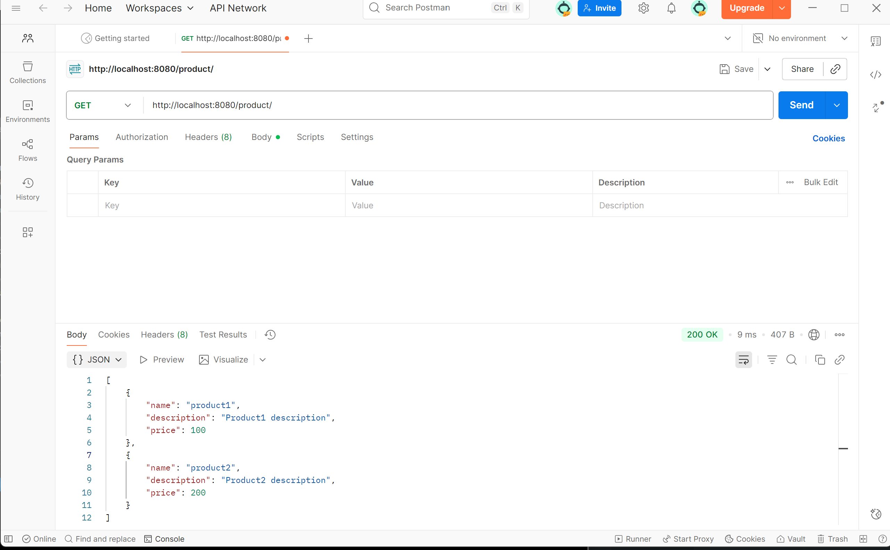

### Now our goal is to show products when user logged in

- Create productAuthMiddle.js in middleware folder

```jsx
import jwt from "jsonwebtoken";

export const ensureAuthenticated = (req, res, next) => {
  const auth = req.headers["authorization"];
  if (!auth) {
    return res.status(401).json({
      message: "Unauthorized",
      success: false,
      error: true,
    });
  }

  try {
    const decoded = jwt.verify(auth, process.env.JWT_SECRET);
    req.user = decoded;
    next();
  } catch (error) {
    console.log(error);
    res.status(401).json({
      message: "Unauthorized, JWT Token is required ",
      success: false,
      error: true,
    });
  }
};
```

```jsx
import express from "express";
import { ensureAuthenticated } from "../middlewares/productAuthMiddle.js";

const productRouter = express.Router();

productRouter.get("/", ensureAuthenticated, (req, res) => {
  res.status(200).json([
    {
      name: "product1",
      description: "Product1 description",
      price: 100,
    },
    {
      name: "product2",
      description: "Product2 description",
      price: 200,
    },
  ]);
});

export default productRouter;
```

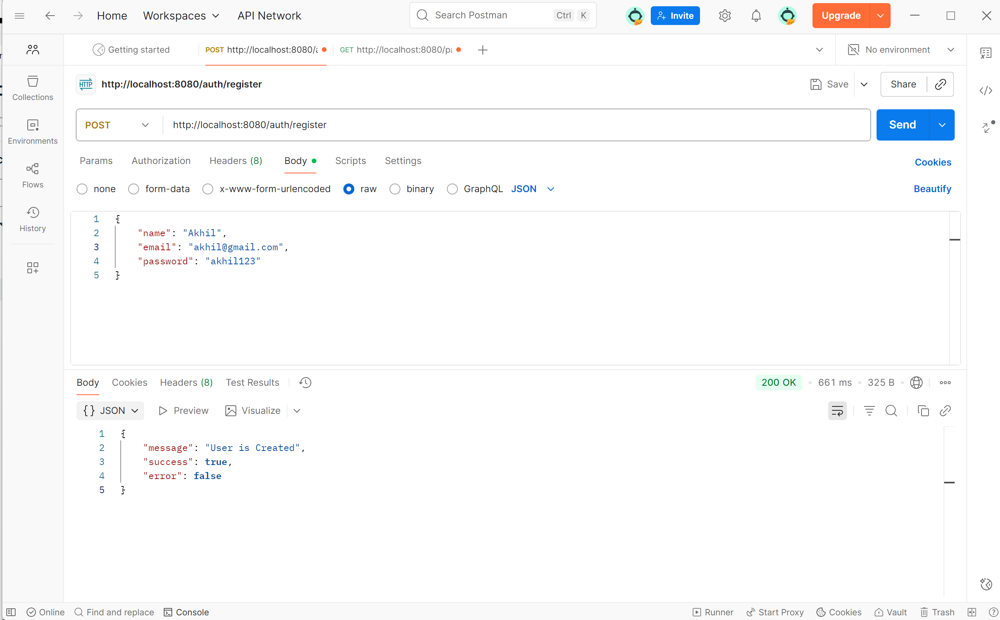
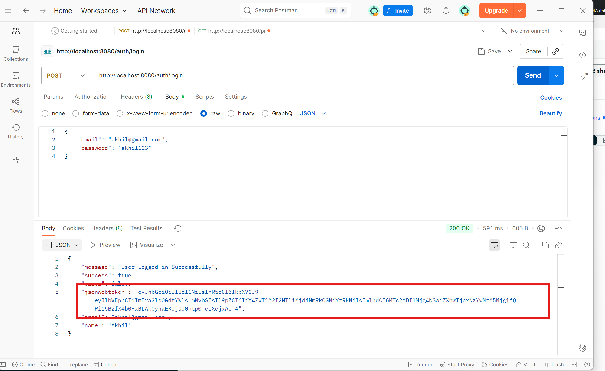

- Check authorization using the json web token
  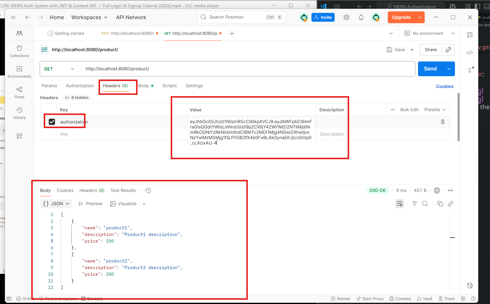
