# Frontend

- Create project
  fro

```sh
npm create vite@latest
npm run dev
```

- Select the options

  - React JS
  - javascript
  - no
    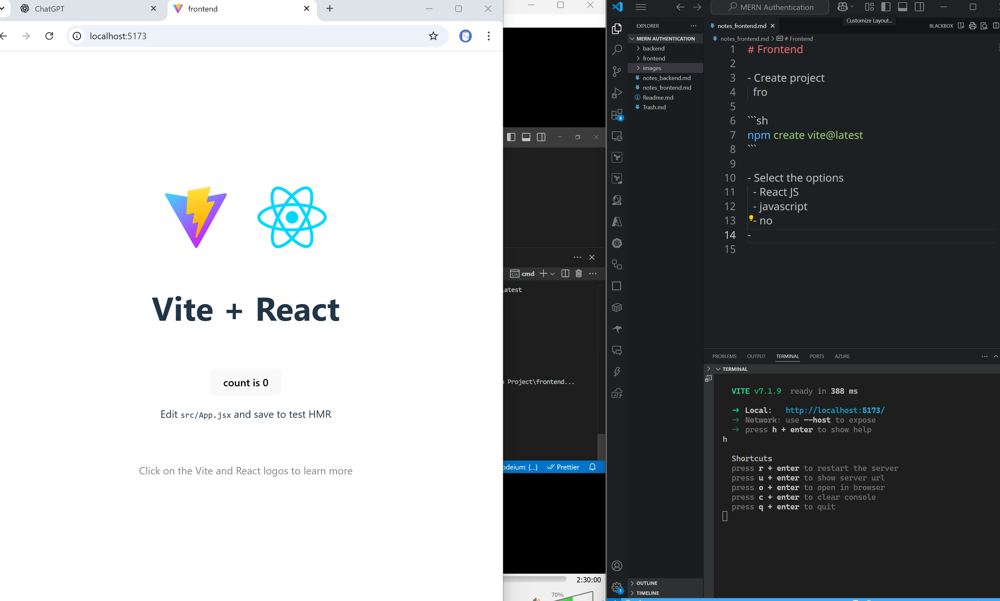

- Install packages

```sh
npm i
npm i react-router-dom react-hot-toast axios
```

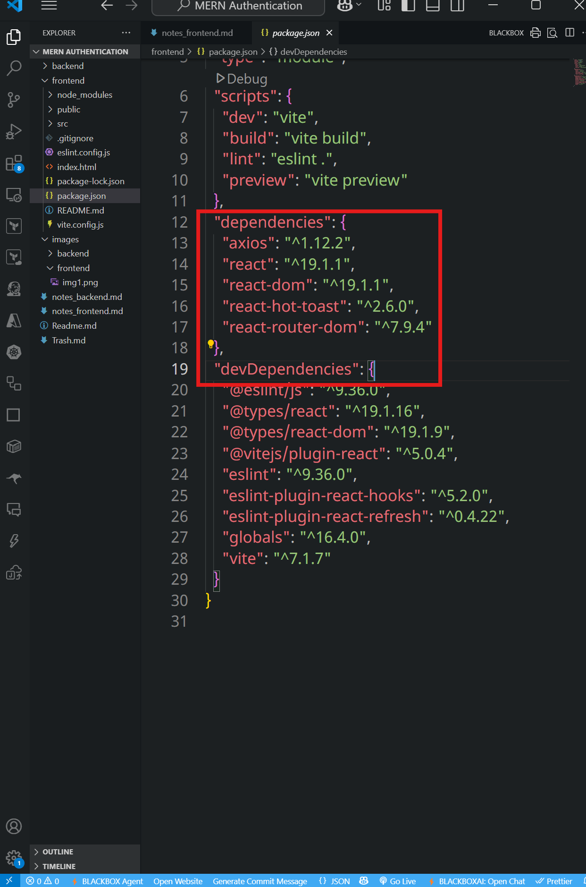

### Install Tailwindcss

```sh
npm install -D tailwindcss@3 postcss autoprefixer
npx tailwindcss init -p
```

- Make the file changes as below
- tailwind.config.js

```js
/** @type { import('tailwindcss').Config } */
export default {
  content: ["./index.html", "./src/ ** / *. {js,ts,jsx,tsx}"],
  theme: {
    extend: {},
  },
  plugins: [],
};
```

- index.css as below

```.css
@tailwind base;
@tailwind components;
@tailwind utilities;
```

```sh
npm  run dev
```

- Make the App.css to empty
- - Make changes to main.jsx

```main.jsx
import { StrictMode } from "react";
import { createRoot } from "react-dom/client";
import { BrowserRouter } from "react-router-dom";
import "./index.css";
import App from "./App.jsx";

createRoot(document.getElementById("root")).render(
  <BrowserRouter>
    <App />
  </BrowserRouter>
);
```

```main.jsx
import { StrictMode } from "react";
import { createRoot } from "react-dom/client";
import { BrowserRouter } from "react-router-dom";
import "./index.css";
import App from "./App.jsx";

createRoot(document.getElementById("root")).render(
  <BrowserRouter>
    <App />
  </BrowserRouter>
);
```

```jsx
import { Routes, Route, Navigate } from "react-router-dom";
import "./App.css";

function App() {
  return (
    <>
      <Routes>
        <Route path="/ " element={<Navigate to="/home" />}></Route>
        <Route path="/ " element={<Navigate to="/login" />}></Route>
        <Route path="/ " element={<Navigate to="/register" />}></Route>
        <Route path="* " element={<Navigate to="/home" />}></Route>
      </Routes>
    </>
  );
}

export default App;
```

- Create different pages in the pages section of src folder

### Sending data from the signup page to the backend

```jsx
import { Link } from "react-router-dom";
import { useState } from "react";
import axios from "axios";
import toast, { Toaster } from "react-hot-toast";

const Signup = () => {
  const [formData, setFormData] = useState({
    name: "",
    email: "",
    password: "",
  });

  const handleChange = (event) => {
    setFormData({
      ...formData,
      [event.target.name]: event.target.value,
    });
  };

  const handleSubmit = async (event) => {
    event.preventDefault();
    const { name, email, password } = formData;
    if (!name || !email || !password) {
      alert("All fields are required");
      return;
    }
    try {
      const response = await axios.post("http://localhost:8080/auth/register", {
        name,
        email,
        password,
      });

      console.log(response.data);
      if (response.data.success) {
        toast.success(response.data.message);
      }
    } catch (error) {
      console.log(error);
      toast.error("Something went wrong");
    }
  };

  return (
    <div className="flex items-center justify-center min-h-screen bg-white">
      <div className="bg-white p-8 rounded-xl shadow-lg w-96">
        <h2 className="text-2xl font-bold text-center mb-6">Sign Up</h2>
        <form onSubmit={handleSubmit}>
          <div className="mb-4">
            <label className="block text-gray-700">Name</label>
            <input
              type="text"
              name="name"
              value={formData.name}
              onChange={handleChange}
              className="w-full p-2 mt-1 border rounded-lg focus:ring-2 focus:ring-blue-500 outline-none"
              placeholder="Enter your name"
              required
            />
          </div>
          <div className="mb-4">
            <label className="block text-gray-700">Email</label>
            <input
              type="email"
              name="email"
              value={formData.email}
              onChange={handleChange}
              className="w-full p-2 mt-1 border rounded-lg focus:ring-2 focus:ring-blue-500 outline-none"
              placeholder="Enter your email"
              required
            />
          </div>
          <div className="mb-6">
            <label className="block text-gray-700">Password</label>
            <input
              type="password"
              name="password"
              value={formData.password}
              onChange={handleChange}
              className="w-full p-2 mt-1 border rounded-lg focus:ring-2 focus:ring-blue-500 outline-none"
              placeholder="Enter your password"
              required
            />
          </div>
          <button
            type="submit"
            className="w-full bg-blue-500 text-white p-2 rounded-lg hover:bg-blue-600 transition-all"
          >
            Sign Up
          </button>
        </form>
        {/* <p className="mt-4 text-center text-gray-600">
          Already have an account?{" "}
          <Link to="/login" className="text-blue-500 hover:underline">
            Log in
          </Link>
        </p> */}
      </div>
      <Toaster />
    </div>
  );
};

export default Signup;
```

- Here toaster is for showing popup messages for the response or data

```jsx
import { Link } from "react-router-dom";
import { useState } from "react";
import axios from "axios";
import toast, { Toaster } from "react-hot-toast";
import { useNavigate } from "react-router-dom";

const Signup = () => {
  const [formData, setFormData] = useState({
    name: "",
    email: "",
    password: "",
  });
  const navigate = useNavigate();

  const handleChange = (event) => {
    setFormData({
      ...formData,
      [event.target.name]: event.target.value,
    });
  };

  const handleSubmit = async (event) => {
    event.preventDefault();
    const { name, email, password } = formData;
    if (!name || !email || !password) {
      alert("All fields are required");
      return;
    }
    try {
      const response = await axios.post("http://localhost:8080/auth/register", {
        name,
        email,
        password,
      });

      console.log(response.data);
      if (response.data.success) {
        toast.success(response.data.message);
      }
      setTimeout(() => {
        navigate("/login");
      }, 2000);
    } catch (error) {
      console.log(error);
      toast.error(error.response.data.message);
    }
  };

  return (
    <div className="flex items-center justify-center min-h-screen bg-white">
      <div className="bg-white p-8 rounded-xl shadow-lg w-96">
        <h2 className="text-2xl font-bold text-center mb-6">Sign Up</h2>
        <form onSubmit={handleSubmit}>
          <div className="mb-4">
            <label className="block text-gray-700">Name</label>
            <input
              type="text"
              name="name"
              value={formData.name}
              onChange={handleChange}
              className="w-full p-2 mt-1 border rounded-lg focus:ring-2 focus:ring-blue-500 outline-none"
              placeholder="Enter your name"
              required
            />
          </div>
          <div className="mb-4">
            <label className="block text-gray-700">Email</label>
            <input
              type="email"
              name="email"
              value={formData.email}
              onChange={handleChange}
              className="w-full p-2 mt-1 border rounded-lg focus:ring-2 focus:ring-blue-500 outline-none"
              placeholder="Enter your email"
              required
            />
          </div>
          <div className="mb-6">
            <label className="block text-gray-700">Password</label>
            <input
              type="password"
              name="password"
              value={formData.password}
              onChange={handleChange}
              className="w-full p-2 mt-1 border rounded-lg focus:ring-2 focus:ring-blue-500 outline-none"
              placeholder="Enter your password"
              required
            />
          </div>
          <button
            type="submit"
            className="w-full bg-blue-500 text-white p-2 rounded-lg hover:bg-blue-600 transition-all"
          >
            Sign Up
          </button>
        </form>
        {/* <p className="mt-4 text-center text-gray-600">
          Already have an account?{" "}
          <Link to="/login" className="text-blue-500 hover:underline">
            Log in
          </Link>
        </p> */}
      </div>
      <Toaster />
    </div>
  );
};

export default Signup;
```

### Setting LoginForm and Login to the account

```jsx
import { Link } from "react-router-dom";
import { useState } from "react";
import axios from "axios";
import toast, { Toaster } from "react-hot-toast";
import { useNavigate } from "react-router-dom";

const Login = () => {
  const [formData, setFormData] = useState({
    email: "",
    password: "",
  });
  const navigate = useNavigate();

  const handleChange = (event) => {
    setFormData({
      ...formData,
      [event.target.name]: event.target.value,
    });
  };

  const handleSubmit = async (event) => {
    event.preventDefault();
    const { email, password } = formData;
    if (!email || !password) {
      alert("All fields are required");
      return;
    }
    try {
      const response = await axios.post("http://localhost:8080/auth/login", {
        email,
        password,
      });
      console.log(response.data);
      if (response.data.success) {
        toast.success(response.data.message);
        setTimeout(() => {
          navigate("/home");
        }, 2000);
      } else {
        toast.error(response.data.message);
      }
    } catch (error) {
      console.log(error);
      toast.error(error.response.data.message);
    }
  };

  return (
    <div className="flex items-center justify-center min-h-screen bg-white">
      <div className="bg-white p-8 rounded-xl shadow-lg w-96">
        <h2 className="text-2xl font-bold text-center mb-6">Login</h2>
        <form onSubmit={handleSubmit}>
          <div className="mb-4">
            <label className="block text-gray-700">Email</label>
            <input
              type="email"
              name="email"
              value={formData.email}
              onChange={handleChange}
              className="w-full p-2 mt-1 border rounded-lg focus:ring-2 focus:ring-blue-500 outline-none"
              placeholder="Enter your email"
              required
            />
          </div>
          <div className="mb-6">
            <label className="block text-gray-700">Password</label>
            <input
              type="password"
              name="password"
              value={formData.password}
              onChange={handleChange}
              className="w-full p-2 mt-1 border rounded-lg focus:ring-2 focus:ring-blue-500 outline-none"
              placeholder="Enter your password"
              required
            />
          </div>
          <button
            type="submit"
            className="w-full bg-blue-500 text-white p-2 rounded-lg hover:bg-blue-600 transition-all"
          >
            Login
          </button>
        </form>
        {/* <p className="mt-4 text-center text-gray-600">
                              Don't have an account?{" "}
                              <Link to="/signup" className="text-blue-500 hover:underline">
                                    Register here
                              </Link>
                        </p> */}
      </div>
      <Toaster />
    </div>
  );
};

export default Login;
```

```jsx
import { useState, useContext, createContext } from "react";

const AuthContext = createContext();

const AuthProvider = (children) => {
  const [auth, setAuth] = useState({
    user: null,
    token: "",
  });

  return (
    <AuthContext.Provider value={{ auth, setAuth }}>
      {children}
    </AuthContext.Provider>
  );
};

const useAuth = () => {
  return useContext(AuthContext);
};

export { useAuth, AuthProvider };
```

```jsx
import { StrictMode } from "react";
import { createRoot } from "react-dom/client";
import { BrowserRouter } from "react-router-dom";
import "./index.css";
import App from "./App.jsx";
import { AuthProvider } from "./context/auth.jsx";

createRoot(document.getElementById("root")).render(
  <AuthProvider>
    <BrowserRouter>
      <App />
    </BrowserRouter>
  </AuthProvider>
);
```

```jsx
import React from "react";
import { useAuth } from "../context/auth.jsx";

const HomePage = () => {
  const { auth, setAuth } = useAuth();

  return <div>{JSON.stringify(auth, null, 4)}</div>;
};

export default HomePage;
```

```jsx
import { Link } from "react-router-dom";
import { useState } from "react";
import axios from "axios";
import toast, { Toaster } from "react-hot-toast";
import { useNavigate } from "react-router-dom";
import { useAuth } from "../context/auth.jsx";

const Login = () => {
  const [formData, setFormData] = useState({
    email: "",
    password: "",
  });
  const { auth, setAuth } = useAuth();
  const navigate = useNavigate();

  const handleChange = (event) => {
    setFormData({
      ...formData,
      [event.target.name]: event.target.value,
    });
  };

  const handleSubmit = async (event) => {
    event.preventDefault();
    const { email, password } = formData;
    if (!email || !password) {
      alert("All fields are required");
      return;
    }
    try {
      const response = await axios.post("http://localhost:8080/auth/login", {
        email,
        password,
      });
      console.log(response.data);
      const { success, message, jsonwebtoken, name, errors } = response.data;
      if (response.data.success) {
        toast.success(response.data.message);
        setAuth({
          ...auth,
          user: name,
          token: jsonwebtoken,
        });
        setTimeout(() => {
          navigate("/home");
        }, 2000);
      } else {
        toast.error(response.data.message);
      }
    } catch (error) {
      console.log(error);
      toast.error(error.response.data.message);
    }
  };

  return (
    <div className="flex items-center justify-center min-h-screen bg-white">
      <div className="bg-white p-8 rounded-xl shadow-lg w-96">
        <h2 className="text-2xl font-bold text-center mb-6">Login</h2>
        <form onSubmit={handleSubmit}>
          <div className="mb-4">
            <label className="block text-gray-700">Email</label>
            <input
              type="email"
              name="email"
              value={formData.email}
              onChange={handleChange}
              className="w-full p-2 mt-1 border rounded-lg focus:ring-2 focus:ring-blue-500 outline-none"
              placeholder="Enter your email"
              required
            />
          </div>
          <div className="mb-6">
            <label className="block text-gray-700">Password</label>
            <input
              type="password"
              name="password"
              value={formData.password}
              onChange={handleChange}
              className="w-full p-2 mt-1 border rounded-lg focus:ring-2 focus:ring-blue-500 outline-none"
              placeholder="Enter your password"
              required
            />
          </div>
          <button
            type="submit"
            className="w-full bg-blue-500 text-white p-2 rounded-lg hover:bg-blue-600 transition-all"
          >
            Login
          </button>
        </form>
      </div>
      <Toaster />
    </div>
  );
};

export default Login;
```

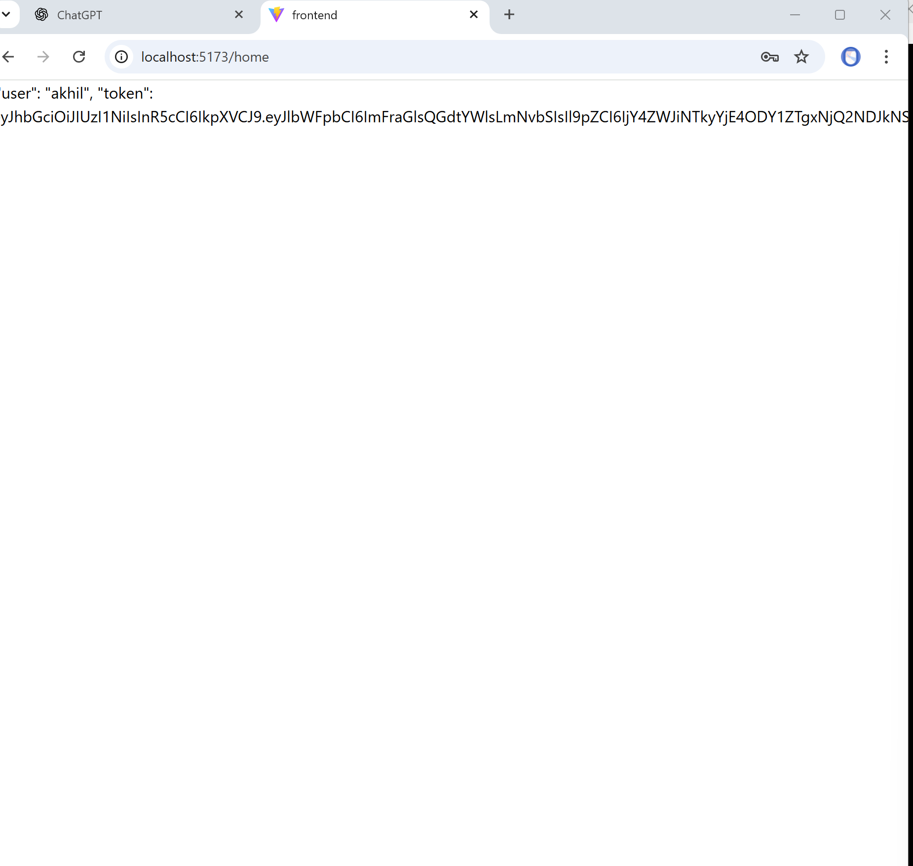

- Now we get the jsonwebtoken and after refreshing it is gone
- Now our goal is to keep it after thhe refresh also.
- jsonwebtoken should stored in the local storage
  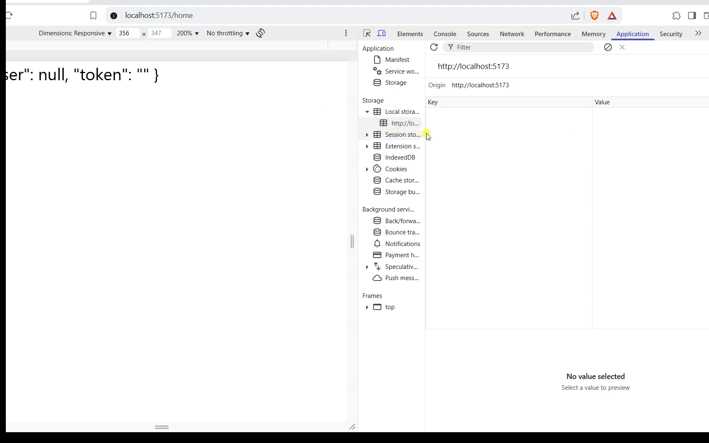
  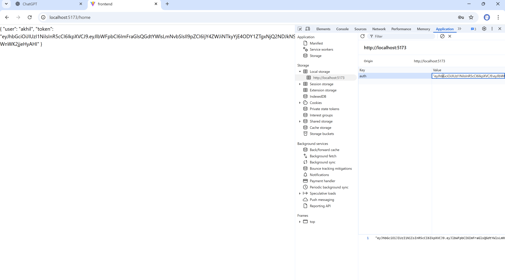
  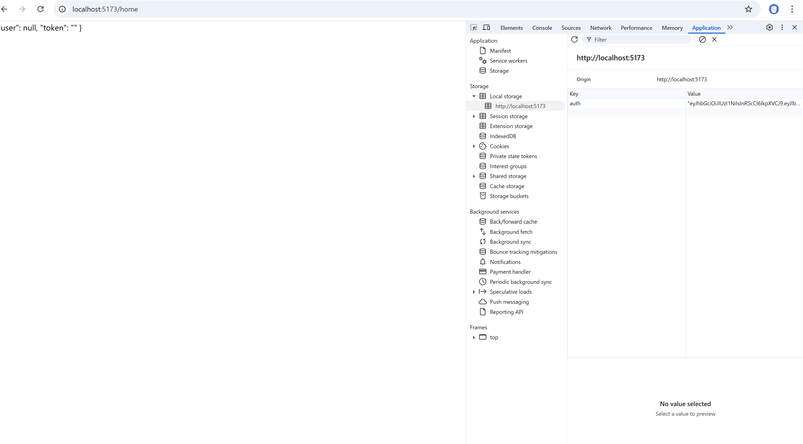

```jsx
import { Link } from "react-router-dom";
import { useState } from "react";
import axios from "axios";
import toast, { Toaster } from "react-hot-toast";
import { useNavigate } from "react-router-dom";
import { useAuth } from "../context/auth.jsx";

const Login = () => {
  const [formData, setFormData] = useState({
    email: "",
    password: "",
  });
  const { auth, setAuth } = useAuth();
  const navigate = useNavigate();

  const handleChange = (event) => {
    setFormData({
      ...formData,
      [event.target.name]: event.target.value,
    });
  };

  const handleSubmit = async (event) => {
    event.preventDefault();
    const { email, password } = formData;
    if (!email || !password) {
      alert("All fields are required");
      return;
    }
    try {
      const response = await axios.post("http://localhost:8080/auth/login", {
        email,
        password,
      });
      console.log(response.data);
      const { success, message, jsonwebtoken, name, errors } = response.data;
      if (response.data.success) {
        toast.success(response.data.message);
        setAuth({
          ...auth,
          user: name,
          token: jsonwebtoken,
        });
        localStorage.setItem("auth", JSON.stringify(response.data));
        setTimeout(() => {
          navigate("/home");
        }, 2000);
      } else {
        toast.error(response.data.message);
      }
    } catch (error) {
      console.log(error);
      toast.error(error.response.data.message);
    }
  };

  return (
    <div className="flex items-center justify-center min-h-screen bg-white">
      <div className="bg-white p-8 rounded-xl shadow-lg w-96">
        <h2 className="text-2xl font-bold text-center mb-6">Login</h2>
        <form onSubmit={handleSubmit}>
          <div className="mb-4">
            <label className="block text-gray-700">Email</label>
            <input
              type="email"
              name="email"
              value={formData.email}
              onChange={handleChange}
              className="w-full p-2 mt-1 border rounded-lg focus:ring-2 focus:ring-blue-500 outline-none"
              placeholder="Enter your email"
              required
            />
          </div>
          <div className="mb-6">
            <label className="block text-gray-700">Password</label>
            <input
              type="password"
              name="password"
              value={formData.password}
              onChange={handleChange}
              className="w-full p-2 mt-1 border rounded-lg focus:ring-2 focus:ring-blue-500 outline-none"
              placeholder="Enter your password"
              required
            />
          </div>
          <button
            type="submit"
            className="w-full bg-blue-500 text-white p-2 rounded-lg hover:bg-blue-600 transition-all"
          >
            Login
          </button>
        </form>
      </div>
      <Toaster />
    </div>
  );
};

export default Login;
```

```jsx
import { useState, useEffect, useContext, createContext } from "react";

const AuthContext = createContext();

const AuthProvider = ({ children }) => {
  const [auth, setAuth] = useState({
    user: null,
    token: "",
  });

  useEffect(() => {
    const data = localStorage.getItem("auth");
    if (data) {
      const parseData = JSON.parse(data);
      setAuth({
        ...auth,
        user: parseData.name,
        token: parseData.jsonwebtoken,
      });
    }
  }, []);

  return (
    <AuthContext.Provider value={{ auth, setAuth }}>
      {children}
    </AuthContext.Provider>
  );
};

const useAuth = () => {
  return useContext(AuthContext);
};

export { useAuth, AuthProvider };
```

```jsx
import React from "react";
import { useAuth } from "../context/auth.jsx";

const HomePage = () => {
  const { auth, setAuth } = useAuth();

  return <div>{JSON.stringify(auth, null, 4)}</div>;
};

export default HomePage;
```

### Now create logout section in the HomePage

- Here if we click logout page the jwt token should be removed

```jsx
import React from "react";
import { useAuth } from "../context/auth.jsx";
import { NavLink } from "react-router-dom";

const HomePage = () => {
  const { auth, setAuth } = useAuth();

  const handleLogout = () => {
    setAuth({
      ...auth,
      user: null,
      token: "",
    });
    localStorage.removeItem("auth");
  };

  return (
    <div>
      {JSON.stringify(auth, null, 4)}
      <NavLink to="/login" onClick={handleLogout}>
        Logout
      </NavLink>
      <button></button>
    </div>
  );
};

export default HomePage;
```

### In the url by entering the /home it is coming. How to call /home after login only make the home page as private route

- Create the folder routes and file called privteRoute.jsx

```jsx
import { useAuth } from "../context/auth";
import { useEffect, useEffectEvent, useState } from "react";
import axios from "axios";
import { Outlet } from "react-router-dom";

export default function PrivateRoute() {
  const [ok, setOkay] = useState(false);
  const { auth, setAuth } = useAuth();

  useEffect(() => {
    const authCheck = async () => {
      const response = await axios.get("http://localhost:8080/product", {
        headers: {
          Authorization: auth?.token,
        },
      });

      if (response.status === 200) {
        setOkay(true);
        console.log(response.data);
      } else {
        setOkay(false);
        console.log(response.data);
      }
    };
    if (auth?.token) {
      authCheck();
    }
  }, [auth?.token]);

  return ok ? <Outlet /> : <h1>Not Authorized</h1>;
}
```

```jsx
import { Routes, Route, Navigate } from "react-router-dom";
import "./App.css";
import Login from "./pages/Login";
import Signup from "./pages/Signup";
import NotFound from "./pages/NotFound";
import HomePage from "./pages/HomePage";
import PrivateRoute from "./routes/privateRoute";

function App() {
  return (
    <>
      <Routes>
        <Route path="/" element={<Navigate to="/login" />}></Route>
        <Route path="/login" element={<Login />}></Route>

        <Route path="/home" element={<PrivateRoute />}>
          <Route path="/home" element={<HomePage />}></Route>
        </Route>

        <Route path="/signup" element={<Signup />}></Route>
        <Route path="*" element={<NotFound />}></Route>
      </Routes>
    </>
  );
}

export default App;
```

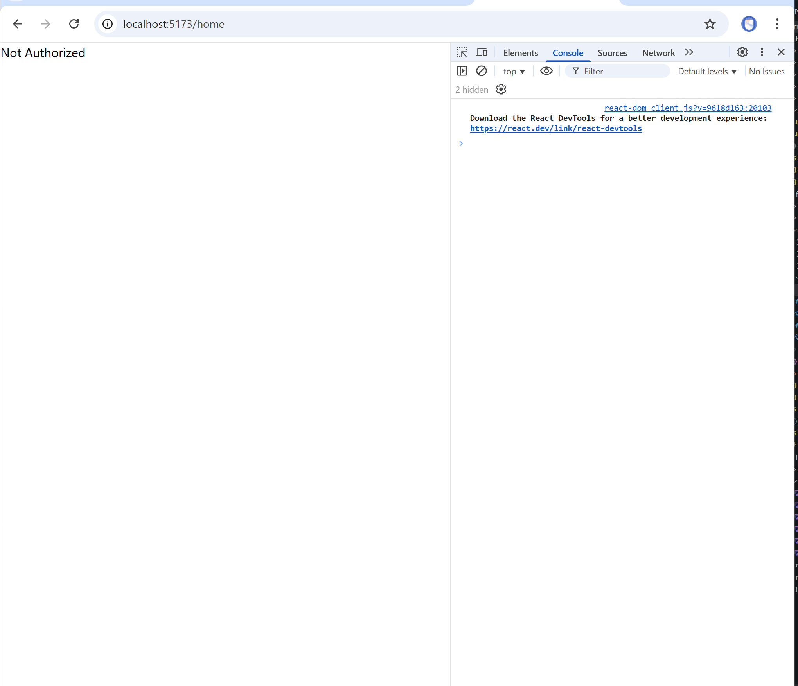

- after logout we are unable to go to home
  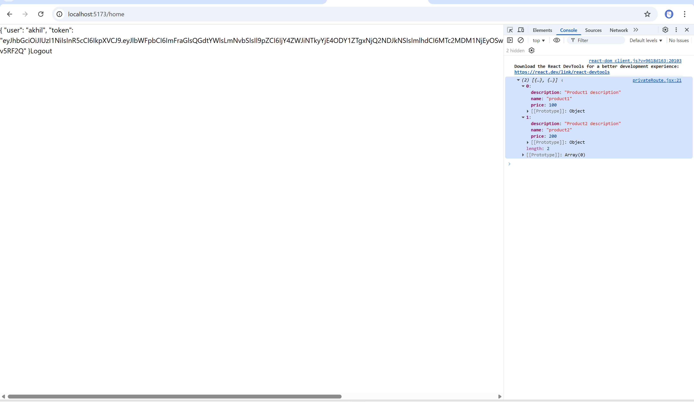

- Create the Spinner.js to use it in the privateRoute.js

```jsx
import React, { useEffect } from "react";
import { useNavigate } from "react-router-dom";
import { useState } from "react";

const Spinner = () => {
  return (
    <div className="flex flex-col items-center justify-center min-h-screen bg-gray-100">
      {/* Spinner Animation */}
      <div className="flex items-center space-x-4">
        <div className="w-16 h-16 border-8 border-blue-500 border-t-transparent border-solid rounded-full animate-spin"></div>
        <p className="text-lg font-medium text-gray-700">
          Redirecting in 5 seconds...
        </p>
      </div>

      {/* Redirect Message */}
      <div className="mt-4 text-center text-xl text-gray-700">
        <p>Please wait while we redirect you...</p>
      </div>
    </div>
  );
};

export default Spinner;
```

```jsx
import React, { useEffect } from "react";
import { useNavigate } from "react-router-dom";
import { useState } from "react";

const Spinner = () => {
  const [count, setCount] = useState(5);
  const navigate = useNavigate();

  useEffect(() => {
    setInterval(() => {
      setCount((currentCount) => currentCount - 1);
    }, 1000);

    if (count == 0) {
      navigate("/login");
    }
    return () => clearInterval();
  }, [count, navigate]);

  return (
    <div className="flex flex-col items-center justify-center min-h-screen bg-gray-100">
      {/* Spinner Animation */}
      <div className="flex items-center space-x-4">
        <div className="w-16 h-16 border-8 border-blue-500 border-t-transparent border-solid rounded-full animate-spin"></div>
        <p className="text-lg font-medium text-gray-700">
          Redirecting in {count} seconds...
        </p>
      </div>

      {/* Redirect Message */}
      <div className="mt-4 text-center text-xl text-gray-700">
        <p>Please wait while we redirect you...</p>
      </div>
    </div>
  );
};

export default Spinner;
```

```jsx
import { useAuth } from "../context/auth";
import { useEffect, useEffectEvent, useState } from "react";
import axios from "axios";
import { Outlet } from "react-router-dom";
import Spinner from "../pages/Spinner";

export default function PrivateRoute() {
  const [ok, setOkay] = useState(false);
  const { auth, setAuth } = useAuth();

  useEffect(() => {
    const authCheck = async () => {
      const response = await axios.get("http://localhost:8080/product", {
        headers: {
          Authorization: auth?.token,
        },
      });

      if (response.status === 200) {
        setOkay(true);
        console.log(response.data);
      } else {
        setOkay(false);
        console.log(response.data);
      }
    };
    if (auth?.token) {
      authCheck();
    }
  }, [auth?.token]);

  return ok ? <Outlet /> : <Spinner></Spinner>;
}
```

- In the backend/routes folder make changes for productRoutes.jsx

```jsx
import express from "express";
import { ensureAuthenticated } from "../middlewares/productAuthMiddle.js";

const productRouter = express.Router();

productRouter.get("/", ensureAuthenticated, (req, res) => {
  res.status(200).json([
    {
      name: "Mobile Phone",
      price: 300,
      image:
        "https://images.pexels.com/photos/607812/pexels-photo-607812.jpeg?auto=compress&cs=tinysrgb&h=300",
    },
    {
      name: "Laptop",
      price: 500,
      image:
        "https://images.pexels.com/photos/18105/pexels-photo.jpg?auto=compress&cs=tinysrgb&h=300",
    },
    {
      name: "Smartwatch",
      price: 80,
      image:
        "https://images.pexels.com/photos/267394/pexels-photo-267394.jpeg?auto=compress&cs=tinysrgb&h=300",
    },

    {
      name: "Tablet",
      price: 200,
      image:
        "https://images.pexels.com/photos/106344/pexels-photo-106344.jpeg?auto=compress&cs=tinysrgb&h=300",
    },
    {
      name: "Gaming Console",
      price: 450,
      image:
        "https://images.pexels.com/photos/1298601/pexels-photo-1298601.jpeg?auto=compress&cs=tinysrgb&h=300",
    },
    {
      name: "Wireless Earbuds",
      price: 500,
      image:
        "https://images.pexels.com/photos/373945/pexels-photo-373945.jpeg?auto=compress&cs=tinysrgb&h=300",
    },
    {
      name: "Smart TV",
      price: 600,
      image:
        "https://images.pexels.com/photos/276583/pexels-photo-276583.jpeg?auto=compress&cs=tinysrgb&h=300",
    },
    {
      name: "Bluetooth Speaker",
      price: 40,
      image:
        "https://images.pexels.com/photos/63703/pexels-photo-63703.jpeg?auto=compress&cs=tinysrgb&h=300",
    },
  ]);
});

export default productRouter;
```

- Make the changes to the home page and represent data there

```jsx
import React, { useEffect, useState } from "react";
import { useAuth } from "../context/auth.jsx";
import { NavLink } from "react-router-dom";
import axios from "axios";

const HomePage = () => {
  const { auth, setAuth } = useAuth();
  const [products, setProducts] = useState([]);

  const fetchProducts = async () => {
    try {
      const response = await axios.get("http://localhost:8080/product/", {
        headers: {
          Authorization: auth?.token,
        },
      });
      if (response.status == 200) {
        setProducts(response.data);
        console.log(JSON.stringify(response.data, null, 4));
      }
    } catch (error) {
      console.log("Error in fetching products");
    }
  };

  useEffect(() => {
    fetchProducts();
  }, []);

  const handleLogout = () => {
    setAuth({
      ...auth,
      user: null,
      token: "",
    });
    localStorage.removeItem("auth");
  };

  return (
    <div>
      {products.length > 0
        ? products.map((products, index) => (
            <div key={index}>
              <h1>{products.name}</h1>
              <h2>{products.price}</h2>
            </div>
          ))
        : null}
      <NavLink to="/login" onClick={handleLogout}>
        Logout
      </NavLink>
      <button></button>
    </div>
  );
};

export default HomePage;
```

- Final code with design

```jsx
import React, { useEffect, useState } from "react";
import { useAuth } from "../context/auth";
import { NavLink } from "react-router-dom";
import axios from "axios";
const Homepage = () => {
  const [auth, setAuth] = useAuth();
  const [products, setProducts] = useState([]);

  const fetchProducts = async () => {
    try {
      const response = await axios.get("http://localhost:8080/product/", {
        headers: {
          Authorization: auth?.token,
        },
      });
      if (response.status === 200) {
        setProducts(response.data);
        console.log(JSON.stringify(response.data, null, 4));
      }
    } catch (error) {
      console.log("Error fetching products", error);
    }
  };

  useEffect(() => {
    fetchProducts();
  }, []);

  const handleLogout = () => {
    setAuth({ ...auth, user: null, token: "" });
    localStorage.removeItem("auth");
  };
  return (
    <div className="min-h-screen bg-white">
      {/* Navbar */}
      <div className="flex justify-between items-center bg-white shadow-md p-4 rounded-lg mb-6">
        <h1 className="text-2xl font-bold text-gray-800">🛒 Shopping Cart</h1>
        {auth?.user ? (
          <div className="flex items-center space-x-4">
            <div className="text-gray-700 font-medium">👤 {auth.user}</div>
            <NavLink
              onClick={handleLogout}
              to="/login"
              className="bg-red-500 hover:bg-red-600 text-white font-bold py-2 px-4 rounded"
            >
              🚪 Logout
            </NavLink>
          </div>
        ) : (
          <NavLink to="/login" className="text-gray-700 font-medium">
            Login
          </NavLink>
        )}
      </div>

      {/* Product Grid */}
      <div className="container mx-auto">
        <div className="grid grid-cols-1 sm:grid-cols-2 md:grid-cols-3 lg:grid-cols-4 gap-6">
          {products.length > 0 ? (
            products.map((product, index) => (
              <div
                key={index}
                className="bg-white shadow-lg rounded-lg p-4 transform transition-all hover:scale-105 hover:shadow-xl"
              >
                
                <h2 className="text-xl font-semibold text-gray-700 mt-3">
                  {product.name}
                </h2>
                <p className="text-gray-600">💰 Price: ${product.price}</p>
                <button className="mt-3 bg-blue-500 hover:bg-blue-600 text-white font-bold py-2 px-4 rounded w-full">
                  Add to Cart
                </button>
              </div>
            ))
          ) : (
            <p className="text-gray-600 text-lg">No products found.</p>
          )}
        </div>
      </div>
    </div>
  );
};

export default Homepage;
```
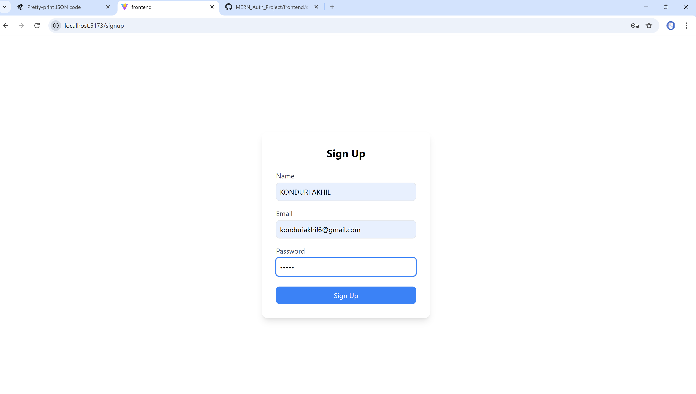
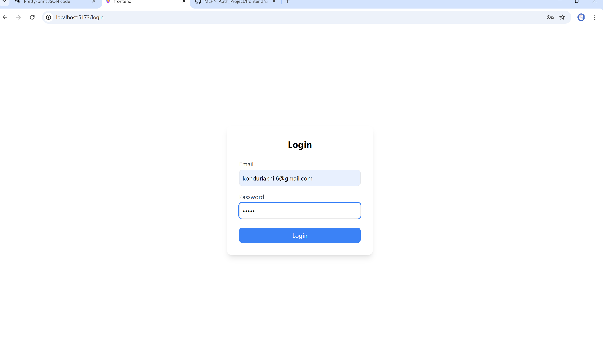
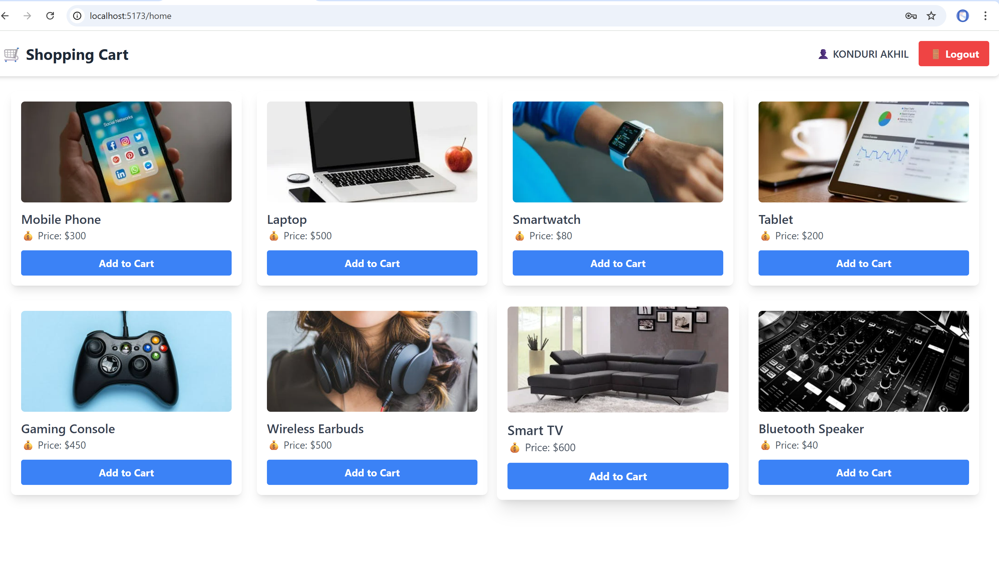


