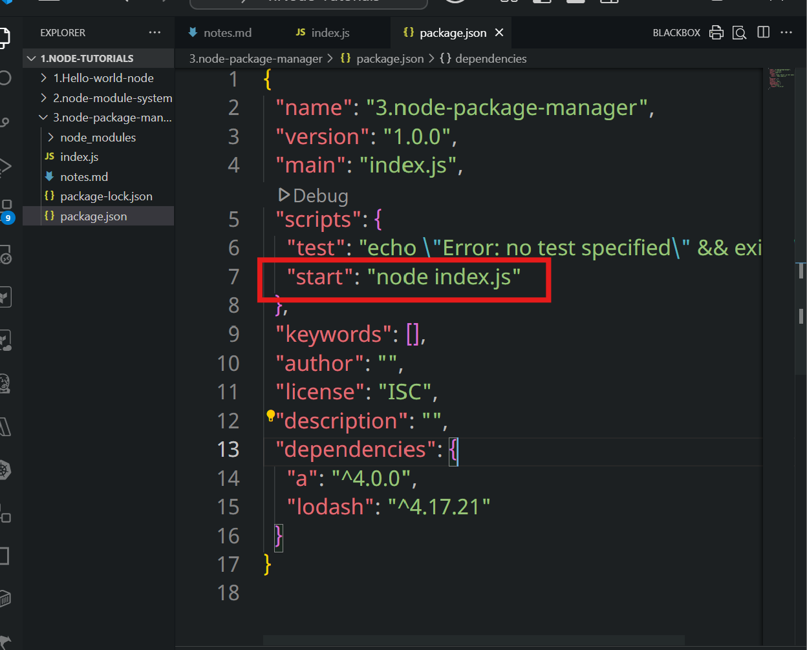
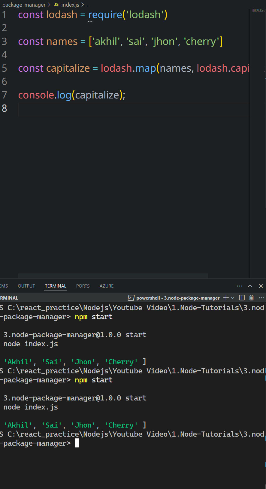

# npm

```sh
npm init -y
```

- It creates the **package.json** file that required for the runtime environmnet or dependencies for the project

```sh
npm install <package name>
```

- It creates or install the required package and we can see it through **node_modules** folder
  
- To run the file just type `npm start ` instead of `node index.js`
  
