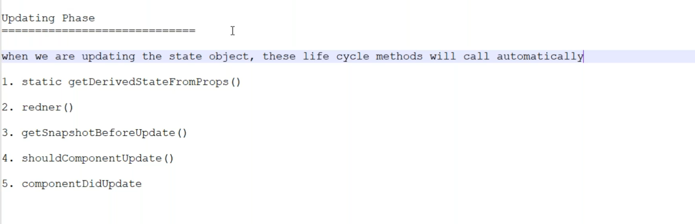
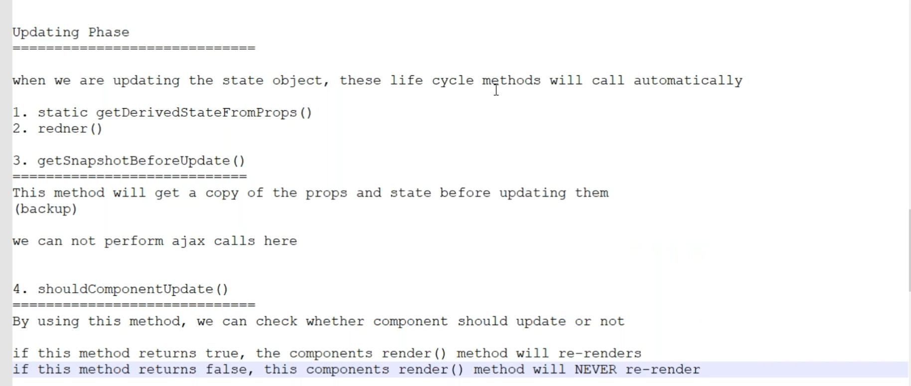
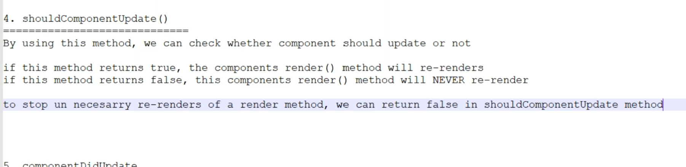
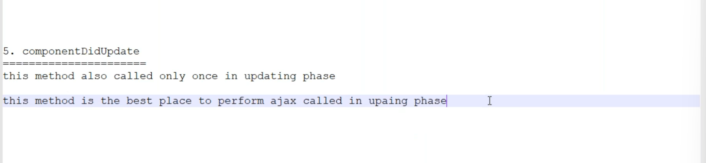
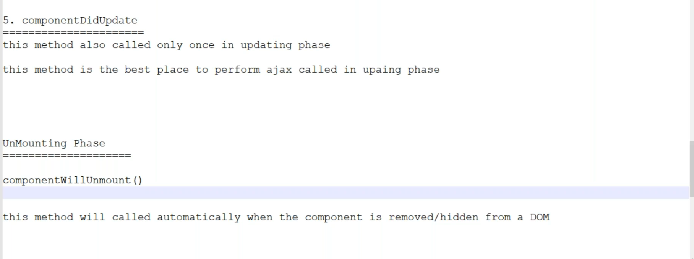
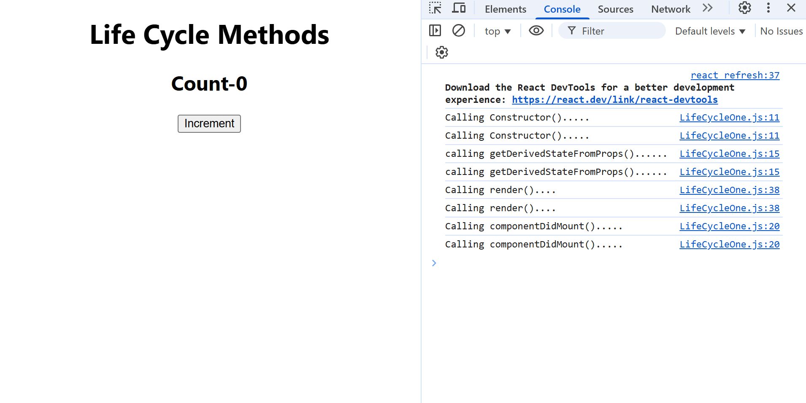
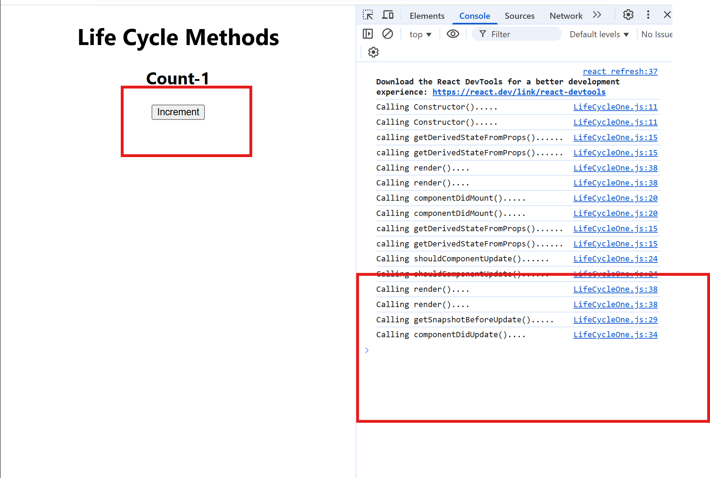
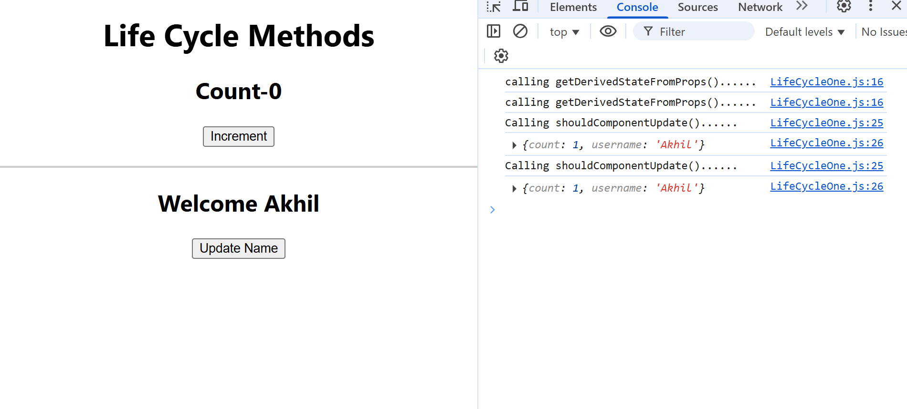
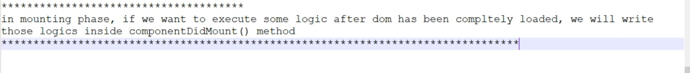

# Updating  Phase Object





```jsx
const { Component } = require("react");

class LifeCycleOne extends Component
{

    constructor(){
        super();
        this.state={
            count: 0
        };
        console.log('Calling Constructor().....')
    }

    static getDerivedStateFromProps(){
        console.log('calling getDerivedStateFromProps()......')
        return null;
    }

    componentDidMount(){
        console.log('Calling componentDidMount().....')
    }

    shouldComponentUpdate(){
        console.log('Calling shouldComponentUpdate()......')
        return true;
    } 

    render(){
        console.log('Calling render()....')
        return <div>
            <h1>Life Cycle Methods</h1>
            <h2>Count-{this.state.count}</h2>
            <button onClick={ () => this.setState({count: this.state.count + 1})}>Increment</button>
        </div>
    }
}
export default LifeCycleOne
```


```jsx
const { Component } = require("react");

class LifeCycleOne extends Component
{

    constructor(){
        super();
        this.state={
            count: 0
        };
        console.log('Calling Constructor().....')
    }

    static getDerivedStateFromProps(){
        console.log('calling getDerivedStateFromProps()......')
        return null;
    }

    componentDidMount(){
        console.log('Calling componentDidMount().....')
    }

    shouldComponentUpdate(){
        console.log('Calling shouldComponentUpdate()......')
        return true;
    } 

    getSnapshotBeforeUpdate(){
        console.log('Calling getSnapshotBeforeUpdate().....')
        return null;
    }

    componentDidUpdate(){
        console.log('Calling componentDidUpdate().... ')
    }

    render(){
        console.log('Calling render()....')
        return <div>
            <h1>Life Cycle Methods</h1>
            <h2>Count-{this.state.count}</h2>
            <button onClick={ () => this.setState({count: this.state.count + 1})}>Increment</button>
        </div>
    }
}
export default LifeCycleOne
```
```jsx
    shouldComponentUpdate(prevProps, prevState){
        console.log('Calling shouldComponentUpdate()......')
        if(this.state.username === prevState.username){
            return false;
        }
        return true;
    } 

        render(){
        console.log('Calling render()....')
        return <div>
            <h1>Life Cycle Methods</h1>
            <h2>Count-{this.state.count}</h2>
            <button onClick={ () => this.setState({count: this.state.count + 1})}>Increment</button>
            <hr></hr>
            <h2>Welcome {this.state.username}</h2>
            <button onClick={() => {this.setState({username: 'Akhil'})}}>Update Name</button>
        </div>
    }
```

```jsx
const { Component } = require("react");

class LifeCycleOne extends Component
{

    constructor(){
        super();
        this.state={
            count: 0,
            username: 'Konduri'
        };
        console.log('Calling Constructor().....')
    }

    static getDerivedStateFromProps(){
        console.log('calling getDerivedStateFromProps()......')
        return null;
    }

    componentDidMount(){
        console.log('Calling componentDidMount().....')
    }

    shouldComponentUpdate(prevProps, prevState){
        console.log('Calling shouldComponentUpdate()......')
        console.log(prevState)
        if(this.state.username === prevState.username){
            return false;
        }
        return true;
    } 

    getSnapshotBeforeUpdate(){
        console.log('Calling getSnapshotBeforeUpdate().....')
        return null;
    }

    componentDidUpdate(){
        console.log('Calling componentDidUpdate().... ')
    }

    render(){
        console.log('Calling render()....')
        return <div>
            <h1>Life Cycle Methods</h1>
            <h2>Count-{this.state.count}</h2>
            <button onClick={ () => this.setState({count: this.state.count + 1})}>Increment</button>
            <hr></hr>
            <h2>Welcome {this.state.username}</h2>
            <button onClick={() => {this.setState({username: 'Akhil'})}}>Update Name</button>
        </div>
    }
}
export default LifeCycleOne
```
## setInterval (reactjs predefined method ) method

```jsx
import { Component } from "react";

class Clock extends Component
{

    constructor(){
        super();
        this.state ={
            timer: new Date().toLocaleTimeString(),
        }
    }

    componentDidMount(){
        setInterval(() => this.setState({
            timer: new Date().toLocaleTimeString()
        }), 1000)
    }

    render(){
        return <div>
            <h1>Time: {this.state.timer}</h1>
        </div>
    }
}
export default Clock
```


# ChatGPT
Sure, Akhil! Here's your **well-organized and interview-ready notes** based on the raw content you provided. All code snippets are **included and formatted properly**.

---

# 📘 React Lifecycle Methods – Updating & Unmounting Phases

## 🔄 Updating Phase

Occurs when the component **re-renders** due to changes in state or props.

### ✅ Lifecycle Methods in Updating Phase:

1. ### `static getDerivedStateFromProps(props, state)`

   * Called **every time** the component is re-rendered due to a change in props or state.
   * Used to update state **based on props**.
   * Returns an object to update the state, or `null` to do nothing.
   * ❌ No AJAX calls allowed.

2. ### `shouldComponentUpdate(nextProps, nextState)`

   * Determines whether the component **should re-render or not**.
   * Returns:

     * `true` ➝ continue with rendering.
     * `false` ➝ skip rendering.
   * ✅ Helps in **performance optimization** by preventing unnecessary renders.

3. ### `render()`

   * The **only required method** in a class component.
   * Returns the JSX to be rendered.
   * Pure and should not modify state or interact with DOM directly.

4. ### `getSnapshotBeforeUpdate(prevProps, prevState)`

   * Called **right before the DOM is updated**.
   * Allows capturing some information (e.g., scroll position) **before update happens**.
   * Must return a value (or `null`) which is passed to `componentDidUpdate`.

5. ### `componentDidUpdate(prevProps, prevState, snapshot)`

   * Invoked **after the component updates**.
   * Best place for **AJAX calls or DOM manipulations** based on updated data.

---

## 🧼 Unmounting Phase

### `componentWillUnmount()`

* Called **when a component is about to be removed** from the DOM.
* Use this to:

  * **Clear timers**
  * **Cancel network requests**
  * **Unsubscribe from services**

---

## 🧪 Code Example: Full Lifecycle in Updating Phase

```jsx
const { Component } = require("react");

class LifeCycleOne extends Component {
  constructor() {
    super();
    this.state = {
      count: 0,
      username: 'Konduri'
    };
    console.log('Calling Constructor().....');
  }

  static getDerivedStateFromProps() {
    console.log('Calling getDerivedStateFromProps()......');
    return null;
  }

  componentDidMount() {
    console.log('Calling componentDidMount().....');
  }

  shouldComponentUpdate(prevProps, prevState) {
    console.log('Calling shouldComponentUpdate()......');
    console.log('Previous State:', prevState);
    if (this.state.username === prevState.username) {
      return false; // Prevent unnecessary render
    }
    return true;
  }

  getSnapshotBeforeUpdate() {
    console.log('Calling getSnapshotBeforeUpdate().....');
    return null;
  }

  componentDidUpdate() {
    console.log('Calling componentDidUpdate()....');
  }

  render() {
    console.log('Calling render()....');
    return (
      <div>
        <h1>Life Cycle Methods</h1>
        <h2>Count - {this.state.count}</h2>
        <button onClick={() => this.setState({ count: this.state.count + 1 })}>
          Increment
        </button>
        <hr />
        <h2>Welcome {this.state.username}</h2>
        <button onClick={() => this.setState({ username: 'Akhil' })}>
          Update Name
        </button>
      </div>
    );
  }
}

export default LifeCycleOne;
```

---

## ⏱️ Timer Example Using `setInterval` in `componentDidMount`

```jsx
import { Component } from "react";

class Clock extends Component {
  constructor() {
    super();
    this.state = {
      timer: new Date().toLocaleTimeString(),
    };
  }

  componentDidMount() {
    setInterval(() => {
      this.setState({
        timer: new Date().toLocaleTimeString(),
      });
    }, 1000);
  }

  render() {
    return (
      <div>
        <h1>Time: {this.state.timer}</h1>
      </div>
    );
  }
}

export default Clock;
```

### 📝 Note:

* `componentDidMount()` is a great place to run **side effects** like:

  * Setting up timers (`setInterval`)
  * Fetching data from an API
  * Manipulating the DOM after the initial render

---

## 💡 Summary Table

| Phase      | Method                     | Purpose                                      |
| ---------- | -------------------------- | -------------------------------------------- |
| Updating   | `getDerivedStateFromProps` | Update state from props                      |
| Updating   | `shouldComponentUpdate`    | Decide whether to render again               |
| Updating   | `render`                   | Describe UI                                  |
| Updating   | `getSnapshotBeforeUpdate`  | Capture info (e.g., scroll) before update    |
| Updating   | `componentDidUpdate`       | Run side effects like API calls after update |
| Unmounting | `componentWillUnmount`     | Cleanup tasks (timers, subscriptions)        |

---
