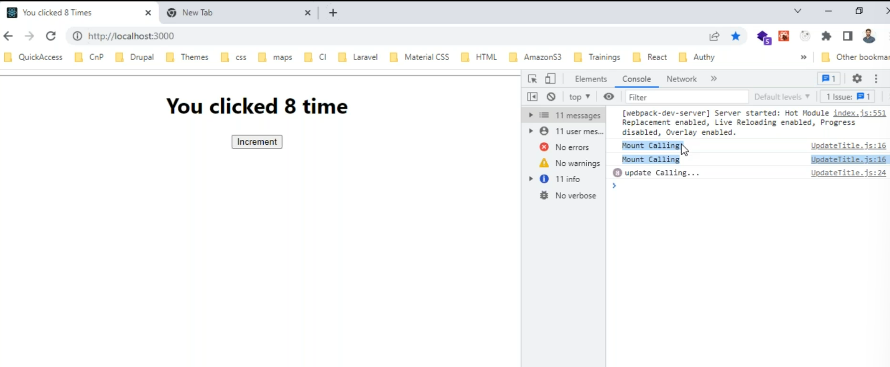
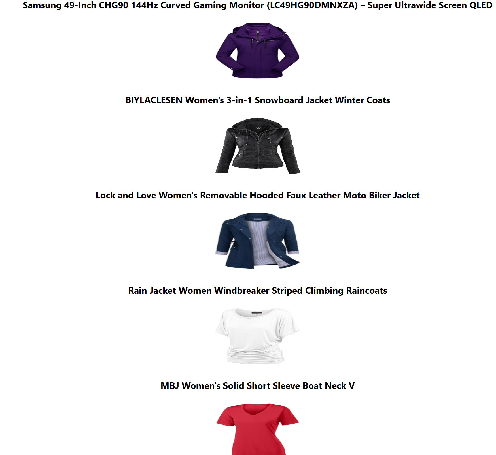

Here are the consolidated notes based on the provided content:

---

# **ReactJS Notes: Day 11**

## **Updating the Document Title**

### **Key Concepts**
- `componentDidMount()` is called once after the component is mounted.
- `componentDidUpdate()` is called every time the state or props are updated.

### **Code Example**
```jsx
import { Component } from "react";

class UpdateTitle extends Component {
  constructor() {
    super();
    this.state = {
      counter: 0,
    };
  }

  increment = () => {
    this.setState({
      counter: this.state.counter + 1,
    });
  };

  componentDidMount() {
    console.log("calling componentDidMount().... ");
    document.title = "you clicked " + this.state.counter + " times";
  }

  componentDidUpdate() {
    console.log("Calling componentDidUpdate()....");
    document.title = "you clicked " + this.state.counter + " times";
  }

  render() {
    return (
      <div>
        <h1>Welcome to React</h1>
        <h2>Counter- {this.state.counter}</h2>
        <button onClick={this.increment}>Increment</button>
      </div>
    );
  }
}

export default UpdateTitle;
```



---

## **Fetching Products List**

### **Key Concepts**
- Use `XMLHttpRequest` to fetch data from an API.
- Use `state` to manage the fetched data and a loader.

### **Code Example**
```jsx
import { Component } from "react";

class Products extends Component {
  constructor() {
    super();
    this.state = {
      products: [],
    };
  }

  componentDidMount() {
    let obj = new XMLHttpRequest();
    obj.open("GET", "https://fakestoreapi.com/products", true);
    obj.send();
    obj.onreadystatechange = () => {
      if (obj.readyState === 4 && obj.status === 200) {
        const data = JSON.parse(obj.responseText);
        this.setState({
          products: data,
        });
      }
    };
  }

  render() {
    return (
      <div>
        <h1>Products List</h1>
        <p>Length: {this.state.products.length}</p>
        <div className="blocks">
          {this.state.products.map((item, index) => (
            <div key={index} className="item">
              <h4>{item.title}</h4>
            </div>
          ))}
        </div>
      </div>
    );
  }
}

export default Products;
```

---

## **Adding Images to the Product List**

### **Key Concepts**
- Display product images using the `img` tag.
- Use CSS for styling the product list.

### **Code Example**
```jsx
import { Component } from "react";

class Products extends Component {
  constructor() {
    super();
    this.state = {
      products: [],
    };
  }

  componentDidMount() {
    let obj = new XMLHttpRequest();
    obj.open("GET", "https://fakestoreapi.com/products", true);
    obj.send();
    obj.onreadystatechange = () => {
      if (obj.readyState === 4 && obj.status === 200) {
        const data = JSON.parse(obj.responseText);
        this.setState({
          products: data,
        });
      }
    };
  }

  render() {
    return (
      <div>
        <h1>Products List</h1>
        <p>Length: {this.state.products.length}</p>
        <div className="blocks">
          {this.state.products.map((item, index) => (
            <div key={index} className="item">
              
              <h4>{item.title}</h4>
              <p>Price: {item.price}</p>
            </div>
          ))}
        </div>
      </div>
    );
  }
}

export default Products;
```


### **CSS for Styling**
```css
.App {
  width: 85%;
  margin: 0px auto;
  padding: 10px;
  background-color: white;
}

.blocks {
  display: flex;
  flex-wrap: wrap;
}

.item {
  flex: 25%;
  border: 1px solid #333;
  margin: 2px;
}
```

---

## **Adding a Loader**

### **Key Concepts**
- Use a `loader` state to show a loading spinner while fetching data.

### **Code Example**
```jsx
import { Component } from "react";
import loaderimg from "./images/loading.gif";

class Products extends Component {
  constructor() {
    super();
    this.state = {
      products: [],
      loader: false,
    };
  }

  componentDidMount() {
    this.setState({
      loader: true,
    });

    let obj = new XMLHttpRequest();
    obj.open("GET", "https://fakestoreapi.com/products", true);
    obj.send();
    obj.onreadystatechange = () => {
      if (obj.readyState === 4 && obj.status === 200) {
        const data = JSON.parse(obj.responseText);
        this.setState({
          products: data,
          loader: false,
        });
      }
    };
  }

  render() {
    return (
      <div>
        <h1>Products List</h1>
        <p>Length: {this.state.products.length}</p>

        {this.state.loader ? (
          
        ) : null}

        <div className="blocks">
          {this.state.products.map((item, index) => (
            <div key={index} className="item">
              
              <h4>{item.title}</h4>
              <p>Price: {item.price}</p>
            </div>
          ))}
        </div>
      </div>
    );
  }
}

export default Products;
```



---

## **Fetching Products on Button Click**

### **Key Concepts**
- Use event binding to fetch data when a button is clicked.

### **Code Example**
```jsx
import { Component } from "react";
import loaderimg from "./images/loading.gif";

class ProductsList extends Component {
  constructor() {
    super();
    this.state = {
      products: [],
      loader: false,
    };
  }

  fetchProductsList = () => {
    this.setState({
      loader: true,
    });
    let obj = new XMLHttpRequest();
    obj.open("GET", "https://fakestoreapi.com/products", true);
    obj.send();
    obj.onreadystatechange = () => {
      if (obj.readyState === 4 && obj.status === 200) {
        const data = JSON.parse(obj.responseText);
        this.setState({
          products: data,
          loader: false,
        });
      }
    };
  };

  render() {
    return (
      <div>
        <h1>Product List Component</h1>
        <p>Length: {this.state.products.length}</p>

        {this.state.loader ? (
          
        ) : null}
        <button onClick={this.fetchProductsList}>Load Products</button>

        <ul>
          {this.state.products.map((product) => (
            <li key={product.id}>{product.title}</li>
          ))}
        </ul>
      </div>
    );
  }
}

export default ProductsList;
```


---

## **Installing Axios**

### **Steps**
1. Install Axios using npm:
   ```bash
   npm install axios
   ```
2. Use Axios for fetching data instead of `XMLHttpRequest` for cleaner and more modern code.

---

These notes cover key concepts, code examples, and styling for working with React components, state management, and API integration.