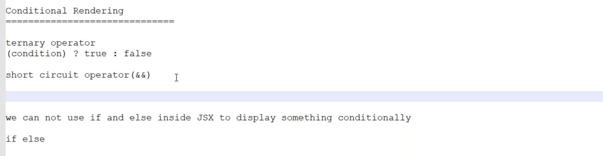
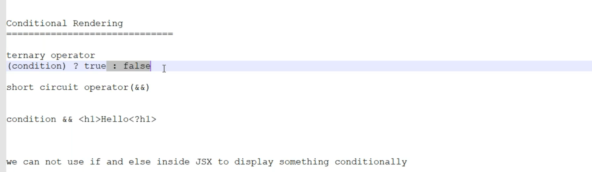
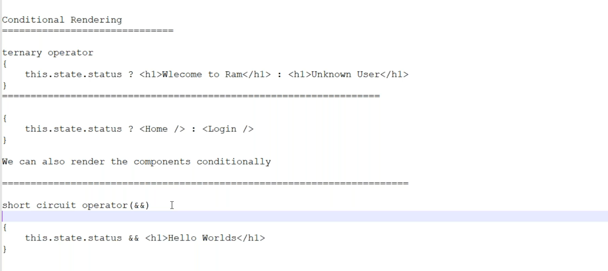
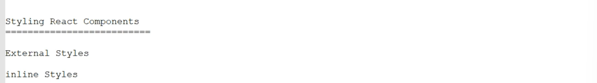

# Conditional rendering
## ternary operator

* here in this we don't have if,ifelse  for and while loopsc
```jsx
import { Component } from "react";

import loaderimg from './images/loading.gif'

class Conditional extends Component
{

    constructor(){
        super();
        this.state = {
            username: 'Akhil',
            status: false,
        }
    }

    render(){
        return <div>
            <h1>Conditional rendering</h1>

            {
                this.state.status ? <h1>Hello {this.state.username}</h1> : <h1>Unknown User</h1>
            }

            {
                this.state.status ? null  : 
            }

        </div>
    }
}
export default Conditional
```
## toggle includation
```jsx
import { Component } from "react";

import loaderimg from './images/loading.gif'

class Conditional extends Component
{

    constructor(){
        super();
        this.state = {
            username: 'Akhil',
            status: false,
        }
    }

    toggleImage = () => {
        this.setState({
            status: !this.state.status
        })
    }

    render(){
        return <div>
            <h1>Conditional rendering</h1>

            {
                this.state.status ? <h1>Hello {this.state.username}</h1> : <h1>Unknown User</h1>
            }

            {
                this.state.status ? null  : 
            }
            <button onClick={this.toggleImage}>Toggle button</button>
        </div>
    }
}
export default Conditional
```
## shortciruit operator

```jsx

import { Component } from "react";

import loaderimg from './images/loading.gif'

class Conditional extends Component
{

    constructor(){
        super();
        this.state = {
            username: 'Akhil',
            status: false,
            isloggedin: true,
        }
    }

    toggleImage = () => {
        this.setState({
            status: !this.state.status
        })
    }

    render(){
        return <div>
            <h1>Conditional rendering</h1>

            {
                this.state.status ? <h1>Hello {this.state.username}</h1> : <h1>Unknown User</h1>
            }

            {
                this.state.status ? null  : 
            }
            {
                this.state.isloggedin && <h1>Welcome {this.state.username}</h1>
            }
            <button onClick={this.toggleImage}>Toggle button</button>
        </div>
    }
}
export default Conditional
```

## Styling react components

* Create CSS folder in src and cretae styles.css there
```styles.css
*{
        margin: 0;     
        box-sizing: border-box;
}

.container{
    width: 85%;
    margin: 0px auto;
}
.block{
    display: flex;
    flex-wrap: wrap;
}
.item{
    flex: 25%;
    border: 1px solid #333;
    margin: 2px;
    text-align: center;
}
```
```jsx
import './App.css';
import './CSS/styles.css'
import Conditional from './Conditional';
import Products from './Products';


function App() {
  return (
    <div className="container" >      
      <Products />
      
     </div>
  );
}
export default App;

```
```jsx
*{
        margin: 0;     
        box-sizing: border-box;
}

.container{
    width: 85%;
    margin: 0px auto;
}
.block{
    display: flex;
    flex-wrap: wrap;
}
.item{
    flex: 25%;
    border: 1px solid #333;
    margin: 2px;
    text-align: center;
}

.title{
    color: red;
}
```
```jsx
import { Component } from "react";

class InLineStyle extends Component
{
    render()
    {
        return (
            <div>
                <h1 className="title">InLineStyling</h1>
            </div>
        )
    }
}
export default InLineStyle
```
```jsx
import { Component } from "react";

class InLineStyle extends Component
{
    render()
    {
        return (
            <div>
                <h1 style={{color: 'red', fontSize: '25px',textDecoration: 'Underline' }}>InLineStyling</h1>
            </div>
        )
    }
}
export default InLineStyle
```
```jsx
import { Component } from "react";

class InLineStyle extends Component
{

    constructor(){
        super();
        this.state ={
            status: true,
        }

    }

    render()
    {
        return (
            <div>
                <h1 style={{color: 'red', fontSize: '25px',textDecoration: 'Underline' }}>InLineStyling</h1>
                <hr></hr>
                {
                    this.state.status ? <h2 >Hello Akhil</h2> : <h2 >Hello Sai</h2>
                }
                <hr></hr>
                <h1 style={this.state.status ? {color: "red"} :  {color: "blue"}}>Number checking</h1>

            </div>
        )
    }
}
export default InLineStyle
```
