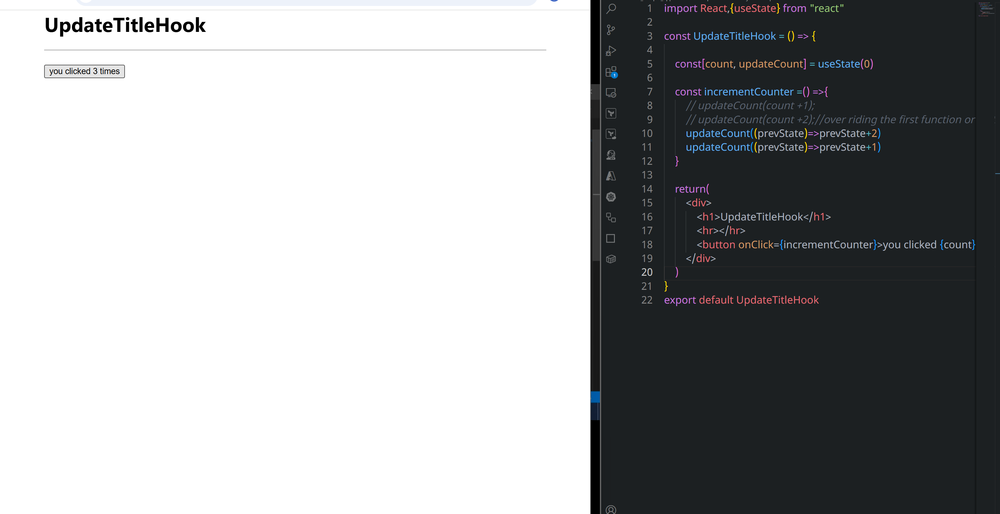
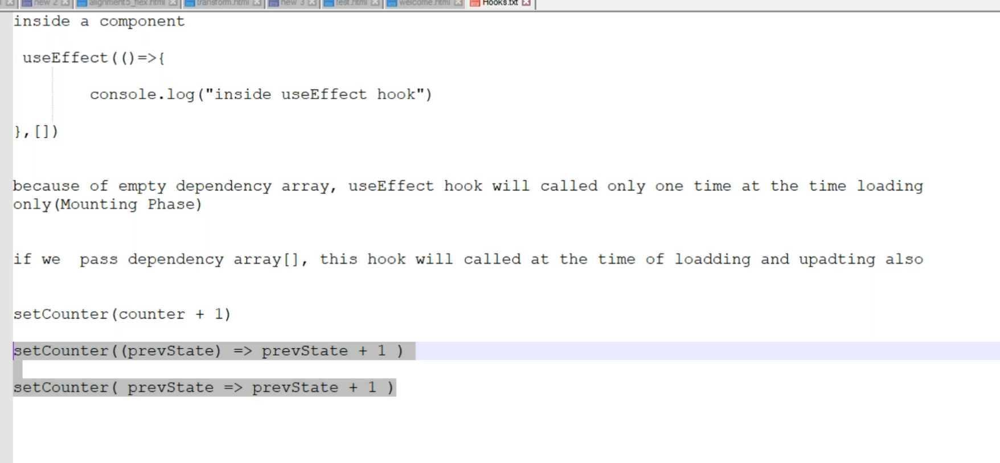
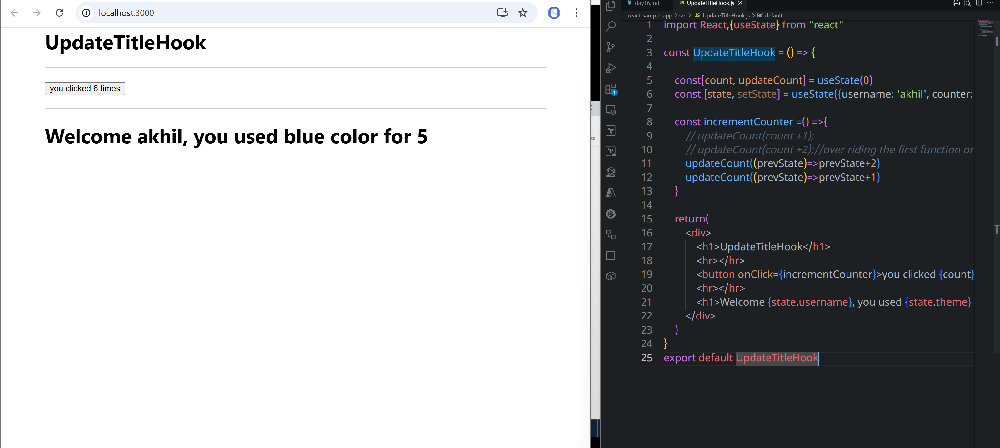
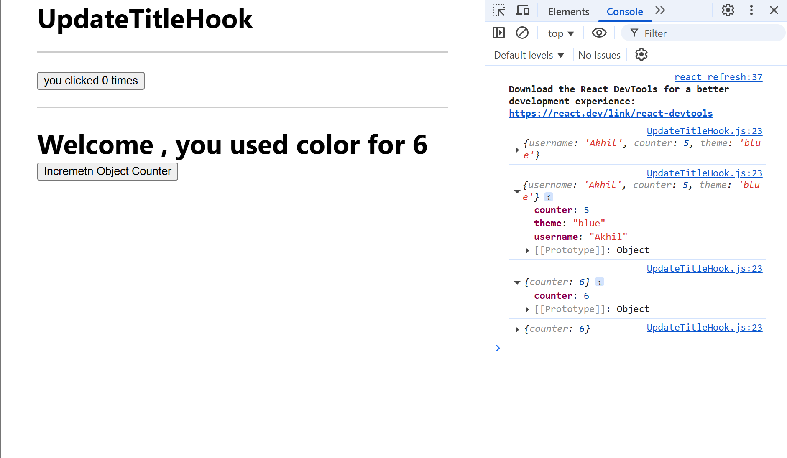
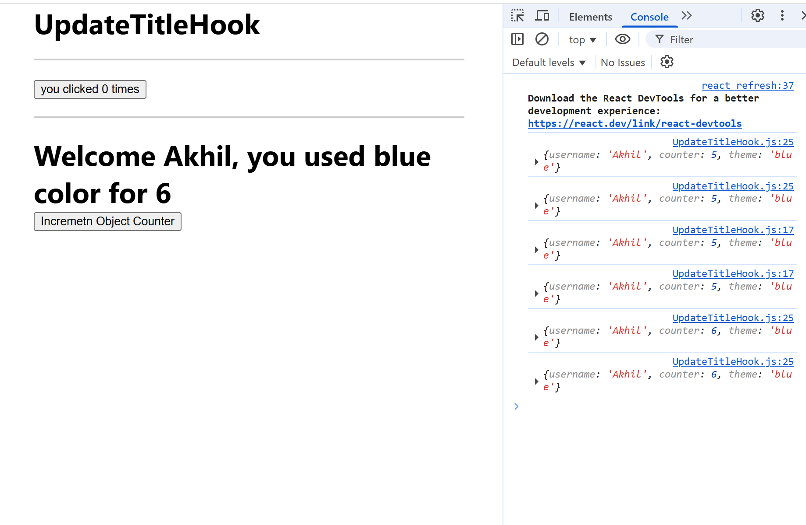

```jsx
import React,{useState} from "react"

const UpdateTitleHook = () => {

    const[count, updateCount] = useState(0)

    return(
        <div>
            <h1>UpdateTitleHook</h1>
            <hr></hr>
            <button onClick={()=>updateCount(count +1)}>you clicked {count} times</button>
        </div>
    )
}
export default UpdateTitleHook
```
### overriding
```jsx
import React,{useState} from "react"

const UpdateTitleHook = () => {

    const[count, updateCount] = useState(0)

    const incrementCounter =() =>{
        updateCount(count +1);
        updateCount(count +4);//over riding the first function or statement
    }

    return(
        <div>
            <h1>UpdateTitleHook</h1>
            <hr></hr>
            <button onClick={incrementCounter}>you clicked {count} times</button>
        </div>
    )
}
export default UpdateTitleHook
```
### prevState
```jsx
import React,{useState} from "react"

const UpdateTitleHook = () => {

    const[count, updateCount] = useState(0)

    const incrementCounter =() =>{
        // updateCount(count +1);
        // updateCount(count +2);//over riding the first function or statement
        updateCount((prevState)=>prevState+2)
        updateCount((prevState)=>prevState+1)
    }

    return(
        <div>
            <h1>UpdateTitleHook</h1>
            <hr></hr>
            <button onClick={incrementCounter}>you clicked {count} times</button>
        </div>
    )
}
export default UpdateTitleHook
```


```jsx
import React,{useState} from "react"

const UpdateTitleHook = () => {

    const[count, updateCount] = useState(0)
    const [state, setState] = useState({username: 'akhil', counter: 5, theme:'blue'})

    const incrementCounter =() =>{
        // updateCount(count +1);
        // updateCount(count +2);//over riding the first function or statement
        updateCount((prevState)=>prevState+2)
        updateCount((prevState)=>prevState+1)
    }

    return(
        <div>
            <h1>UpdateTitleHook</h1>
            <hr></hr>
            <button onClick={incrementCounter}>you clicked {count} times</button>
            <hr></hr>
            <h1>Welcome {state.username}, you used {state.theme} color for {state.counter}</h1>
        </div>
    )
}
export default UpdateTitleHook
```

### object is overriding with counter only 
```jsx
import React,{useState} from "react"

const UpdateTitleHook = () => {

    const[count, updateCount] = useState(0)
    const [state, setState] = useState({username: 'Akhil', counter: 5, theme:'blue'})

    const incrementCounter =() =>{
        // updateCount(count +1);
        // updateCount(count +2);//over riding the first function or statement
        updateCount((prevState)=>prevState+2)
        updateCount((prevState)=>prevState+1)
    }

    const incrementObjectCounter =() => {
        setState((prevState)=>{
            return {
                counter: prevState.counter + 1
            }
        })
    }

    console.log(state)

    return(
        <div>
            <h1>UpdateTitleHook</h1>
            <hr></hr>
            <button onClick={incrementCounter}>you clicked {count} times</button>
            <hr></hr>
            <h1>Welcome {state.username}, you used {state.theme} color for {state.counter}</h1>
            <button onClick={incrementObjectCounter}>Incremetn Object Counter</button>
        </div>
    )
}
export default UpdateTitleHook
```


```jsx
import React,{useState} from "react"

const UpdateTitleHook = () => {

    const[count, updateCount] = useState(0)
    const [state, setState] = useState({username: 'Akhil', counter: 5, theme:'blue'})

    const incrementCounter =() =>{
        // updateCount(count +1);
        // updateCount(count +2);//over riding the first function or statement
        updateCount((prevState)=>prevState+2)
        updateCount((prevState)=>prevState+1)
    }

    const incrementObjectCounter =() => {
        setState((prevState)=>{
            console.log(prevState)
            return {
                ...prevState,
                counter: prevState.counter + 1
            }
        })
    }

    console.log(state)

    return(
        <div>
            <h1>UpdateTitleHook</h1>
            <hr></hr>
            <button onClick={incrementCounter}>you clicked {count} times</button>
            <hr></hr>
            <h1>Welcome {state.username}, you used {state.theme} color for {state.counter}</h1>
            <button onClick={incrementObjectCounter}>Incremetn Object Counter</button>
        </div>
    )
}
export default UpdateTitleHook
```


## updating title
```jsx
import React,{useState, useEffect} from "react"

const UpdateTitleHook = () => {

    const[count, updateCount] = useState(0)
    const [state, setState] = useState({username: 'Akhil', counter: 5, theme:'blue'})

    const incrementCounter =() =>{
        // updateCount(count +1);
        // updateCount(count +2);//over riding the first function or statement
        updateCount((prevState)=>prevState+2)
        updateCount((prevState)=>prevState+1)
    }

    useEffect(()=>{
        document.title=' you clicked '+ count + ' times'
    })

    console.log('Inside Component..')

    const incrementObjectCounter =() => {
        setState((prevState)=>{
            return {
                ...prevState,
                counter: prevState.counter + 1
            }
        })
    }


    return(
        <div>
            <h1>UpdateTitleHook</h1>
            <hr></hr>
            <button onClick={incrementCounter}>you clicked {count} times</button>
            <hr></hr>
            <h1>Welcome {state.username}, you used {state.theme} color for {state.counter}</h1>
            <button onClick={incrementObjectCounter}>Incremetn Object Counter</button>
        </div>
    )
}
export default UpdateTitleHook
```    
## using dependency [] of useEffect hook
```jsx
import React,{useState, useEffect} from "react"

const UpdateTitleHook = () => {

    const[count, updateCount] = useState(0)
    const [state, setState] = useState({username: 'Akhil', counter: 5, theme:'blue'})

    const incrementCounter =() =>{
        updateCount(count +1);
        // updateCount(count +2);//over riding the first function or statement
        // updateCount((prevState)=>prevState+2)
        // updateCount((prevState)=>prevState+1)
    }

    useEffect(()=>{
        console.log('calling useeffect()')
        document.title=' you clicked '+ count + ' times'
    }, [count])

    console.log('Inside Component..')

    const incrementObjectCounter =() => {
        setState((prevState)=>{
            return {
                ...prevState,
                counter: prevState.counter + 1
            }
        })
    }


    return(
        <div>
            <h1>UpdateTitleHook</h1>
            <hr></hr>
            <button onClick={incrementCounter}>you clicked {count} times</button>
            <hr></hr>
            <h1>Welcome {state.username}, you used {state.theme} color for {state.counter}</h1>
            <button onClick={incrementObjectCounter}>Incremetn Object Counter</button>
        </div>
    )
}
export default UpdateTitleHook
```
27:00