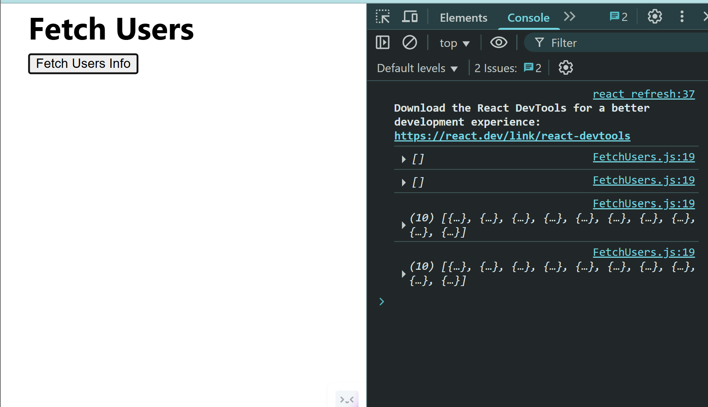
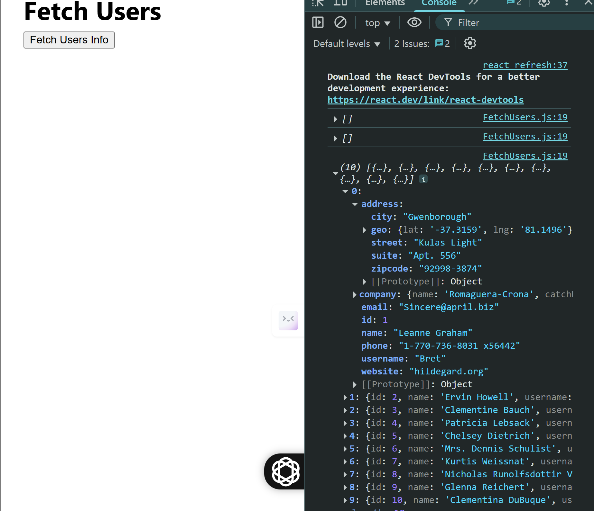
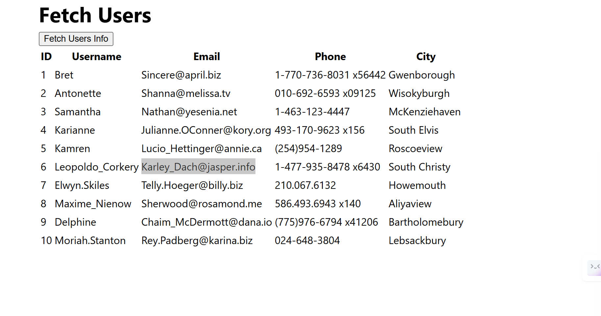
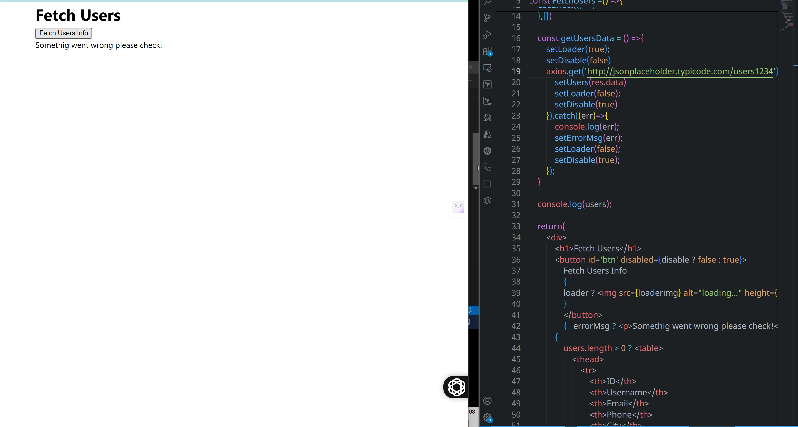
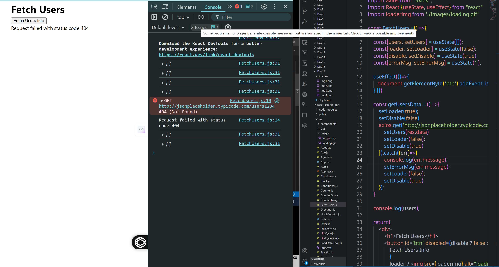

```jsx
import axios from "axios";
import React,{useState, useEffect} from "react"

const FetchUsers =() =>{

    const[users, setUsers] = useState([]);

    useEffect(()=>{
       document.getElementById('btn').addEventListener('click', getUsersData) 
    },[])

    const getUsersData = () =>{
        axios.get('http://jsonplaceholder.typicode.com/users').then((res)=>{
            setUsers(res.data)
        }).catch((err)=>{
            console.log(err)
        })
    }
    console.log(users);
    return(
        <div>
            <h1>Fetch Users</h1>
            <button id='btn'>Fetch Users Info</button>
        </div>
    )
}
export default FetchUsers
```


```jsx
import axios from "axios";
import React,{useState, useEffect} from "react"

const FetchUsers =() =>{
    
    const[users, setUsers] = useState([]);

    useEffect(()=>{
       document.getElementById('btn').addEventListener('click', getUsersData) 
    },[])

    const getUsersData = () =>{
        axios.get('http://jsonplaceholder.typicode.com/users').then((res)=>{
            setUsers(res.data)
        }).catch((err)=>{
            console.log(err)
        })
    }
    console.log(users);
    return(
        <div>            
            <h1>Fetch Users</h1>
            <button id='btn'>Fetch Users Info</button>
            {
                users.length > 0 ? <table>
                    <thead>
                        <tr>
                            <th>ID</th>
                            <th>Username</th>
                            <th>Email</th>
                            <th>Phone</th>
                            <th>City</th>
                        </tr>
                    </thead>
                    <tbody>
                        {
                            users.map((item,index)=><tr key={index}>                        
                                <td>{item.id}</td>
                                <td>{item.username}</td>
                                <td>{item.email}</td>
                                <td>{item.phone}</td>
                                <td>{item.address.city}</td>
                        </tr>)
                        }
                    </tbody>
                </table> : null
            }
        </div>
    )
}
export default FetchUsers
```

```jsx
import axios from "axios";
import React,{useState, useEffect} from "react"
import loaderimg from './images/loading.gif'

const FetchUsers =() =>{
    
    const[users, setUsers] = useState([]);
    const[loader, setLoader] = useState(false)

    useEffect(()=>{
       document.getElementById('btn').addEventListener('click', getUsersData) 
    },[])

    const getUsersData = () =>{
        setLoader(true);
        axios.get('http://jsonplaceholder.typicode.com/users').then((res)=>{
            setUsers(res.data)
            setLoader(false);
        }).catch((err)=>{
            console.log(err);
        })
    }

    console.log(users);

    return(
        <div>
            <h1>Fetch Users</h1>
            <button id='btn'>
                Fetch Users Info
                {
                loader ? </img> : null
                }
                </button>          
            {
                users.length > 0 ? <table>
                    <thead>
                        <tr>
                            <th>ID</th>
                            <th>Username</th>
                            <th>Email</th>
                            <th>Phone</th>
                            <th>City</th>
                        </tr>
                    </thead>
                    <tbody>
                        {
                            users.map((item,index)=><tr key={index}>                        
                                <td>{item.id}</td>
                                <td>{item.username}</td>
                                <td>{item.email}</td>
                                <td>{item.phone}</td>
                                <td>{item.address.city}</td>
                        </tr>)
                        }
                    </tbody>
                </table> : null
            }
        </div>
    )
}
export default FetchUsers
```
## Disabled parameter setting for <button />
```jsx
import axios from "axios";
import React,{useState, useEffect} from "react"
import loaderimg from './images/loading.gif'

const FetchUsers =() =>{
    
    const[users, setUsers] = useState([]);
    const[loader, setLoader] = useState(false);
    const[disable, setDisable] = useState(true);
    const[errorMsg, setErrorMsg] = useState('');

    useEffect(()=>{
       document.getElementById('btn').addEventListener('click', getUsersData) 
    },[])

    const getUsersData = () =>{
        setLoader(true);
        setDisable(false)
        axios.get('http://jsonplaceholder.typicode.com/users1234').then((res)=>{
            setUsers(res.data)
            setLoader(false);
            setDisable(true)
        }).catch((err)=>{
            console.log(err.message);
            setErrorMsg(err.message);
            setLoader(false);
            setDisable(true);
        });
    }

    console.log(users);

    return(
        <div>
            <h1>Fetch Users</h1>
            <button id='btn' disabled={disable ? false : true}>
                Fetch Users Info
                {
                loader ? </img> : null
                }
                </button>    
                {   errorMsg ? <p>{errorMsg}</p> : null }      
            {
                users.length > 0 ? <table>
                    <thead>
                        <tr>
                            <th>ID</th>
                            <th>Username</th>
                            <th>Email</th>
                            <th>Phone</th>
                            <th>City</th>
                        </tr>
                    </thead>
                    <tbody>
                        {
                            users.map((item,index)=><tr key={index}>                        
                                <td>{item.id}</td>
                                <td>{item.username}</td>
                                <td>{item.email}</td>
                                <td>{item.phone}</td>
                                <td>{item.address.city}</td>
                        </tr>)
                        }
                    </tbody>
                </table> : null
            }
            
        </div>
    )
}
export default FetchUsers
```
## Handling errors by making wrong url <http://jsonplaceholder.typicode.com/users1243>




# ChatGPT Version
Perfect Akhil! Here is the **complete set of structured notes** from your content — **including all the code**, **with explanations**, **features by version**, and key points highlighted clearly.

---

# 🧾 ReactJS: **Fetch Users - Full Feature Breakdown With Code**

---

## ✅ **1. Basic Version – Fetch API on Button Click**

### 🔹 Features:

* Fetch user data on button click.
* Uses `axios.get(...)` to call API.
* Event attached using `addEventListener` inside `useEffect`.

### 💡 Code:

```jsx
import axios from "axios";
import React,{useState, useEffect} from "react"

const FetchUsers =() =>{
        
    const [users, setUsers] = useState([]);

    useEffect(()=>{
        document.getElementById('btn').addEventListener('click', getUsersData) 
    },[])

    const getUsersData = () => {
        axios.get('http://jsonplaceholder.typicode.com/users').then((res)=>{
            setUsers(res.data)
        }).catch((err)=>{
            console.log(err)
        })
    }

    console.log(users);

    return(
        <div>
            <h1>Fetch Users</h1>
            <button id='btn'>Fetch Users Info</button>
        </div>
    )
}

export default FetchUsers
```

---

## ✅ **2. Add Table to Display User Data**

### 🔹 Features:

* Displays a table with the following headers: ID, Username, Email, Phone, City.
* Conditionally renders only when `users.length > 0`.

### 💡 Code:

```jsx
import axios from "axios";
import React,{useState, useEffect} from "react"

const FetchUsers =() =>{

    const [users, setUsers] = useState([]);

    useEffect(()=>{
        document.getElementById('btn').addEventListener('click', getUsersData) 
    },[])

    const getUsersData = () => {
        axios.get('http://jsonplaceholder.typicode.com/users').then((res)=>{
            setUsers(res.data)
        }).catch((err)=>{
            console.log(err)
        })
    }

    console.log(users);

    return(
        <div>            
            <h1>Fetch Users</h1>
            <button id='btn'>Fetch Users Info</button>
            {
                users.length > 0 ? <table>
                    <thead>
                        <tr>
                            <th>ID</th>
                            <th>Username</th>
                            <th>Email</th>
                            <th>Phone</th>
                            <th>City</th>
                        </tr>
                    </thead>
                    <tbody>
                        {
                            users.map((item,index)=><tr key={index}>                        
                                <td>{item.id}</td>
                                <td>{item.username}</td>
                                <td>{item.email}</td>
                                <td>{item.phone}</td>
                                <td>{item.address.city}</td>
                            </tr>)
                        }
                    </tbody>
                </table> : null
            }
        </div>
    )
}

export default FetchUsers
```

---

## ✅ **3. Add Loader (loading.gif)**

### 🔹 Features:

* Added `loader` state to show GIF during API call.
* Loader shown inside the `<button>` next to text.

### 💡 Code:

```jsx
import axios from "axios";
import React,{useState, useEffect} from "react"
import loaderimg from './images/loading.gif'

const FetchUsers =() =>{

    const [users, setUsers] = useState([]);
    const [loader, setLoader] = useState(false)

    useEffect(()=>{
        document.getElementById('btn').addEventListener('click', getUsersData) 
    },[])

    const getUsersData = () => {
        setLoader(true);
        axios.get('http://jsonplaceholder.typicode.com/users').then((res)=>{
            setUsers(res.data)
            setLoader(false);
        }).catch((err)=>{
            console.log(err);
        })
    }

    console.log(users);

    return(
        <div>
            <h1>Fetch Users</h1>
            <button id='btn'>
                Fetch Users Info
                {
                loader ? </img> : null
                }
            </button>          
            {
                users.length > 0 ? <table>
                    <thead>
                        <tr>
                            <th>ID</th>
                            <th>Username</th>
                            <th>Email</th>
                            <th>Phone</th>
                            <th>City</th>
                        </tr>
                    </thead>
                    <tbody>
                        {
                            users.map((item,index)=><tr key={index}>                        
                                <td>{item.id}</td>
                                <td>{item.username}</td>
                                <td>{item.email}</td>
                                <td>{item.phone}</td>
                                <td>{item.address.city}</td>
                            </tr>)
                        }
                    </tbody>
                </table> : null
            }
        </div>
    )
}

export default FetchUsers
```

---

## ✅ **4. Add Disable Button and Error Handling**

### 🔹 Features:

* Adds `disable` state to prevent multiple clicks during fetch.
* Adds `errorMsg` state to capture and display errors.
* Simulates error by intentionally using incorrect URL:
  `http://jsonplaceholder.typicode.com/users1234`

### 💡 Code:

```jsx
import axios from "axios";
import React,{useState, useEffect} from "react"
import loaderimg from './images/loading.gif'

const FetchUsers =() =>{

    const [users, setUsers] = useState([]);
    const [loader, setLoader] = useState(false);
    const [disable, setDisable] = useState(true);
    const [errorMsg, setErrorMsg] = useState('');

    useEffect(()=>{
        document.getElementById('btn').addEventListener('click', getUsersData) 
    },[])

    const getUsersData = () => {
        setLoader(true);
        setDisable(false)
        axios.get('http://jsonplaceholder.typicode.com/users1234').then((res)=>{
            setUsers(res.data)
            setLoader(false);
            setDisable(true)
        }).catch((err)=>{
            console.log(err.message);
            setErrorMsg(err.message);
            setLoader(false);
            setDisable(true);
        });
    }

    console.log(users);

    return(
        <div>
            <h1>Fetch Users</h1>
            <button id='btn' disabled={disable ? false : true}>
                Fetch Users Info
                {
                loader ? </img> : null
                }
            </button>    
            {
                errorMsg ? <p>{errorMsg}</p> : null 
            }      
            {
                users.length > 0 ? <table>
                    <thead>
                        <tr>
                            <th>ID</th>
                            <th>Username</th>
                            <th>Email</th>
                            <th>Phone</th>
                            <th>City</th>
                        </tr>
                    </thead>
                    <tbody>
                        {
                            users.map((item,index)=><tr key={index}>                        
                                <td>{item.id}</td>
                                <td>{item.username}</td>
                                <td>{item.email}</td>
                                <td>{item.phone}</td>
                                <td>{item.address.city}</td>
                            </tr>)
                        }
                    </tbody>
                </table> : null
            }

        </div>
    )
}

export default FetchUsers
```

---

## 📌 Summary Table

| 🔢 Version           | 🧩 Features                                     |
| -------------------- | ----------------------------------------------- |
| 1️⃣ Basic            | Fetch on button click using `addEventListener`  |
| 2️⃣ Table            | Display user data in a table                    |
| 3️⃣ Loader           | Show GIF loader while fetching                  |
| 4️⃣ Disabled + Error | Disable button during fetch + handle API errors |

---

# image version
Ah got it Akhil! 😊 You want to **keep the actual image references in context** like:

```md

```

Let me now give you the **full structured notes** **including** the `` Markdown-style image references at the exact points where they are relevant.

---

# 🧾 ReactJS: **Fetch Users – Structured Notes With Markdown Image References**

---

## ✅ 1. **Basic Version – Button Click to Fetch Users**

### 📌 Features:

* Calls API when the button is clicked.
* Uses `addEventListener` inside `useEffect`.
* Uses Axios to fetch data and store in `users` state.
* No data displayed on UI yet.

### 💻 Code:

```jsx
useEffect(()=>{
   document.getElementById('btn').addEventListener('click', getUsersData) 
},[])
```

```jsx
<button id='btn'>Fetch Users Info</button>
```

```jsx
axios.get('http://jsonplaceholder.typicode.com/users')
```

### 🖼️ Output:


---

## ✅ 2. **Rendering User Table After Fetch**

### 📌 Features:

* Displays table only if users are present.
* Renders ID, Username, Email, Phone, and City.
* Data is mapped from `users` array.

### 💻 Code:

```jsx
{
  users.length > 0 ? <table>
    <thead>
      <tr>
        <th>ID</th>
        <th>Username</th>
        <th>Email</th>
        <th>Phone</th>
        <th>City</th>
      </tr>
    </thead>
    <tbody>
      {
        users.map((item,index)=><tr key={index}>                        
          <td>{item.id}</td>
          <td>{item.username}</td>
          <td>{item.email}</td>
          <td>{item.phone}</td>
          <td>{item.address.city}</td>
        </tr>)
      }
    </tbody>
  </table> : null
}
```

### 🖼️ Output:


---

## ✅ 3. **Loader GIF During API Call**

### 📌 Features:

* `loader` state added to show a GIF.
* Displayed next to button text while fetching.

### 💻 Code:

```jsx
{
  loader ? </img> : null
}
```

```jsx
const [loader, setLoader] = useState(false);
```

### 🖼️ Output:


---

## ✅ 4. **Disabled Button + Error Handling**

### 📌 Features:

* `disable` state controls button enabling/disabling.
* `errorMsg` state shows error from failed API.
* Intentional wrong URL is used to simulate error.

### 💻 Code:

```jsx
<button id='btn' disabled={disable ? false : true}>
```

```jsx
axios.get('http://jsonplaceholder.typicode.com/users1234') // Wrong URL
```

```jsx
{ errorMsg ? <p>{errorMsg}</p> : null }
```

### 🖼️ Output:

* Error triggered due to wrong URL:
  

* Error message displayed:
  

---

Let me know if you'd like this exported as a **Markdown file**, or if you want me to create a **clean best-practice version of the code** (using `onClick`, cleanup, etc.) for interviews.
