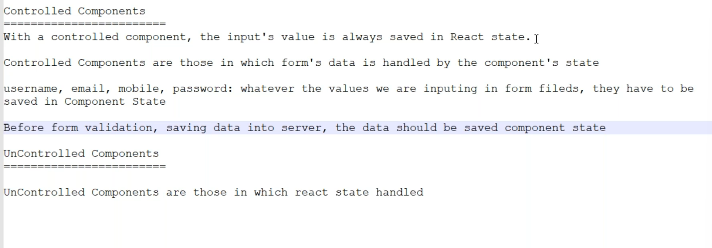
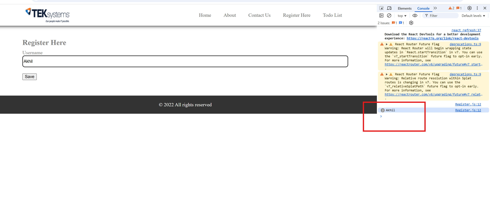

# working on Registration form
```jsx
import React from 'react'
import Header from './Header'
import Footer from './Footer'

const Register = () => {
  return (
    <React.Fragment>
      <Header />
      <section className='content'>
        <h1>Register Here</h1>
      </section>
      <Footer></Footer>
    </React.Fragment>
  )
}

export default Register
```
### Style the form in ./assets/css/style
```css
/**********************
Form Design
************************/
.formgroup{
	padding: 10px 0px;
}
.formcontrol{
	width: 100%;
	height: 38px;
	border: 2px solid #333;
	border-radius: 8px;
}
```
## Controlled Components in React

```jsx
import React from 'react'
import Header from './Header'
import Footer from './Footer'

const Register = () => {


      const handleSubmit =()=>{
            alert('Form is Submitted')
      }

      return (
            <React.Fragment>
                  <Header />
                  <section className='content'>
                        <h1>Register Here</h1>
                        <form method='POST' action='' onSubmit={handleSubmit}>
                              <div className='formgroup'>
                                    <label>Username</label>
                                    <input type='text' className='formcontrol'/>
                              </div>
                              <div className='formgroup'>
                                    <input type='submit' value='Save' />
                              </div>

                        </form>
                  </section>
                  <Footer></Footer>
            </React.Fragment>
      )
}

export default Register
```
### prevent Default behaviour (to prevent refreshing the page)
```jsx
import React from 'react'
import Header from './Header'
import Footer from './Footer'

const Register = () => {


      const handleSubmit =(event)=>{
            event.preventDefault();
            alert('Form is Submitted')
      }

      return (
            <React.Fragment>
                  <Header />
                  <section className='content'>
                        <h1>Register Here</h1>
                        <form method='POST' action='' onSubmit={handleSubmit}>
                              <div className='formgroup'>
                                    <label>Username</label>
                                    <input type='text' className='formcontrol'/>
                              </div>
                              <div className='formgroup'>
                                    <input type='submit' value='Save' />
                              </div>

                        </form>
                  </section>
                  <Footer></Footer>
            </React.Fragment>
      )
}

export default Register
```
## collect data on submitting the requests

```jsx
import React from 'react'
import Header from './Header'
import Footer from './Footer'
import { useState } from 'react'

const Register = () => {

      const[formdata, setFormdata] = useState('Ram')

      const handleSubmit =(event)=>{
            event.preventDefault();
            console.log(formdata)
      }

      const updateFormData = (event) =>{
            setFormdata(event.target.value)
      }

      return (
            <React.Fragment>
                  <Header />
                  <section className='content'>
                        <h1>Register Here</h1>
                        <form method='POST' action='' onSubmit={handleSubmit}>
                              <div className='formgroup'>
                                    <label>Username</label>
                                    <input type='text' className='formcontrol' value={formdata} onChange={updateFormData} />
                              </div>
                              <div className='formgroup'>
                                    <input type='submit' value='Save' />
                              </div>

                        </form>
                  </section>
                  <Footer></Footer>
            </React.Fragment>
      )
}
export default Register
```
### onChange={updateFormData} and updating state


```jsx
import React from 'react'
import Header from './Header'
import Footer from './Footer'
import { useState } from 'react'

const Register = () => {

      const[formdata, setFormdata] = useState('Welcome To React')

      const handleSubmit =(event)=>{
            event.preventDefault();
            console.log(formdata)
      }

      const updateFormData = (event) =>{
            setFormdata(event.target.value)
      }

      return (
            <React.Fragment>
                  <Header />
                  <section className='content'>
                        <h1>Register Here</h1>
                        <form method='POST' action='' onSubmit={handleSubmit}>
                              <div className='formgroup'>
                                    <label>Username</label>
                                    <input type='text' className='formcontrol' value={formdata} onChange={updateFormData} />
                              </div>
                              <div className='formgroup'>
                                    <input type='submit' value='Save' />
                              </div>

                        </form>
                  </section>
                  <Footer></Footer>
            </React.Fragment>
      )
}

export default Register
```
### setting for the multiple fields or values
```jsx
import React from 'react'
import Header from './Header'
import Footer from './Footer'
import { useState } from 'react'

const Register = () => {

      const[formdata, setFormdata] = useState({username: 'Akhil'})

      const handleSubmit =(event)=>{
            event.preventDefault();
            console.log(formdata)
      }

      const updateFormData = (event) =>{
            setFormdata({
                  username:event.target.value,
            })
      }

      return (
            <React.Fragment>
                  <Header />
                  <section className='content'>
                        <h1>Register Here</h1>
                        <form method='POST' action='' onSubmit={handleSubmit}>
                              <div className='formgroup'>
                                    <label>Username</label>
                                    <input type='text' className='formcontrol' value={formdata.username} onChange={updateFormData} />
                              </div>
                              <div className='formgroup'>
                                    <input type='submit' value='Save' />
                              </div>

                        </form>
                  </section>
                  <Footer></Footer>
            </React.Fragment>
      )
}

export default Register
```
```jsx
import React from 'react'
import Header from './Header'
import Footer from './Footer'
import { useState } from 'react'

const Register = () => {

      const[formdata, setFormdata] = useState({username: 'Akhil', email: 'akhil@gmail.com'})

      const handleSubmit =(event)=>{
            event.preventDefault();
            console.log(formdata)
      }

      const updateFormData = (event) =>{
            setFormdata({
                  username:event.target.value,
                  email: event.target.value
            })
      }

      return (
            <React.Fragment>
                  <Header />
                  <section className='content'>
                        <h1>Register Here</h1>
                        <form method='POST' action='' onSubmit={handleSubmit}>
                              <div className='formgroup'>
                                    <label>Username</label>
                                    <input type='text' className='formcontrol' value={formdata.username} onChange={updateFormData} />
                              </div>

                              <div className='formgroup'>
                                    <label>Email</label>
                                    <input type='text' className='formcontrol' value={formdata.email} onChange={updateFormData} />
                              </div>

                              <div className='formgroup'>
                                    <input type='submit' value='Save' />
                              </div>

                        </form>
                  </section>
                  <Footer></Footer>
            </React.Fragment>
      )
}

export default Register
```
```jsx
import React from 'react'
import Header from './Header'
import Footer from './Footer'
import { useState } from 'react'

const Register = () => {

      const[formdata, setFormdata] = useState({username: '', email: ''})

      const handleSubmit =(event)=>{
            event.preventDefault();
            console.log(formdata)
      }

      const updateFormDataUsername  = (event) =>{
            setFormdata({
                  ...formdata,
                  username:event.target.value,
            })
      }

      const updateFormDataEmail = (event)  =>{
            setFormdata({
                  ...formdata,
                  email: event.target.value
            })
      }

      return (
            <React.Fragment>
                  <Header />
                  <section className='content'>
                        <h1>Register Here</h1>
                        <form method='POST' action='' onSubmit={handleSubmit}>

                              <div className='formgroup'>
                                    <label>Username</label>
                                    <input type='text' className='formcontrol' value={formdata.username} onChange={updateFormDataUsername} />
                              </div>

                              <div className='formgroup'>
                                    <label>Email</label>
                                    <input type='text' className='formcontrol' value={formdata.email} onChange={updateFormDataEmail} />
                              </div>

                              <div className='formgroup'>
                                    <input type='submit' value='Save' />
                              </div>

                        </form>
                  </section>
                  <Footer></Footer>
            </React.Fragment>
      )
}

export default Register
```
### Using Common Function for onchange the state for each element
```jsx
import React from 'react'
import Header from './Header'
import Footer from './Footer'
import { useState } from 'react'

const Register = () => {

      const[formdata, setFormdata] = useState({username: '', email: ''})

      const handleSubmit =(event)=>{
            event.preventDefault();
            console.log(formdata)
      }

      const updateHandle  = (event) =>{
            setFormdata({
                  ...formdata,
                  [event.target.name]:event.target.value
            })
      }


      return (
            <React.Fragment>
                  <Header />
                  <section className='content'>
                        <h1>Register Here</h1>
                        <form method='POST' action='' onSubmit={handleSubmit}>

                              <div className='formgroup'>
                                    <label>Username</label>
                                    <input type='text' name='username' className='formcontrol' value={formdata.username} onChange={updateHandle} />
                              </div>

                              <div className='formgroup'>
                                    <label>Email</label>
                                    <input type='text' name='email' className='formcontrol' value={formdata.email} onChange={updateHandle} />
                              </div>

                              <div className='formgroup'>
                                    <input type='submit' value='Save' />
                              </div>

                        </form>
                  </section>
                  <Footer></Footer>
            </React.Fragment>
      )
}

export default Register
```
## one function for all the fields
```jsx
import React from 'react'
import Header from './Header'
import Footer from './Footer'
import { useState } from 'react'

const Register = () => {

      const[formdata, setFormdata] = useState({username: '', email: ''})

      const handleSubmit =(event)=>{
            event.preventDefault();
            console.log(formdata)
      }

      const updateHandle  = (event) =>{
            setFormdata({
                  ...formdata,
                  [event.target.name]: event.target.value
            })
      }


      return (
            <React.Fragment>
                  <Header />
                  <section className='content'>
                        <h1>Register Here</h1>
                        <form method='POST' action='' onSubmit={handleSubmit}>

                              <div className='formgroup'>
                                    <label>Username</label>
                                    <input type='text' name='username' className='formcontrol' value={formdata.username} onChange={updateHandle} />
                              </div>

                              <div className='formgroup'>
                                    <label>Email</label>
                                    <input type='text' name='email' className='formcontrol' value={formdata.email} onChange={updateHandle} />
                              </div>

                              <div className='formgroup'>
                                    <input type='submit' value='Save' />
                              </div>

                        </form>
                  </section>
                  <Footer></Footer>
            </React.Fragment>
      )
}

export default Register
```
# ChatGPT
Absolutely, Akhil! Here's the improved and complete **React Registration Form Study Guide**, with:

* 📚 Clear and meaningful section headings
* ✍️ Beginner-friendly explanations
* 🧪 Original code where needed
* ✅ Final **full working React snippet** at the end

---

# 📝 React.js Study Guide: Registration Form & Controlled Components

---

## 🔧 Step 1: Basic Registration Page Structure

### 📘 Explanation

You're starting with a simple component structure. Using `<Header />` and `<Footer />` promotes reusability. You're using `<React.Fragment>` to wrap multiple elements without adding extra DOM nodes.

### 💻 Code

```jsx
import React from 'react'
import Header from './Header'
import Footer from './Footer'

const Register = () => {
  return (
    <React.Fragment>
      <Header />
      <section className='content'>
        <h1>Register Here</h1>
      </section>
      <Footer />
    </React.Fragment>
  )
}

export default Register
```

---

## 🎨 Step 2: Styling the Form (CSS)

### 📘 Explanation

You created form-specific styles. The class `.formgroup` handles spacing, and `.formcontrol` is styled input fields.

### 💻 CSS Snippet (in `./assets/css/style.css`)

```css
.formgroup {
  padding: 10px 0px;
}
.formcontrol {
  width: 100%;
  height: 38px;
  border: 2px solid #333;
  border-radius: 8px;
}
```

---

## 🧪 Step 3: Creating a Basic Form Layout

### 📘 Explanation

You're creating a static form with a submit button and a heading. This doesn’t collect or process any data yet.

### 💻 Code

```jsx
<form method='POST' action='' onSubmit={handleSubmit}>
  <div className='formgroup'>
    <label>Username</label>
    <input type='text' className='formcontrol'/>
  </div>
  <div className='formgroup'>
    <input type='submit' value='Save' />
  </div>
</form>
```

---

## 🚫 Step 4: Prevent Page Reload on Submit

### 📘 Explanation

The default form submission reloads the page. We prevent this with `event.preventDefault()`.

### 💻 Code

```jsx
const handleSubmit = (event) => {
  event.preventDefault();
  alert('Form is Submitted');
}
```

✅ This is a standard pattern for all forms in React.

---

## 🧠 Step 5: Controlled Component for Username Input


### 📘 Explanation

A controlled input binds the value to state and updates it using `onChange`.

### 💻 Code

```jsx
const [formdata, setFormdata] = useState('Ram');

const updateFormData = (event) => {
  setFormdata(event.target.value);
};
```

✅ The input is now a controlled field.

---

## 📦 Step 6: Managing Form State for Multiple Inputs


### 📘 Explanation

Now you're using a single `formdata` object with multiple fields like `username` and `email`. Initially, you overwrote fields — now we fix that.

### 🔧 Correct Way (Using Spread Operator)

```jsx
const updateHandle = (event) => {
  setFormdata({
    ...formdata,
    [event.target.name]: event.target.value
  });
};
```

### 📘 Why It Matters

Using the spread operator ensures that other fields are retained while updating one field dynamically.

---

## 🧩 Step 7: Final Pattern — One Function for All Fields

### 📘 Explanation

This is the most scalable and reusable form pattern. You use:

* A single `useState` for all fields
* A shared `onChange` handler
* Field-specific `name` attributes

---

## ✅ ✅ Final Complete Code (Full Working Registration Form)

```jsx
import React, { useState } from 'react'
import Header from './Header'
import Footer from './Footer'

const Register = () => {
  const [formdata, setFormdata] = useState({
    username: '',
    email: '',
  });

  const handleSubmit = (event) => {
    event.preventDefault();
    console.log('Submitted Data:', formdata);
  };

  const updateHandle = (event) => {
    setFormdata({
      ...formdata,
      [event.target.name]: event.target.value,
    });
  };

  return (
    <React.Fragment>
      <Header />
      <section className='content'>
        <h1>Register Here</h1>
        <form method='POST' action='' onSubmit={handleSubmit}>
          <div className='formgroup'>
            <label>Username</label>
            <input
              type='text'
              name='username'
              className='formcontrol'
              value={formdata.username}
              onChange={updateHandle}
            />
          </div>

          <div className='formgroup'>
            <label>Email</label>
            <input
              type='text'
              name='email'
              className='formcontrol'
              value={formdata.email}
              onChange={updateHandle}
            />
          </div>

          <div className='formgroup'>
            <input type='submit' value='Save' />
          </div>
        </form>
      </section>
      <Footer />
    </React.Fragment>
  );
};

export default Register;
```

---

## 🧼 Summary

You now know:

* ✅ How to create and style a form
* ✅ What controlled components are and why they're important
* ✅ How to use `useState` for form fields
* ✅ How to handle multiple fields with a single function
* ✅ Best practices for scalable form handling in React

---
## Practise data
```jsx
import {useState} from "react";
import React from 'react';
import Header from "./components/Header";
import Footer from "./components/Footer";


const Trail = () => {

    const[formdata, setFormData] = useState({username:'Akhil',email:'akhil@gmail.com'})


    const submitHandler =(event) =>{
        event.preventDefault()
        console.log(formdata)
    }

    const handleData = (event) => {
        setFormData({
            ...formdata,
            [event.target.name]: event.target.value
        })
    }

  return (
    <div>
        <Header></Header>
        <section className="content">
        <h1>Form Details</h1>
            <form method='POST' action='' onSubmit={submitHandler}>
              
                <div className="formgroup">
                    <label>Username</label>
                    <input type="text" name="username" value={formdata.username} onChange={handleData} />
                </div>

                <div className="formgroup"  >
                    <label>Email</label>
                    <input type="text" name='email' value={formdata.email} onChange={handleData}/>
                </div>

                <div className="formgroup" value='submit'>
                    <input type="submit" />
                </div>
            </form>
        </section>
        <Footer></Footer>
    </div>
  )
}

export default Trail


```

