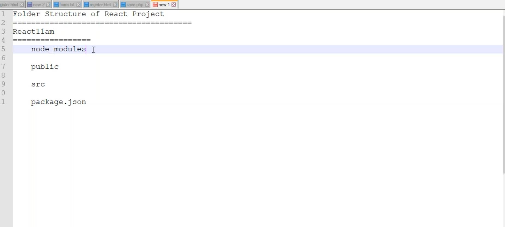
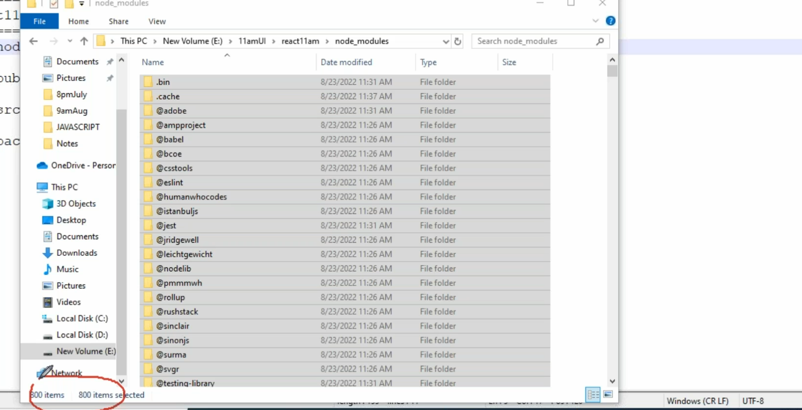
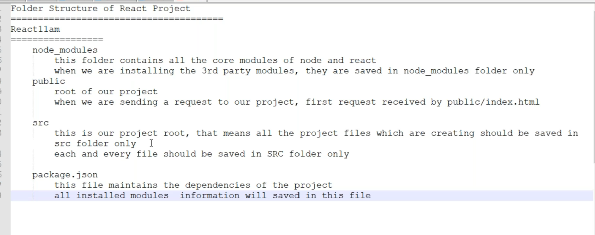
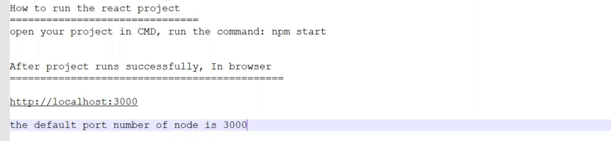
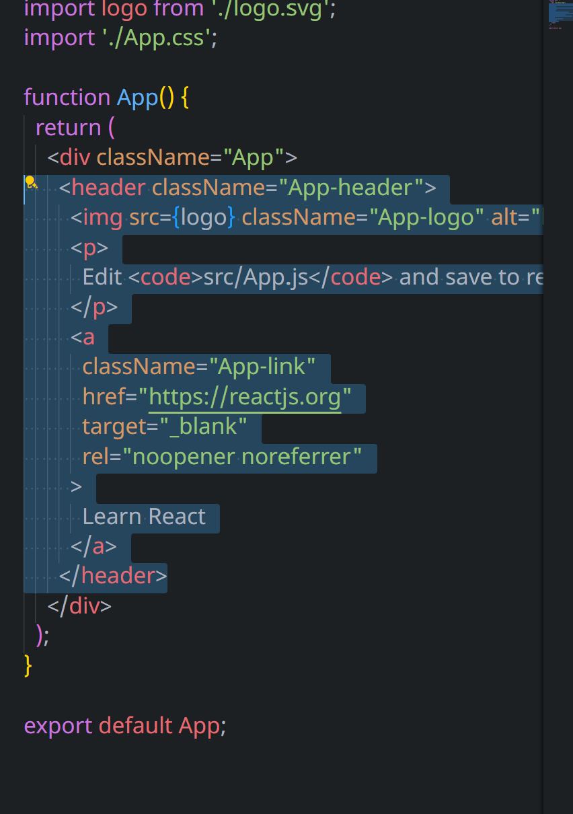
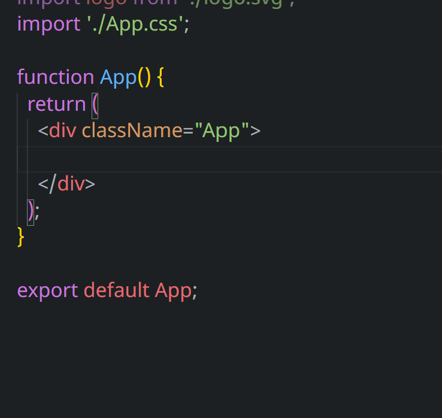
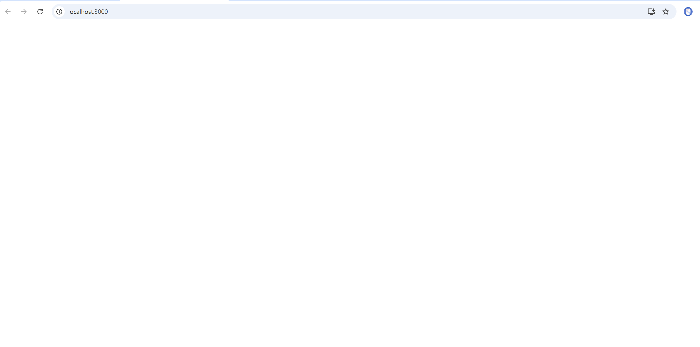
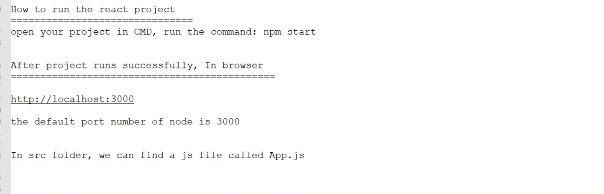
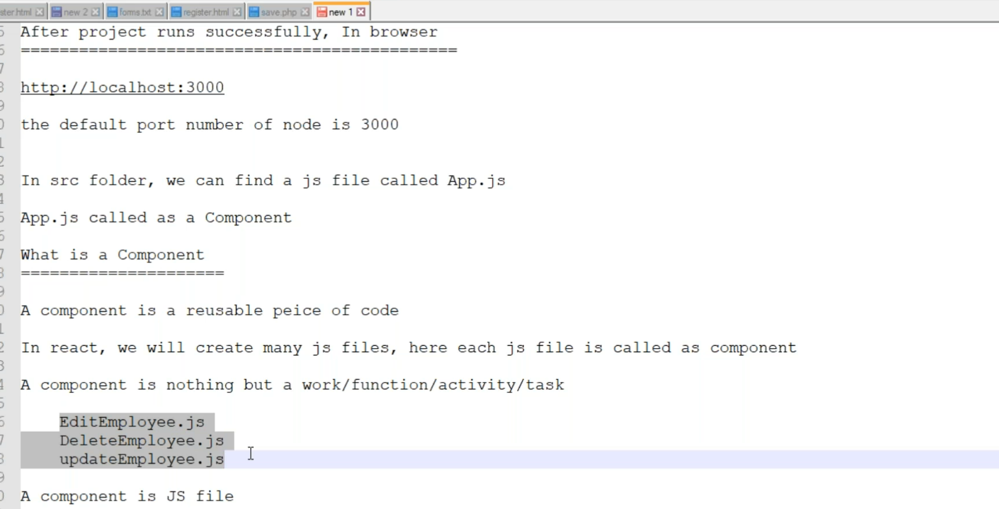
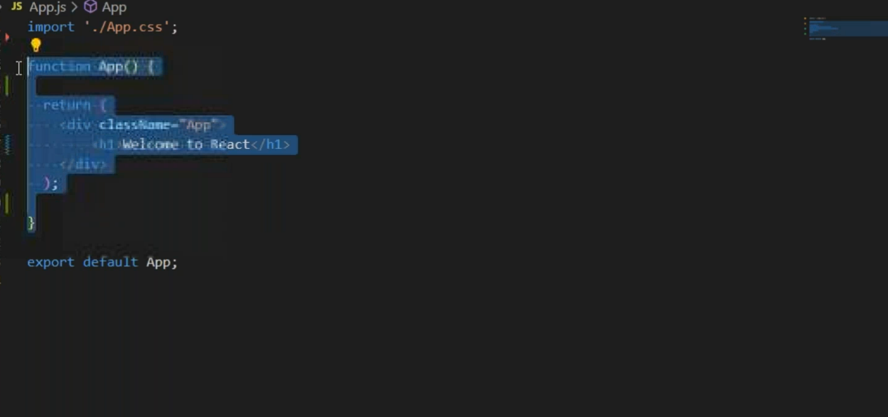
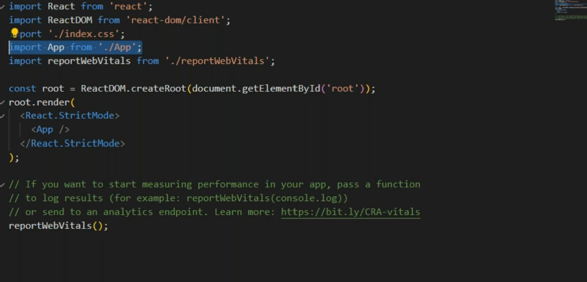
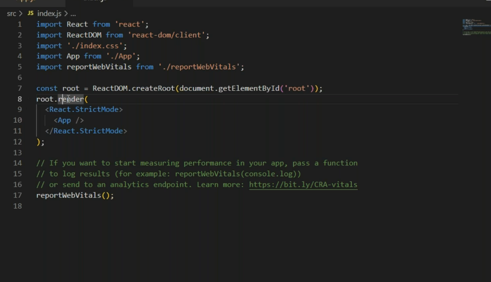
* In the src we have index.html and in the project we have index.html
* App.js is first rendered into index.html
* These is connection between two index.html
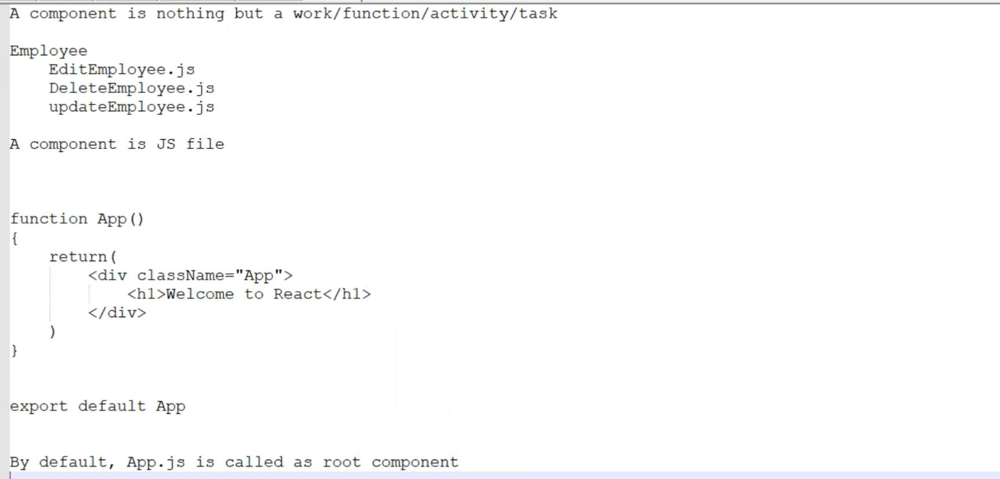
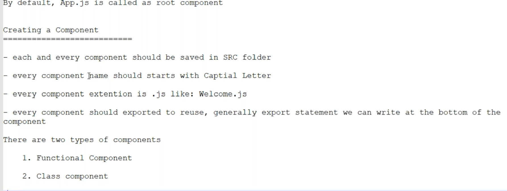
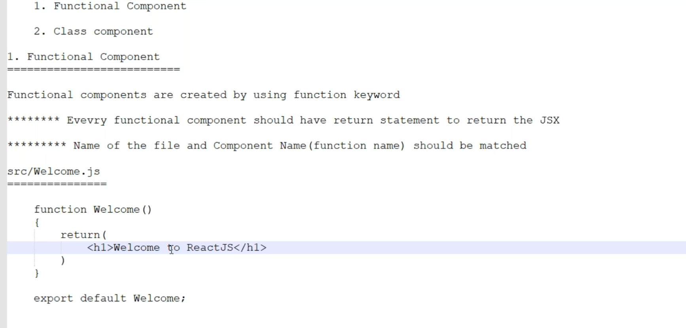
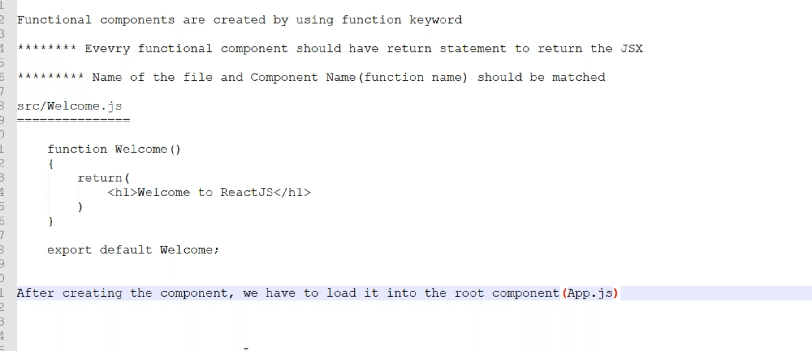
 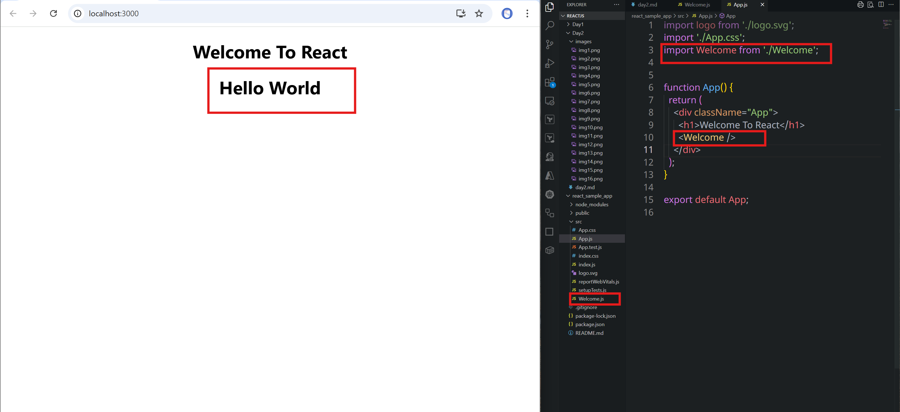
 
# Chatgpt version 
---

## 📁 React Project Folder Structure

```
React11am/
├── node_modules/
├── public/
│   └── index.html
├── src/
│   └── App.js
├── package.json
```

### 📂 `node_modules/`

* Contains all core Node.js and React modules.
* Third-party modules installed via `npm` are saved here.

### 📂 `public/`

* The entry point of the project.
* Contains `index.html`, which is the **root HTML file**.
* All React components will ultimately render inside this HTML.

### 📂 `src/`

* This is the main development folder.
* All custom components (JS files) should be placed here.
* Do **not** create React files outside this folder.

### 📄 `package.json`

* Keeps track of all dependencies and metadata.
* Lists all installed modules for the project.

---

## 🚀 Running the React Project

```bash
# Open CMD in your project directory and run:
npm start
```

* This runs your React project on `http://localhost:3000`
* Default **Node server port**: `3000`

---

## 📄 `App.js` - The Root Component

```jsx
import './App.css';

function App() {
  return (
    <div className="App">
      <h1>Welcome to React</h1>
    </div>
  );
}

export default App;
```

* Located in `src/`
* **App.js** is considered the **root component** of your project.
* JSX code (HTML-like syntax) is returned in `return()`.

---

## ⚙️ `index.js` - Rendering App Component

```jsx
import React from 'react';
import ReactDOM from 'react-dom/client';
import './index.css';
import App from './App';
import reportWebVitals from './reportWebVitals';

const root = ReactDOM.createRoot(document.getElementById('root'));
root.render(
  <React.StrictMode>
    <App />
  </React.StrictMode>
);

reportWebVitals();
```

* This file renders the `App` component inside `index.html` using:

  ```html
  <div id="root"></div>
  ```
* ReactDOM creates a **virtual DOM** and mounts your component inside this `div`.

---

## 🧱 What is a Component?

> A **component** is a reusable piece of UI logic.

* Every `.js` file in `src/` can be a **React component**.
* Each component performs one **task/function/activity**.
* Example components:

  * `EditEmployee.js`
  * `DeleteEmployee.js`
  * `UpdateEmployee.js`

---

## 📌 Component Rules

* Every component must be inside the `src/` folder.
* Component file name and function name must start with a **Capital Letter**.
* Every component must **return JSX**.
* Every component must be **exported** to be reused.

---

## 🧩 Types of Components

1. **Functional Component** ✅ *(Mostly used today)*
2. **Class Component** ❌ *(Old method, less common now)*

---

## ✅ Functional Component - Example

### 📄 `src/Welcome.js`

```jsx
function Welcome() {
  return (
    <h1>Welcome to ReactJS</h1>
  );
}

export default Welcome;
```

---

## 📥 Using Functional Component Inside App

### 📄 `App.js`

```jsx
import './App.css';
import Welcome from './Welcome';

function App() {
  return (
    <div className="App">
      <h1>Welcome To React</h1>
      <Welcome />
    </div>
  );
}

export default App;
```

---


