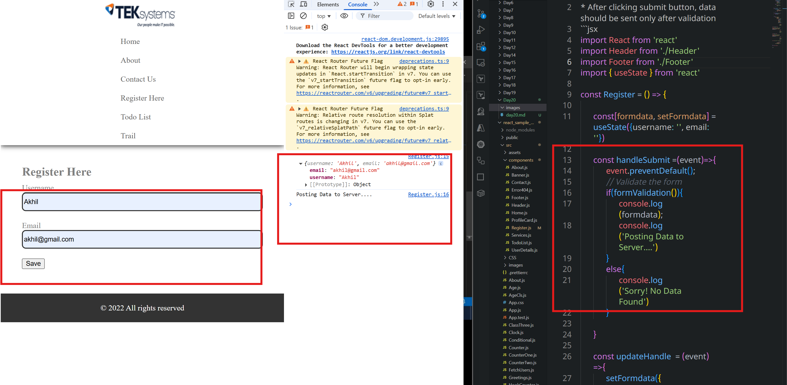

# Validation of Form
* After clicking submit button, data should be sent only after validation
```jsx
import React from 'react'
import Header from './Header'
import Footer from './Footer'
import { useState } from 'react'

const Register = () => {

      const[formdata, setFormdata] = useState({username: '', email: ''})

      const handleSubmit =(event)=>{
            event.preventDefault();
            // Validate the form
            if(formValidation()){
                  console.log(formdata);
                  console.log('Posting Data to Server....')
            }
            else{
                  console.log('Sorry! No Data Found')
            }

      }

      const updateHandle  = (event) =>{
            setFormdata({
                  ...formdata,
                  [event.target.name]: event.target.value
            })
      }

      const formValidation = () =>{
            let valid = false;
            return valid
      }


      return (
            <React.Fragment>
                  <Header />
                  <section className='content'>
                        <h1>Register Here</h1>
                        <form method='POST' action='' onSubmit={handleSubmit}>

                              <div className='formgroup'>
                                    <label>Username</label>
                                    <input type='text' name='username' className='formcontrol' value={formdata.username} onChange={updateHandle} />
                              </div>

                              <div className='formgroup'>
                                    <label>Email</label>
                                    <input type='text' name='email' className='formcontrol' value={formdata.email} onChange={updateHandle} />
                              </div>

                              <div className='formgroup'>
                                    <input type='submit' value='Save' />
                              </div>

                        </form>
                  </section>
                  <Footer></Footer>
            </React.Fragment>
      )
}

export default Register
```

```jsx
import React from 'react'
import Header from './Header'
import Footer from './Footer'
import { useState } from 'react'

const Register = () => {

      const[formdata, setFormdata] = useState({username: '', email: ''})
      const[formErrors, setFormErrors] = useState({username: '', email: ''})

      const handleSubmit =(event)=>{
            event.preventDefault();
            // Validate the form
            if(formValidation()){
                  console.log(formdata);
                  console.log('Posting Data to Server....')
            }
            else{
                  console.log('Sorry! No Data Found')
            }

      }

      const updateHandle  = (event) =>{
            setFormdata({
                  ...formdata,
                  [event.target.name]: event.target.value
            })
      }

      const formValidation = () =>{
            let valid = true;
            let errors ={}

            if(formdata.username === ''){
                  valid = false;
                  errors.username = 'Username is required';
            }
            if(formdata.email === ''){
                  valid = false;
                  errors.email= 'Email is Required'
            }

            setFormErrors(errors)
            return valid;

      }


      return (
            <React.Fragment>
                  <Header />
                  <section className='content'>
                        <h1>Register Here</h1>
                        <form method='POST' action='' onSubmit={handleSubmit}>

                              <div className='formgroup'>
                                    <label>Username</label>
                                    <input type='text' name='username' className='formcontrol' value={formdata.username} onChange={updateHandle} />
                                    {formErrors.username ? <span className='error'>{formErrors.username}</span> : null}                                    
                              </div>

                              <div className='formgroup'>
                                    <label>Email</label>
                                    <input type='text' name='email' className='formcontrol' value={formdata.email} onChange={updateHandle} />
                                    { formErrors.email ? <span className='error'>{formErrors.email}</span>:null}
                              </div>

                              <div className='formgroup'>
                                    <input type='submit' value='Save' />
                              </div>

                        </form>
                  </section>
                  <Footer></Footer>
            </React.Fragment>
      )
}

export default Register
```
## Check wether email is valid or not
```jsx
import React from 'react'
import Header from './Header'
import Footer from './Footer'
import { useState } from 'react'

const Register = () => {

      const[formdata, setFormdata] = useState({username: '', email: ''})
      const[formErrors, setFormErrors] = useState({username: '', email: ''})

      const handleSubmit =(event)=>{
            event.preventDefault();
            // Validate the form
            if(formValidation()){
                  console.log(formdata);
                  console.log('Posting Data to Server....')
            }
            else{
                  console.log('Sorry! No Data Found')
            }

      }

      const updateHandle  = (event) =>{
            setFormdata({
                  ...formdata,
                  [event.target.name]: event.target.value
            })
      }

      const isValidEmail = (email) =>{
            let isValid = true;
            var filter = /^(([^<>()[\]\\.,;:\s@"]+(\.[^<>()[\]\\.,;:\s@"]+)*)|(".+"))@((\[[0-9]{1,3}\.[0-9]{1,3}\.[0-9]{1,3}\.[0-9]{1,3}])|(([a-zA-Z\-0-9]+\.)+[a-zA-Z]{2,}))$/;
            if(!filter.test(email)){
                  isValid = false;                  
            }
            return isValid
      }

      const formValidation = () =>{
            let valid = true;
            let errors ={}

            if(formdata.username === ''){
                  valid = false;
                  errors.username = 'Username is Required';
            }
            if(formdata.email === ''){
                  valid = false;
                  errors.email= 'Email is Required'
            }
            else{
                  valid = true;
                  if(!isValidEmail(formdata.email)){
                        valid = false;
                        errors.email= 'Enter Valid Email'
                  }                  
            }
            setFormErrors(errors)
            return valid;
      }

      return (
            <React.Fragment>
                  <Header />
                  <section className='content'>
                        <h1>Register Here</h1>
                        <form method='POST' action='' onSubmit={handleSubmit}>

                              <div className='formgroup'>
                                    <label>Username</label>
                                    <input type='text' name='username' className='formcontrol' value={formdata.username} onChange={updateHandle} />
                                    {formErrors.username ? <span className='error'>{formErrors.username}</span> : null}                                    
                              </div>

                              <div className='formgroup'>
                                    <label>Email</label>
                                    <input type='text' name='email' className='formcontrol' value={formdata.email} onChange={updateHandle} />
                                    { formErrors.email ? <span className='error'>{formErrors.email}</span>:null}
                              </div>

                              <div className='formgroup'>
                                    <input type='submit' value='Save' />
                              </div>

                        </form>
                  </section>
                  <Footer></Footer>
            </React.Fragment>
      )
}

export default Register
```
## Sending data to the server on submit click, through axios
## install XAMPP in the windows
## start apache server in the laptop

### save users.php in C:\xampp\htdocs\reactAPI\users.php location.
```php
<?php
// Allow CORS (for development only)
header("Access-Control-Allow-Origin: *");
header("Access-Control-Allow-Headers: Content-Type");
header("Access-Control-Allow-Methods: POST");

// Set content type to JSON
header("Content-Type: application/json");

// Get the POSTed JSON data
$data = json_decode(file_get_contents("php://input"), true);

// Basic validation
if (isset($data['username']) && isset($data['useremail'])) {
    $username = $data['username'];
    $useremail = $data['useremail'];

    // Simulate storing to DB, etc.
    // You can add your MySQL logic here

    echo json_encode([
        "status" => "success",
        "message" => "User data received successfully",
        "username" => $username,
        "useremail" => $useremail
    ]);
} else {
    echo json_encode([
        "status" => "error",
        "message" => "Invalid data"
    ]);
}
?>

```

```jsx
import React from 'react'
import Header from './Header'
import Footer from './Footer'
import { useState } from 'react'
import axios from 'axios';


const Register = () => {

      const[formdata, setFormdata] = useState({username: '', email: ''})
      const[formErrors, setFormErrors] = useState({username: '', email: ''})

      const handleSubmit =(event)=>{
            event.preventDefault();
            // Validate the form
            if(formValidation()){
            console.log(formdata)
            let data={username: formdata.username, email: formdata.email}
            axios.post('http://localhost/reactAPI/users.php', JSON.stringify(data), {
                  headers: {
                        'Content-Type': 'application/json'
                  }
            }).then(res =>{
                        let info = res.data
                        console.log(info)
                        console.log(info.message)
                  }).catch(err =>{
                        console.log(err.message)
                  })
            
            }
            else{
                  console.log('Sorry! No Data Found');
            }
      }

      const updateHandle  = (event) =>{
            setFormdata({
                  ...formdata,
                  [event.target.name]: event.target.value
            })
      }

      const isValidEmail = (email) =>{
            let isValid = true;
            var filter = /^(([^<>()[\]\\.,;:\s@"]+(\.[^<>()[\]\\.,;:\s@"]+)*)|(".+"))@((\[[0-9]{1,3}\.[0-9]{1,3}\.[0-9]{1,3}\.[0-9]{1,3}])|(([a-zA-Z\-0-9]+\.)+[a-zA-Z]{2,}))$/;
            if(!filter.test(email)){
                  isValid = false;                  
            }
            return isValid
      }

      const formValidation = () =>{
            let valid = true;
            let errors ={}

            if(formdata.username === ''){
                  valid = false;
                  errors.username = 'Username is Required';
            }
            if(formdata.email === ''){
                  valid = false;
                  errors.email= 'Email is Required'
            }
            else{
                  valid = true;
                  if(!isValidEmail(formdata.email)){
                        valid = false;
                        errors.email= 'Enter Valid Email'
                  }                  
            }
            setFormErrors(errors)
            return valid;
      }

      return (
            <React.Fragment>
                  <Header />
                  <section className='content'>
                        <h1>Register Here</h1>
                        <form method='POST' action='' onSubmit={handleSubmit}>

                              <div className='formgroup'>
                                    <label>Username</label>
                                    <input type='text' name='username' className='formcontrol' value={formdata.username} onChange={updateHandle} />
                                    {formErrors.username ? <span className='error'>{formErrors.username}</span> : null}                                    
                              </div>

                              <div className='formgroup'>
                                    <label>Email</label>
                                    <input type='text' name='email' className='formcontrol' value={formdata.email} onChange={updateHandle} />
                                    { formErrors.email ? <span className='error'>{formErrors.email}</span>:null}
                              </div>

                              <div className='formgroup'>
                                    <input type='submit' value='Save' />
                              </div>

                        </form>
                  </section>
                  <Footer></Footer>
            </React.Fragment>
      )
}

export default Register
```
```jsx
import React from 'react'
import Header from './Header'
import Footer from './Footer'
import { useState } from 'react'
import axios from 'axios';


const Register = () => {

      const[formdata, setFormdata] = useState({username: '', email: ''})
      const[formErrors, setFormErrors] = useState({username: '', email: ''})

      const handleSubmit =(event)=>{
            event.preventDefault();
            // Validate the form
            if(formValidation()){
            console.log(formdata)
            let data={username: formdata.username, email: formdata.email}
            axios.post('http://localhost/reactAPI/users.php', JSON.stringify(data), {
                  headers: {
                        'Content-Type': 'application/json'
                  }
            }).then(res =>{
                        let info = res.data
                        console.log(info)
                        console.log(info.message)
                  }).catch(err =>{
                        console.log(err.message)
                  })
            
            }
            else{
                  console.log('Sorry! No Data Found');
            }
      }

      const updateHandle  = (event) =>{
            setFormdata({
                  ...formdata,
                  [event.target.name]: event.target.value
            })
      }

      const isValidEmail = (email) =>{
            let isValid = true;
            var filter = /^(([^<>()[\]\\.,;:\s@"]+(\.[^<>()[\]\\.,;:\s@"]+)*)|(".+"))@((\[[0-9]{1,3}\.[0-9]{1,3}\.[0-9]{1,3}\.[0-9]{1,3}])|(([a-zA-Z\-0-9]+\.)+[a-zA-Z]{2,}))$/;
            if(!filter.test(email)){
                  isValid = false;                  
            }
            return isValid
      }

      const formValidation = () =>{
            let valid = true;
            let errors ={}

            if(formdata.username === ''){
                  valid = false;
                  errors.username = 'Username is Required';
            }
            if(formdata.email === ''){
                  valid = false;
                  errors.email= 'Email is Required'
            }
            else{
                  valid = true;
                  if(!isValidEmail(formdata.email)){
                        valid = false;
                        errors.email= 'Enter Valid Email'
                  }                  
            }
            setFormErrors(errors)
            return valid;
      }

      return (
            <React.Fragment>
                  <Header />
                  <section className='content'>
                        <h1>Register Here</h1>
                        <form method='POST' action='' onSubmit={handleSubmit}>

                              <div className='formgroup'>
                                    <label>Username</label>
                                    <input type='text' name='username' className='formcontrol' value={formdata.username} onChange={updateHandle} />
                                    {formErrors.username ? <span className='error'>{formErrors.username}</span> : null}                                    
                              </div>

                              <div className='formgroup'>
                                    <label>Email</label>
                                    <input type='text' name='email' className='formcontrol' value={formdata.email} onChange={updateHandle} />
                                    { formErrors.email ? <span className='error'>{formErrors.email}</span>:null}
                              </div>

                              <div className='formgroup'>
                                    <input type='submit' value='Save' />
                              </div>

                        </form>
                  </section>
                  <Footer></Footer>
            </React.Fragment>
      )
}

export default Register

```

```jsx
import React from 'react'
import Header from './Header'
import Footer from './Footer'
import { useState } from 'react'
import axios from 'axios';


const Register = () => {

      const[formdata, setFormdata] = useState({username: '', email: ''})
      const[formErrors, setFormErrors] = useState({username: '', email: ''})

      const handleSubmit =(event)=>{
            event.preventDefault();
            // Validate the form
            if(formValidation()){
            console.log(formdata)
            let data={username: formdata.username, email: formdata.email}
            axios.post('http://localhost/reactAPI/users.php', JSON.stringify(data), {
                  headers: {
                        'Content-Type': 'application/json'
                  }
            }).then(res =>{
                        let info = res.data
                        console.log(info)
                        console.log(info.message)
                        setFormdata({username: '', email: ''})
                  }).catch(err =>{
                        console.log(err.message)
                  })
            
            }
            else{
                  console.log('Sorry! No Data Found');
            }
      }

      const updateHandle  = (event) =>{
            setFormdata({
                  ...formdata,
                  [event.target.name]: event.target.value
            })
      }

      const isValidEmail = (email) =>{
            let isValid = true;
            var filter = /^(([^<>()[\]\\.,;:\s@"]+(\.[^<>()[\]\\.,;:\s@"]+)*)|(".+"))@((\[[0-9]{1,3}\.[0-9]{1,3}\.[0-9]{1,3}\.[0-9]{1,3}])|(([a-zA-Z\-0-9]+\.)+[a-zA-Z]{2,}))$/;
            if(!filter.test(email)){
                  isValid = false;                  
            }
            return isValid
      }

      const formValidation = () =>{
            let valid = true;
            let errors ={}

            if(formdata.username === ''){
                  valid = false;
                  errors.username = 'Username is Required';
            }
            if(formdata.email === ''){
                  valid = false;
                  errors.email= 'Email is Required'
            }
            else{
                  valid = true;
                  if(!isValidEmail(formdata.email)){
                        valid = false;
                        errors.email= 'Enter Valid Email'
                  }                  
            }
            setFormErrors(errors)
            return valid;
      }

      const checkField = (event) =>{
            console.log(event.target.name)
            console.log(event.target.value)
      }

      return (
            <React.Fragment>
                  <Header />
                  <section className='content'>
                        <h1>Register Here</h1>
                        <form method='POST' action='' onSubmit={handleSubmit} autoComplete='off'>

                              <div className='formgroup'>
                                    <label>Username</label>
                                    <input onFocus={checkField} type='text' name='username' className='formcontrol' value={formdata.username} onChange={updateHandle} />
                                    {formErrors.username ? <span className='error'>{formErrors.username}</span> : null}                                    
                              </div>

                              <div className='formgroup'>
                                    <label>Email</label>
                                    <input type='text' name='email' className='formcontrol' value={formdata.email} onChange={updateHandle} />
                                    { formErrors.email ? <span className='error'>{formErrors.email}</span>:null}
                              </div>

                              <div className='formgroup'>
                                    <input type='submit' value='Save' />
                              </div>

                        </form>
                  </section>
                  <Footer></Footer>
            </React.Fragment>
      )
}

export default Register

```


```jsx
import React from 'react'
import Header from './Header'
import Footer from './Footer'
import { useState } from 'react'
import axios from 'axios';


const Register = () => {

      const[formdata, setFormdata] = useState({username: '', email: ''})
      const[formErrors, setFormErrors] = useState({username: '', email: ''})

      const handleSubmit =(event)=>{
            event.preventDefault();
            // Validate the form
            if(formValidation()){
            console.log(formdata)
            let data={username: formdata.username, email: formdata.email}
            axios.post('http://localhost/reactAPI/users.php', JSON.stringify(data), {
                  headers: {
                        'Content-Type': 'application/json'
                  }
            }).then(res =>{
                        let info = res.data
                        console.log(info)
                        console.log(info.message)
                        setFormdata({username: '', email: ''})
                  }).catch(err =>{
                        console.log(err.message)
                  })
            
            }
            else{
                  console.log('Sorry! No Data Found');
            }
      }

      const updateHandle  = (event) =>{
            setFormdata({
                  ...formdata,
                  [event.target.name]: event.target.value
            })
      }

      const isValidEmail = (email) =>{
            let isValid = true;
            var filter = /^(([^<>()[\]\\.,;:\s@"]+(\.[^<>()[\]\\.,;:\s@"]+)*)|(".+"))@((\[[0-9]{1,3}\.[0-9]{1,3}\.[0-9]{1,3}\.[0-9]{1,3}])|(([a-zA-Z\-0-9]+\.)+[a-zA-Z]{2,}))$/;
            if(!filter.test(email)){
                  isValid = false;                  
            }
            return isValid
      }

      const formValidation = () =>{
            let valid = true;
            let errors ={}

            if(formdata.username === ''){
                  valid = false;
                  errors.username = 'Username is Required';
            }
            if(formdata.email === ''){
                  valid = false;
                  errors.email= 'Email is Required'
            }
            else{
                  valid = true;
                  if(!isValidEmail(formdata.email)){
                        valid = false;
                        errors.email= 'Enter Valid Email'
                  }                  
            }
            setFormErrors(errors)
            return valid;
      }

      const checkField = (event) =>{
            let formErrors = {};
            if(event.target.value === ''){
                  formErrors[event.target.name] = '';
            };
            setFormErrors(formErrors);
      }

      return (
            <React.Fragment>
                  <Header />
                  <section className='content'>
                        <h1>Register Here</h1>
                        <form method='POST' action='' onSubmit={handleSubmit} autoComplete='off'>

                              <div className='formgroup'>
                                    <label>Username</label>
                                    <input onFocus={checkField} type='text' name='username' className='formcontrol' value={formdata.username} onChange={updateHandle} />
                                    {formErrors.username ? <span className='error'>{formErrors.username}</span> : null}                                    
                              </div>

                              <div className='formgroup'>
                                    <label>Email</label>
                                    <input type='text' name='email' className='formcontrol' value={formdata.email} onChange={updateHandle} />
                                    { formErrors.email ? <span className='error'>{formErrors.email}</span>:null}
                              </div>

                              <div className='formgroup'>
                                    <input type='submit' value='Save' />
                              </div>

                        </form>
                  </section>
                  <Footer></Footer>
            </React.Fragment>
      )
}

export default Register

```
```jsx

import React from 'react'
import Header from './Header'
import Footer from './Footer'
import { useState } from 'react'
import axios from 'axios';

const Register = () => {

      const[formdata, setFormdata] = useState({username: '', email: ''})
      const[formErrors, setFormErrors] = useState({username: '', email: ''})

      const handleSubmit =(event)=>{
            event.preventDefault();
            // Validate the form
            if(formValidation()){
            console.log(formdata)
            let data={username: formdata.username, email: formdata.email}
            axios.post('http://localhost/reactAPI/users.php', JSON.stringify(data), {
                  headers: {
                        'Content-Type': 'application/json'
                  }
            }).then(res =>{
                        let info = res.data
                        console.log(info)
                        console.log(info.message)
                        setFormdata({username: '', email: ''})
                  }).catch(err =>{
                        console.log(err.message)
                  })
            
            }
            else{
                  console.log('Sorry! No Data Found');
            }
      }

      const updateHandle  = (event) =>{
            setFormdata({
                  ...formdata,
                  [event.target.name]: event.target.value
            })
      }

      const isValidEmail = (email) =>{
            let isValid = true;
            var filter = /^(([^<>()[\]\\.,;:\s@"]+(\.[^<>()[\]\\.,;:\s@"]+)*)|(".+"))@((\[[0-9]{1,3}\.[0-9]{1,3}\.[0-9]{1,3}\.[0-9]{1,3}])|(([a-zA-Z\-0-9]+\.)+[a-zA-Z]{2,}))$/;
            if(!filter.test(email)){
                  isValid = false;                  
            }
            return isValid
      }

      const formValidation = () =>{
            let valid = true;
            let errors ={}

            if(formdata.username === ''){
                  valid = false;
                  errors.username = 'Username is Required';
            }
            if(formdata.email === ''){
                  valid = false;
                  errors.email= 'Email is Required'
            }
            else{
                  valid = true;
                  if(!isValidEmail(formdata.email)){
                        valid = false;
                        errors.email= 'Enter Valid Email'
                  }                  
            }
            setFormErrors(errors)
            return valid;
      }

      const checkField = (event) =>{
            if(event.target.value === ''){
 
                  setFormErrors({
                        ...formErrors,
                        [event.target.name] : ''
                  })
            };
          
      }

      return (
            <React.Fragment>
                  <Header />
                  <section className='content'>
                        <h1>Register Here</h1>
                        <form method='POST' action='' onSubmit={handleSubmit} autoComplete='off'>

                              <div className='formgroup'>
                                    <label>Username</label>
                                    <input onFocus={checkField} type='text' name='username' className='formcontrol' value={formdata.username} onChange={updateHandle} />
                                    {formErrors.username ? <span className='error'>{formErrors.username}</span> : null}                                    
                              </div>

                              <div className='formgroup'>
                                    <label>Email</label>
                                    <input type='text' onFocus={checkField} name='email' className='formcontrol' value={formdata.email} onChange={updateHandle} />
                                    { formErrors.email ? <span className='error'>{formErrors.email}</span>:null}
                              </div>

                              <div className='formgroup'>
                                    <input type='submit' value='Save' />
                              </div>

                        </form>
                  </section>
                  <Footer></Footer>
            </React.Fragment>
      )
}

export default Register
```
