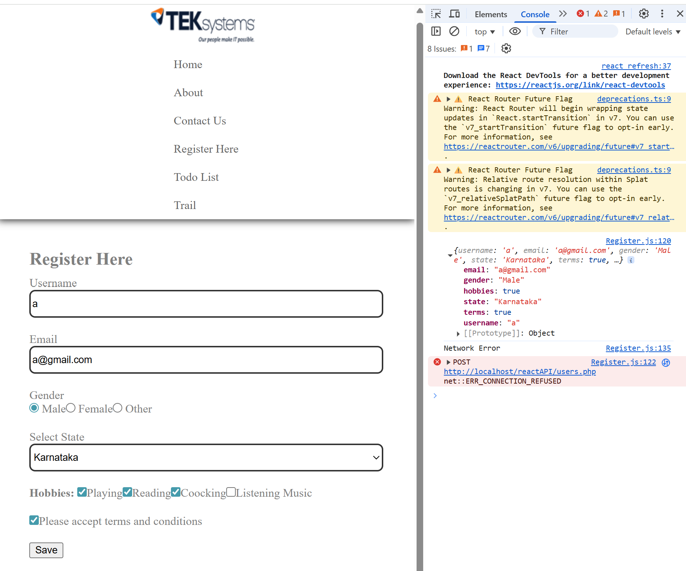

# Check Boxes
```jsx
import React from 'react';
import Header from './Header';
import Footer from './Footer';
import { useState } from 'react';
import axios from 'axios';

const Register = () => {
      const [formdata, setFormdata] = useState({
            username: '',
            email: '',
            gender: ''
      });

      const [formErrors, setFormErrors] = useState({
            username: '',
            email: '',
            gender: ''
      });

      const [touched, setTouched] = useState({
            username: false,
            email: false,
            gender: false
      });

      const updateHandle = (event) => {
            setFormdata({
                  ...formdata,
                  [event.target.name]: event.target.value
            });
      };

      const handleFocus = (event) => {
            const { name } = event.target;
            setFormErrors({
                  ...formErrors,
                  [name]: ''
            });
      };

      const isValidEmail = (email) => {
            var filter = /^(([^<>()[\]\\.,;:\s@"]+(\.[^<>()[\]\\.,;:\s@"]+)*)|(".+"))@((\[[0-9]{1,3}\.[0-9]{1,3}\.[0-9]{1,3}\.[0-9]{1,3}])|(([a-zA-Z\-0-9]+\.)+[a-zA-Z]{2,}))$/;
            return filter.test(email);
      };

      const handleBlur = (event) => {
            const { name, value } = event.target;

            setTouched({
                  ...touched,
                  [name]: true
            });

            let errorMsg = '';
            if (value.trim() === '') {
                  errorMsg = `${name.charAt(0).toUpperCase() + name.slice(1)} is Required`;
            } else if (name === 'email' && !isValidEmail(value)) {
                  errorMsg = 'Enter Valid Email';
            }

            setFormErrors({
                  ...formErrors,
                  [name]: errorMsg
            });
      };

      const formValidation = () => {
            let valid = true;
            let errors = {};

            if (formdata.username.trim() === '') {
                  valid = false;
                  errors.username = 'Username is Required';
            }

            if (formdata.email.trim() === '') {
                  valid = false;
                  errors.email = 'Email is Required';
            } else if (!isValidEmail(formdata.email)) {
                  valid = false;
                  errors.email = 'Enter Valid Email';
            }

            if (formdata.gender.trim() === '') {
                  valid = false;
                  errors.gender = 'Gender is Required';
            }

            setFormErrors(errors);
            setTouched({ username: true, email: true, gender: true });
            return valid;
      };

      const handleSubmit = (event) => {
            event.preventDefault();

            if (formValidation()) {
                  axios.post('http://localhost/reactAPI/users.php', JSON.stringify(formdata), {
                        headers: {
                              'Content-Type': 'application/json'
                        }
                  })
                        .then(res => {
                              console.log(res.data.message);
                              console.log(res.data)
                              setFormdata({ username: '', email: '', gender: '' });
                              setFormErrors({ username: '', email: '', gender: '' });
                              setTouched({ username: false, email: false, gender: false });
                        })
                        .catch(err => {
                              console.log(err.message);
                        });
            } else {
                  console.log('Sorry! No Data Found');
            }
      };

      return (
            <React.Fragment>
                  <Header />
                  <section className='content'>
                        <h1>Register Here</h1>
                        <form method='POST' onSubmit={handleSubmit} autoComplete='off'>

                              <div className='formgroup'>
                                    <label>Username</label>
                                    <input
                                          type='text'
                                          name='username'
                                          className='formcontrol'
                                          value={formdata.username}
                                          onChange={updateHandle}
                                          onBlur={handleBlur}
                                          onFocus={handleFocus}
                                    />
                                    {touched.username && formErrors.username && <span className='error'>{formErrors.username}</span>}
                              </div>

                              <div className='formgroup'>
                                    <label>Email</label>
                                    <input
                                          type='text'
                                          name='email'
                                          className='formcontrol'
                                          value={formdata.email}
                                          onChange={updateHandle}
                                          onBlur={handleBlur}
                                          onFocus={handleFocus}
                                    />
                                    {touched.email && formErrors.email && <span className='error'>{formErrors.email}</span>}
                              </div>

                              <div className='formgroup'>
                                    <label>Gender</label><br />
                                    {['Male', 'Female', 'Other'].map((g) => (
                                          <label key={g}>
                                                <input
                                                      type='radio'
                                                      name='gender'
                                                      value={g}
                                                      checked={formdata.gender === g}
                                                      onChange={updateHandle}
                                                      onBlur={handleBlur}
                                                      onFocus={handleFocus}
                                                /> {g}
                                          </label>
                                    ))}
                                    <br />
                                    {touched.gender && formErrors.gender && <span className='error'>{formErrors.gender}</span>}
                              </div>

                              <div className='formgroup'>
                                    <input type='submit' value='Save' />
                              </div>
                              
                        </form>
                  </section>
                  <Footer />
            </React.Fragment>
      );
};

export default Register;

```

```jsx
import React from 'react';
import Header from './Header';
import Footer from './Footer';
import { useState } from 'react';
import axios from 'axios';


const Register = () => {
      const [formdata, setFormdata] = useState({
            username: '',
            email: '',
            gender: '',
            state: '',
            terms: false
      });

      const [formErrors, setFormErrors] = useState({
            username: '',
            email: '',
            gender: '',
            state:''
      });

      const [touched, setTouched] = useState({
            username: false,
            email: false,
            gender: false,
            state: false
      });

      const updateHandle = (event) => {
            setFormdata({
                  ...formdata,
                  [event.target.name]: event.target.value
            });
      };

      const handleFocus = (event) => {
            const { name } = event.target;
            setFormErrors({
                  ...formErrors,
                  [name]: ''
            });
      };

      const isValidEmail = (email) => {
            var filter = /^(([^<>()[\]\\.,;:\s@"]+(\.[^<>()[\]\\.,;:\s@"]+)*)|(".+"))@((\[[0-9]{1,3}\.[0-9]{1,3}\.[0-9]{1,3}\.[0-9]{1,3}])|(([a-zA-Z\-0-9]+\.)+[a-zA-Z]{2,}))$/;
            return filter.test(email);
      };

      const handleBlur = (event) => {
            const { name, value } = event.target;

            setTouched({
                  ...touched,
                  [name]: true
            });

            let errorMsg = '';
            if (value.trim() === '') {
                  errorMsg = `${name.charAt(0).toUpperCase() + name.slice(1)} is Required`;
            } else if (name === 'email' && !isValidEmail(value)) {
                  errorMsg = 'Enter Valid Email';
            }

            setFormErrors({
                  ...formErrors,
                  [name]: errorMsg
            });
      };

      const formValidation = () => {
            let valid = true;
            let errors = {};

            if (formdata.username.trim() === '') {
                  valid = false;
                  errors.username = 'Username is Required';
            }

            if (formdata.email.trim() === '') {
                  valid = false;
                  errors.email = 'Email is Required';
            } else if (!isValidEmail(formdata.email)) {
                  valid = false;
                  errors.email = 'Enter Valid Email';
            }

            if (formdata.gender.trim() === '') {
                  valid = false;
                  errors.gender = 'Gender is Required';
            }

            if (formdata.state.trim() === '') {
                  valid = false;
                  errors.state = 'State is Required';
            }

            setFormErrors(errors);
            setTouched({ username: true, email: true, gender: true, state: true });
            return valid;
      };

      const handleSubmit = (event) => {
            event.preventDefault();
            if (formValidation()) {
                  axios.post('http://localhost/reactAPI/users.php', JSON.stringify(formdata), {
                        headers: {
                              'Content-Type': 'application/json'
                        }
                  })
                        .then(res => {
                              console.log(res.data.message);
                              console.log(res.data)
                              setFormdata({ username: '', email: '', gender: '', state: ''});
                              setFormErrors({ username: '', email: '', gender: '', state: '' });
                              setTouched({ username: false, email: false, gender: false, state: false });
                        })
                        .catch(err => {
                              console.log(err.message);
                        });
            } else {
                  console.log('Sorry! No Data Found');
            }
      };

      return (
            <React.Fragment>
                  <Header />
                  <section className='content'>
                        <h1>Register Here</h1>
                        <form method='POST' onSubmit={handleSubmit} autoComplete='off'>

                              <div className='formgroup'>
                                    <label>Username</label>
                                    <input
                                          type='text'
                                          name='username'
                                          className='formcontrol'
                                          value={formdata.username}
                                          onChange={updateHandle}
                                          onBlur={handleBlur}
                                          onFocus={handleFocus}
                                    />
                                    {touched.username && formErrors.username && <span className='error'>{formErrors.username}</span>}
                              </div>

                              <div className='formgroup'>
                                    <label>Email</label>
                                    <input
                                          type='text'
                                          name='email'
                                          className='formcontrol'
                                          value={formdata.email}
                                          onChange={updateHandle}
                                          onBlur={handleBlur}
                                          onFocus={handleFocus}
                                    />
                                    {touched.email && formErrors.email && <span className='error'>{formErrors.email}</span>}
                              </div>

                              <div className='formgroup'>
                                    <label>Gender</label><br />
                                    {['Male', 'Female', 'Other'].map((g) => (
                                          <label key={g}>
                                                <input
                                                      type='radio'
                                                      name='gender'
                                                      value={g}
                                                      checked={formdata.gender === g}
                                                      onChange={updateHandle}
                                                      onBlur={handleBlur}
                                                      onFocus={handleFocus}
                                                /> {g}
                                          </label>
                                    ))}
                                    <br />
                                    {touched.gender && formErrors.gender && <span className='error'>{formErrors.gender}</span>}
                              </div>

                              <div className='formgroup'>
                                    <label>Select State</label>
                                    <select name='state'  value= {formdata.state} onFocus={handleFocus} onBlur={handleBlur} className='formcontrol' onChange={updateHandle}>
                                          <option value=''>--Select State--</option>
                                          <option value='Karnataka'>Karnataka</option>
                                          <option value='Telangana'>Telangana</option>
                                          <option value='Andhra Pradesh'>Andhra Pradesh</option>
                                    </select>
                                    <br />
                                    {touched.state && formErrors.state && <span className='error'>{formErrors.state}</span>}
                              </div>

                              <div className='formgroup'>
                                    <label><input type='checkbox' value={formdata.terms} onChange={updateHandle}/>Please accept terms and conditions</label>
                              </div>

                              <div className='formgroup'>
                                    <input type='submit' value='Save' />
                              </div>
                              
                        </form>
                  </section>
                  <Footer />
            </React.Fragment>
      );
};

export default Register;
```
```jsx
import React from 'react';
import Header from './Header';
import Footer from './Footer';
import { useState } from 'react';
import axios from 'axios';


const Register = () => {
      const [formdata, setFormdata] = useState({
            username: '',
            email: '',
            gender: '',
            state: '',
            terms: false
      });

      const [formErrors, setFormErrors] = useState({
            username: '',
            email: '',
            gender: '',
            state:''
      });

      const [touched, setTouched] = useState({
            username: false,
            email: false,
            gender: false,
            state: false
      });

      const updateHandle = (event) => {
            if(event.target.type === 'checkbox'){
                  setFormdata({
                        ...formdata,
                        [event.target.name]: event.target.checked ? true : false
                  })
            }
            else{
                  setFormdata({
                        ...formdata,
                        [event.target.name]: event.target.value
                  });
            }
      };

      const handleFocus = (event) => {
            const { name } = event.target;
            setFormErrors({
                  ...formErrors,
                  [name]: ''
            });
      };

      const isValidEmail = (email) => {
            var filter = /^(([^<>()[\]\\.,;:\s@"]+(\.[^<>()[\]\\.,;:\s@"]+)*)|(".+"))@((\[[0-9]{1,3}\.[0-9]{1,3}\.[0-9]{1,3}\.[0-9]{1,3}])|(([a-zA-Z\-0-9]+\.)+[a-zA-Z]{2,}))$/;
            return filter.test(email);
      };

      const handleBlur = (event) => {
            const { name, value } = event.target;

            setTouched({
                  ...touched,
                  [name]: true
            });

            let errorMsg = '';
            if (value.trim() === '') {
                  errorMsg = `${name.charAt(0).toUpperCase() + name.slice(1)} is Required`;
            } else if (name === 'email' && !isValidEmail(value)) {
                  errorMsg = 'Enter Valid Email';
            }

            setFormErrors({
                  ...formErrors,
                  [name]: errorMsg
            });
      };

      const formValidation = () => {
            let valid = true;
            let errors = {};

            if (formdata.username.trim() === '') {
                  valid = false;
                  errors.username = 'Username is Required';
            }

            if (formdata.email.trim() === '') {
                  valid = false;
                  errors.email = 'Email is Required';
            } else if (!isValidEmail(formdata.email)) {
                  valid = false;
                  errors.email = 'Enter Valid Email';
            }

            if (formdata.gender.trim() === '') {
                  valid = false;
                  errors.gender = 'Gender is Required';
            }

            if (formdata.state.trim() === '') {
                  valid = false;
                  errors.state = 'State is Required';
            }

            
            if (formdata.terms === false) {
                  valid = false;
                  alert('Please accept terms and conditions')
            }
            setFormErrors(errors);
            setTouched({ username: true, email: true, gender: true, state: true });
            return valid;
      };

      const handleSubmit = (event) => {
            event.preventDefault();
            console.log(formdata)
            if (formValidation()) {
                  axios.post('http://localhost/reactAPI/users.php', JSON.stringify(formdata), {
                        headers: {
                              'Content-Type': 'application/json'
                        }
                  })
                        .then(res => {
                              console.log(res.data.message);
                              console.log(res.data)
                              setFormdata({ username: '', email: '', gender: '', state: '', terms: false});
                              setFormErrors({ username: '', email: '', gender: '', state: '' });
                              setTouched({ username: false, email: false, gender: false, state: false, terms: false });
                        })
                        .catch(err => {
                              console.log(err.message);
                        });
            } else {
                  console.log('Sorry! No Data Found');
            }
      };

      return (
            <React.Fragment>
                  <Header />
                  <section className='content'>
                        <h1>Register Here</h1>
                        <form method='POST' onSubmit={handleSubmit} autoComplete='off'>

                              <div className='formgroup'>
                                    <label>Username</label>
                                    <input
                                          type='text'
                                          name='username'
                                          className='formcontrol'
                                          value={formdata.username}
                                          onChange={updateHandle}
                                          onBlur={handleBlur}
                                          onFocus={handleFocus}
                                    />
                                    {touched.username && formErrors.username && <span className='error'>{formErrors.username}</span>}
                              </div>

                              <div className='formgroup'>
                                    <label>Email</label>
                                    <input
                                          type='text'
                                          name='email'
                                          className='formcontrol'
                                          value={formdata.email}
                                          onChange={updateHandle}
                                          onBlur={handleBlur}
                                          onFocus={handleFocus}
                                    />
                                    {touched.email && formErrors.email && <span className='error'>{formErrors.email}</span>}
                              </div>

                              <div className='formgroup'>
                                    <label>Gender</label><br />
                                    {['Male', 'Female', 'Other'].map((g) => (
                                          <label key={g}>
                                                <input
                                                      type='radio'
                                                      name='gender'
                                                      value={g}
                                                      checked={formdata.gender === g}
                                                      onChange={updateHandle}
                                                      onBlur={handleBlur}
                                                      onFocus={handleFocus}
                                                /> {g}
                                          </label>
                                    ))}
                                    <br />
                                    {touched.gender && formErrors.gender && <span className='error'>{formErrors.gender}</span>}
                              </div>

                              <div className='formgroup'>
                                    <label>Select State</label>
                                    <select name='state'  value= {formdata.state} onFocus={handleFocus} onBlur={handleBlur} className='formcontrol' onChange={updateHandle}>
                                          <option value=''>--Select State--</option>
                                          <option value='Karnataka'>Karnataka</option>
                                          <option value='Telangana'>Telangana</option>
                                          <option value='Andhra Pradesh'>Andhra Pradesh</option>
                                    </select>
                                    <br />
                                    {touched.state && formErrors.state && <span className='error'>{formErrors.state}</span>}
                              </div>

                              <div className='formgroup'>
                                    <label><input type='checkbox' name= 'terms' value={formdata.terms} onChange={updateHandle}/>Please accept terms and conditions</label>
                              </div>

                              <div className='formgroup'>
                                    <input type='submit' value='Save' />
                              </div>
                              
                        </form>
                  </section>
                  <Footer />
            </React.Fragment>
      );
};

export default Register;

```
 ## Multiple check boxes
 ```jsx
import React from 'react';
import Header from './Header';
import Footer from './Footer';
import { useState } from 'react';
import axios from 'axios';


const Register = () => {
      const [formdata, setFormdata] = useState({
            username: '',
            email: '',
            gender: '',
            state: '',
            terms: false,
            hobbies: []
      });

      const [formErrors, setFormErrors] = useState({
            username: '',
            email: '',
            gender: '',
            state:''
      });

      const [touched, setTouched] = useState({
            username: false,
            email: false,
            gender: false,
            state: false
      });

      const updateHandle = (event) => {
            if(event.target.type === 'checkbox'){
                  setFormdata({
                        ...formdata,
                        [event.target.name]: event.target.checked ? true : false
                  })
            }
            else{
                  setFormdata({
                        ...formdata,
                        [event.target.name]: event.target.value
                  });
            }
      };

      const handleFocus = (event) => {
            const { name } = event.target;
            setFormErrors({
                  ...formErrors,
                  [name]: ''
            });
      };

      const isValidEmail = (email) => {
            var filter = /^(([^<>()[\]\\.,;:\s@"]+(\.[^<>()[\]\\.,;:\s@"]+)*)|(".+"))@((\[[0-9]{1,3}\.[0-9]{1,3}\.[0-9]{1,3}\.[0-9]{1,3}])|(([a-zA-Z\-0-9]+\.)+[a-zA-Z]{2,}))$/;
            return filter.test(email);
      };

      const handleBlur = (event) => {
            const { name, value } = event.target;

            setTouched({
                  ...touched,
                  [name]: true
            });

            let errorMsg = '';
            if (value.trim() === '') {
                  errorMsg = `${name.charAt(0).toUpperCase() + name.slice(1)} is Required`;
            } else if (name === 'email' && !isValidEmail(value)) {
                  errorMsg = 'Enter Valid Email';
            }

            setFormErrors({
                  ...formErrors,
                  [name]: errorMsg
            });
      };

      const formValidation = () => {
            let valid = true;
            let errors = {};

            if (formdata.username.trim() === '') {
                  valid = false;
                  errors.username = 'Username is Required';
            }

            if (formdata.email.trim() === '') {
                  valid = false;
                  errors.email = 'Email is Required';
            } else if (!isValidEmail(formdata.email)) {
                  valid = false;
                  errors.email = 'Enter Valid Email';
            }

            if (formdata.gender.trim() === '') {
                  valid = false;
                  errors.gender = 'Gender is Required';
            }

            if (formdata.state.trim() === '') {
                  valid = false;
                  errors.state = 'State is Required';
            }

            
            if (formdata.terms === false) {
                  valid = false;
                  alert('Please accept terms and conditions')
            }
            setFormErrors(errors);
            setTouched({ username: true, email: true, gender: true, state: true });
            return valid;
      };

      const handleSubmit = (event) => {
            event.preventDefault();
            console.log(formdata);
            if (formValidation()) {
                  axios.post('http://localhost/reactAPI/users.php', JSON.stringify(formdata), {
                        headers: {
                              'Content-Type': 'application/json'
                        }
                  })
                        .then(res => {
                              console.log(res.data.message);
                              console.log(res.data)
                              setFormdata({ username: '', email: '', gender: '', state: '', terms: false});
                              setFormErrors({ username: '', email: '', gender: '', state: '' });
                              setTouched({ username: false, email: false, gender: false, state: false, terms: false });
                        })
                        .catch(err => {
                              console.log(err.message);
                        });
            } else {
                  console.log('Sorry! No Data Found');
            }
      };

      return (
            <React.Fragment>
                  <Header />
                  <section className='content'>
                        <h1>Register Here</h1>
                        <form method='POST' onSubmit={handleSubmit} autoComplete='off'>

                              <div className='formgroup'>
                                    <label>Username</label>
                                    <input
                                          type='text'
                                          name='username'
                                          className='formcontrol'
                                          value={formdata.username}
                                          onChange={updateHandle}
                                          onBlur={handleBlur}
                                          onFocus={handleFocus}
                                    />
                                    {touched.username && formErrors.username && <span className='error'>{formErrors.username}</span>}
                              </div>

                              <div className='formgroup'>
                                    <label>Email</label>
                                    <input
                                          type='text'
                                          name='email'
                                          className='formcontrol'
                                          value={formdata.email}
                                          onChange={updateHandle}
                                          onBlur={handleBlur}
                                          onFocus={handleFocus}
                                    />
                                    {touched.email && formErrors.email && <span className='error'>{formErrors.email}</span>}
                              </div>

                              <div className='formgroup'>
                                    <label>Gender</label><br />
                                    {['Male', 'Female', 'Other'].map((g) => (
                                          <label key={g}>
                                                <input
                                                      type='radio'
                                                      name='gender'
                                                      value={g}
                                                      checked={formdata.gender === g}
                                                      onChange={updateHandle}
                                                      onBlur={handleBlur}
                                                      onFocus={handleFocus}
                                                /> {g}
                                          </label>
                                    ))}
                                    <br />
                                    {touched.gender && formErrors.gender && <span className='error'>{formErrors.gender}</span>}
                              </div>

                              <div className='formgroup'>
                                    <label>Select State</label>
                                    <select name='state'  value= {formdata.state} onFocus={handleFocus} onBlur={handleBlur} className='formcontrol' onChange={updateHandle}>
                                          <option value=''>--Select State--</option>
                                          <option value='Karnataka'>Karnataka</option>
                                          <option value='Telangana'>Telangana</option>
                                          <option value='Andhra Pradesh'>Andhra Pradesh</option>
                                    </select>
                                    <br />
                                    {touched.state && formErrors.state && <span className='error'>{formErrors.state}</span>}
                              </div>

                              <div className='formgroup'>
                                    <label style={{fontWeight: 'bold'}}>Hobbies:  </label>
                                    <label><input type='checkbox' name='hobbies' value='Playing' onChange={updateHandle} />Playing</label>
                                    <label><input type='checkbox' name='hobbies' value='Reading' onChange={updateHandle} />Reading</label>
                                    <label><input type='checkbox' name='hobbies' value='Coocking' onChange={updateHandle} />Coocking</label>
                                    <label><input type='checkbox' name='hobbies' value='Listening Music' onChange={updateHandle} />Listening Music</label>
                              </div>


                              <div className='formgroup'>
                                    <label><input type='checkbox' name= 'terms' value={formdata.terms} onChange={updateHandle}/>Please accept terms and conditions</label>
                              </div>

                              <div className='formgroup'>
                                    <input type='submit' value='Save' />
                              </div>
                              
                        </form>
                  </section>
                  <Footer />
            </React.Fragment>
      );
};

export default Register;
 ```
 
```jsx
import React from 'react';
import Header from './Header';
import Footer from './Footer';
import { useState } from 'react';
import axios from 'axios';


const Register = () => {
      const [formdata, setFormdata] = useState({
            username: '',
            email: '',
            gender: '',
            state: '',
            terms: false,
            hobbies: []
      });

      const [formErrors, setFormErrors] = useState({
            username: '',
            email: '',
            gender: '',
            state:''
      });

      const [touched, setTouched] = useState({
            username: false,
            email: false,
            gender: false,
            state: false
      });

      const updateHandle = (event) => {
            if(event.target.type === 'checkbox'){
                  if(event.target.name === 'hobbies'){
                        formdata.hobbies.push(event.target.value);
                  }
                  else{
                  setFormdata({
                        ...formdata,
                        [event.target.name]: event.target.checked ? true : false
                  })
            }
            }
            else{
                  setFormdata({
                        ...formdata,
                        [event.target.name]: event.target.value
                  });
            }
      };

      const handleFocus = (event) => {
            const { name } = event.target;
            setFormErrors({
                  ...formErrors,
                  [name]: ''
            });
      };

      const isValidEmail = (email) => {
            var filter = /^(([^<>()[\]\\.,;:\s@"]+(\.[^<>()[\]\\.,;:\s@"]+)*)|(".+"))@((\[[0-9]{1,3}\.[0-9]{1,3}\.[0-9]{1,3}\.[0-9]{1,3}])|(([a-zA-Z\-0-9]+\.)+[a-zA-Z]{2,}))$/;
            return filter.test(email);
      };

      const handleBlur = (event) => {
            const { name, value } = event.target;

            setTouched({
                  ...touched,
                  [name]: true
            });

            let errorMsg = '';
            if (value.trim() === '') {
                  errorMsg = `${name.charAt(0).toUpperCase() + name.slice(1)} is Required`;
            } else if (name === 'email' && !isValidEmail(value)) {
                  errorMsg = 'Enter Valid Email';
            }

            setFormErrors({
                  ...formErrors,
                  [name]: errorMsg
            });
      };

      const formValidation = () => {
            let valid = true;
            let errors = {};

            if (formdata.username.trim() === '') {
                  valid = false;
                  errors.username = 'Username is Required';
            }

            if (formdata.email.trim() === '') {
                  valid = false;
                  errors.email = 'Email is Required';
            } else if (!isValidEmail(formdata.email)) {
                  valid = false;
                  errors.email = 'Enter Valid Email';
            }

            if (formdata.gender.trim() === '') {
                  valid = false;
                  errors.gender = 'Gender is Required';
            }

            if (formdata.state.trim() === '') {
                  valid = false;
                  errors.state = 'State is Required';
            }

            
            if (formdata.terms === false) {
                  valid = false;
                  alert('Please accept terms and conditions')
            }
            setFormErrors(errors);
            setTouched({ username: true, email: true, gender: true, state: true });
            return valid;
      };

      const handleSubmit = (event) => {
            event.preventDefault();
            console.log(formdata);
            if (formValidation()) {
                  axios.post('http://localhost/reactAPI/users.php', JSON.stringify(formdata), {
                        headers: {
                              'Content-Type': 'application/json'
                        }
                  })
                        .then(res => {
                              console.log(res.data.message);
                              console.log(res.data)
                              setFormdata({ username: '', email: '', gender: '', state: '', terms: false});
                              setFormErrors({ username: '', email: '', gender: '', state: '' });
                              setTouched({ username: false, email: false, gender: false, state: false, terms: false });
                        })
                        .catch(err => {
                              console.log(err.message);
                        });
            } else {
                  console.log('Sorry! No Data Found');
            }
      };

      return (
            <React.Fragment>
                  <Header />
                  <section className='content'>
                        <h1>Register Here</h1>
                        <form method='POST' onSubmit={handleSubmit} autoComplete='off'>

                              <div className='formgroup'>
                                    <label>Username</label>
                                    <input
                                          type='text'
                                          name='username'
                                          className='formcontrol'
                                          value={formdata.username}
                                          onChange={updateHandle}
                                          onBlur={handleBlur}
                                          onFocus={handleFocus}
                                    />
                                    {touched.username && formErrors.username && <span className='error'>{formErrors.username}</span>}
                              </div>

                              <div className='formgroup'>
                                    <label>Email</label>
                                    <input
                                          type='text'
                                          name='email'
                                          className='formcontrol'
                                          value={formdata.email}
                                          onChange={updateHandle}
                                          onBlur={handleBlur}
                                          onFocus={handleFocus}
                                    />
                                    {touched.email && formErrors.email && <span className='error'>{formErrors.email}</span>}
                              </div>

                              <div className='formgroup'>
                                    <label>Gender</label><br />
                                    {['Male', 'Female', 'Other'].map((g) => (
                                          <label key={g}>
                                                <input
                                                      type='radio'
                                                      name='gender'
                                                      value={g}
                                                      checked={formdata.gender === g}
                                                      onChange={updateHandle}
                                                      onBlur={handleBlur}
                                                      onFocus={handleFocus}
                                                /> {g}
                                          </label>
                                    ))}
                                    <br />
                                    {touched.gender && formErrors.gender && <span className='error'>{formErrors.gender}</span>}
                              </div>

                              <div className='formgroup'>
                                    <label>Select State</label>
                                    <select name='state'  value= {formdata.state} onFocus={handleFocus} onBlur={handleBlur} className='formcontrol' onChange={updateHandle}>
                                          <option value=''>--Select State--</option>
                                          <option value='Karnataka'>Karnataka</option>
                                          <option value='Telangana'>Telangana</option>
                                          <option value='Andhra Pradesh'>Andhra Pradesh</option>
                                    </select>
                                    <br />
                                    {touched.state && formErrors.state && <span className='error'>{formErrors.state}</span>}
                              </div>

                              <div className='formgroup'>
                                    <label style={{fontWeight: 'bold'}}>Hobbies:  </label>
                                    <label><input type='checkbox' name='hobbies' value='Playing' onChange={updateHandle} />Playing</label>
                                    <label><input type='checkbox' name='hobbies' value='Reading' onChange={updateHandle} />Reading</label>
                                    <label><input type='checkbox' name='hobbies' value='Coocking' onChange={updateHandle} />Coocking</label>
                                    <label><input type='checkbox' name='hobbies' value='Listening Music' onChange={updateHandle} />Listening Music</label>
                              </div>


                              <div className='formgroup'>
                                    <label><input type='checkbox' name= 'terms' value={formdata.terms} onChange={updateHandle}/>Please accept terms and conditions</label>
                              </div>

                              <div className='formgroup'>
                                    <input type='submit' value='Save' />
                              </div>
                              
                        </form>
                  </section>
                  <Footer />
            </React.Fragment>
      );
};

export default Register;

```
```jsx
import React from 'react';
import Header from './Header';
import Footer from './Footer';
import { useState } from 'react';
import axios from 'axios';


const Register = () => {
      const [formdata, setFormdata] = useState({
            username: '',
            email: '',
            gender: '',
            state: '',
            terms: false,
            hobbies: []
      });

      const [formErrors, setFormErrors] = useState({
            username: '',
            email: '',
            gender: '',
            state:''
      });

      const [touched, setTouched] = useState({
            username: false,
            email: false,
            gender: false,
            state: false
      });

      const updateHandle = (event) => {
            if(event.target.type === 'checkbox'){
                  if(event.target.name === 'hobbies'){
                        formdata.hobbies.push(event.target.value);
                        console.log(formdata.hobbies)
                  }
                  else{
                  setFormdata({
                        ...formdata,
                        [event.target.name]: event.target.checked ? true : false
                  })
            }
            }
            else{
                  setFormdata({
                        ...formdata,
                        [event.target.name]: event.target.value
                  });
            }
      };

      const handleFocus = (event) => {
            const { name } = event.target;
            setFormErrors({
                  ...formErrors,
                  [name]: ''
            });
      };

      const isValidEmail = (email) => {
            var filter = /^(([^<>()[\]\\.,;:\s@"]+(\.[^<>()[\]\\.,;:\s@"]+)*)|(".+"))@((\[[0-9]{1,3}\.[0-9]{1,3}\.[0-9]{1,3}\.[0-9]{1,3}])|(([a-zA-Z\-0-9]+\.)+[a-zA-Z]{2,}))$/;
            return filter.test(email);
      };

      const handleBlur = (event) => {
            const { name, value } = event.target;

            setTouched({
                  ...touched,
                  [name]: true
            });

            let errorMsg = '';
            if (value.trim() === '') {
                  errorMsg = `${name.charAt(0).toUpperCase() + name.slice(1)} is Required`;
            } else if (name === 'email' && !isValidEmail(value)) {
                  errorMsg = 'Enter Valid Email';
            }

            setFormErrors({
                  ...formErrors,
                  [name]: errorMsg
            });
      };

      const formValidation = () => {
            let valid = true;
            let errors = {};

            if (formdata.username.trim() === '') {
                  valid = false;
                  errors.username = 'Username is Required';
            }

            if (formdata.email.trim() === '') {
                  valid = false;
                  errors.email = 'Email is Required';
            } else if (!isValidEmail(formdata.email)) {
                  valid = false;
                  errors.email = 'Enter Valid Email';
            }

            if (formdata.gender.trim() === '') {
                  valid = false;
                  errors.gender = 'Gender is Required';
            }

            if (formdata.state.trim() === '') {
                  valid = false;
                  errors.state = 'State is Required';
            }

            
            if (formdata.terms === false) {
                  valid = false;
                  alert('Please accept terms and conditions')
            }
            setFormErrors(errors);
            setTouched({ username: true, email: true, gender: true, state: true });
            return valid;
      };

      const handleSubmit = (event) => {
            event.preventDefault();
            console.log(formdata);
            if (formValidation()) {
                  axios.post('http://localhost/reactAPI/users.php', JSON.stringify(formdata), {
                        headers: {
                              'Content-Type': 'application/json'
                        }
                  })
                        .then(res => {
                              console.log(res.data.message);
                              console.log(res.data)
                              setFormdata({ username: '', email: '', gender: '', state: '', terms: false});
                              setFormErrors({ username: '', email: '', gender: '', state: '' });
                              setTouched({ username: false, email: false, gender: false, state: false, terms: false });
                        })
                        .catch(err => {
                              console.log(err.message);
                        });
            } else {
                  console.log('Sorry! No Data Found');
            }
      };

      return (
            <React.Fragment>
                  <Header />
                  <section className='content'>
                        <h1>Register Here</h1>
                        <form method='POST' onSubmit={handleSubmit} autoComplete='off'>

                              <div className='formgroup'>
                                    <label>Username</label>
                                    <input
                                          type='text'
                                          name='username'
                                          className='formcontrol'
                                          value={formdata.username}
                                          onChange={updateHandle}
                                          onBlur={handleBlur}
                                          onFocus={handleFocus}
                                    />
                                    {touched.username && formErrors.username && <span className='error'>{formErrors.username}</span>}
                              </div>

                              <div className='formgroup'>
                                    <label>Email</label>
                                    <input
                                          type='text'
                                          name='email'
                                          className='formcontrol'
                                          value={formdata.email}
                                          onChange={updateHandle}
                                          onBlur={handleBlur}
                                          onFocus={handleFocus}
                                    />
                                    {touched.email && formErrors.email && <span className='error'>{formErrors.email}</span>}
                              </div>

                              <div className='formgroup'>
                                    <label>Gender</label><br />
                                    {['Male', 'Female', 'Other'].map((g) => (
                                          <label key={g}>
                                                <input
                                                      type='radio'
                                                      name='gender'
                                                      value={g}
                                                      checked={formdata.gender === g}
                                                      onChange={updateHandle}
                                                      onBlur={handleBlur}
                                                      onFocus={handleFocus}
                                                /> {g}
                                          </label>
                                    ))}
                                    <br />
                                    {touched.gender && formErrors.gender && <span className='error'>{formErrors.gender}</span>}
                              </div>

                              <div className='formgroup'>
                                    <label>Select State</label>
                                    <select name='state'  value= {formdata.state} onFocus={handleFocus} onBlur={handleBlur} className='formcontrol' onChange={updateHandle}>
                                          <option value=''>--Select State--</option>
                                          <option value='Karnataka'>Karnataka</option>
                                          <option value='Telangana'>Telangana</option>
                                          <option value='Andhra Pradesh'>Andhra Pradesh</option>
                                    </select>
                                    <br />
                                    {touched.state && formErrors.state && <span className='error'>{formErrors.state}</span>}
                              </div>

                              <div className='formgroup'>
                                    <label style={{fontWeight: 'bold'}}>Hobbies:  </label>
                                    <label><input type='checkbox' name='hobbies' value='Playing' onChange={updateHandle} />Playing</label>
                                    <label><input type='checkbox' name='hobbies' value='Reading' onChange={updateHandle} />Reading</label>
                                    <label><input type='checkbox' name='hobbies' value='Coocking' onChange={updateHandle} />Coocking</label>
                                    <label><input type='checkbox' name='hobbies' value='Listening Music' onChange={updateHandle} />Listening Music</label>
                              </div>


                              <div className='formgroup'>
                                    <label><input type='checkbox' name= 'terms' value={formdata.terms} onChange={updateHandle}/>Please accept terms and conditions</label>
                              </div>

                              <div className='formgroup'>
                                    <input type='submit' value='Save' />
                              </div>
                              
                        </form>
                  </section>
                  <Footer />
            </React.Fragment>
      );
};

export default Register;

```
