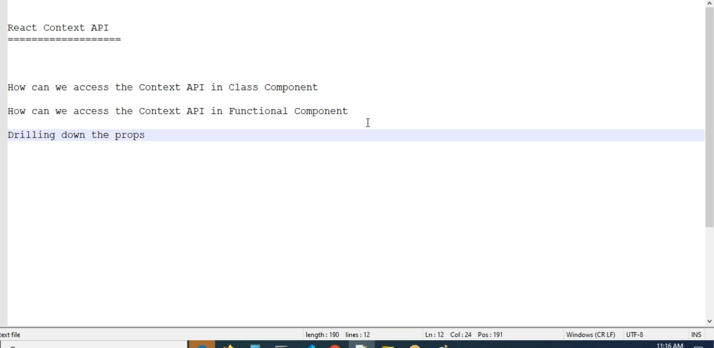
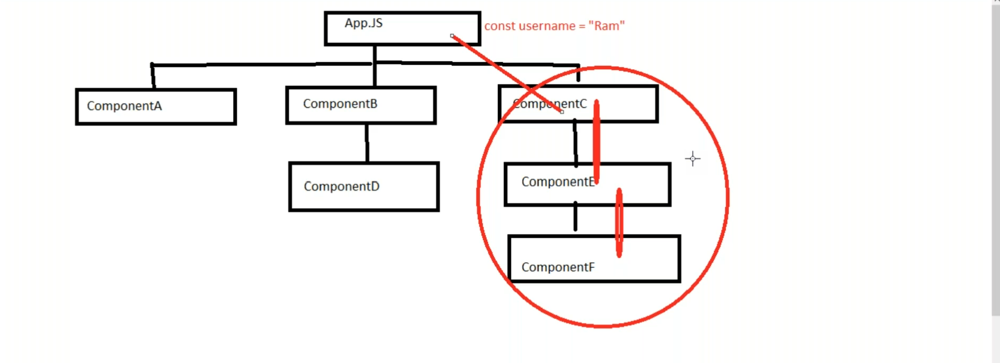
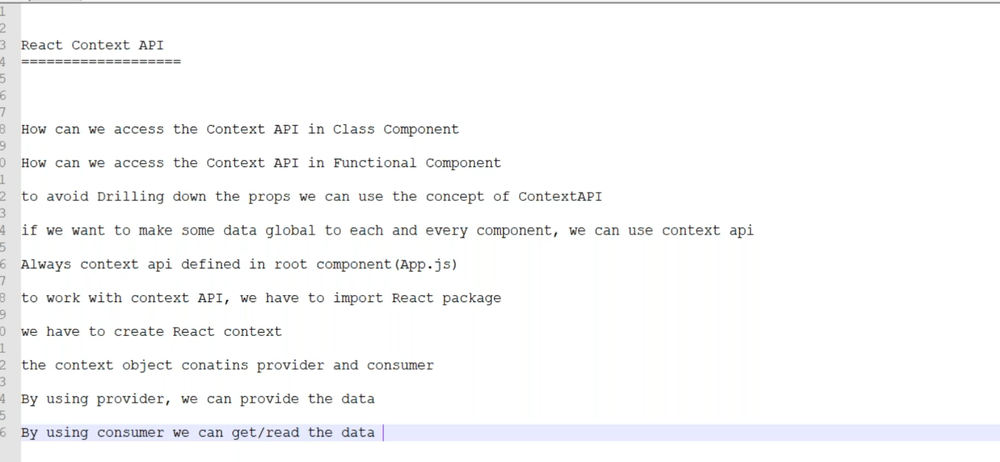
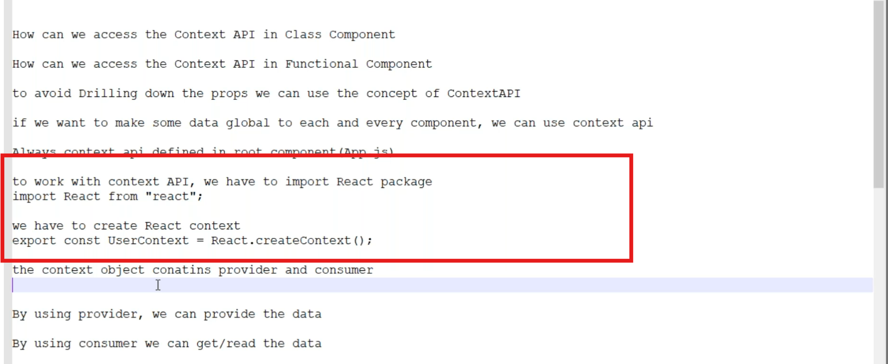
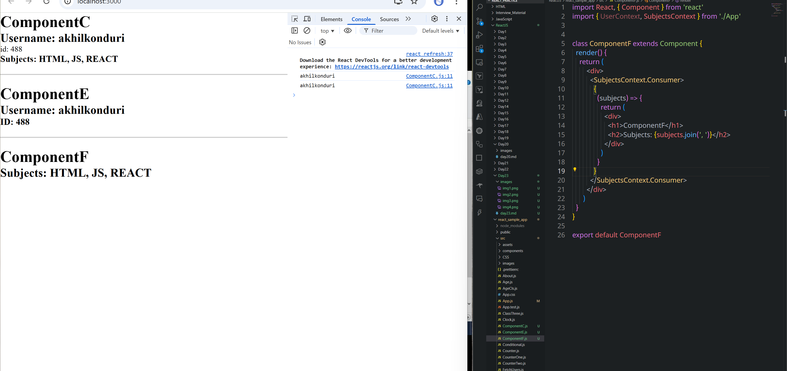
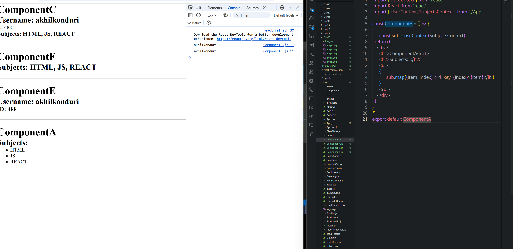

# Context API


* Create components as mentioned in diagram in src folder


---

## ✅ What is Context API?

* **Context API** helps us avoid **prop drilling** (passing props from parent to child to grandchild, etc.)
* It allows you to **make data global**, so **any component** (at any level) can access it.
* Context is usually **defined in the root component**, e.g., `App.js`.

---

## 🛠️ Steps to Use Context API

### 1. **Import React and Create Context**

```js
import React from "react";

// Create Context
export const UserContext = React.createContext();
```

This `UserContext` object gives you access to:

* `<UserContext.Provider />` – To **provide** data
* `<UserContext.Consumer />` – To **consume** data (used in class components)
* `useContext(UserContext)` – To **consume** data (used in functional components)

---

## 🌳 Provide Context in Root (App.js)

```jsx
import React from "react";
import { UserContext } from "./UserContext";
import Child from "./Child";

function App() {
  return (
    <UserContext.Provider value={{ username: "Akhil", role: "Frontend Dev" }}>
      <Child />
    </UserContext.Provider>
  );
}

export default App;
```

---

## 💡 Accessing Context in Functional Components

Use the `useContext()` hook:

```jsx
import React, { useContext } from "react";
import { UserContext } from "./UserContext";

const Child = () => {
  const { username, role } = useContext(UserContext);

  return (
    <div>
      <h2>Username: {username}</h2>
      <p>Role: {role}</p>
    </div>
  );
};

export default Child;
```

---

## 💡 Accessing Context in Class Components

Use `UserContext.Consumer`:

```jsx
import React, { Component } from "react";
import { UserContext } from "./UserContext";

class ChildClass extends Component {
  render() {
    return (
      <UserContext.Consumer>
        {(value) => (
          <div>
            <h2>Username: {value.username}</h2>
            <p>Role: {value.role}</p>
          </div>
        )}
      </UserContext.Consumer>
    );
  }
}

export default ChildClass;
```

---

## 📝 Final Summary

| Concept                 | Description                                          |
| ----------------------- | ---------------------------------------------------- |
| `React.createContext()` | Creates the context                                  |
| `Provider`              | Supplies the data                                    |
| `Consumer`              | Reads the data in class components                   |
| `useContext()`          | Reads the data in functional components              |
| **Where to define?**    | Usually in `App.js` or a dedicated `Context.js` file |

---
```jsx
import "./App.css";
import { BrowserRouter, Route, Routes } from "react-router-dom";
import ComponentC from "./ComponentC";
import ComponentE from "./ComponentE";
import React from "react";

export const UserContext = React.createContext();
function App() {

      const username= 'Konduri Akhil'

      return (
            <UserContext.Provider value={{username: 'akhilkonduri', id: '488'}}>
            <div>
                  <ComponentC  />
                  <hr></hr>
                  <ComponentE />
            </div>
            </UserContext.Provider>
      )
}

export default App

```
```jsx
import React, { useContext } from 'react'
import ComponentE from './ComponentE'
import { UserContext } from './App'


const ComponentC = () => {

      const { username, id } = useContext(UserContext)
      return (
            <div>
                  <h2>Username: {username}</h2>
                  <p>id: {id}</p>
            </div>
      )
}

export default ComponentC
```
```jsx
import React, { Component } from "react";
import { UserContext } from "./App";

class ComponentE extends Component {

  render() {
    return (
      <UserContext.Consumer>
        {
          (value) => (
            <div>
              <h2>Username: {value.username}</h2>
              <h3>ID: {value.id}</h3>
            </div>
          )
        }
      </UserContext.Consumer>
    )
  }
}
export default ComponentE
```

```jsx
import "./App.css";
import { BrowserRouter, Route, Routes } from "react-router-dom";
import ComponentC from "./ComponentC";
import ComponentE from "./ComponentE";
import React from "react";


export const SubjectsContext = React.createContext();
export const UserContext = React.createContext();
function App() {

      const subjects = ['HTML', 'JS', 'REACT']

      return (
            <UserContext.Provider value={{username: 'akhilkonduri', id: '488'}}>
                  <SubjectsContext.Provider value={subjects}>
            <div>
                  <ComponentC  />
                  <hr></hr>
                  <ComponentE />
            </div>
            </SubjectsContext.Provider>
            </UserContext.Provider>
      )
}

export default App

```
```jsx
import React, { useContext } from 'react'
import ComponentE from './ComponentE'
import { UserContext, SubjectsContext } from './App'


const ComponentC = () => {

      const { username, id } = useContext(UserContext)
      const subjects = useContext(SubjectsContext)
      console.log(username)
      return (
            <div>
                  <h1>ComponentC</h1>
                  <h2>Username: {username}</h2>
                  <p>id: {id}</p>
                  <h3>Subjects: {subjects.join( ', ' )}</h3>
            </div>
      )
}

export default ComponentC
```
```jsx
import React, { Component } from 'react'
import { UserContext, SubjectsContext } from './App'


class ComponentF extends Component {
  render() {
    return (
        <div>
          <SubjectsContext.Consumer>
            {
              (subjects) => {
                return (
                  <div>
                    <h1>ComponentF</h1>
                    <h2>Subjects: {subjects.join(', ')}</h2>
                  </div>
                )
                
              }
            }
          </SubjectsContext.Consumer>
        </div>
      )
  }
}

export default ComponentF
```


```jsx
import { useContext } from 'react'
import React  from 'react'
import { UserContext, SubjectsContext } from './App'

const ComponentA = () => {

      const sub = useContext(SubjectsContext)
  return (
    <div>
      <h1>ComponentA</h1>
      <h2>Subjects: </h2>
      <ul>
      {
            sub.map((item, index)=><li key={index}>{item}</li>)
      }
      </ul>
    </div>
  )
}

export default ComponentA
```



