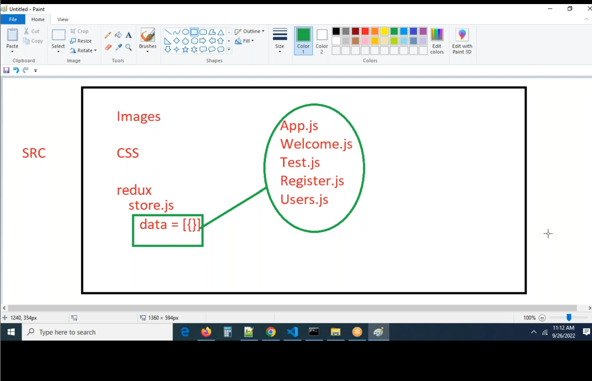
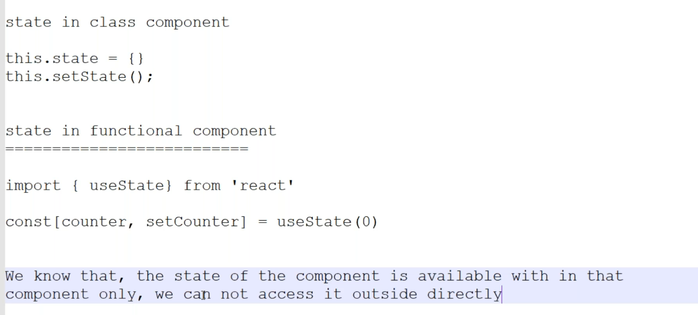
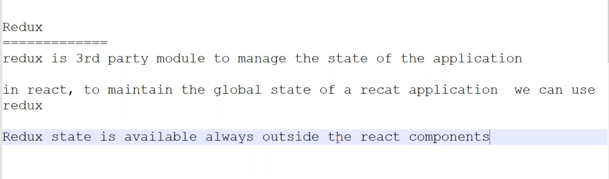
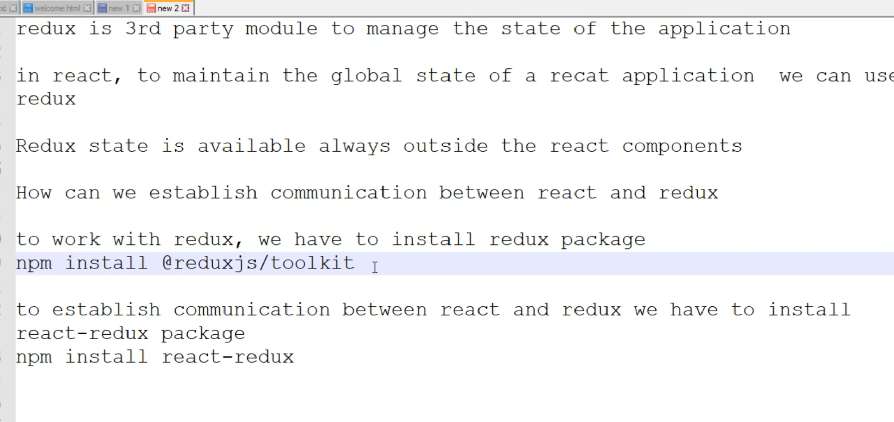
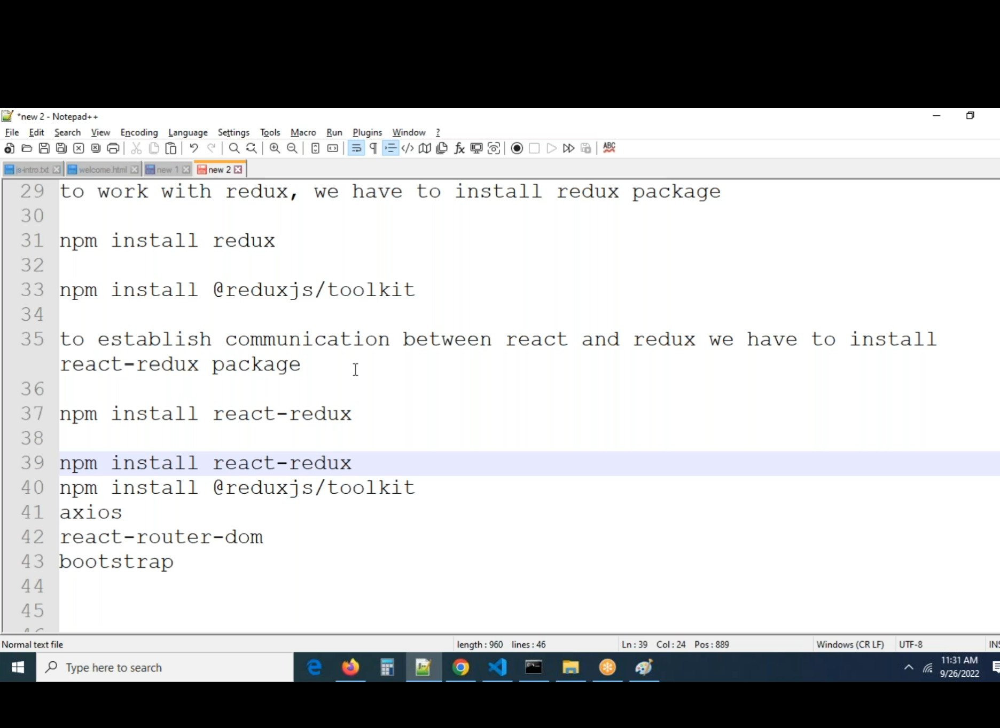
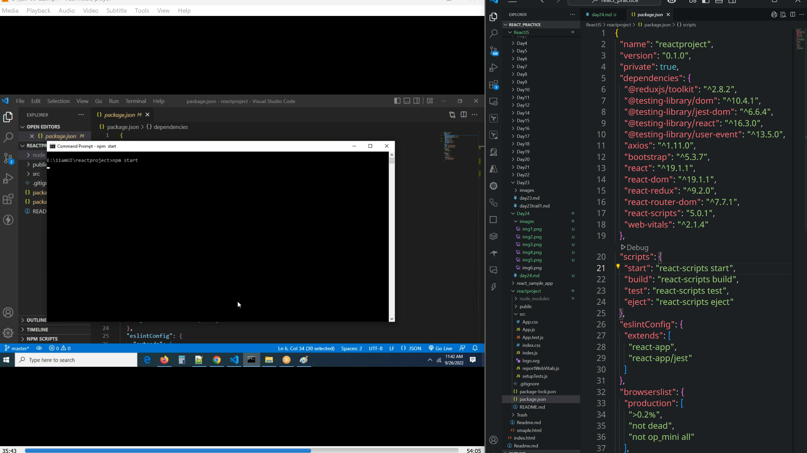

# Redux
* create redux folder
* create store.js file




* Create new project and install necessary packages as given below

```sh
npx create-react-app reactproject
cd reactproject
npm install @reduxjs/toolkit 
npm install react-redux
npm install axios
npm install react-router-dom
npm install bootstrap
npm start
```
* check package.json whether they installed or not.

## Add `import 'bootstrap/dist/css/bootstrap.min.css'` to index.js file
* remove index.css file
## create components folder in src
## from bootstrap website copy the code of navbar and add it to Header.js file
* rename class with className
* import 'bootstrap/dist/js/bootstrap.bundle.min.js'
 in the index.js file
 * Add different components like  header, footer, home, slider etc..,

