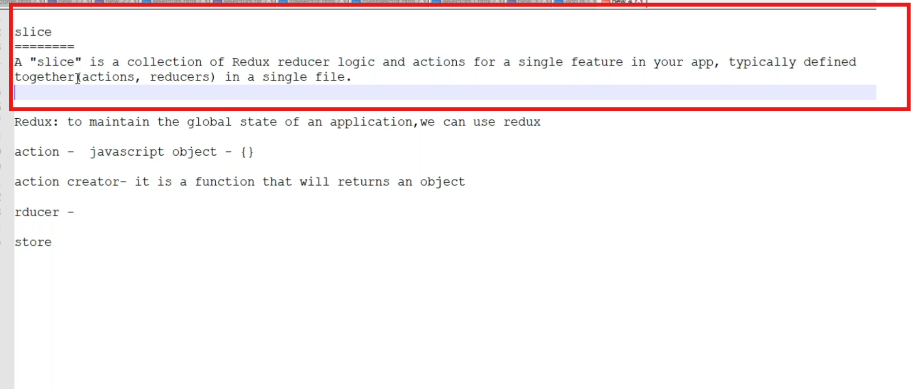
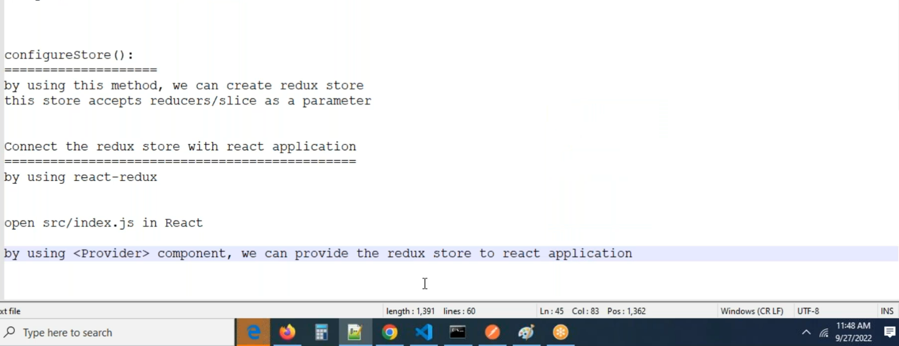

# Redux with navigation barsetup
```jsx
import React from 'react'
 
import { Link } from 'react-router-dom'

const Header = () => {
  return (
    <nav className="navbar navbar-expand-lg bg-body-tertiary">
      <div className="container">
        <Link to='/' className='navbar-brand' >Navbar</Link>
        {/* <a className="navbar-brand" href="#">Navbar</a> */}
        <button className="navbar-toggler" type="button" data-bs-toggle="collapse" data-bs-target="#navbarSupportedContent" aria-controls="navbarSupportedContent" aria-expanded="false" aria-label="Toggle navigation">
          <span className="navbar-toggler-icon"></span>
        </button>
        <div className="collapse navbar-collapse" id="navbarSupportedContent">
          <ul className="navbar-nav me-auto mb-2 mb-lg-0">
            <li className="nav-item">
              <a className="nav-link active" aria-current="page" href="#">Home</a>
            </li>
            <li className="nav-item">
              <a className="nav-link" href="#">Link</a>
            </li>
            <li className="nav-item dropdown">
              <a className="nav-link dropdown-toggle" href="#" role="button" data-bs-toggle="dropdown" aria-expanded="false">
                Dropdown
              </a>
              <ul className="dropdown-menu">
                <li><a className="dropdown-item" href="#">Action</a></li>
                <li><a className="dropdown-item" href="#">Another action</a></li>
                <li><hr className="dropdown-divider" /></li>
                <li><a className="dropdown-item" href="#">Something else here</a></li>
              </ul>
            </li>
            <li className="nav-item">
              <a className="nav-link disabled" aria-disabled="true">Disabled</a>
            </li>
          </ul>
          <form className="d-flex" role="search">
            <input className="form-control me-2" type="search" placeholder="Search" aria-label="Search" />
            <button className="btn btn-outline-success" type="submit">Search</button>
          </form>
        </div>
      </div>
    </nav>
  )
}
export default Header
```
```js
import React from 'react'
 
import { Link } from 'react-router-dom'

const Header = () => {
  return (
    <nav className="navbar navbar-expand-lg bg-body-tertiary">
      <div className="container">
        <Link to='/' className='navbar-brand' >Navbar</Link>
        <button className="navbar-toggler" type="button" data-bs-toggle="collapse" data-bs-target="#navbarSupportedContent" aria-controls="navbarSupportedContent" aria-expanded="false" aria-label="Toggle navigation">
          <span className="navbar-toggler-icon"></span>
        </button>
        <div className="collapse navbar-collapse" id="navbarSupportedContent">
          <ul className="navbar-nav me-auto mb-2 mb-lg-0">
            <li className="nav-item">
              <Link className="nav-link active" to='/' aria-current="page" href="#">Home</Link>
            </li>
            <li className="nav-item">
              <Link to='/posts' className="nav-link" href="#">Posts</Link>
            </li>

          </ul>
          <form className="d-flex" role="search">
            <input className="form-control me-2" type="search" placeholder="Search" aria-label="Search" />
            <button className="btn btn-outline-success" type="submit">Search</button>
          </form>
        </div>
      </div>
    </nav>
  )
}
export default Header
```
## Customize the navigation bar as below
### New component posts got created
### We need to display data from redux store here 
* Create `redux` folder in the src
* Create `postSlice.js` in the `redux` folder
##  Key words in the redux to know




## Basic Syntax 
```jsx
import {createSlice} from '@reduxjs/toolkit'

const initialState = [{
      id: 1,
      title: 'HTML',
      text: "This is one basic for the web page development"
},
      {
            id:2,
            title: 'CSS',
            text: 'Beautification of the HTML and it is like the flesh of the body'
      }
]

const postSlice = createSlice({
      name:'posts',
      initialState,
      reducers:{
            
      }
})
export default postSlice.reducer
```

## Update index.js as below

```jsx
import React from 'react';
import ReactDOM from 'react-dom/client';
import App from './App';
import 'bootstrap/dist/css/bootstrap.min.css'
import 'bootstrap/dist/js/bootstrap.bundle.min.js'
import store from './redux/store';
import {Provider} from 'react-redux'

console.log(store.getState())

const root = ReactDOM.createRoot(document.getElementById('root'));
root.render(
  <React.StrictMode>
    <Provider store={store}>
      <App />
    </Provider>
  </React.StrictMode>
);
```

## Import data to posts component and iterate it 

```jsx
import React from 'react'
import Header from './Header'
import Footer from './Footer'
import { useSelector } from 'react-redux'

const Posts = () => {

    const posts = useSelector(state => state.posts)
    const users = useSelector(state => state.users)

    console.log(posts);
    console.log(users);
    
  return (
    <div>
      <Header />
      <section className='container'>
            <h1 className='py-2'>Posts</h1>
            <div className='row'>
              <div className='col-md-6'>
                {
                  posts.length > 0 ? posts.map((item, index)=> <div key={index}>
                    <h3>{item.title}</h3>
                    <div >{item.text}</div>
                  </div>) : null
                }
              </div>
              <div className='col-md-6'></div>

            </div>
      </section>
      <Footer />
    </div> 
  )
}

export default Posts
```


