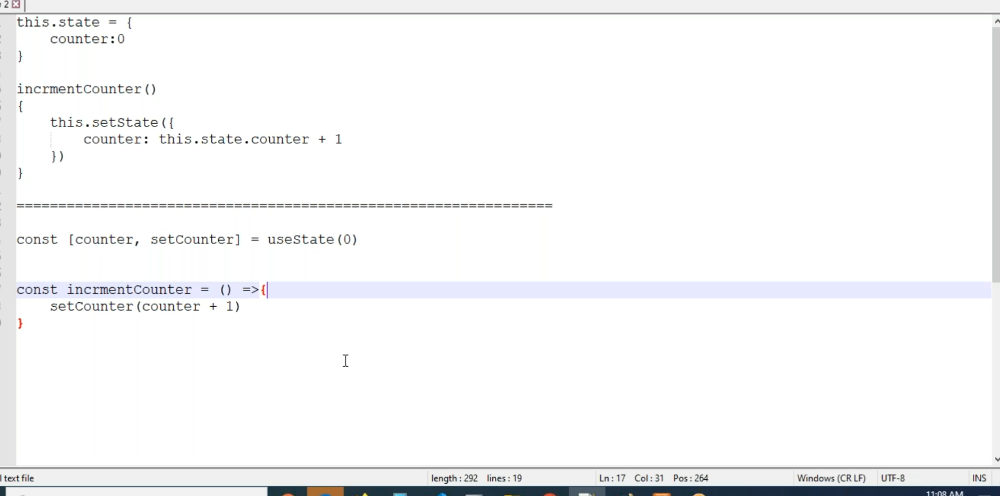
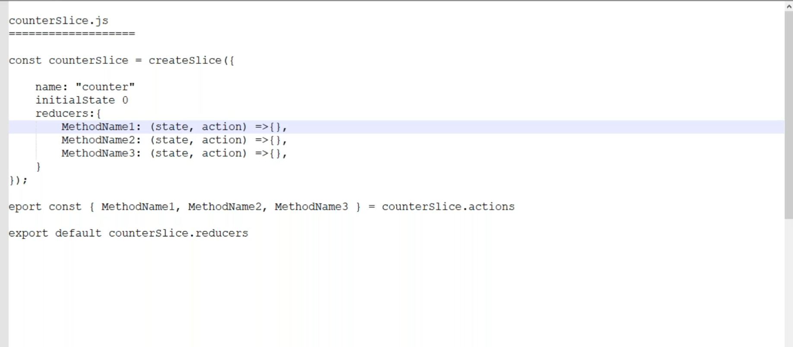
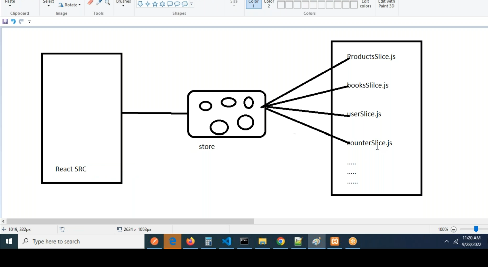
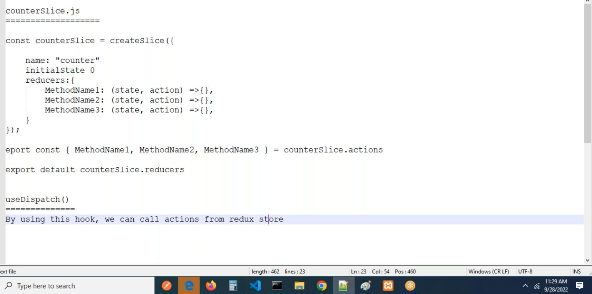
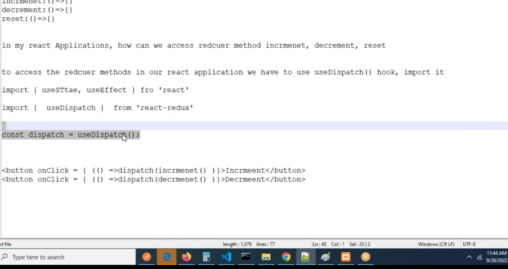
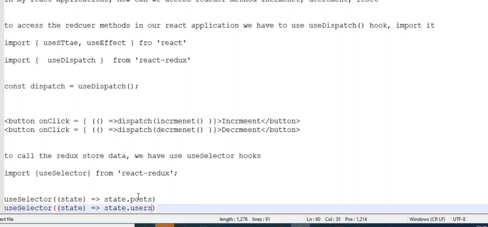
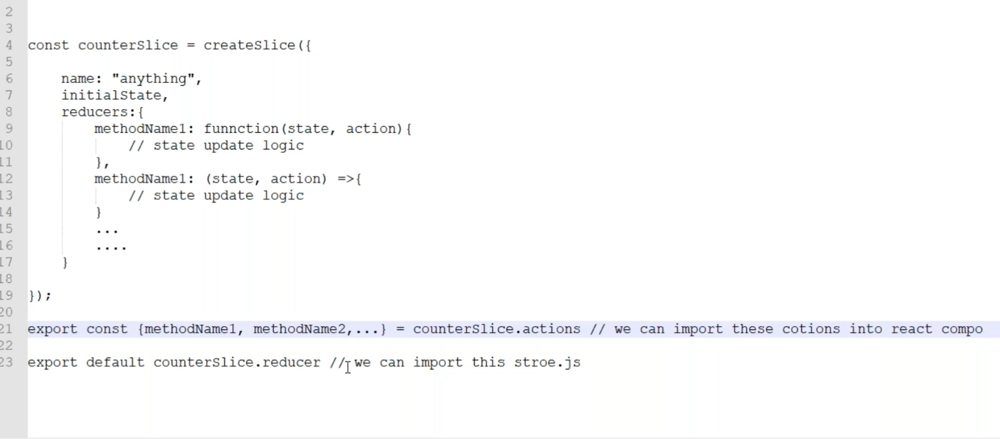

# Increment function in redux 
* Increment counter in class and functional components


* Create `counterSlice.js`

* Create `counterSlice.js` in redux and` Counters.js ` component in components folder.

```js
import { createSlice } from "@reduxjs/toolkit";

const initialState = 0

const counterSlice = createSlice({
      name: 'counter',
      initialState,
      reducers:{
            increment: (state, action) =>{
                  state += 1
            }
      }
})

export const { increment } = counterSlice.actions;
export default counterSlice.reducer;
```

* useSelectore is for stored data
* useDispatch is for stored functions
```js
import { createSlice } from "@reduxjs/toolkit";

const initialState = 0;

const counterSlice = createSlice({
      name: 'counter',
      initialState,
      reducers:{
            increment: (state, action) =>{
                  return state += 1
            },
            decrement: (state, action) =>{
                  return state -= 1
            }
      }
})

export const { increment, decrement } = counterSlice.actions;
export default counterSlice.reducer;
```





