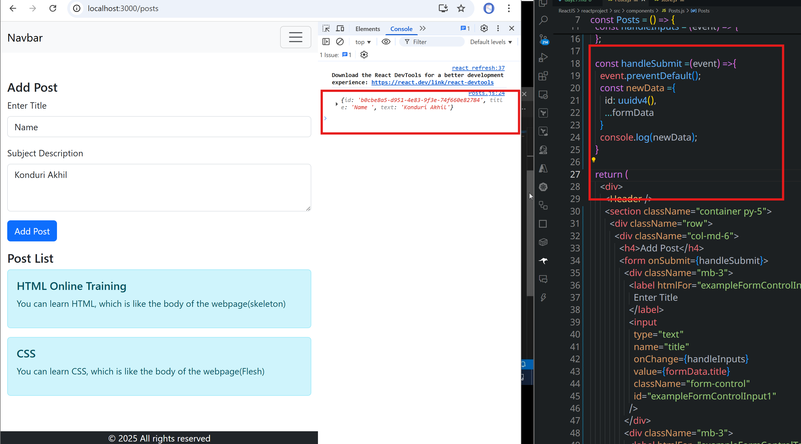
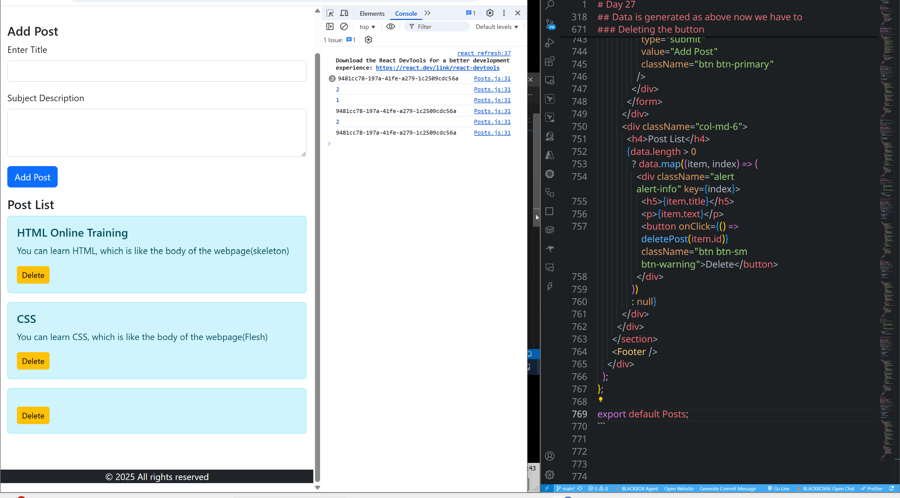

# 📘 React Redux Posts App – Complete Notes

## 1. Initial Redux Setup

### postSlice.js

```jsx
import { createSlice } from "@reduxjs/toolkit";

const initialState = [
  {
    id: 1,
    title: 'HTML Online Training',
    text: 'You can learn HTML, which is like the body of the webpage(skeleton)'
  },
  {
    id:2,
    title: 'CSS',
    text: 'You can learn CSS, which is like the body of the webpage(Flesh)'
  }
]

const postSlice = createSlice({
  name: 'posts',
  initialState,
  reducers:{ }
})

export default postSlice.reducer
```

### store.js

```jsx
import { configureStore } from "@reduxjs/toolkit";
import userSlice from "./userSlice";
import movieSlice from "./movieSlice";
import counterSlice from "./counterSlice";
import postSlice from './postSlice'

const store = configureStore({
  reducer:{
    users: userSlice,
    movies: movieSlice,
    counter: counterSlice,
    posts: postSlice,
  }
})

export default store;
```

---

## 2. Basic Posts Component (Read Only)

```jsx
import React from 'react'
import Header from './Header'
import Footer from './Footer'
import {useSelector} from 'react-redux'

const Posts = () => {
  const data = useSelector(state => state.posts)
  
  return (
    <div>
      <Header />
      <section className='container py-5'>
        <div className='row'>
          <div className='col-md-6'>
            <h4>Add Post</h4>
          </div>
          <div className='col-md-6'>
            <h4 >Post List</h4>
            {
              data.length >0 ?data.map((item, index)=><div className='alert alert-info' key={index}>
                <h5>{item.title}</h5>
                <p>{item.text}</p>
              </div>) :null
            }
          </div>
        </div>
      </section>
      <Footer />
    </div>
  )
}

export default Posts
```

---

## 3. Adding Form UI

[Form field setup with Bootstrap](https://getbootstrap.com/docs/5.3/forms/form-control/)


```jsx
import React, { useState } from 'react'
import Header from './Header'
import Footer from './Footer'
import { useSelector } from 'react-redux'

const Posts = () => {
  const data = useSelector(state => state.posts)

  return (
    <div>
      <Header />
      <section className='container py-5'>
        <div className='row'>
          <div className='col-md-6'>
            <h4>Add Post</h4>
            <form>
              <div className="mb-3">
                <label for="exampleFormControlInput1" className="form-label">Enter Title</label>
                <input type="email" className="form-control" id="exampleFormControlInput1" />
              </div>
              <div className="mb-3">
                <label for="exampleFormControlTextarea1" className="form-label">Subject Description</label>
                <textarea className="form-control" id="exampleFormControlTextarea1" rows="3"></textarea>
              </div>
              <div className="mb-3">
                <input type='submit' value='Add Post' className='btn btn-primary' />
              </div>
            </form>
          </div>
          <div className='col-md-6'>
            <h4 >Post List</h4>
            {
              data.length > 0 ? data.map((item, index) => <div className='alert alert-info' key={index}>
                <h5>{item.title}</h5>
                <p>{item.text}</p>
              </div>) : null
            }
          </div>
        </div>
      </section>
      <Footer />
    </div>
  )
}

export default Posts
```


---

## 4. Adding Local State (useState)

```jsx
import React, { useState } from "react";
import Header from "./Header";
import Footer from "./Footer";
import { useSelector } from "react-redux";

const Posts = () => {
  const data = useSelector((state) => state.posts);
  const [formData, setFormData] = useState({ title: "", text: "" });

  const handleInputs = (event) => {
    setFormData({
      ...formData,
      [event.target.name]: event.target.value,
    });
  };

  const handleSubmit =(event) =>{
    event.preventDefault();
    console.log(formData)
  }

  return (
    <div>
      <Header />
      <section className="container py-5">
        <div className="row">
          <div className="col-md-6">
            <h4>Add Post</h4>
            <form onSubmit={handleSubmit}>
              <div className="mb-3">
                <label htmlFor="exampleFormControlInput1" className="form-label">
                  Enter Title
                </label>
                <input
                  type="text"
                  name="title"
                  onChange={handleInputs}
                  value={formData.title}
                  className="form-control"
                  id="exampleFormControlInput1"
                />
              </div>
              <div className="mb-3">
                <label htmlFor="exampleFormControlTextarea1" className="form-label">
                  Subject Description
                </label>
                <textarea
                  className="form-control"
                  name="text"
                  onChange={handleInputs}
                  value={formData.text}
                  id="exampleFormControlTextarea1"
                  rows="3"
                ></textarea>
              </div>
              <div className="mb-3">
                <input
                  type="submit"
                  value="Add Post"
                  className="btn btn-primary"
                />
              </div>
            </form>
          </div>
          <div className="col-md-6">
            <h4>Post List</h4>
            {data.length > 0
              ? data.map((item, index) => (
                <div className="alert alert-info" key={index}>
                  <h5>{item.title}</h5>
                  <p>{item.text}</p>
                </div>
              ))
              : null}
          </div>
        </div>
      </section>
      <Footer />
    </div>
  );
};

export default Posts;
```

---

## 5. Using `uuid` for Unique IDs

Install:

```sh
npm i uuid
```

Usage:

```jsx
import { v4 as uuidv4} from 'uuid'
console.log(uuidv4());
```

```jsx
const handleSubmit =(event) =>{
  event.preventDefault();
  console.log(formData);
  console.log(uuidv4());
}
```



---

## 6. Dispatching Data to Redux

### Updated postSlice.js

```jsx
const postSlice = createSlice({
  name: 'posts',
  initialState,
  reducers:{
    addPost: (state, action) =>{
      state.push(action.payload)
    }
  }
})

export const { addPost} = postSlice.actions
export default postSlice.reducer
```

### Posts.js with `dispatch(addPost)`

```jsx
import { useSelector, useDispatch } from "react-redux";
import { v4 as uuidv4} from 'uuid'
import { addPost } from "../redux/postSlice";

const Posts = () => {
  const data = useSelector((state) => state.posts);
  const [formData, setFormData] = useState({ title: "", text: "" });
  const dispatch = useDispatch();

  const handleSubmit =(event) =>{
    event.preventDefault();
    const newData ={
      id: uuidv4(),
      ...formData
    }
    dispatch(addPost(newData));
  }
```


---

## 7. Adding Delete Functionality

### postSlice.js

```jsx
const postSlice = createSlice({
  name: 'posts',
  initialState,
  reducers:{
    addPost: (state, action) => {
      state.push(action.payload);
    },
    deletePost: (state, action) => {
      return state.filter(post => post.id !== action.payload);
    }
  }
})

export const { addPost, deletePost } = postSlice.actions
export default postSlice.reducer
```

### Posts.js with Delete

```jsx
const removePost = (id) => {
  dispatch(deletePost(id));
};

{data.length > 0
  ? data.map((item) => (
    <div className="alert alert-info" key={item.id}>
      <h5>{item.title}</h5>
      <p>{item.text}</p>
      <button 
        onClick={() => removePost(item.id)} 
        className="btn btn-sm btn-warning">
        Delete
      </button>
    </div>
  ))
  : null}
```



---

## 8. ✅ Final Working `Posts.js`

```jsx
import React, { useState } from "react";
import Header from "./Header";
import Footer from "./Footer";
import { useSelector, useDispatch } from "react-redux";
import { v4 as uuidv4 } from "uuid";
import { addPost, deletePost } from "../redux/postSlice";

const Posts = () => {
  const data = useSelector((state) => state.posts);
  const [formData, setFormData] = useState({ title: "", text: "" });
  const dispatch = useDispatch();

  const handleInputs = (e) => {
    setFormData({ ...formData, [e.target.name]: e.target.value });
  };

  const handleSubmit = (e) => {
    e.preventDefault();
    const newPost = { id: uuidv4(), ...formData };
    dispatch(addPost(newPost));
    setFormData({ title: "", text: "" });
  };

  const removePost = (id) => {
    dispatch(deletePost(id));
  };

  return (
    <div>
      <Header />
      <section className="container py-5">
        <div className="row">
          {/* Form */}
          <div className="col-md-6">
            <h4>Add Post</h4>
            <form onSubmit={handleSubmit}>
              <div className="mb-3">
                <label htmlFor="title" className="form-label">Enter Title</label>
                <input
                  type="text"
                  name="title"
                  value={formData.title}
                  onChange={handleInputs}
                  className="form-control"
                  id="title"
                />
              </div>
              <div className="mb-3">
                <label htmlFor="text" className="form-label">Subject Description</label>
                <textarea
                  name="text"
                  value={formData.text}
                  onChange={handleInputs}
                  className="form-control"
                  id="text"
                  rows="3"
                />
              </div>
              <input type="submit" value="Add Post" className="btn btn-primary" />
            </form>
          </div>

          {/* Post List */}
          <div className="col-md-6">
            <h4>Post List</h4>
            {data.length > 0 ? (
              data.map((item) => (
                <div className="alert alert-info d-flex justify-content-between" key={item.id}>
                  <div>
                    <h5>{item.title}</h5>
                    <p>{item.text}</p>
                  </div>
                  <button onClick={() => removePost(item.id)} className="btn btn-sm btn-warning">
                    Delete
                  </button>
                </div>
              ))
            ) : (
              <p>No posts available.</p>
            )}
          </div>
        </div>
      </section>
      <Footer />
    </div>
  );
};

export default Posts;
```

---

✅ This is now **full, progressive notes** without skipping any snippet — from setup → form → state → uuid → addPost → deletePost → final working.