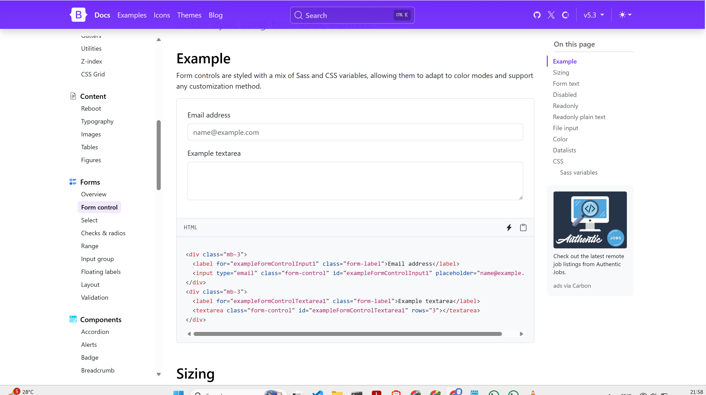
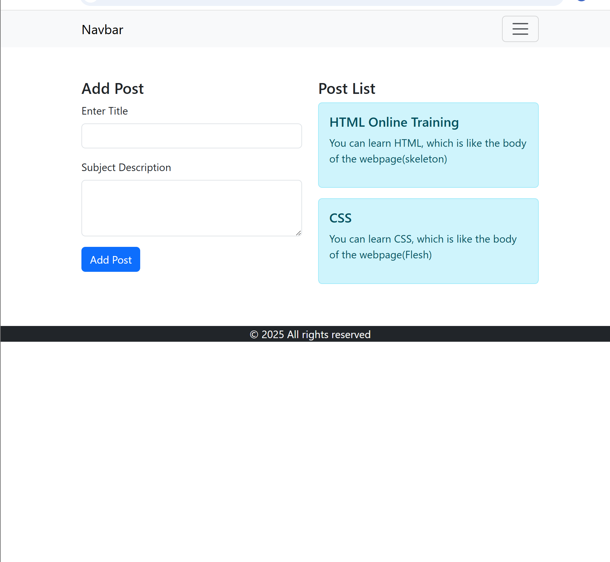
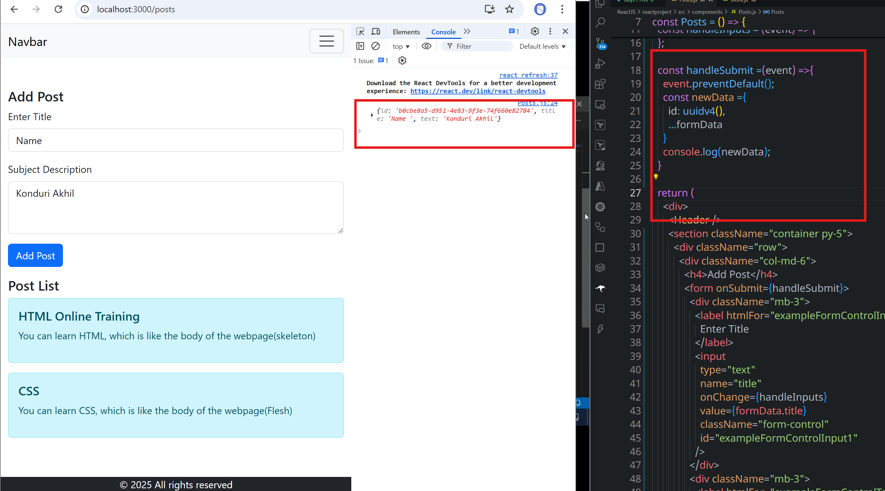
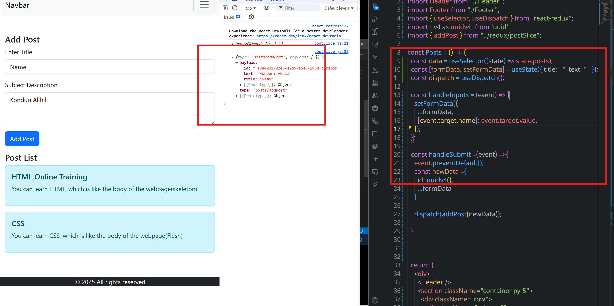
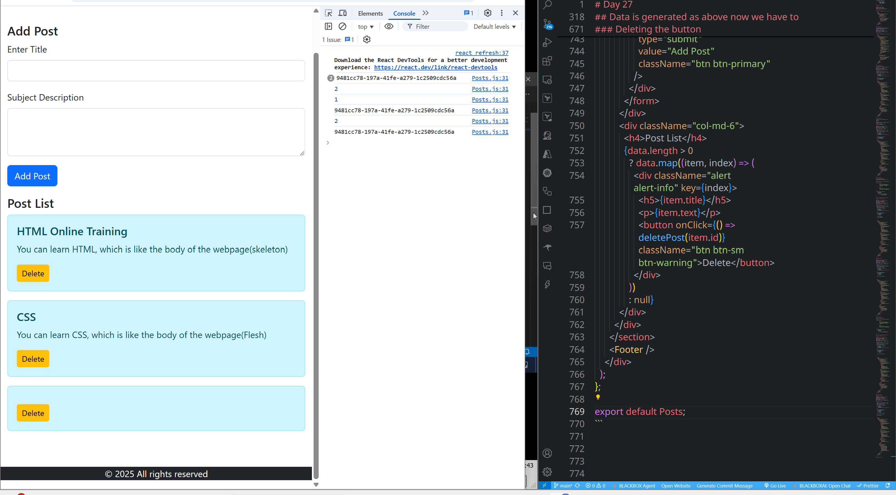

# Day 27
```jsx
import { createSlice } from "@reduxjs/toolkit";

const initialState = [
      {
            id: 1,
            title: 'HTML Online Training',
            text: 'You can learn HTML, which is like the body of the webpage(skeleton)'
      },
      {
            id:2,
            title: 'CSS',
            text: 'You can learn CSS, which is like the body of the webpage(Flesh)'
      }
]

const postSlice = createSlice({
      name: 'posts',
      initialState,
      reducers:{

      }
})

export default postSlice.reducer
```
```jsx
import { configureStore } from "@reduxjs/toolkit";
import userSlice from "./userSlice";
import movieSlice from "./movieSlice";
import counterSlice from "./counterSlice";
import postSlice from './postSlice'

const store = configureStore({
      reducer:{
            users: userSlice,
            movies: movieSlice,
            counter: counterSlice,
            posts: postSlice,
      }
})

export default store;
```
```jsx
import React from 'react'
import Header from './Header'
import Footer from './Footer'
import {useSelector} from 'react-redux'

const Posts = () => {

  const data = useSelector(state => state.posts)
  
  return (
    <div>
      <Header />
      <section className='container py-5'>
        <div className='row'>
          <div className='col-md-6'>
            <h4>Add Post</h4>
          </div>
          <div className='col-md-6'>
            <h4 >Post List</h4>
            {
              data.length >0 ?data.map((item, index)=><div className='alert alert-info' key={index}>
                <h5>{item.title}</h5>
                <p>{item.text}</p>
              </div>) :null
            }
          </div>
        </div>
      </section>
      <Footer />
    </div>
  )
}

export default Posts
```
[form fieldsetup with bootstrap](https://getbootstrap.com/docs/5.3/forms/form-control/)

```jsx
import React, { useState } from 'react'
import Header from './Header'
import Footer from './Footer'
import { useSelector } from 'react-redux'

const Posts = () => {

  const data = useSelector(state => state.posts)

  return (
    <div>
      <Header />
      <section className='container py-5'>
        <div className='row'>
          <div className='col-md-6'>
            <h4>Add Post</h4>
            <form>
              <div className="mb-3">
                <label for="exampleFormControlInput1" className="form-label">Enter Title</label>
                <input type="email" className="form-control" id="exampleFormControlInput1" />
              </div>
              <div className="mb-3">
                <label for="exampleFormControlTextarea1" className="form-label">Subject Description</label>
                <textarea className="form-control" id="exampleFormControlTextarea1" rows="3"></textarea>
              </div>
              <div className="mb-3">
                <input type='submit' value='Add Post' className='btn btn-primary' />
              </div>
            </form>

          </div>
          <div className='col-md-6'>
            <h4 >Post List</h4>
            {
              data.length > 0 ? data.map((item, index) => <div className='alert alert-info' key={index}>
                <h5>{item.title}</h5>
                <p>{item.text}</p>
              </div>) : null
            }
          </div>
        </div>
      </section>
      <Footer />
    </div>
  )
}

export default Posts
```

## Posting data to the redux store(postsSlice)
```js
import React, { useState } from "react";
import Header from "./Header";
import Footer from "./Footer";
import { useSelector } from "react-redux";

const Posts = () => {
  const data = useSelector((state) => state.posts);
  const [formData, setFormData] = useState({ title: "", text: "" });

  const handleInputs = (event) => {
    setFormData({
      ...formData,
      [event.target.name]: event.target.value,
    });
  };

  const handleSubmit =(event) =>{
    event.preventDefault();
    console.log(formData)
  }

  return (
    <div>
      <Header />
      <section className="container py-5">
        <div className="row">
          <div className="col-md-6">
            <h4>Add Post</h4>
            <form onSubmit={handleSubmit}>
              <div className="mb-3">
                <label htmlFor="exampleFormControlInput1" className="form-label">
                  Enter Title
                </label>
                <input
                  type="text"
                  name="title"
                  onChange={handleInputs}
                  value={formData.title}
                  className="form-control"
                  id="exampleFormControlInput1"
                />
              </div>
              <div className="mb-3">
                <label htmlFor="exampleFormControlTextarea1" className="form-label">
                  Subject Description
                </label>
                <textarea
                  className="form-control"
                  name="text"
                  onChange={handleInputs}
                  value={formData.text}
                  id="exampleFormControlTextarea1"
                  rows="3"
                ></textarea>
              </div>
              <div className="mb-3">
                <input
                  type="submit"
                  value="Add Post"
                  className="btn btn-primary"
                />
              </div>
            </form>
          </div>
          <div className="col-md-6">
            <h4>Post List</h4>
            {data.length > 0
              ? data.map((item, index) => (
                <div className="alert alert-info" key={index}>
                  <h5>{item.title}</h5>
                  <p>{item.text}</p>
                </div>
              ))
              : null}
          </div>
        </div>
      </section>
      <Footer />
    </div>
  );
};

export default Posts;
```    
*  install uuid for the generation of id's randomly
```js
npm i uuid
```
* import it to the react component and call the fucntion as follows
```jsx
import { v4 as uuidv4} from 'uuid'
    console.log(uuidv4());
```
```jsx
import React, { useState } from "react";
import Header from "./Header";
import Footer from "./Footer";
import { useSelector } from "react-redux";
import { v4 as uuidv4} from 'uuid'

const Posts = () => {
  const data = useSelector((state) => state.posts);
  const [formData, setFormData] = useState({ title: "", text: "" });

  const handleInputs = (event) => {
    setFormData({
      ...formData,
      [event.target.name]: event.target.value,
    });
  };

  const handleSubmit =(event) =>{
    event.preventDefault();
    console.log(formData);
    console.log(uuidv4());
  }

  return (
    <div>
      <Header />
      <section className="container py-5">
        <div className="row">
          <div className="col-md-6">
            <h4>Add Post</h4>
            <form onSubmit={handleSubmit}>
              <div className="mb-3">
                <label htmlFor="exampleFormControlInput1" className="form-label">
                  Enter Title
                </label>
                <input
                  type="text"
                  name="title"
                  onChange={handleInputs}
                  value={formData.title}
                  className="form-control"
                  id="exampleFormControlInput1"
                />
              </div>
              <div className="mb-3">
                <label htmlFor="exampleFormControlTextarea1" className="form-label">
                  Subject Description
                </label>
                <textarea
                  className="form-control"
                  name="text"
                  onChange={handleInputs}
                  value={formData.text}
                  id="exampleFormControlTextarea1"
                  rows="3"
                ></textarea>
              </div>
              <div className="mb-3">
                <input
                  type="submit"
                  value="Add Post"
                  className="btn btn-primary"
                />
              </div>
            </form>
          </div>
          <div className="col-md-6">
            <h4>Post List</h4>
            {data.length > 0
              ? data.map((item, index) => (
                <div className="alert alert-info" key={index}>
                  <h5>{item.title}</h5>
                  <p>{item.text}</p>
                </div>
              ))
              : null}
          </div>
        </div>
      </section>
      <Footer />
    </div>
  );
};

export default Posts;
```

## Data is generated as above now we have to post that data to the redux store

```jsx
import { createSlice } from "@reduxjs/toolkit";

const initialState = [
      {
            id: 1,
            title: 'HTML Online Training',
            text: 'You can learn HTML, which is like the body of the webpage(skeleton)'
      },
      {
            id:2,
            title: 'CSS',
            text: 'You can learn CSS, which is like the body of the webpage(Flesh)'
      }
]

const postSlice = createSlice({
      name: 'posts',
      initialState,
      reducers:{
            addPost: (state, action) =>{
                  console.log(state);
                  console.log(action);
            }
      }
})

export const { addPost} = postSlice.actions

export default postSlice.reducer
```
```jsx
import React, { useState } from "react";
import Header from "./Header";
import Footer from "./Footer";
import { useSelector, useDispatch } from "react-redux";
import { v4 as uuidv4} from 'uuid'
import { addPost } from "../redux/postSlice";

const Posts = () => {
  const data = useSelector((state) => state.posts);
  const [formData, setFormData] = useState({ title: "", text: "" });
  const dispatch = useDispatch();

  const handleInputs = (event) => {
    setFormData({
      ...formData,
      [event.target.name]: event.target.value,
    });
  };

  const handleSubmit =(event) =>{
    event.preventDefault();
    const newData ={
      id: uuidv4(),
      ...formData
    }

    dispatch(addPost())
    console.log(newData);

  }


  return (
    <div>
      <Header />
      <section className="container py-5">
        <div className="row">
          <div className="col-md-6">
            <h4>Add Post</h4>
            <form onSubmit={handleSubmit}>
              <div className="mb-3">
                <label htmlFor="exampleFormControlInput1" className="form-label">
                  Enter Title
                </label>
                <input
                  type="text"
                  name="title"
                  onChange={handleInputs}
                  value={formData.title}
                  className="form-control"
                  id="exampleFormControlInput1"
                />
              </div>
              <div className="mb-3">
                <label htmlFor="exampleFormControlTextarea1" className="form-label">
                  Subject Description
                </label>
                <textarea
                  className="form-control"
                  name="text"
                  onChange={handleInputs}
                  value={formData.text}
                  id="exampleFormControlTextarea1"
                  rows="3"
                ></textarea>
              </div>
              <div className="mb-3">
                <input
                  type="submit"
                  value="Add Post"
                  className="btn btn-primary"
                />
              </div>
            </form>
          </div>
          <div className="col-md-6">
            <h4>Post List</h4>
            {data.length > 0
              ? data.map((item, index) => (
                <div className="alert alert-info" key={index}>
                  <h5>{item.title}</h5>
                  <p>{item.text}</p>
                </div>
              ))
              : null}
          </div>
        </div>
      </section>
      <Footer />
    </div>
  );
};

export default Posts;
```
```jsx
import React, { useState } from "react";
import Header from "./Header";
import Footer from "./Footer";
import { useSelector, useDispatch } from "react-redux";
import { v4 as uuidv4} from 'uuid'
import { addPost } from "../redux/postSlice";

const Posts = () => {
  const data = useSelector((state) => state.posts);
  const [formData, setFormData] = useState({ title: "", text: "" });
  const dispatch = useDispatch();

  const handleInputs = (event) => {
    setFormData({
      ...formData,
      [event.target.name]: event.target.value,
    });
  };

  const handleSubmit =(event) =>{
    event.preventDefault();
    const newData ={
      id: uuidv4(),
      ...formData
    }

    dispatch(addPost(newData));

  }


  return (
    <div>
      <Header />
      <section className="container py-5">
        <div className="row">
          <div className="col-md-6">
            <h4>Add Post</h4>
            <form onSubmit={handleSubmit}>
              <div className="mb-3">
                <label htmlFor="exampleFormControlInput1" className="form-label">
                  Enter Title
                </label>
                <input
                  type="text"
                  name="title"
                  onChange={handleInputs}
                  value={formData.title}
                  className="form-control"
                  id="exampleFormControlInput1"
                />
              </div>
              <div className="mb-3">
                <label htmlFor="exampleFormControlTextarea1" className="form-label">
                  Subject Description
                </label>
                <textarea
                  className="form-control"
                  name="text"
                  onChange={handleInputs}
                  value={formData.text}
                  id="exampleFormControlTextarea1"
                  rows="3"
                ></textarea>
              </div>
              <div className="mb-3">
                <input
                  type="submit"
                  value="Add Post"
                  className="btn btn-primary"
                />
              </div>
            </form>
          </div>
          <div className="col-md-6">
            <h4>Post List</h4>
            {data.length > 0
              ? data.map((item, index) => (
                <div className="alert alert-info" key={index}>
                  <h5>{item.title}</h5>
                  <p>{item.text}</p>
                </div>
              ))
              : null}
          </div>
        </div>
      </section>
      <Footer />
    </div>
  );
};

export default Posts;
```

```jsx
import { createSlice } from "@reduxjs/toolkit";

const initialState = [
      {
            id: 1,
            title: 'HTML Online Training',
            text: 'You can learn HTML, which is like the body of the webpage(skeleton)'
      },
      {
            id:2,
            title: 'CSS',
            text: 'You can learn CSS, which is like the body of the webpage(Flesh)'
      }
]

const postSlice = createSlice({
      name: 'posts',
      initialState,
      reducers:{
            addPost: (state, action) =>{
                  state.push(action.payload)
            }
      }
})

export const { addPost} = postSlice.actions

export default postSlice.reducer
```
```jsx
import React, { useState } from "react";
import Header from "./Header";
import Footer from "./Footer";
import { useSelector, useDispatch } from "react-redux";
import { v4 as uuidv4} from 'uuid'
import { addPost } from "../redux/postSlice";

const Posts = () => {
  const data = useSelector((state) => state.posts);
  const [formData, setFormData] = useState({ title: "", text: "" });
  const dispatch = useDispatch();

  const handleInputs = (event) => {
    setFormData({
      ...formData,
      [event.target.name]: event.target.value
    });
  };

  const handleSubmit =(event) =>{
    event.preventDefault();
    const newData ={
      id: uuidv4(),
      ...formData
    }

    dispatch(addPost(newData));

  }


  return (
    <div>
      <Header />
      <section className="container py-5">
        <div className="row">
          <div className="col-md-6">
            <h4>Add Post</h4>
            <form onSubmit={handleSubmit}>
              <div className="mb-3">
                <label htmlFor="exampleFormControlInput1" className="form-label">
                  Enter Title
                </label>
                <input
                  type="text"
                  name="title"
                  onChange={handleInputs}
                  value={formData.title}
                  className="form-control"
                  id="exampleFormControlInput1"
                />
              </div>
              <div className="mb-3">
                <label htmlFor="exampleFormControlTextarea1" className="form-label">
                  Subject Description
                </label>
                <textarea
                  className="form-control"
                  name="text"
                  onChange={handleInputs}
                  value={formData.text}
                  id="exampleFormControlTextarea1"
                  rows="3"
                ></textarea>
              </div>
              <div className="mb-3">
                <input
                  type="submit"
                  value="Add Post"
                  className="btn btn-primary"
                />
              </div>
            </form>
          </div>
          <div className="col-md-6">
            <h4>Post List</h4>
            {data.length > 0
              ? data.map((item, index) => (
                <div className="alert alert-info" key={index}>
                  <h5>{item.title}</h5>
                  <p>{item.text}</p>
                </div>
              ))
              : null}
          </div>
        </div>
      </section>
      <Footer />
    </div>
  );
};

export default Posts;
```
### Deleting the button
```jsx
import React, { useState } from "react";
import Header from "./Header";
import Footer from "./Footer";
import { useSelector, useDispatch } from "react-redux";
import { v4 as uuidv4} from 'uuid'
import { addPost } from "../redux/postSlice";

const Posts = () => {

  const data = useSelector((state) => state.posts);
  const [formData, setFormData] = useState({ title: "", text: "" });
  const dispatch = useDispatch();

  const handleInputs = (event) => {
    setFormData({
      ...formData,
      [event.target.name]: event.target.value
    });
  };

  const handleSubmit =(event) =>{
    event.preventDefault();
    const newData ={
      id: uuidv4(),
      ...formData
    }
    dispatch(addPost(newData));
  }

  const deletePost = (id) => {
    console.log(id)
  }


  return (
    <div>
      <Header />
      <section className="container py-5">
        <div className="row">
          <div className="col-md-6">
            <h4>Add Post</h4>
            <form onSubmit={handleSubmit}>
              <div className="mb-3">
                <label htmlFor="exampleFormControlInput1" className="form-label">
                  Enter Title
                </label>
                <input
                  type="text"
                  name="title"
                  onChange={handleInputs}
                  value={formData.title}
                  className="form-control"
                  id="exampleFormControlInput1"
                />
              </div>
              <div className="mb-3">
                <label htmlFor="exampleFormControlTextarea1" className="form-label">
                  Subject Description
                </label>
                <textarea
                  className="form-control"
                  name="text"
                  onChange={handleInputs}
                  value={formData.text}
                  id="exampleFormControlTextarea1"
                  rows="3"
                ></textarea>
              </div>
              <div className="mb-3">
                <input
                  type="submit"
                  value="Add Post"
                  className="btn btn-primary"
                />
              </div>
            </form>
          </div>
          <div className="col-md-6">
            <h4>Post List</h4>
            {data.length > 0
              ? data.map((item, index) => (
                <div className="alert alert-info" key={index}>
                  <h5>{item.title}</h5>
                  <p>{item.text}</p>
                  <button onClick={() => deletePost(item.id)} className="btn btn-sm btn-warning">Delete</button>
                </div>
              ))
              : null}
          </div>
        </div>
      </section>
      <Footer />
    </div>
  );
};

export default Posts;
```



