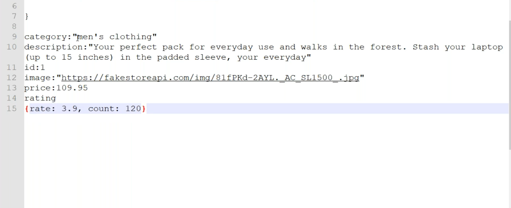

# ReactJS Day 28 Notes

## Redux Toolkit: Managing State with createSlice

- When creating a slice (e.g., `postSlice`), always define the **initialState** as an **object**.
  
  Example initialState for posts:
  ```jsx
  const initialState = {
    posts: [
      {
        id: 1,
        title: 'HTML Online Training',
        text: 'You can learn HTML, which is like the body of the webpage(skeleton)'
      },
      {
        id: 2,
        title: 'CSS',
        text: 'You can learn CSS, which is like the body of the webpage(Flesh)'
      }
    ]
  }
  ```

- Using `createSlice` from Redux Toolkit simplifies reducer and action creation:
  ```jsx
  import { createSlice } from "@reduxjs/toolkit";

  const postSlice = createSlice({
    name: 'posts',
    initialState,
    reducers: {
      addPost: (state, action) => {
        state.push(action.payload)
      },
      deletePost: (state, action) => {
        state = state.filter(item => item.id !== action.payload)
      }
    }
  })

  export const { addPost, deletePost } = postSlice.actions
  export default postSlice.reducer
  ```

- Note: The reducer functions can mutate the state directly because Redux Toolkit uses Immer under the hood to handle immutable updates.

## Conditional Rendering for No Articles Found

- When rendering a list of articles, check if the data array has items:
  ```jsx
  {data.length > 0
    ? data.map((item, index) => (
      <div className="alert alert-info" key={index}>
        <h5>{item.title}</h5>
        <p>{item.text}</p>
        <button onClick={() => removePost(item.id)} className="btn btn-sm btn-warning">Delete</button>
      </div>
    ))
    : <p className="alert alert-warning"> No Articles Found</p>}
  ```

## Task: Create a Todo List and Add Todo List as Above

- The notes suggest creating a Todo List component similar to the posts example above.

---

## Building a Products Page or Component

- Basic React component structure for Products page:
  ```jsx
  import React from 'react'
  import Header from './Header'
  import Footer from './Footer'

  const Products = () => {
    return (
      <div>
        <Header />
        <section className='container py-5'>
          <h1>Products List</h1>
        </section>
        <Footer />
      </div>
    )
  }

  export default Products
  ```

---

## Fetching Data from Server Using Redux

- Define initial state for products with loading status and error handling:
  ```jsx
  const initialState = {
    items: [],
    status: 'loading',
    error: null
  }
  ```

- Create a product slice (incomplete example):
  ```jsx
  import { createSlice } from "@reduxjs/toolkit";

  const productSlice = createSlice({
    name: 'Products',
    initialState,
  })

  export default productSlice.reducer
  ```

- Combine slices in the Redux store:
  ```jsx
  import { configureStore } from "@reduxjs/toolkit";
  import userSlice from "./userSlice";
  import movieSlice from "./movieSlice";
  import counterSlice from "./counterSlice";
  import postSlice from './postSlice'
  import postSliceT from './postSliceT'
  import productSlice from './porductSlice'

  const store = configureStore({
    reducer: {
      users: userSlice,
      movies: movieSlice,
      counter: counterSlice,
      posts: postSlice,
      postst: postSliceT,
      products: productSlice,
    }
  })

  export default store;
  ```

---

## Making Redux Asynchronous with createAsyncThunk

- Redux by default is synchronous; to handle asynchronous Ajax calls, use middleware `createAsyncThunk`.

- Example usage of `createAsyncThunk` with axios to fetch products:
  ```jsx
  import { createAsyncThunk, createSlice } from "@reduxjs/toolkit";
  import axios from 'axios';

  const initialState = {
    items: [],
    status: 'loading',
    error: null
  };

  export const fetchProducts = createAsyncThunk('products', async (id = null, { rejectWithValue }) => {
    try {
      const response = await axios.get('');
      return response.data;
    } catch (err) {
      return rejectWithValue('Sorry! unable to fetch data ');
    }
  });

  const productSlice = createSlice({
    name: 'products',
    initialState,
    reducers: {},
    extraReducers(builder) {
      builder
        .addCase(fetchProducts.pending, (state, action) => {
          state.status = 'loading'
        })
        .addCase(fetchProducts.fulfilled, (state, action) => {
          state.status = 'success'
          state.items = action.payload
        })
        .addCase(fetchProducts.rejected, (state, action) => {
          state.status = 'failed'
          state.error = action.err.message
        })
    }
  })

  export default productSlice.reducer
  ```

---

## Calling fetchProducts in Products Component

- Example React component using Redux hooks to dispatch fetchProducts and select state:
  ```jsx
  import React, { useEffect } from 'react'
  import Header from './Header'
  import Footer from './Footer'
  import { useDispatch, useSelector } from 'react-redux' 
  import { fetchProducts } from '../redux/porductSlice'

  const Products = () => {
    const productlist = useSelector((state) => state.products.items)
    const pStatus = useSelector((state) => state.products.status)
    const pError = useSelector((state) => state.products.error)
    const dispatch = useDispatch();

    useEffect(() => {
      if (pStatus === 'idle') {
        dispatch(fetchProducts())
      }
    }, [productlist, dispatch])

    return (
      <div>
        <Header />
        <section className='container py-5'>
          <div className='row'>
            {productlist.length > 0 ? productlist.map((item, index) => (
              <div className='col-md-3 my-5' key={index}>
                
                <h4>{item.title.substr(0, 30)}</h4>
                <p>Price: {item.price}</p>
                <button className='btn btn-warning'>Add To Cart</button>
              </div>
            )) : null}
          </div>
          {pStatus === 'loading' ? <p>Loading...</p> : null}
        </section>
        <Footer />
      </div>
    )
  }

  export default Products
  ```

---

## Server Response Example

- The server returns product data in a format similar to the image below:



---

# Summary of Key Concepts

- Redux Toolkit simplifies Redux usage with `createSlice` and Immer-powered reducers.
- Initial state should be an object, even if it contains arrays.
- Use conditional rendering to handle empty data states.
- Redux is synchronous by default; use `createAsyncThunk` for async actions like Ajax calls.
- `createAsyncThunk` handles pending, fulfilled, and rejected states via `extraReducers`.
- React components can dispatch async thunks and select state using `useDispatch` and `useSelector`.
- Properly handle loading and error states in UI.
- Images and code snippets help visualize data and implementation.

---

These notes include all code snippets and the image reference from the original markdown file, with elaboration on the concepts for clarity.
