# Day 29
# Bootstrap -v5
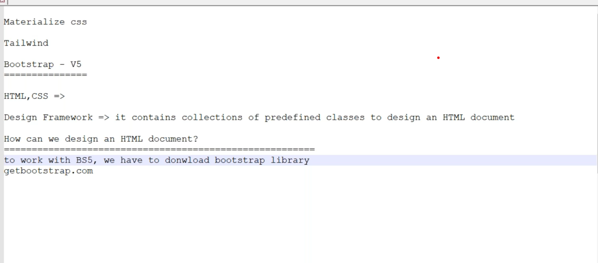
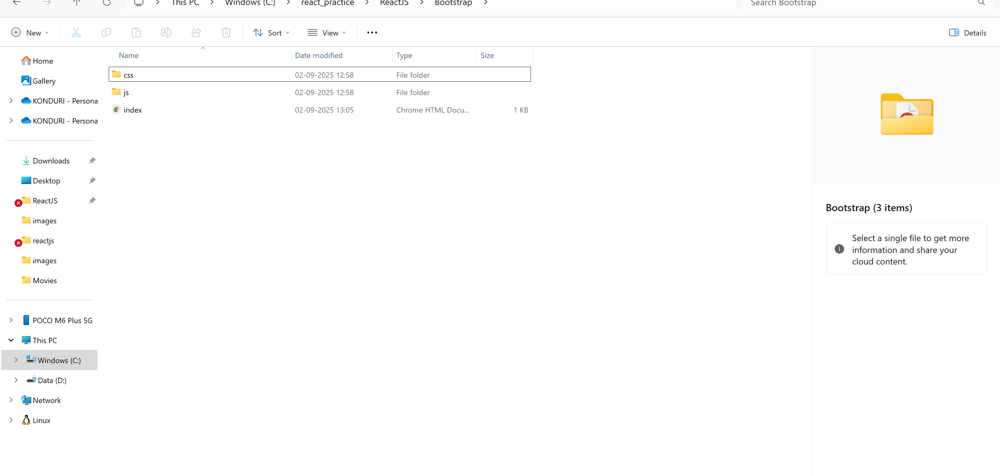
* Create  `Bootstrap` folder and download bootstrap-v5
* extract bootstrap zip file and avail the 2 folders
* Link bootstrap with file created
```
<!DOCTYPE html>
<html lang="en">
<head>
    <meta charset="UTF-8">
    <meta name="viewport" content="width=device-width, initial-scale=1.0">
    <title>Bootstrap</title>
    
</head>
<body>
    <h1>Hello, World!</h1>
    
</body>
</html>
```
```
<!DOCTYPE html>
<html lang="en">
<head>
    <meta charset="UTF-8">
    <meta name="viewport" content="width=device-width, initial-scale=1.0">
    <link rel="stylesheet" href="css/bootstrap.min.css" />
    <title>Bootstrap</title>

</head>
<body>
    <h1>Hello, World!</h1>
    
</body>
</html>
```
* See the difference
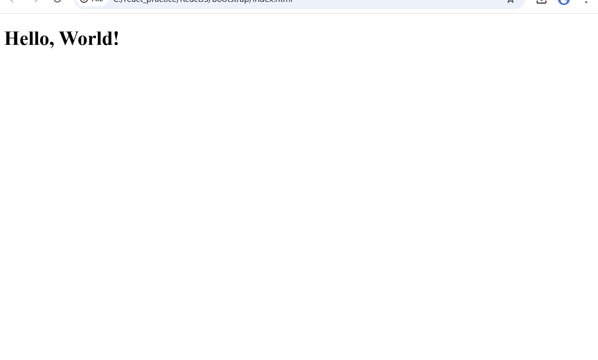
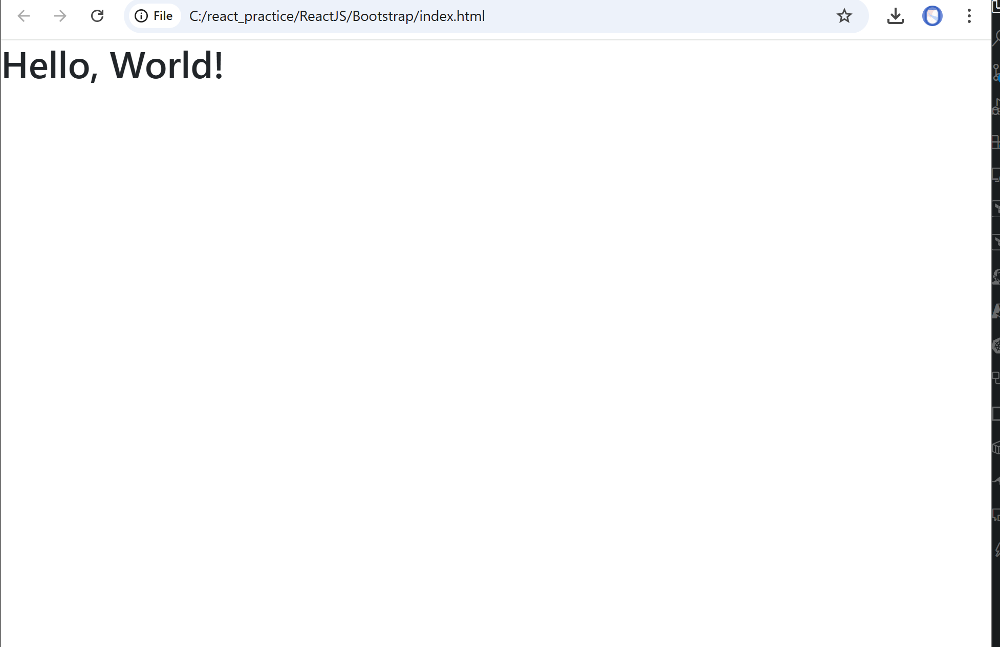

project-folder/
│── index.html
│── css/
    └── bootstrap.min.css
```jsx
<!DOCTYPE html>
<html lang="en">
<head>
    <meta charset="UTF-8">
    <meta name="viewport" content="width=device-width, initial-scale=1.0">
    <link rel="stylesheet" href="css/bootstrap.min.css" />
    <script src="js/bootstrap.bundle.js" />
    <title>Bootstrap</title>

</head>
<body>
    <h1>Hello, World!</h1>
    
</body>
</html>
```
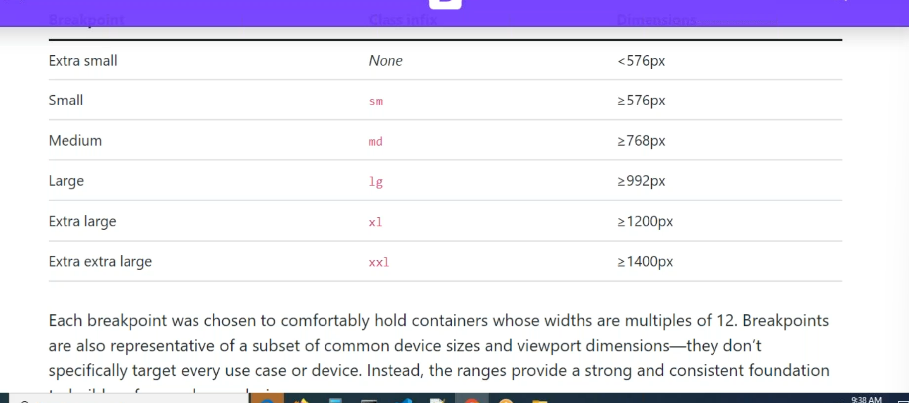
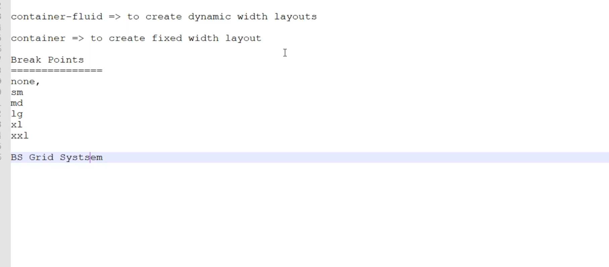
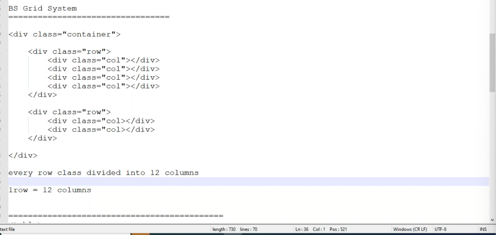
```jsx
<!DOCTYPE html>
<html lang="en">

<head>
    <meta charset="UTF-8">
    <meta name="viewport" content="width=device-width, initial-scale=1.0">
    <link rel="stylesheet" href="css/bootstrap.min.css" />
    <!-- <script src="js/bootstrap.bundle.js" /> -->
    <title>Bootstrap</title>

</head>

<body>
    <div class="container">
        <div class="row">
            <div class="col"></div>
            <div class="col"></div>
            <div class="col"></div>

        </div>
        <div class="row">
            <div class="col"></div>
            <div class="col"></div>
            <div class="col"></div>

        </div>
    </div>

</body>

</html>
```
* Every `row` contains `12 columns`
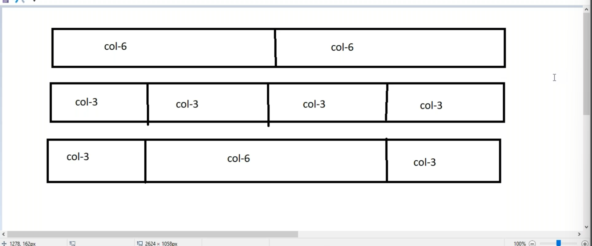

* For the customization we have to read the manual 
* As mentioned earlier for the class's and their attributes we have to read the manual
```jsx
<!DOCTYPE html>
<html lang="en">

<head>
      <meta charset="UTF-8">
      <meta name="viewport" content="width=device-width, initial-scale=1.0">
      <link rel="stylesheet" href="css/bootstrap.min.css" />
      <!-- <script src="js/bootstrap.bundle.js" /> -->
      <title>Bootstrap</title>

</head>

<body>
      <div class="container">
            <div class="row">
                  <div class="col">
                        <h1>Hello, Akhil</h1>
                  </div>
                  <div class="col">
                        <h1>Hello, Akhil</h1>
                  </div>
                  <div class="col">
                        <h1>Hello, Akhil</h1>
                  </div>

            </div>

      </div>

</body>

</html>
```
```jsx
<!DOCTYPE html>
<html lang="en">

<head>
      <meta charset="UTF-8">
      <meta name="viewport" content="width=device-width, initial-scale=1.0">
      <link rel="stylesheet" href="css/bootstrap.min.css" />
      <!-- <script src="js/bootstrap.bundle.js" /> -->
      <title>Bootstrap</title>

</head>

<body>
      <div class="container">
            <div class="row">
                  <div class="col bg-success m-1">
                        <h1 class="text-white">Hello, Akhil</h1>
                  </div>
                  <div class="col bg-success m-1">
                        <h1 class="text-white">Hello, Akhil</h1>
                  </div>
                  <div class="col bg-success m-1">
                        <h1 class="text-white">Hello, Akhil</h1>
                  </div>

            </div>

      </div>

</body>

</html>
```
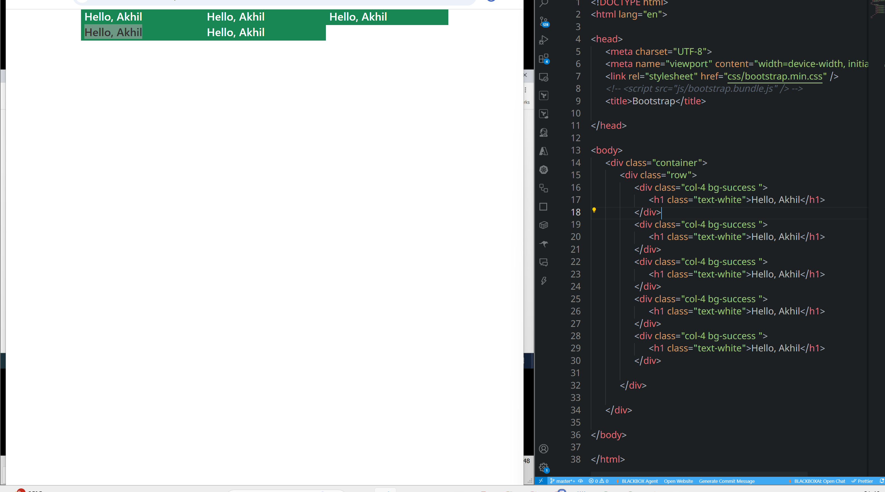
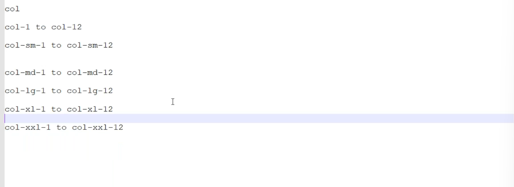
## Bootstrap Grid System
* Copy some **images** folder into **Bootstrap  folder**
* Break Point reference
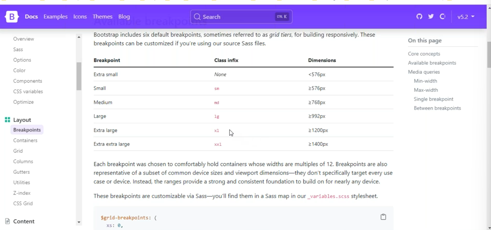
```jsx
<!DOCTYPE html>
<html lang="en">

<head>
      <meta charset="UTF-8">
      <meta name="viewport" content="width=device-width, initial-scale=1.0">
      <!-- <link rel="stylesheet" href="css/bootstrap.min.css" /> -->
      <!-- <script src="js/bootstrap.bundle.js" /> -->
      <title>Bootstrap</title>

</head>

<body>
      <div class="container">
            <div class="row">
                  <div>
                        
                        <h4>Some Title Comes here</h4>
                        <p>This is some program and the description about the program</p>
                  </div>
                  <div>
                        
                        <h4>Some Title Comes here</h4>
                        <p>This is some program and the description about the program</p>
                  </div>
                  <div>
                        
                        <h4>Some Title Comes here</h4>
                        <p>This is some program and the description about the program</p>
                  </div>
                  <div>
                        
                        <h4>Some Title Comes here</h4>
                        <p>This is some program and the description about the program</p>
                  </div>
                  <div>
                        
                        <h4>Some Title Comes here</h4>
                        <p>This is some program and the description about the program</p>
                  </div>
            </div>

      </div>

</body>

</html>
```
```jsx
<!DOCTYPE html>
<html lang="en">

<head>
      <meta charset="UTF-8">
      <meta name="viewport" content="width=device-width, initial-scale=1.0">
      <link rel="stylesheet" href="css/bootstrap.min.css" />
      <!-- <script src="js/bootstrap.bundle.js" /> -->
      <title>Bootstrap</title>

</head>

<body>
      <div class="container">
            <div class="row">
                  <div class="col">
                        
                        <h4>Some Title Comes here</h4>
                        <p>This is some program and the description about the program</p>
                  </div>
                  <div class="col">
                        
                        <h4>Some Title Comes here</h4>
                        <p>This is some program and the description about the program</p>
                  </div>
                  <div class="col">
                        
                        <h4>Some Title Comes here</h4>
                        <p>This is some program and the description about the program</p>
                  </div>
                  <div class="col">
                        
                        <h4>Some Title Comes here</h4>
                        <p>This is some program and the description about the program</p>
                  </div>
                  <div class="col">
                        
                        <h4>Some Title Comes here</h4>
                        <p>This is some program and the description about the program</p>
                  </div>
            </div>

      </div>

</body>

</html>
```
* Use **sft+ctl+i** and **sft+ctl+m** to see the resolution change
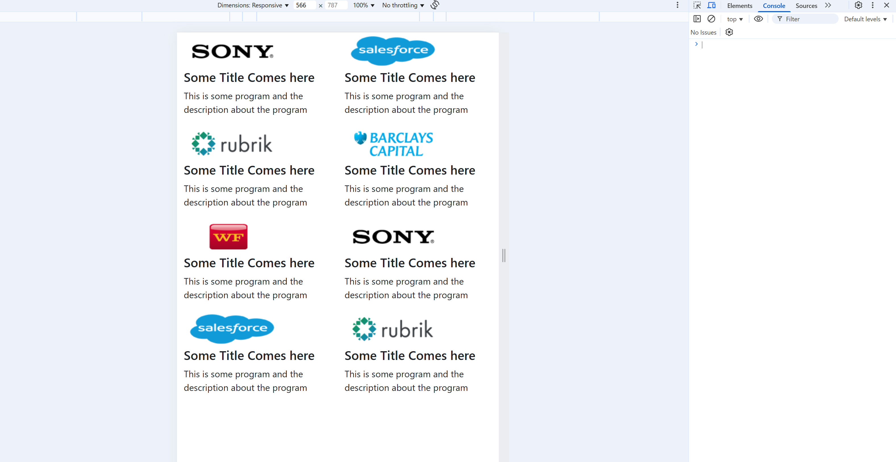
```jsx
<!DOCTYPE html>
<html lang="en">

<head>
      <meta charset="UTF-8">
      <meta name="viewport" content="width=device-width, initial-scale=1.0">
      <link rel="stylesheet" href="css/bootstrap.min.css" />
      <!-- <script src="js/bootstrap.bundle.js" /> -->
      <title>Bootstrap</title>

</head>

<body>
      <div class="container">
            <div class="row">
                  <div class="col col-sm-12 col-md-3  ">
                        
                        <h4>Some Title Comes here</h4>
                        <p>This is some program and the description about the program</p>
                  </div>
                  <div class="col col-sm-12 col-md-3">
                        
                        <h4>Some Title Comes here</h4>
                        <p>This is some program and the description about the program</p>
                  </div>
                  <div class="col col-sm-12 col-md-3">
                        
                        <h4>Some Title Comes here</h4>
                        <p>This is some program and the description about the program</p>
                  </div>
                  <div class="col col-sm-12 col-md-3">
                        
                        <h4>Some Title Comes here</h4>
                        <p>This is some program and the description about the program</p>
                  </div>
                  <div class="col col-sm-12 col-md-3">
                        
                        <h4>Some Title Comes here</h4>
                        <p>This is some program and the description about the program</p>
                  </div>
                  <div class="col col-sm-12 col-md-3">
                        
                        <h4>Some Title Comes here</h4>
                        <p>This is some program and the description about the program</p>
                  </div>
                  <div class="col col-sm-12 col-md-3">
                        
                        <h4>Some Title Comes here</h4>
                        <p>This is some program and the description about the program</p>
                  </div>
                  <div class="col col-sm-12 col-md-3">
                        
                        <h4>Some Title Comes here</h4>
                        <p>This is some program and the description about the program</p>
                  </div>

            </div>

      </div>

</body>

</html>
```

```jsx
<!DOCTYPE html>
<html lang="en">

<head>
      <meta charset="UTF-8">
      <meta name="viewport" content="width=device-width, initial-scale=1.0">
      <link rel="stylesheet" href="css/bootstrap.min.css" />
      <!-- <script src="js/bootstrap.bundle.js" /> -->
      <title>Bootstrap</title>

</head>

<body>
      <div class="container">
            <div class="row">
                  <div class="col-lg-3 col-md-6">
                        
                        <h4>Some Title Comes here</h4>
                        <p>This is some program and the description about the program</p>
                  </div>
                  <div class="col-lg-3 col-md-6">
                        
                        <h4>Some Title Comes here</h4>
                        <p>This is some program and the description about the program</p>
                  </div>
                  <div class="col-lg-3 col-md-6">
                        
                        <h4>Some Title Comes here</h4>
                        <p>This is some program and the description about the program</p>
                  </div>
                  <div class="col-lg-3 col-md-6">
                        
                        <h4>Some Title Comes here</h4>
                        <p>This is some program and the description about the program</p>
                  </div>
                  <div class="col-lg-3 col-md-6">
                        
                        <h4>Some Title Comes here</h4>
                        <p>This is some program and the description about the program</p>
                  </div>
                  <div class="col-lg-3 col-md-6">
                        
                        <h4>Some Title Comes here</h4>
                        <p>This is some program and the description about the program</p>
                  </div>
                  <div class="col-lg-3 col-md-6">
                        
                        <h4>Some Title Comes here</h4>
                        <p>This is some program and the description about the program</p>
                  </div>
                  <div class="col-lg-3 col-md-6">
                        
                        <h4>Some Title Comes here</h4>
                        <p>This is some program and the description about the program</p>
                  </div>

            </div>

      </div>

</body>

</html>
```
```jsx
<!DOCTYPE html>
<html lang="en">

<head>
      <meta charset="UTF-8">
      <meta name="viewport" content="width=device-width, initial-scale=1.0">
      <link rel="stylesheet" href="css/bootstrap.min.css" />
      <!-- <script src="js/bootstrap.bundle.js" /> -->
      <title>Bootstrap</title>

</head>

<body>
      <div class="container">
            <div class="row">
                  <div class="col-lg-3 col-md-6 border">
                        
                        <h4>Some Title Comes here</h4>
                        <p>This is some program and the description about the program</p>
                  </div>
                  <div class="col-lg-3 col-md-6 border">
                        
                        <h4>Some Title Comes here</h4>
                        <p>This is some program and the description about the program</p>
                  </div>
                  <div class="col-lg-3 col-md-6 border">
                        
                        <h4>Some Title Comes here</h4>
                        <p>This is some program and the description about the program</p>
                  </div>
                  <div class="col-lg-3 col-md-6 border">
                        
                        <h4>Some Title Comes here</h4>
                        <p>This is some program and the description about the program</p>
                  </div>


            </div>

      </div>

</body>

</html>
```
* Regarding border there is only **border-1** to **border-5**
```jsx
<!DOCTYPE html>
<html lang="en">

<head>
      <meta charset="UTF-8">
      <meta name="viewport" content="width=device-width, initial-scale=1.0">
      <link rel="stylesheet" href="css/bootstrap.min.css" />
      <!-- <script src="js/bootstrap.bundle.js" /> -->
      <title>Bootstrap</title>

</head>

<body>
      <div class="container">
            <div class="row">
                  <div class="col-lg-3 col-md-6 border border-5">
                        
                        <h4>Some Title Comes here</h4>
                        <p>This is some program and the description about the program</p>
                  </div>
                  <div class="col-lg-3 col-md-6 border border-5">
                        
                        <h4>Some Title Comes here</h4>
                        <p>This is some program and the description about the program</p>
                  </div>
                  <div class="col-lg-3 col-md-6 border border-5">
                        
                        <h4>Some Title Comes here</h4>
                        <p>This is some program and the description about the program</p>
                  </div>
                  <div class="col-lg-3 col-md-6 border border-5">
                        
                        <h4>Some Title Comes here</h4>
                        <p>This is some program and the description about the program</p>
                  </div>


            </div>

      </div>

</body>

</html>
```
```jsx
<!DOCTYPE html>
<html lang="en">

<head>
      <meta charset="UTF-8">
      <meta name="viewport" content="width=device-width, initial-scale=1.0">
      <link rel="stylesheet" href="css/bootstrap.min.css" />
      <!-- <script src="js/bootstrap.bundle.js" /> -->
      <title>Bootstrap</title>

</head>

<body>
      <div class="container">
            <div class="row">
                  <div class="col">
                        
                  </div>
            </div>
      </div>

      </div>

</body>

</html>
```
## Table
### Without class
```jsx

<!DOCTYPE html>
<html lang="en">

<head>
      <meta charset="UTF-8">
      <meta name="viewport" content="width=device-width, initial-scale=1.0">
      <link rel="stylesheet" href="css/bootstrap.min.css" />
      <!-- <script src="js/bootstrap.bundle.js" /> -->
      <title>Bootstrap</title>

</head>

<body>
      <div class="container">
            <table >
                  <thead>
                        <tr>
                              <th>Id</th>
                              <th>Name</th>
                              <th>Email</th>
                              <th>Mobile</th>
                              <th>City</th>
                        </tr>
                  </thead>
                  <tbody>
                        <tr>
                              <td>1</td>
                              <td>Akhil</td>
                              <td>akhil@gmail.com</td>
                              <td>8799338737</td>
                              <td>Hyderabad</td>
                        </tr>
                        <tr>
                              <td>1</td>
                              <td>Akhil</td>
                              <td>akhil@gmail.com</td>
                              <td>8799338737</td>
                              <td>Hyderabad</td>
                        </tr>
                        <tr>
                              <td>1</td>
                              <td>Akhil</td>
                              <td>akhil@gmail.com</td>
                              <td>8799338737</td>
                              <td>Hyderabad</td>
                        </tr>
                        <tr>
                              <td>1</td>
                              <td>Akhil</td>
                              <td>akhil@gmail.com</td>
                              <td>8799338737</td>
                              <td>Hyderabad</td>
                        </tr>
                        <tr>
                              <td>1</td>
                              <td>Akhil</td>
                              <td>akhil@gmail.com</td>
                              <td>8799338737</td>
                              <td>Hyderabad</td>
                        </tr>
                  </tbody>
            </table>
      </div>

      </div>

</body>

</html>
```

### With class
```jsx
<!DOCTYPE html>
<html lang="en">

<head>
      <meta charset="UTF-8">
      <meta name="viewport" content="width=device-width, initial-scale=1.0">
      <link rel="stylesheet" href="css/bootstrap.min.css" />
      <!-- <script src="js/bootstrap.bundle.js" /> -->
      <title>Bootstrap</title>

</head>

<body>
      <div class="container">
            <table class="table">
                  <thead>
                        <tr>
                              <th>Id</th>
                              <th>Name</th>
                              <th>Email</th>
                              <th>Mobile</th>
                              <th>City</th>
                        </tr>
                  </thead>
                  <tbody>
                        <tr>
                              <td>1</td>
                              <td>Akhil</td>
                              <td>akhil@gmail.com</td>
                              <td>8799338737</td>
                              <td>Hyderabad</td>
                        </tr>
                        <tr>
                              <td>1</td>
                              <td>Akhil</td>
                              <td>akhil@gmail.com</td>
                              <td>8799338737</td>
                              <td>Hyderabad</td>
                        </tr>
                        <tr>
                              <td>1</td>
                              <td>Akhil</td>
                              <td>akhil@gmail.com</td>
                              <td>8799338737</td>
                              <td>Hyderabad</td>
                        </tr>
                        <tr>
                              <td>1</td>
                              <td>Akhil</td>
                              <td>akhil@gmail.com</td>
                              <td>8799338737</td>
                              <td>Hyderabad</td>
                        </tr>
                        <tr>
                              <td>1</td>
                              <td>Akhil</td>
                              <td>akhil@gmail.com</td>
                              <td>8799338737</td>
                              <td>Hyderabad</td>
                        </tr>
                  </tbody>
            </table>
      </div>

      </div>

</body>

</html>
```
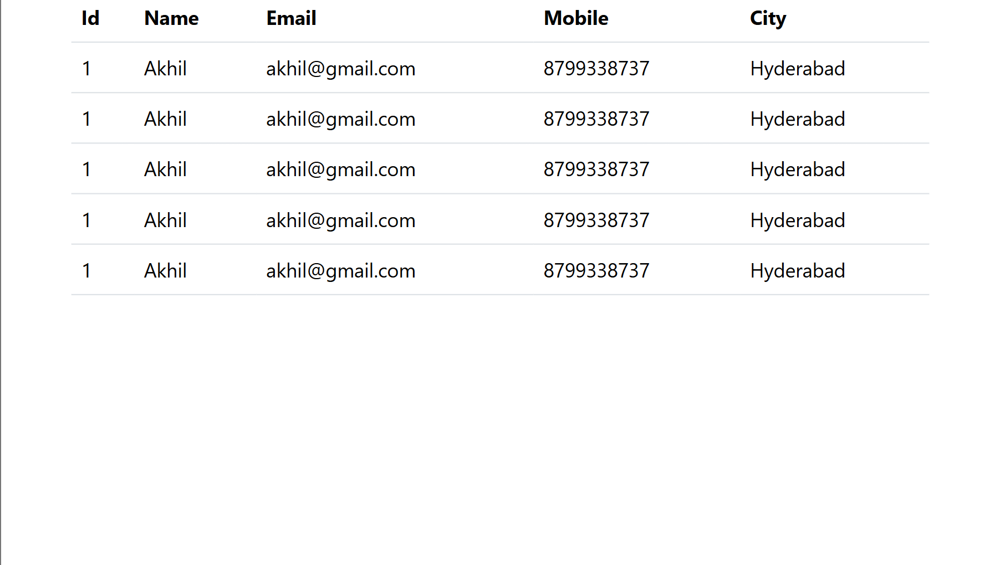


