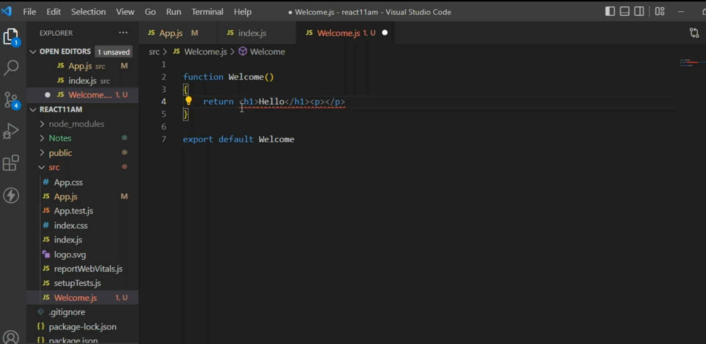
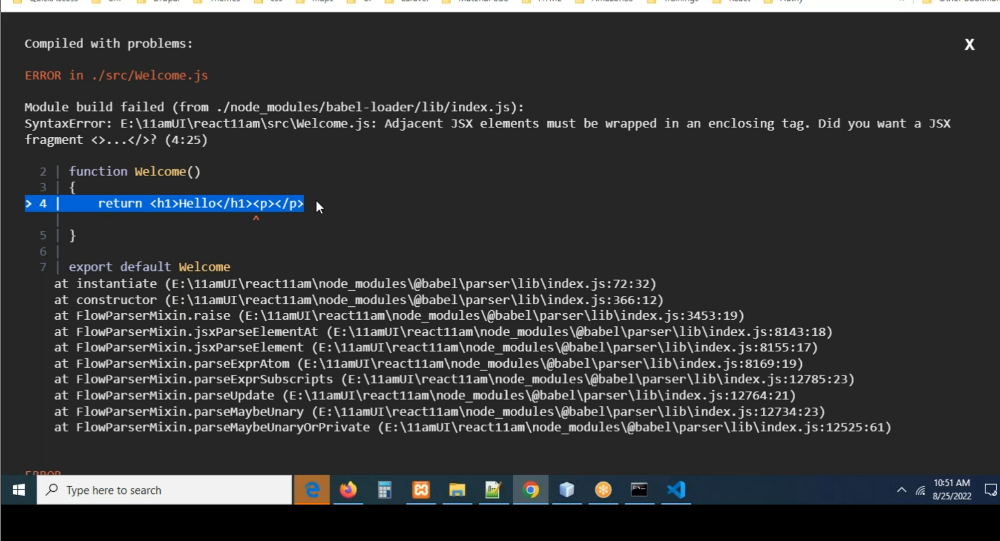
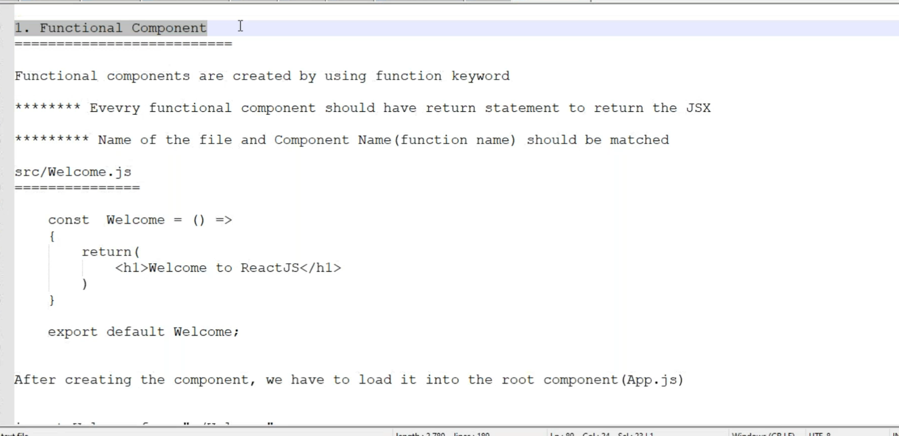
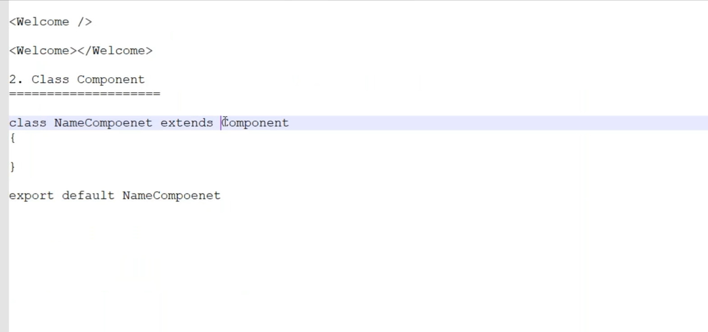
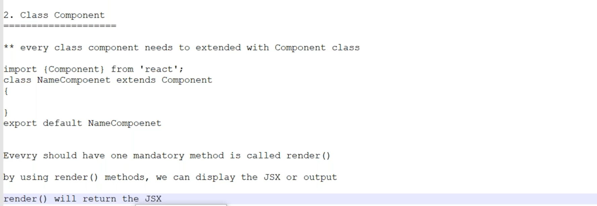
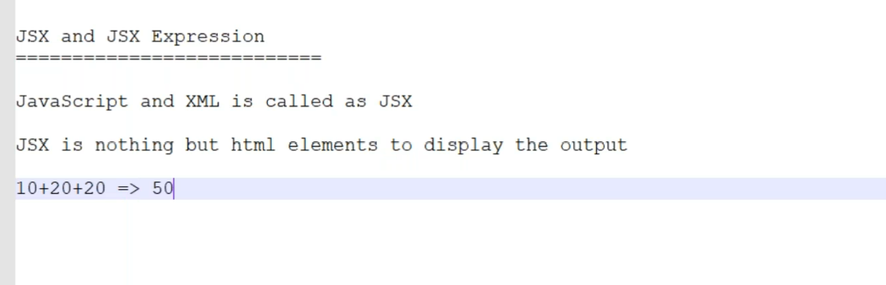
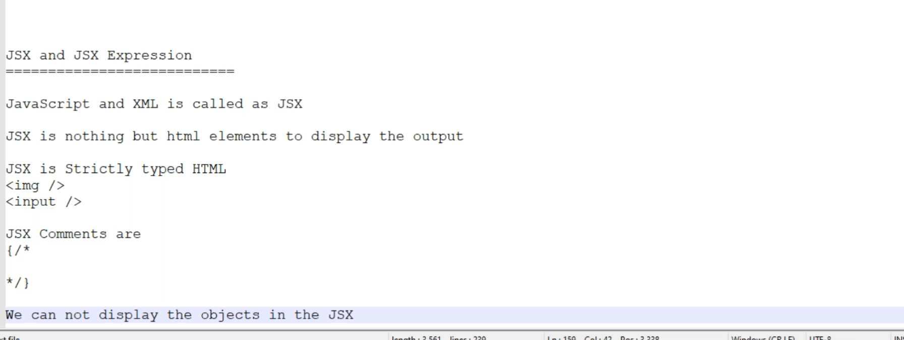
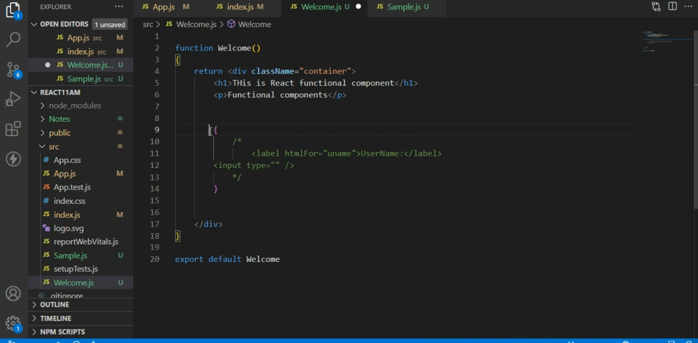

 * In the functional component we should have atleast one parent element
     * In that parent element you can write no of elements you wish



```jsx
import logo from './logo.svg';
import './App.css';
import Welcome from './Welcome';
import About from './About';

function App() {
  return (
    <div className="App">
      <h1>Welcome To React</h1>
      < Welcome />
      < About />
    </div>
  );
}

export default App;

```


* class component always use **extends** with Component

* render () will have return statement to return jsx
```simple.js
import { Component } from "react";
class Simple extends Component
{
    render()
    {
        return <div>
            <h1>Class  Component</h1>
            <p>from simple.js</p>
        </div>
    }
}
export default Simple
```
```App.js
import logo from './logo.svg';
import './App.css';
import Welcome from './Welcome';
import About from './About';
import Simple from './Simple';

function App() {
  return (
    <div className="App">
      <h1>Welcome To React</h1>
      < Welcome />
      < About />
      <Simple />
      <Simple></Simple>
    </div>
  );
}

export default App;
```



### Code Comment in JSX


```simple.js
import { Component } from "react";
import Welcome from "./Welcome";
class Simple extends Component
{
    render(){
        return <div>
            <h1>Class Component</h1>
            <p>From simple.js</p>
            <h2>Current Date: { new Date().toLocaleString()}</h2>
            <hr></hr>
        </div>
    }
}

export default Simple
```
```simple.js
import { Component } from "react";
import Welcome from "./Welcome";

class Simple extends Component {
  username = "AkhilKonduri";

  render() {
    return (
      <div>
        <h1>Welcome {this.username}</h1>
        <h1>Class Component</h1>
        <p>From simple.js</p>
        <h2>Current Date: { new Date().toLocaleString() }</h2>
        <hr />
      </div>
    );
  }
}

export default Simple;

```
```simple.js
import { Component } from "react";
import Welcome from "./Welcome";

class Simple extends Component {
  username = "AkhilKonduri";
  y = 100;


  render() {
    let x = 200;
    
    return (
      <div>
        <h1>Welcome {this.username}</h1>
        <h1>Class Component</h1>
        <p>The value of x is: {x}</p>
        <h2>Current Date: { new Date().toLocaleString() }</h2>
        <h1>The sum of x and y is: {x + this.y}</h1>
        <hr />
      </div>
    );
  }
}

export default Simple;

```
# ChatGPT
# ReactJS Notes

---

## 1. Functional Components

### ✅ Key Points:
- Created using the `function` keyword or arrow function syntax.
- Must return **JSX** inside a `return` statement.
- File name and component name should match (PascalCase preferred).
- Example usage in `App.js`:  
  `<Welcome />` or `<Welcome></Welcome>`

### 📁 `src/Welcome.js`

```js
const Welcome = () => {
  return (
    <h1>Welcome to ReactJS</h1>
  );
};

export default Welcome;
```

---

## 2. Class Components

### ✅ Key Points:
- The `return()` method must return a single **parent** element (like a `<div>` or `<>...</>` fragment).
- Created using the `class` keyword.
- Must **extend `Component`** from React.
- Must contain a **`render()`** method.
- `render()` must return JSX.
- You can use `this.property` to access class variables.

### 📁 Example 1: `Simple.js`

```js
import { Component } from "react";

class Simple extends Component {
  render() {
    return (
      <div>
        <h1>Class Component</h1>
        <p>From simple.js</p>
      </div>
    );
  }
}

export default Simple;
```

---

### 📁 Example 2: With Class Variables and Expressions

```js
import { Component } from "react";

class Simple extends Component {
  username = "AkhilKonduri";
  y = 100;

  render() {
    let x = 200;

    return (
      <div>
        <h1>Welcome {this.username}</h1>
        <h1>Class Component</h1>
        <p>The value of x is: {x}</p>
        <h2>Current Date: { new Date().toLocaleString() }</h2>
        <h1>The sum of x and y is: {x + this.y}</h1>
        <hr />
      </div>
    );
  }
}

export default Simple;
```

---

## 3. JSX and JSX Expressions

### ✅ JSX (JavaScript + XML):
- Allows HTML-like syntax in JavaScript.
- Used to describe UI structure.
- JSX is **strictly typed HTML**:
  - Tags like ``, `<input />` must be self-closing.

### ✅ JSX Expression:
- JavaScript expressions inside `{}`.
- Examples:
  ```jsx
  <h2>{10 + 20 + 20}</h2>  // Output: 50
  ```

### ❌ Cannot display JavaScript objects directly in JSX.

### ✅ JSX Comments:

```jsx
{/* This is a JSX comment */}
```

---

## 4. `App.js` – Root Component

### 📁 Example Usage

```js
import logo from './logo.svg';
import './App.css';
import Welcome from './Welcome';
import About from './About';
import Simple from './Simple';

function App() {
  return (
    <div className="App">
      <h1>Welcome To React</h1>
      <Welcome />
      <About />
      <Simple />
      <Simple></Simple>
    </div>
  );
}

export default App;
```

---

## Summary Table

| Component Type     | Syntax             | Required Method | File Naming Rule |
|--------------------|--------------------|------------------|------------------|
| Functional         | `function` / Arrow | `return()`       | Match Component  |
| Class              | `class extends Component` | `render()`    | Match Component  |

---