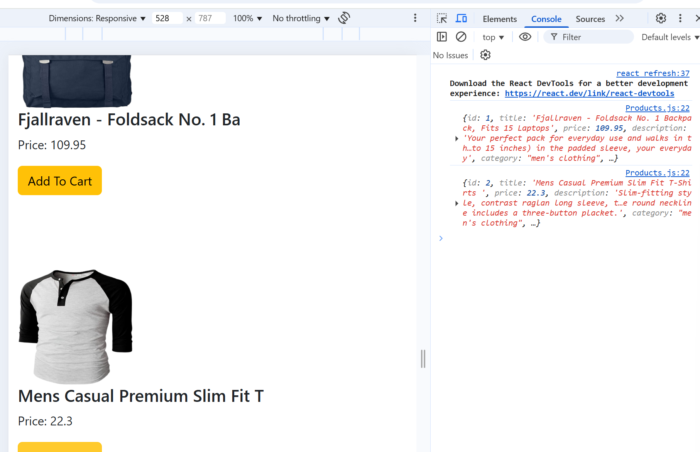
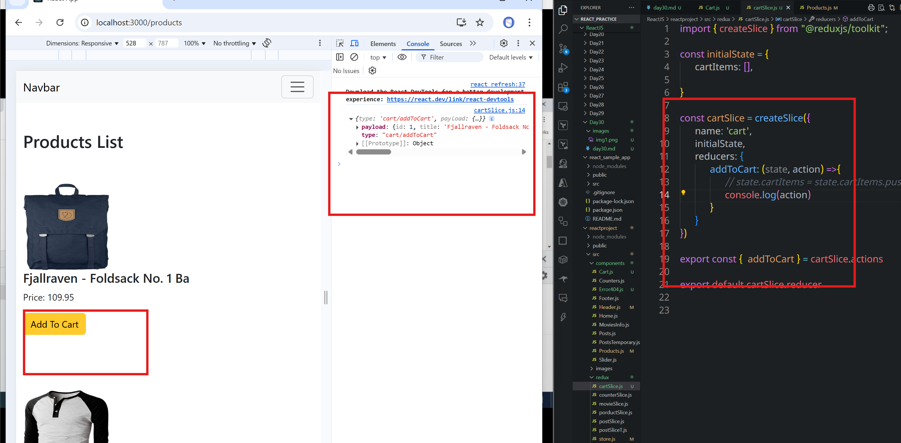
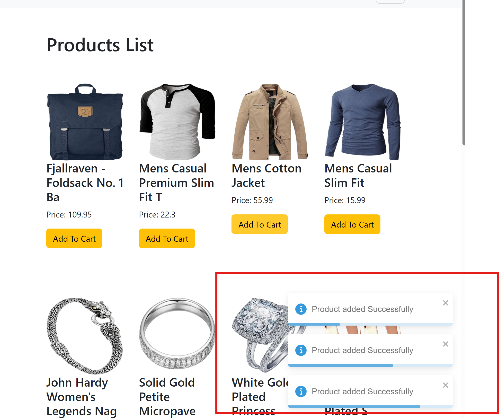
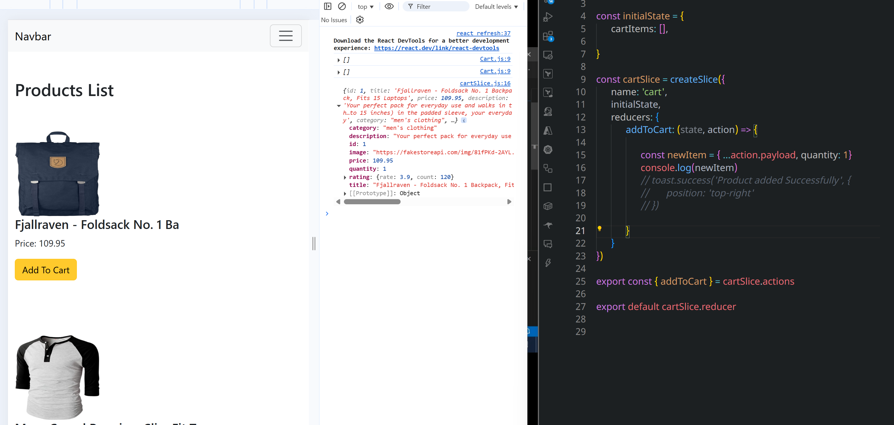
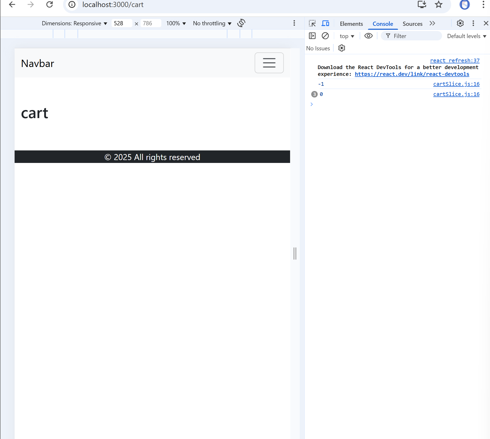
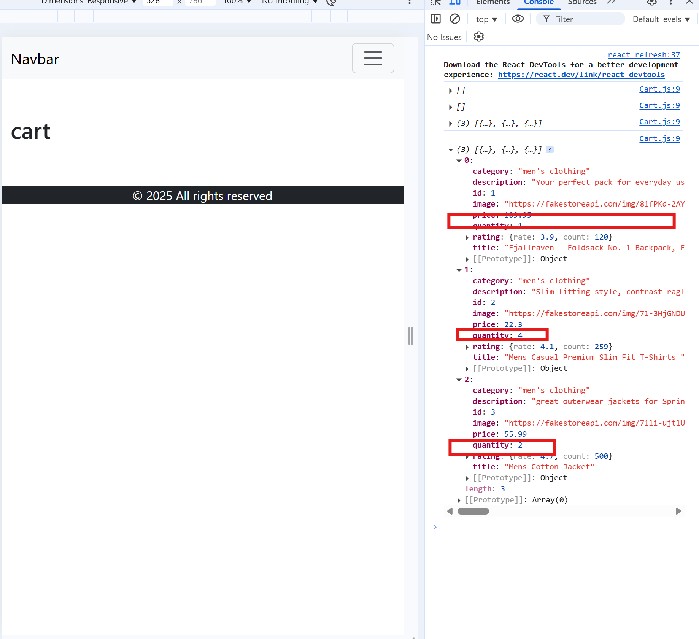
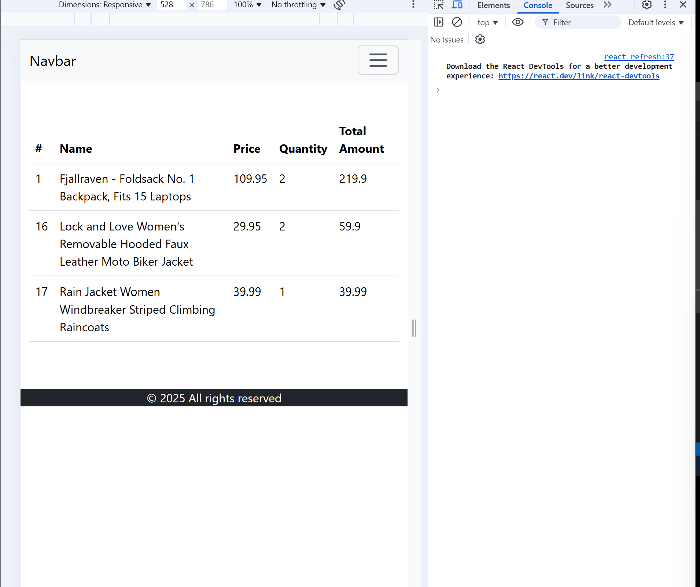
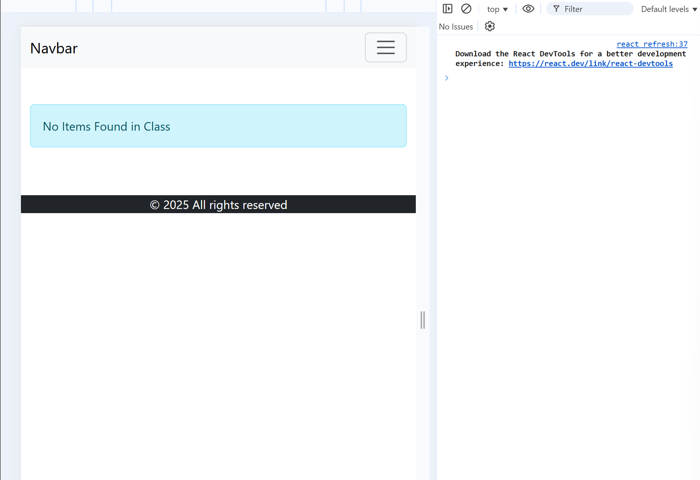

# Day30

## In the **reactproject** project adding **cart** section

- Create Cart component in the components section
- 14:00

### make changes for the Product component as below

```jsx
import React, { useEffect } from "react";
import Header from "./Header";
import Footer from "./Footer";
import { useDispatch, useSelector } from "react-redux";
import { fetchProducts } from "../redux/porductSlice";

const Products = () => {
  const productlist = useSelector((state) => state.products.items);
  const pStatus = useSelector((state) => state.products.status);
  const pError = useSelector((state) => state.products.error);
  const dispatch = useDispatch();

  useEffect(() => {
    if (pStatus == "idle") {
      dispatch(fetchProducts());
    }
  }, [productlist, dispatch]);

  const addProductToCart = (product) => {
    console.log(product);
  };

  return (
    <div>
      <Header />
      <section className=" container py-5">
        <div className="row">
          <h1>Products List</h1>
          {pStatus == "loading" ? <p>Loading...</p> : null}
          {pError ? <p className="alert alert-danger">{pError}</p> : null}
          {productlist.length > 0
            ? productlist.map((item, index) => (
                <div className="col-md-3 my-5" key={index}>
                  
                  <h4>{item.title.substr(0, 30)}</h4>
                  <p>Price: {item.price}</p>
                  <button
                    onClick={() => addProductToCart(item)}
                    className="btn btn-warning"
                  >
                    Add To Cart
                  </button>
                </div>
              ))
            : null}
        </div>
      </section>
      <Footer />
    </div>
  );
};

export default Products;
```

### Onclicking the products are being added logged into console




```JSX
import { createSlice } from "@reduxjs/toolkit";

const initialState = {
      cartItems: [],

}

const cartSlice = createSlice({
      name: 'cart',
      initialState,
      reducers: {
            addToCart: (state, action) =>{
                  // state.cartItems = state.cartItems.push(action.payload)
                  state.cartItems.push(action.payload)
            }
      }
})

export const {  addToCart } = cartSlice.actions

export default cartSlice.reducer
```

```jsx
import React from "react";
import Header from "./Header";
import Footer from "./Footer";
import { useSelector } from "react-redux";

const Cart = () => {
  const cartProducts = useSelector((state) => state.cart.cartItems);
  console.log(cartProducts);
  return (
    <>
      <Header />
      <section className="container py-5">
        <h1>cart</h1>
      </section>
      <Footer />
    </>
  );
};

export default Cart;
```

### install `toastify` for the notifications

- `npm install react-toastify`
- Make changes in the **App.js** and **cartSlice.js**

```jsx
import React from "react";
import { Routes, Route, BrowserRouter } from "react-router-dom";
import Home from "./components/Home";
import Posts from "./components/Posts";
import MoviesInfo from "./components/MoviesInfo";
import Counters from "./components/Counters";
import PostsTemporary from "./components/PostsTemporary";
import Products from "./components/Products";
import Cart from "./components/Cart";
import Error404 from "./components/Error404";
import "react-toastify/dist/ReactToastify.css";
import { ToastContainer } from "react-toastify";

const App = () => {
  return (
    <BrowserRouter>
      <ToastContainer />
      <Routes>
        <Route path="/" element={<Home />} />
        <Route path="/posts" element={<Posts />}></Route>
        <Route path="/movies" element={<MoviesInfo />}></Route>
        <Route path="/counter" element={<Counters />}></Route>
        <Route path="/postst" element={<PostsTemporary />}></Route>
        <Route path="/products" element={<Products />}></Route>
        <Route path="/cart" element={<Cart />}></Route>
        <Route path="*" element={<Error404 />}></Route>
      </Routes>
    </BrowserRouter>
  );
};

export default App;
```

```jsx
import { createSlice } from "@reduxjs/toolkit";
import { toast } from "react-toastify";

const initialState = {
  cartItems: [],
};

const cartSlice = createSlice({
  name: "cart",
  initialState,
  reducers: {
    addToCart: (state, action) => {
      // state.cartItems = state.cartItems.push(action.payload)
      state.cartItems.push(action.payload);
      toast.info("Product added Successfully", {
        position: "bottom-right",
      });
    },
  },
});

export const { addToCart } = cartSlice.actions;

export default cartSlice.reducer;
```



- In the json data there is no **quantity** attribute.
- Let's add this **quantity** to the data.
  

```jsx
import { createSlice } from "@reduxjs/toolkit";
import { toast } from "react-toastify";

const initialState = {
  cartItems: [],
};

const cartSlice = createSlice({
  name: "cart",
  initialState,
  reducers: {
    addToCart: (state, action) => {
      const newItem = { ...action.payload, quantity: 1 };
      console.log(newItem);
      // toast.success('Product added Successfully', {
      //       position: 'top-right'
      // })
    },
  },
});

export const { addToCart } = cartSlice.actions;

export default cartSlice.reducer;
```

```jsx
import React from "react";
import Header from "./Header";
import Footer from "./Footer";
import { useSelector } from "react-redux";

const Cart = () => {
  const cartProducts = useSelector((state) => state.cart.cartItems);
  console.log(cartProducts);
  return (
    <>
      <Header />
      <section className="container py-5">
        <h1>cart</h1>
      </section>
      <Footer />
    </>
  );
};

export default Cart;
```

```jsx
import { createSlice } from "@reduxjs/toolkit";
import { toast } from "react-toastify";

const initialState = {
  cartItems: [],
};

const cartSlice = createSlice({
  name: "cart",
  initialState,
  reducers: {
    addToCart: (state, action) => {
      const findItem = state.cartItems.findIndex(
        (item) => item.id === action.payload.id
      );
      console.log(findItem);
      const newItem = { ...action.payload, quantity: 1 };
      state.cartItems.push(newItem);

      toast.success("Product added Successfully", {
        position: "top-right",
      });
    },
  },
});

export const { addToCart } = cartSlice.actions;

export default cartSlice.reducer;
```



```jsx
import { createSlice } from "@reduxjs/toolkit";
import { toast } from "react-toastify";

const initialState = {
  cartItems: [],
};

const cartSlice = createSlice({
  name: "cart",
  initialState,
  reducers: {
    addToCart: (state, action) => {
      const findItem = state.cartItems.findIndex(
        (item) => item.id === action.payload.id
      );

      if (findItem > -1) {
        toast.success("Item Already Exists", {
          position: "top-right",
        });
      } else {
        const newItem = { ...action.payload, quantity: 1 };
        state.cartItems.push(newItem);
        toast.success("Product added Successfully", {
          position: "top-right",
        });
      }
    },
  },
});

export const { addToCart } = cartSlice.actions;

export default cartSlice.reducer;
```

```jsx
import { createSlice } from "@reduxjs/toolkit";
import { toast } from "react-toastify";

const initialState = {
  cartItems: [],
};

const cartSlice = createSlice({
  name: "cart",
  initialState,
  reducers: {
    addToCart: (state, action) => {
      const findItem = state.cartItems.findIndex(
        (item) => item.id === action.payload.id
      );

      if (findItem > -1) {
        state.cartItems[findItem].quantity++;
        toast.info("Quantity Increased", {
          position: "top-right",
        });
      } else {
        const newItem = { ...action.payload, quantity: 1 };
        state.cartItems.push(newItem);
        toast.success("Product added Successfully", {
          position: "top-right",
        });
      }
    },
  },
});

export const { addToCart } = cartSlice.actions;

export default cartSlice.reducer;
```

```jsx
import React from "react";
import Header from "./Header";
import Footer from "./Footer";
import { useSelector } from "react-redux";

const Cart = () => {
  const cartProducts = useSelector((state) => state.cart.cartItems);
  console.log(cartProducts);
  return (
    <>
      <Header />
      <section className="container py-5">
        <h1>cart</h1>
      </section>
      <Footer />
    </>
  );
};

export default Cart;
```



```jsx
import React from "react";
import Header from "./Header";
import Footer from "./Footer";
import { useSelector } from "react-redux";

const Cart = () => {
  const cartProducts = useSelector((state) => state.cart.cartItems);

  const content =
    cartProducts.length > 0
      ? cartProducts.map((item, index) => (
          <tr key={index}>
            <td>{item.id}</td>
            <td>{item.title}</td>
            <td>{item.price}</td>
            <td>{item.quantity}</td>
            <td>{item.quantity * item.price}</td>
          </tr>
        ))
      : null;

  return (
    <>
      <Header />
      <section className="container py-5">
        <table className="table">
          <thead>
            <tr>
              <th>#</th>
              <th>Name</th>
              <th>Price</th>
              <th>Quantity</th>
              <th>Total Amount</th>
            </tr>
          </thead>
          <tbody>{content}</tbody>
        </table>
      </section>
      <Footer />
    </>
  );
};

export default Cart;
```

```jsx
{
  cartProducts.length > 0 ? (
    <table className="table">
      <thead>
        <tr>
          <th>#</th>
          <th>Name</th>
          <th>Price</th>
          <th>Quantity</th>
          <th>Total Amount</th>
        </tr>
      </thead>
      <tbody>{content}</tbody>
    </table>
  ) : null;
}
```



```jsx
<section className="container py-5">
  {cartProducts.length > 0 ? (
    <table className="table">
      <thead>
        <tr>
          <th>#</th>
          <th>Name</th>
          <th>Price</th>
          <th>Quantity</th>
          <th>Total Amount</th>
        </tr>
      </thead>
      <tbody>{content}</tbody>
    </table>
  ) : (
    <div className="alert alert-info">No Items Found in Class</div>
  )}
</section>
```


