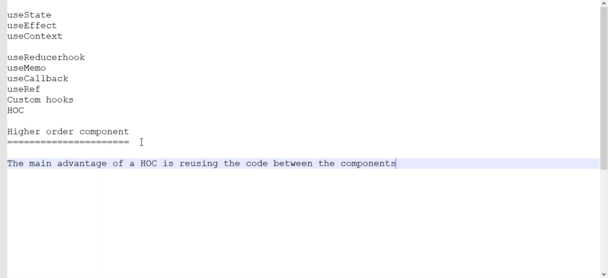
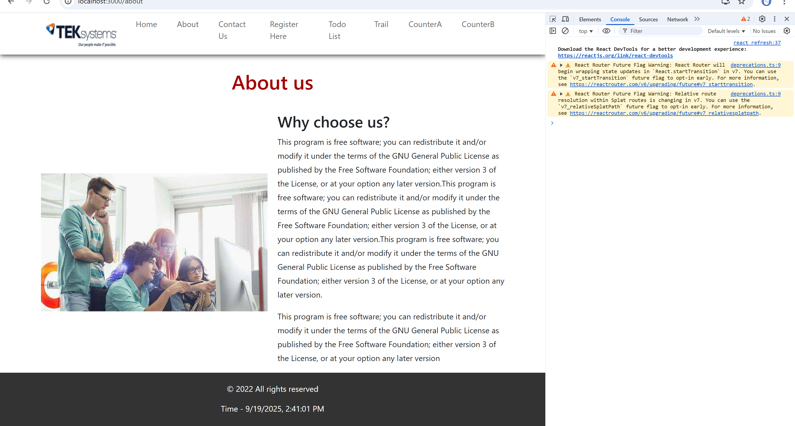

# Day 34

# Remaining Hooks

- Already we have learnt about **useState, useEffect and useSelector** hooks
- We are going to learn remaining hooks **useReducer, useMemo, useCallback and useRef**
  

## Higher Order Components

- This is going to do in the **react_sample_app**
- Create component called CounterA.js
  Got it 👍 Let’s carefully break down what’s happening in your code.

What you have here is a **Higher-Order Component (HOC)** in React.
A **HOC** is basically a function that takes a component as input and returns a new component with some extra logic or props.

---

### Step by Step Explanation

```js
const reusableCounter = (OriginalComponent) => {
```

- `reusableCounter` is a **function**.
- It takes one argument: `OriginalComponent` (any React component).
- This means we are wrapping `OriginalComponent` with some reusable functionality.

---

```js
class NewComponent extends React.Component {
```

- Inside, you define a new **class component** called `NewComponent`.
- This is the wrapper that adds **counter logic** to the `OriginalComponent`.

---

```js
constructor() {
      this.state = {
            counter: 0
      }
}
```

- The wrapper component manages its own state: a single property `counter`, initialized to `0`.
- ⚠️ One issue: since you’re using a class component, normally you should write

  ```js
  constructor(props) {
    super(props);
    this.state = { counter: 0 }
  }
  ```

  Otherwise `this.state` won’t work properly.

---

### Methods for Counter

```js
incrementCounter = () => {
  this.setState({
    counter: this.state.counter + 1,
  });
};
```

- Increases the counter by `1`.

```js
decrementCounter = () => {
  this.setState({
    counter: this.state.counter - 1,
  });
};
```

- Decreases the counter by `1`.

```js
resetCounter = () => {
  this.setState({
    counter: 0,
  });
};
```

- Resets counter back to `0`.

---

### Render Method

```js
render() {
      return (
            <OriginalComponent
                  counter={this.state.counter}
                  incrementCounter={this.incrementCounter}
                  decrementCounter={this.decrementCounter}
                  resetCounter={this.resetCounter}
            />
      )
}
```

- Instead of rendering itself, `NewComponent` renders the `OriginalComponent`.
- But it **injects props** into `OriginalComponent`:

  - `counter` (the value from state)
  - `incrementCounter` (function)
  - `decrementCounter` (function)
  - `resetCounter` (function)

So, the `OriginalComponent` can use these props as if it had its own counter logic — even though the logic actually lives in the HOC.

---

### Return

```js
return NewComponent;
```

- Finally, `reusableCounter` returns the new, enhanced component.

---

✅ **In short**:
This pattern is called a **Higher-Order Component (HOC)**.
It allows you to **reuse logic** (counter state + functions) across multiple components, without duplicating code.

```jsx
import React, { useState } from "react";
import Footer from "./Footer";
import Header from "./Header";

const CounterA = () => {
  const [counter, setCounter] = useState(0);

  const incrementCounter = () => {
    setCounter(counter + 1);
  };

  return (
    <>
      <Header />
      <section className="content">
        <h1>CounterA- {counter}</h1>
        <button onClick={incrementCounter}>Increment</button>
      </section>
      <Footer />
    </>
  );
};

export default CounterA;
```

- Create another component called CounterB.js

```jsx
import React, { useState } from "react";
import Footer from "./Footer";
import Header from "./Header";

const CounterB = () => {
  const [counter, setCounter] = useState(0);

  const incrementCounter = () => {
    setCounter(counter + 1);
  };

  return (
    <>
      <Header />
      <section className="content">
        <h1>CounterB- {counter}</h1>
        <button onClick={incrementCounter}>Increment</button>
      </section>
      <Footer />
    </>
  );
};

export default CounterB;
```

- Here Increment logic is written twice but our goal is to use the same logic with writing multiple times
- Create **reusableCounter.js**

```jsx
const reusableCounter = (OriginalComponent) => {
  class NewComponent extends React.Component {
    constructor() {
      this.state = {
        counter: 0,
      };
    }

    incrementCounter = () => {
      this.setState({
        counter: this.state.counter + 1,
      });
    };

    decrementCounter = () => {
      this.setState({
        counter: this.state.counter - 1,
      });
    };

    resetCounter = () => {
      this.setState({
        counter: 0,
      });
    };

    render() {
      return (
        <OriginalComponent
          counter={this.state.counter}
          incrementCounter={this.incrementCounter}
          decrementCounter={this.decrementCounter}
          resetCounter={this.resetCounter}
        />
      );
    }
  }
  return NewComponent;
};
```

- CounterA before

```jsx
import React, { useState } from "react";
import Footer from "./Footer";
import Header from "./Header";

const CounterA = () => {
  const [counter, setCounter] = useState(0);

  const incrementCounter = () => {
    setCounter(counter + 1);
  };

  return (
    <>
      <Header />
      <section className="content">
        <h1>CounterA- {counter}</h1>
        <button onClick={incrementCounter}>Increment</button>
      </section>
      <Footer />
    </>
  );
};

export default CounterA;
```

- After Counter A

```jsx
import React from "react";
import Footer from "./Footer";
import Header from "./Header";
import reusableCounter from "./reusableCounter";

const CounterA = (props) => {
  const { counter, incrementCounter, decrementCounter, resetCounter } = props;
  return (
    <>
      <Header />
      <section className="content">
        <h1>CounterA- {counter}</h1>
        <button onClick={incrementCounter}>Increment</button>
        <button onClick={decrementCounter}>Decrement</button>
        <button onClick={resetCounter}>Reset</button>
      </section>
      <Footer />
    </>
  );
};

export default reusableCounter(CounterA);
```

```jsx
import React from "react";
import Footer from "./Footer";
import Header from "./Header";
import reusableCounter from "./reusableCounter";

const CounterB = (props) => {
  const { counter, incrementCounter, decrementCounter, resetCounter } = props;

  return (
    <>
      <Header />
      <section className="content">
        <h1>CounterB- {counter}</h1>
        <button onClick={incrementCounter}>Increment</button>
        <button onClick={decrementCounter}>Decrement</button>
        <button onClick={resetCounter}>Reset</button>
      </section>
      <Footer />
    </>
  );
};

export default reusableCounter(CounterB);
```

### If props are coming from two different components what should we do?(for example props from the App.js and reusableCounter.js )

```jsx
import React from "react";

const reusableCounter = (OriginalComponent) => {
  class NewComponent extends React.Component {
    constructor(props) {
      super(props);
      this.state = {
        counter: 0,
      };
    }

    incrementCounter = () => {
      this.setState({
        counter: this.state.counter + 1,
      });
    };

    decrementCounter = () => {
      this.setState({
        counter: this.state.counter - 1,
      });
    };

    resetCounter = () => {
      this.setState({
        counter: 0,
      });
    };

    render() {
      return (
        <OriginalComponent
          {...this.props}
          counter={this.state.counter}
          incrementCounter={this.incrementCounter}
          decrementCounter={this.decrementCounter}
          resetCounter={this.resetCounter}
        />
      );
    }
  }
  return NewComponent;
};
export default reusableCounter;
```

```jsx
import "./App.css";
import { BrowserRouter, Route, Routes } from "react-router-dom";
import React from "react";
import Home from "./components/Home";
import CounterA from "./components/CounterA";
import About from "./components/About";
import Register from "./components/Register";
import Contact from "./components/Contact";
import TodoList from "./components/TodoList";
import CounterB from "./components/CounterB";

export const SubjectsContext = React.createContext();
export const UserContext = React.createContext();
function App() {
  const subjects = ["HTML", "JS", "REACT"];

  return (
    <UserContext.Provider value={{ username: "akhilkonduri", id: "488" }}>
      <SubjectsContext.Provider value={subjects}>
        <BrowserRouter>
          <Routes>
            <Route path="/" element={<Home />}></Route>
            <Route path="/about" element={<About />}></Route>
            <Route path="/contact" element={<Contact />}></Route>
            <Route path="/register" element={<Register />}></Route>
            <Route path="/todo" element={<TodoList />}></Route>
            <Route path="/countera" element={<CounterA />}></Route>
            <Route
              path="/counterb"
              element={<CounterB myname="Konduri Akhil" city="Martur" />}
            ></Route>
          </Routes>
        </BrowserRouter>
      </SubjectsContext.Provider>
    </UserContext.Provider>
  );
}

export default App;
```

### By using this HOC we can add date to the Footer componet

- Create **dateInfo.js** component
- At this time we are using functional components

```jsx
import React from "react";
import dateInfo from "./dateInfo";

const Footer = (props) => {
  const { time } = props;

  return (
    <footer id="footer">
      <div className="footer">
        <p>&copy; 2022 All rights reserved</p>
        <p>Time - {time}</p>
      </div>
    </footer>
  );
};

export default dateInfo(Footer);
```

```jsx
const dateInfo = (OriginalComponent) => {
  const getTimeInfo = (props) => {
    const d = new Date();
    let time = d.toLocaleString();

    return <OriginalComponent {...props} time={time} />;
  };
  return getTimeInfo;
};

export default dateInfo;
```



- We can also change the Header section with time like below

```jsx
import React from "react";
import logo from "../assets/images/10.png";
import { Link } from "react-router-dom";
import dateInfo from "./dateInfo";

const Header = (props) => {
  const { time } = props;

  return (
    <header id="header">
      <div className="header">
        <div className="logo">
          
        </div>
        <div className="mainmenu">
          <ul className="menu">
            <li>
              <Link to="/">Home</Link>
            </li>
            <li>
              <Link to="/about">About</Link>
            </li>
            <li>
              <Link to="/contact">Contact Us</Link>
            </li>
            <li>
              <Link to="/register">Register Here</Link>
            </li>
            <li>
              <Link to="/todo">Todo List</Link>
            </li>
            <li>
              <Link to="/trail">Trail</Link>
            </li>
            <li>
              <Link to="/countera">CounterA</Link>
            </li>
            <li>
              <Link to="/counterb">CounterB</Link>
            </li>
            <li>
              <h2>Time-{time}</h2>
            </li>
          </ul>
        </div>
      </div>
    </header>
  );
};

export default dateInfo(Header);
```

```jsx
const dateInfo = (OriginalComponent) => {
  const getTimeInfo = (props) => {
    const d = new Date();
    let time = d.toLocaleDateString();

    return <OriginalComponent {...props} time={time} />;
  };
  return getTimeInfo;
};

export default dateInfo;
```


### For Timer

```jsx
import React, { useEffect, useState } from "react";

const dateInfo = (OriginalComponent) => {
  const NewComponent = () => {
    const [timer, setTimer] = useState(new Date().toLocaleString());

    useEffect(() => {
      setInterval(() => {
        setTimer(new Date().toLocaleString());
      }, 1000);
    }, []);

    return <OriginalComponent time={timer} />;
  };
  return NewComponent;
};

export default dateInfo;
```

- we can make the Header component like below

```jsx
import React from "react";
import logo from "../assets/images/10.png";
import { Link } from "react-router-dom";
import dateInfo from "./dateInfo";

const Header = (props) => {
  const { time } = props;

  return (
    <header id="header">
      <div className="header">
        <div className="logo">
          
        </div>
        <div className="mainmenu">
          <ul className="menu">
            <li>
              <Link to="/">Home</Link>
            </li>
            <li>
              <Link to="/about">About</Link>
            </li>
            <li>
              <Link to="/contact">Contact Us</Link>
            </li>
            <li>
              <Link to="/register">Register Here</Link>
            </li>
            <li>
              <Link to="/todo">Todo List</Link>
            </li>
            <li>
              <Link to="/trail">Trail</Link>
            </li>
            <li>
              <Link to="/countera">CounterA</Link>
            </li>
            <li>
              <Link to="/counterb">CounterB</Link>
            </li>
            <li>
              <h1>{time}</h1>
            </li>
          </ul>
        </div>
      </div>
    </header>
  );
};

export default dateInfo(Header);
```
