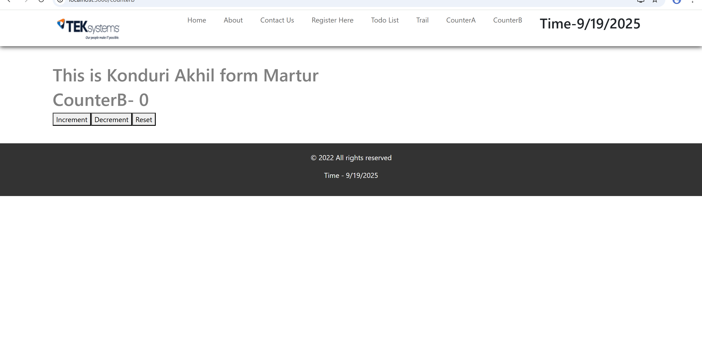
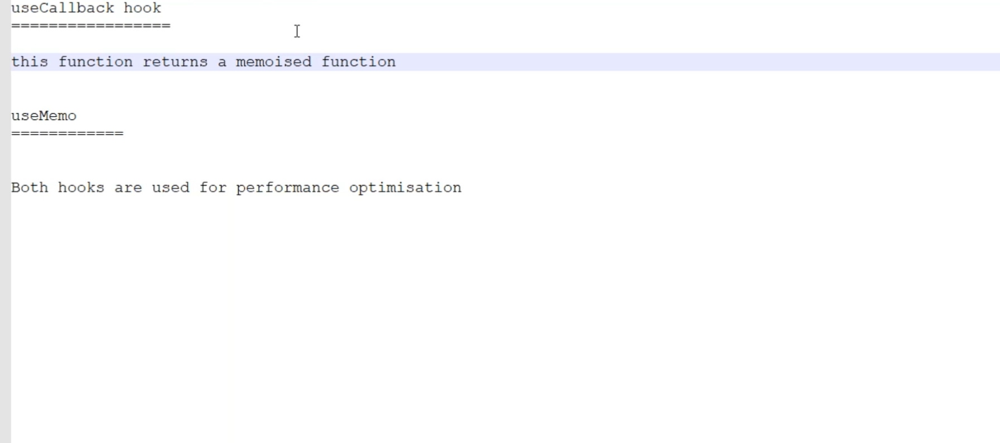
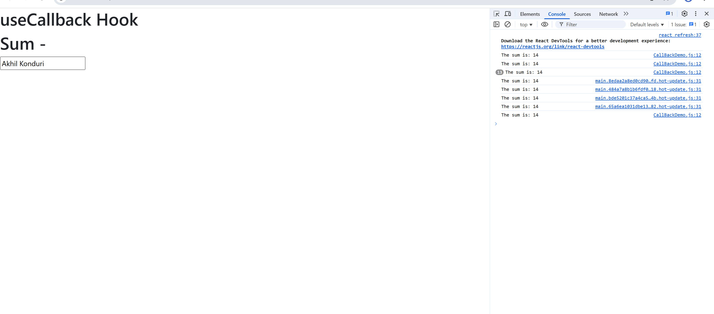
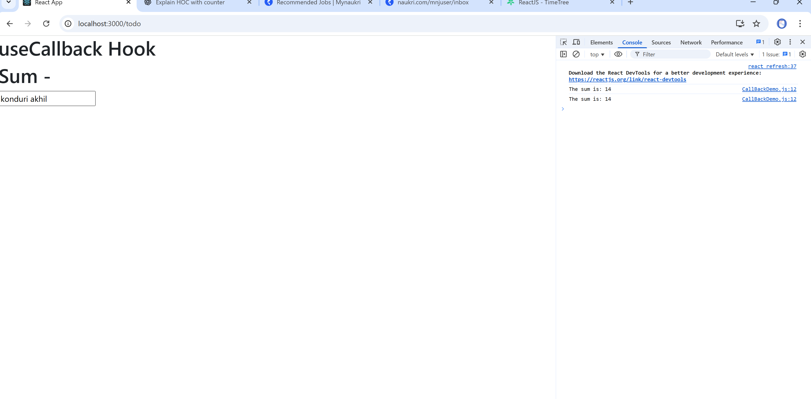
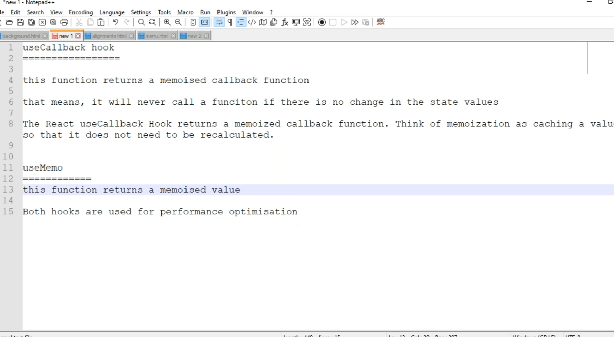
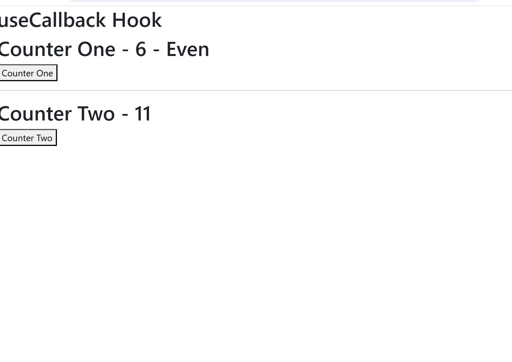

# Day 35(This is continuation to Day34)

- We can also change the Header section with time like below

```jsx
import React from "react";
import logo from "../assets/images/10.png";
import { Link } from "react-router-dom";
import dateInfo from "./dateInfo";

const Header = (props) => {
  const { time } = props;

  return (
    <header id="header">
      <div className="header">
        <div className="logo">
          
        </div>
        <div className="mainmenu">
          <ul className="menu">
            <li>
              <Link to="/">Home</Link>
            </li>
            <li>
              <Link to="/about">About</Link>
            </li>
            <li>
              <Link to="/contact">Contact Us</Link>
            </li>
            <li>
              <Link to="/register">Register Here</Link>
            </li>
            <li>
              <Link to="/todo">Todo List</Link>
            </li>
            <li>
              <Link to="/trail">Trail</Link>
            </li>
            <li>
              <Link to="/countera">CounterA</Link>
            </li>
            <li>
              <Link to="/counterb">CounterB</Link>
            </li>
            <li>
              <h2>Time-{time}</h2>
            </li>
          </ul>
        </div>
      </div>
    </header>
  );
};

export default dateInfo(Header);
```

```jsx
const dateInfo = (OriginalComponent) => {
  const getTimeInfo = (props) => {
    const d = new Date();
    let time = d.toLocaleDateString();

    return <OriginalComponent {...props} time={time} />;
  };
  return getTimeInfo;
};

export default dateInfo;
```



### For Timer

```jsx
import React, { useEffect, useState } from "react";

const dateInfo = (OriginalComponent) => {
  const NewComponent = () => {
    const [timer, setTimer] = useState(new Date().toLocaleString());

    useEffect(() => {
      setInterval(() => {
        setTimer(new Date().toLocaleString());
      }, 1000);
    }, []);

    return <OriginalComponent time={timer} />;
  };
  return NewComponent;
};

export default dateInfo;
```

- we can make the Header component like below

```jsx
import React from "react";
import logo from "../assets/images/10.png";
import { Link } from "react-router-dom";
import dateInfo from "./dateInfo";

const Header = (props) => {
  const { time } = props;

  return (
    <header id="header">
      <div className="header">
        <div className="logo">
          
        </div>
        <div className="mainmenu">
          <ul className="menu">
            <li>
              <Link to="/">Home</Link>
            </li>
            <li>
              <Link to="/about">About</Link>
            </li>
            <li>
              <Link to="/contact">Contact Us</Link>
            </li>
            <li>
              <Link to="/register">Register Here</Link>
            </li>
            <li>
              <Link to="/todo">Todo List</Link>
            </li>
            <li>
              <Link to="/trail">Trail</Link>
            </li>
            <li>
              <Link to="/countera">CounterA</Link>
            </li>
            <li>
              <Link to="/counterb">CounterB</Link>
            </li>
            <li>
              <h1>{time}</h1>
            </li>
          </ul>
        </div>
      </div>
    </header>
  );
};

export default dateInfo(Header);
```

# useCallback and useMemo

- Both hooks are used for performance optimization

# useCallback



```jsx
import React, { useEffect, useState } from "react";

const CallBackDemo = () => {
  const [userInput, setUserInput] = useState("");
  const [num1] = useState(9);
  const [num2] = useState(5);

  const sum = () => num1 + num2;

  useEffect(() => {
    console.log(`The sum is: ${sum()}`);
  }, [sum]);

  return (
    <div>
      <h1>Sum - </h1>
      <input
        type="text"
        value={userInput}
        onChange={(e) => setUserInput(e.target.value)}
      />
    </div>
  );
};

export default CallBackDemo;
```



- For every word press it is **rerendering**
- We want to render it only, when the value gets changed regarding num1 and num2, not for the text box or anything related other than that num1 and num2

#### To avoid unnecessary rerenders we can use useCallback

- useCallback will always check the function

```jsx
import React, { useCallback, useEffect, useState } from "react";

const CallBackDemo = () => {
  const [userInput, setUserInput] = useState("");
  const [result, setResult] = useState(0);
  const [num1] = useState(9);
  const [num2] = useState(5);
  const sum = useCallback(() => num1 + num2, [num1, num2]);

  useEffect(() => {
    console.log(`The sum is: ${sum()}`);
    setResult(sum());
  }, [sum]);

  return (
    <div>
      <h1>Sum - </h1>
      <input
        type="text"
        value={userInput}
        onChange={(e) => setUserInput(e.target.value)}
      />
      <p>
        {userInput} - {result}
      </p>
    </div>
  );
};

export default CallBackDemo;
```




# useMemo


- Let's create **MemoDemo.js**

```jsx
import React from "react";
import MemoDemo from "./MemoDemo";

const App = () => {
  return (
    <div>
      <h1>useCallback Hook</h1>
      <MemoDemo />
    </div>
  );
};

export default App;
```

```jsx
import React, { useState } from "react";

const MemoDemo = () => {
  const [counterOne, setCounterOne] = useState(0);
  const [counterTwo, setCounterTwo] = useState(0);

  const incrementCounterOne = () => {
    setCounterOne(counterOne + 1);
  };
  const incrementCounterTwo = () => {
    setCounterTwo(counterTwo + 1);
  };
  const isEven = () => {
    return counterOne % 2 === 0;
  };

  return (
    <div>
      <h1>
        Counter One - {counterOne} - {isEven() ? "Even" : "Odd"}
      </h1>
      <button onClick={incrementCounterOne}>Counter One</button>
      <hr></hr>
      <h1>Counter Two - {counterTwo}</h1>
      <button onClick={incrementCounterTwo}>Counter Two</button>
    </div>
  );
};

export default MemoDemo;
```

```jsx
import React, { useState } from "react";

const MemoDemo = () => {
  const [counterOne, setCounterOne] = useState(0);
  const [counterTwo, setCounterTwo] = useState(0);

  const incrementCounterOne = () => {
    setCounterOne(counterOne + 1);
  };
  const incrementCounterTwo = () => {
    setCounterTwo(counterTwo + 1);
  };
  const isEven = () => {
    let i = 0;
    while (i <= 110000) i++;
    return counterOne % 2 === 0;
  };

  return (
    <div>
      <h1>
        Counter One - {counterOne} - {isEven() ? "Even" : "Odd"}
      </h1>
      <button onClick={incrementCounterOne}>Counter One</button>
      <hr></hr>
      <h1>Counter Two - {counterTwo}</h1>
      <button onClick={incrementCounterTwo}>Counter Two</button>
    </div>
  );
};

export default MemoDemo;
```

- Here for the counterOne execution it is stoping CounterTwo
- We need to restrict this to counterOne only.

```jsx
import React, { useMemo, useState } from "react";

const MemoDemo = () => {
  const [counterOne, setCounterOne] = useState(0);
  const [counterTwo, setCounterTwo] = useState(0);

  const incrementCounterOne = () => {
    setCounterOne(counterOne + 1);
  };
  const incrementCounterTwo = () => {
    setCounterTwo(counterTwo + 1);
  };
  const isEven = useMemo(() => {
    let i = 0;
    while (i <= 1100000000) i++;
    return counterOne % 2 === 0;
  }, [counterOne]);

  return (
    <div>
      <h1>
        Counter One - {counterOne} - {isEven ? "Even" : "Odd"}
      </h1>
      <button onClick={incrementCounterOne}>Counter One</button>
      <hr></hr>
      <h1>Counter Two - {counterTwo}</h1>
      <button onClick={incrementCounterTwo}>Counter Two</button>
    </div>
  );
};

export default MemoDemo;
```

- Through this **useMemo** we can restrict delay to the **counterOne** not to the **counterTwo**
- useMemo does not return a function it always return a value
  


