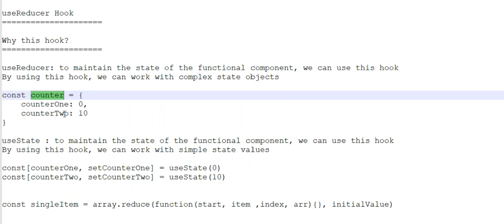
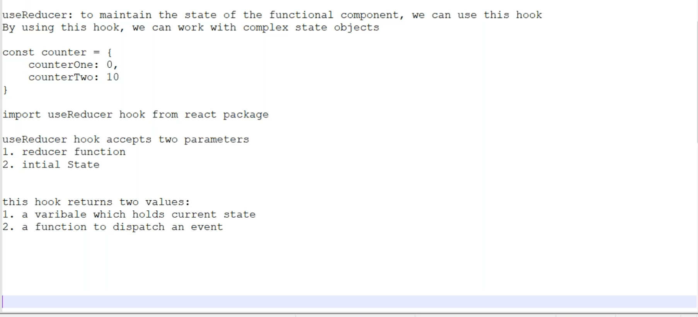
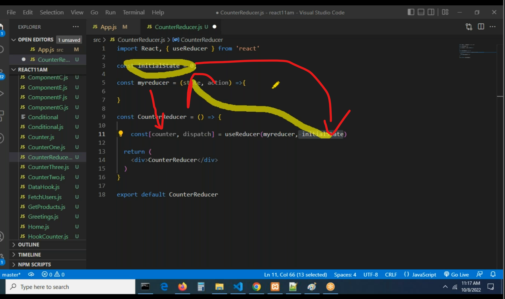
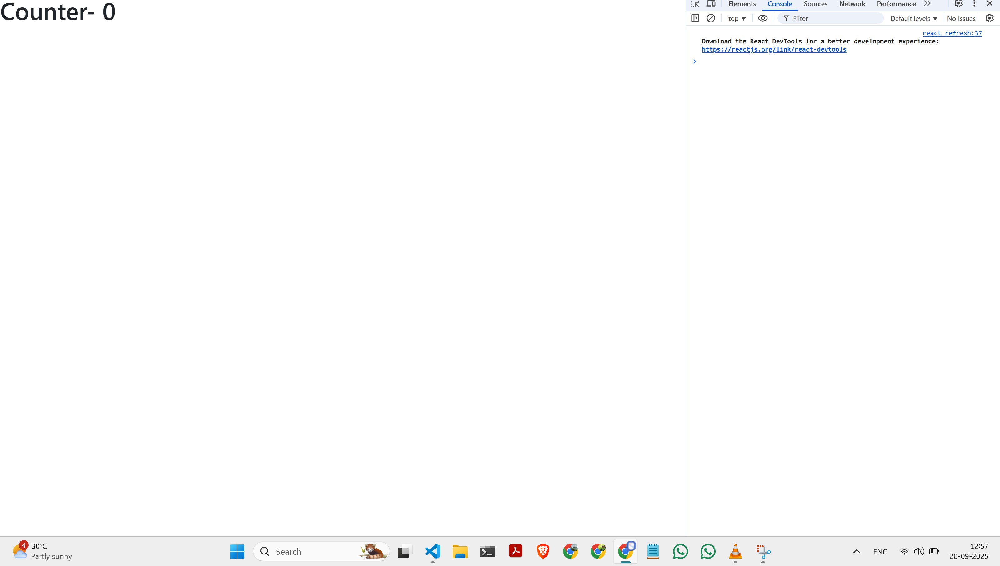
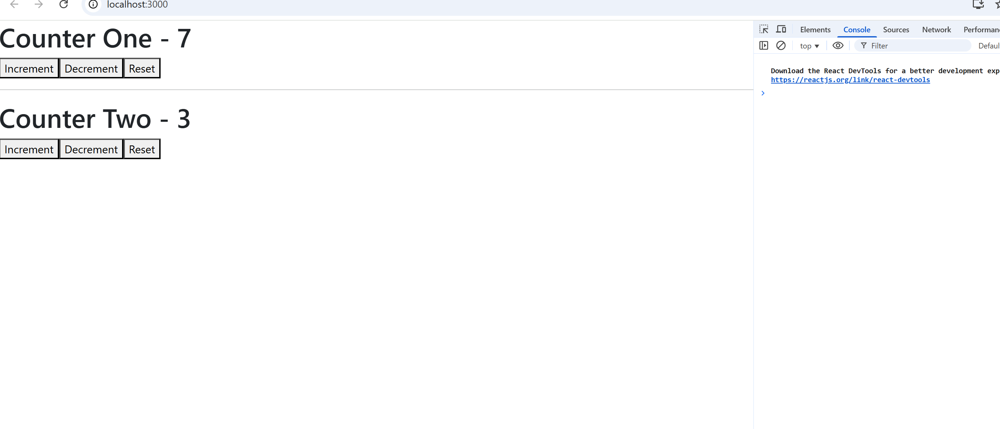

# Day36

# useReducere and useRef

# useReducer


**useReducer Hook**

**Why this hook?**

**useReducer**: to maintain the state of the functional component, we can use this hook
By using this hook, we can work with complex state objects

const counter = {
counterOne: 0,
counterTwp: 10
}
**useState** : to maintain the state of the functional component, we can use this hook
By using this hook, we can work with simple state values

const [counterOne, setCounterOne] = useState(0)
const [counterTwo, setCounterTwo] = useState (10)

const singleItem = array. reduce (function (start, item , index, arr) {}, initialValue)


```jsx
import React from "react";

const CounterReducer = () => {
  return (
    <div>
      <h1>CounterReducer</h1>
    </div>
  );
};

export default CounterReducer;
```

```jsx
import React from "react";
import CounterReducer from "./components/CounterReducer";

const App = () => {
  return (
    <div>
      <CounterReducer />
    </div>
  );
};

export default App;
```



```jsx
import React, { useReducer } from "react";

const initialState = 0;

const myreducer = (state, action) => {
  return state;
};

const CounterReducer = () => {
  const [counter, dispatch] = useReducer(myreducer, initialState);

  return (
    <div>
      <h1>Counter- {counter}</h1>
    </div>
  );
};

export default CounterReducer;
```



```jsx
import React, { useReducer } from "react";

const initialState = 10;

const myreducer = (state, action) => {
  switch (action) {
    case "increment":
      return (state += 1);
    case "decrement":
      return (state -= 1);
    case "reset":
      return (state = 0);
    default:
      return state;
  }
};

const CounterReducer = () => {
  const [counter, dispatch] = useReducer(myreducer, initialState);

  return (
    <div>
      <h1>Counter- {counter}</h1>
      <button onClick={() => dispatch("increment")}>Increment</button>
      <button onClick={() => dispatch("decrement")}>Decrement</button>
      <button onClick={() => dispatch("reset")}>Reset</button>
    </div>
  );
};

export default CounterReducer;
```

```jsx
import React, { useReducer } from "react";

const initialState = {
  counterOne: 0,
};

const counterReducer = (state, action) => {
  return state;
};

const CounterReducerOne = () => {
  const [counter, dispatch] = useReducer(counterReducer, initialState);

  return (
    <div>
      <h1>Counter One - {counter.counterOne}</h1>
    </div>
  );
};

export default CounterReducerOne;
```

```jsx
import React, { useReducer } from "react";

const initialState = {
  counterOne: 0,
  counterTwo: 20,
};

const counterReducer = (state, action) => {
  switch (action) {
    case "increment":
      return {
        ...state,
        counterOne: state.counterOne + 1,
      };
    case "decrement":
      return {
        ...state,
        counterOne: state.counterOne - 1,
      };
    case "reset":
      return {
        ...state,
        counterOne: 0,
      };
    case "incrementtwo":
      return {
        ...state,
        counterTwo: state.counterTwo + 1,
      };
    case "decrementtwo":
      return {
        ...state,
        counterTwo: state.counterTwo - 1,
      };
    case "resettwo":
      return {
        ...state,
        counterTwo: 0,
      };
    default:
      return state;
  }
};

const CounterReducerOne = () => {
  const [counter, dispatch] = useReducer(counterReducer, initialState);

  return (
    <div>
      <h1>Counter One - {counter.counterOne}</h1>
      <button onClick={() => dispatch("increment")}>Increment</button>
      <button onClick={() => dispatch("decrement")}>Decrement</button>
      <button onClick={() => dispatch("reset")}>Reset</button>
      <hr></hr>

      <h1>Counter Two - {counter.counterTwo}</h1>
      <button onClick={() => dispatch("incrementtwo")}>Increment</button>
      <button onClick={() => dispatch("decrementtwo")}>Decrement</button>
      <button onClick={() => dispatch("resettwo")}>Reset</button>
    </div>
  );
};

export default CounterReducerOne;
```



# Ashok

2. useReducer
   it is used to Manage more complex state logic in a component.
   useReducer when we have complex state logic that involves when the next state depends on the
   previous one. It’s also useful for centralizing state updates in a way similar to Redux.
