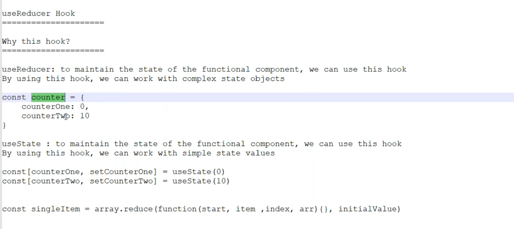
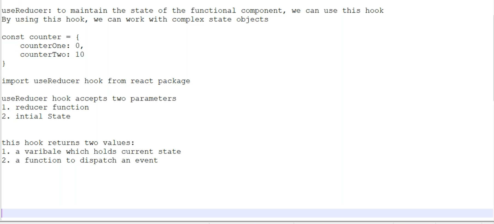
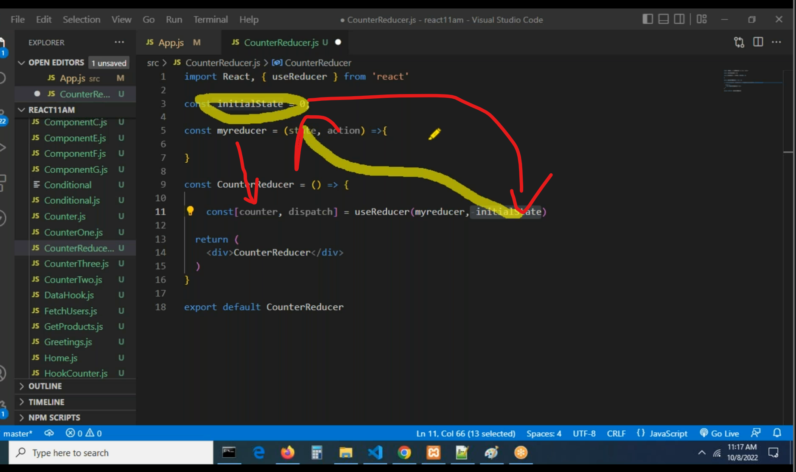
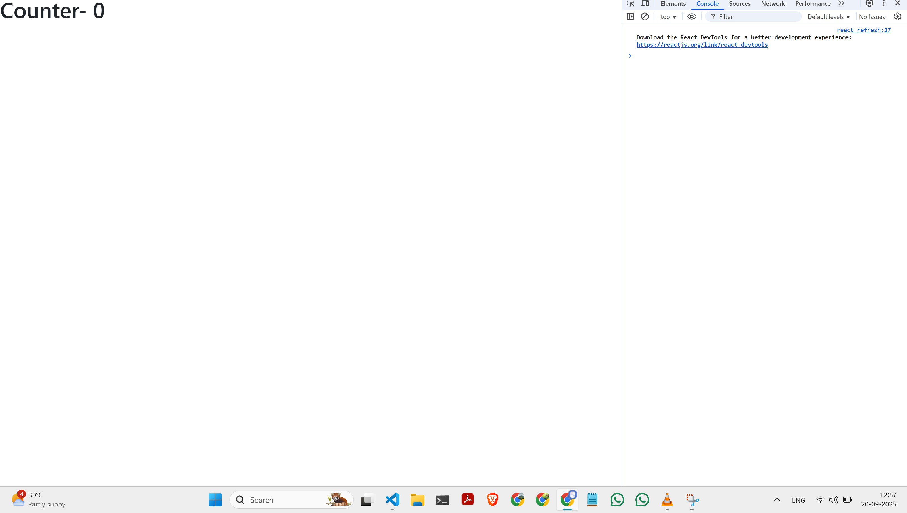
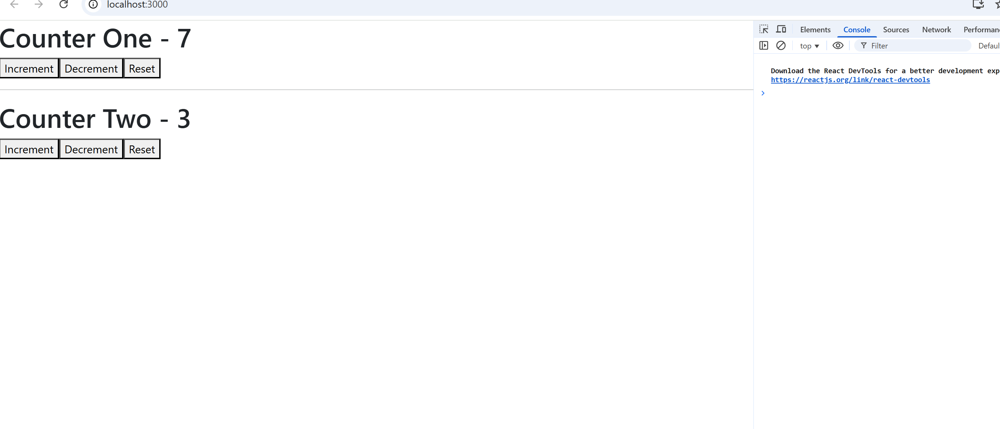

# Day36

# useReducere and useRef

# useReducer


**useReducer Hook**

**Why this hook?**

**useReducer**: to maintain the state of the functional component, we can use this hook
By using this hook, we can work with complex state objects

const counter = {
counterOne: 0,
counterTwp: 10
}
**useState** : to maintain the state of the functional component, we can use this hook
By using this hook, we can work with simple state values

const [counterOne, setCounterOne] = useState(0)
const [counterTwo, setCounterTwo] = useState (10)

const singleItem = array. reduce (function (start, item , index, arr) {}, initialValue)


```jsx
import React from "react";

const CounterReducer = () => {
  return (
    <div>
      <h1>CounterReducer</h1>
    </div>
  );
};

export default CounterReducer;
```

```jsx
import React from "react";
import CounterReducer from "./components/CounterReducer";

const App = () => {
  return (
    <div>
      <CounterReducer />
    </div>
  );
};

export default App;
```



```jsx
import React, { useReducer } from "react";

const initialState = 0;

const myreducer = (state, action) => {
  return state;
};

const CounterReducer = () => {
  const [counter, dispatch] = useReducer(myreducer, initialState);

  return (
    <div>
      <h1>Counter- {counter}</h1>
    </div>
  );
};

export default CounterReducer;
```



```jsx
import React, { useReducer } from "react";

const initialState = 10;

const myreducer = (state, action) => {
  switch (action) {
    case "increment":
      return (state += 1);
    case "decrement":
      return (state -= 1);
    case "reset":
      return (state = 0);
    default:
      return state;
  }
};

const CounterReducer = () => {
  const [counter, dispatch] = useReducer(myreducer, initialState);

  return (
    <div>
      <h1>Counter- {counter}</h1>
      <button onClick={() => dispatch("increment")}>Increment</button>
      <button onClick={() => dispatch("decrement")}>Decrement</button>
      <button onClick={() => dispatch("reset")}>Reset</button>
    </div>
  );
};

export default CounterReducer;
```

```jsx
import React, { useReducer } from "react";

const initialState = {
  counterOne: 0,
};

const counterReducer = (state, action) => {
  return state;
};

const CounterReducerOne = () => {
  const [counter, dispatch] = useReducer(counterReducer, initialState);

  return (
    <div>
      <h1>Counter One - {counter.counterOne}</h1>
    </div>
  );
};

export default CounterReducerOne;
```

```jsx
import React, { useReducer } from "react";

const initialState = {
  counterOne: 0,
  counterTwo: 20,
};

const counterReducer = (state, action) => {
  switch (action) {
    case "increment":
      return {
        ...state,
        counterOne: state.counterOne + 1,
      };
    case "decrement":
      return {
        ...state,
        counterOne: state.counterOne - 1,
      };
    case "reset":
      return {
        ...state,
        counterOne: 0,
      };
    case "incrementtwo":
      return {
        ...state,
        counterTwo: state.counterTwo + 1,
      };
    case "decrementtwo":
      return {
        ...state,
        counterTwo: state.counterTwo - 1,
      };
    case "resettwo":
      return {
        ...state,
        counterTwo: 0,
      };
    default:
      return state;
  }
};

const CounterReducerOne = () => {
  const [counter, dispatch] = useReducer(counterReducer, initialState);

  return (
    <div>
      <h1>Counter One - {counter.counterOne}</h1>
      <button onClick={() => dispatch("increment")}>Increment</button>
      <button onClick={() => dispatch("decrement")}>Decrement</button>
      <button onClick={() => dispatch("reset")}>Reset</button>
      <hr></hr>

      <h1>Counter Two - {counter.counterTwo}</h1>
      <button onClick={() => dispatch("incrementtwo")}>Increment</button>
      <button onClick={() => dispatch("decrementtwo")}>Decrement</button>
      <button onClick={() => dispatch("resettwo")}>Reset</button>
    </div>
  );
};

export default CounterReducerOne;
```

```jsx
import React, { useEffect, useReducer } from "react";
import axios from "axios";

const initialState = {
  loader: true,
  errorMsg: "",
  usersList: [],
};

const dataReducer = (state, action) => {
  switch (action.type) {
    case "FETCH_REQUEST":
      return {
        loader: true,
        errorMsg: "",
        usersList: [],
      };
    case "FETCH_SUCCESS":
      return {
        loader: false,
        errorMsg: "",
        usersList: action.payload,
      };
    case "FETCH_FAIL":
      return {
        loader: false,
        errorMsg: action.payload,
        usersList: [],
      };
    default:
      return state;
  }
};

const FetchDataReducer = () => {
  const [data, dispatch] = useReducer(dataReducer, initialState);

  useEffect(() => {
    dispatch({ type: "FETCH_REQUEST" });

    axios
      .get("https://jsonplaceholder.typicode.com/users")
      .then((res) => {
        dispatch({ type: "FETCH_SUCCESS", payload: res.data });
      })
      .catch((err) => {
        dispatch({ type: "FETCH_FAIL", payload: err.message });
      });
  }, []);

  return (
    <div>
      <h1>UserInformationFetching</h1>

      {data.loader ? "Loading...." : null}
      {data.errorMsg ? data.errorMsg : null}

      <table>
        <thead>
          <tr>
            <th>ID</th>
            <th>Username</th>
            <th>Email</th>
            <th>Phone</th>
            <th>City</th>
          </tr>
        </thead>
        <tbody>
          {data.usersList.length > 0
            ? data.usersList.map((item, index) => (
                <tr key={index}>
                  <td>{item.id}</td>
                  <td>{item.username}</td>
                  <td>{item.email}</td>
                  <td>{item.phone}</td>
                  <td>{item.address.city}</td>
                </tr>
              ))
            : null}
        </tbody>
      </table>
    </div>
  );
};

export default FetchDataReducer;
```



# Ashok

2. **useReducer**
   it is used to Manage more complex state logic in a component.
   useReducer when we have complex state logic that involves when the next state depends on the
   previous one. It’s also useful for centralizing state updates in a way similar to Redux.
   Interview Answer: useState vs useReducer

“In React, both useState and useReducer are hooks used to manage state, but they serve slightly different purposes.

useState is simple and ideal for individual or simple states. For example, updating a single counter value or a toggle button. It’s straightforward—you call the setter function (setState) directly whenever the state changes.

useReducer, on the other hand, is better for complex state logic or when multiple state values are related. Instead of updating state directly, you define a reducer function that handles all possible state transitions based on an action. This makes the state updates predictable, centralized, and easier to debug.

For example, in a counter with multiple actions like increment, decrement, double, and reset, useReducer lets you handle all actions in a single reducer function, rather than having multiple setState calls.

So the advantages of useReducer over useState are:

Centralized and organized state logic

Predictable and maintainable updates

Scales better for complex components