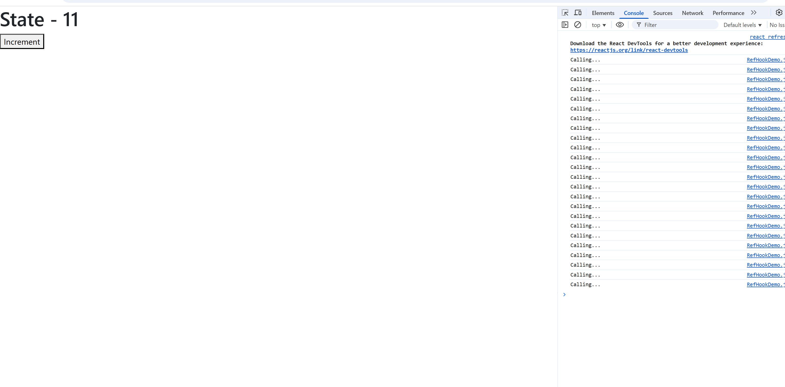
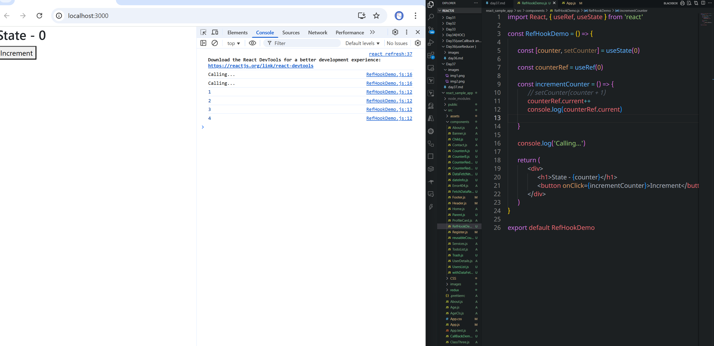
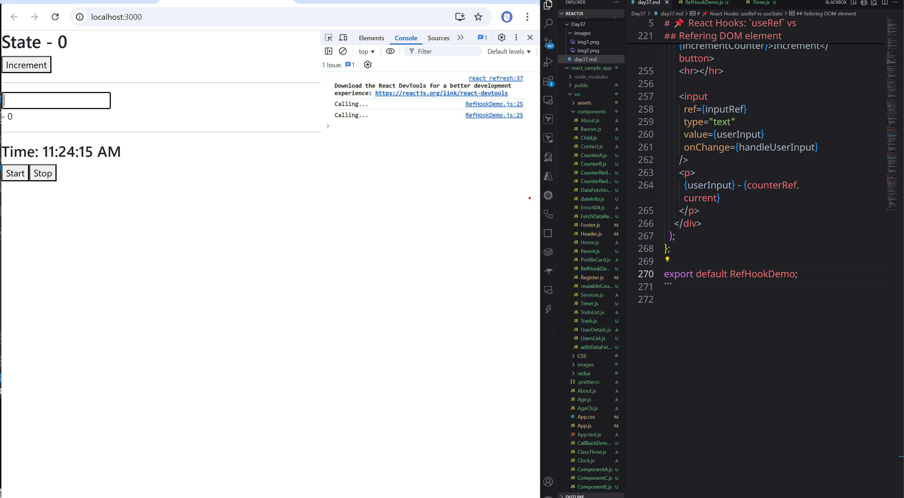
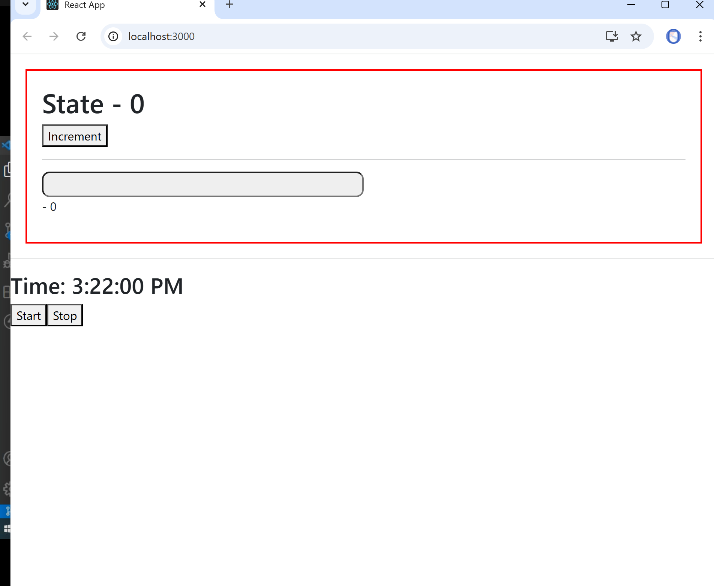

# Day 37

# useRef Hook

# 📌 React Hooks: `useRef` vs `useState`

## 🔹 `useRef` Hook

- **Purpose:**

  - Store a value that persists across re-renders.
  - Reference and interact with DOM elements directly.

- **Behavior:**

  - Updating a `useRef` value **does not trigger** a re-render.

- **Usage:**

  - Useful for storing mutable values (e.g., timers, previous state, form inputs).

- **Import:**

  ```js
  import { useRef } from "react";
  ```

---

## 🔹 `useState` Hook

- **Purpose:**

  - Manage state inside a component.

- **Behavior:**

  - Updating state **does trigger** a re-render.

- **Usage:**

  - Useful for UI state like counters, toggles, form inputs.

- **Import:**

  ```js
  import { useState } from "react";
  ```

---

## ⚖️ Key Difference

| Feature             | `useRef`                                        | `useState`                  |
| ------------------- | ----------------------------------------------- | --------------------------- |
| Triggers re-render? | ❌ No                                           | ✅ Yes                      |
| Stores              | Mutable values, DOM references                  | Component state (UI data)   |
| Common Use Cases    | Accessing DOM, persisting values across renders | Handling dynamic UI changes |

---

```jsx
import React, { useState } from "react";

const RefHookDemo = () => {
  const [counter, setCounter] = useState(0);

  const incrementCounter = () => {
    setCounter(counter + 1);
  };

  console.log("Calling...");

  return (
    <div>
      <h1>State - {counter}</h1>
      <button onClick={incrementCounter}>Increment</button>
    </div>
  );
};

export default RefHookDemo;
```



- For every update function is calling or rendering

```jsx
import React, { useRef, useState } from "react";

const RefHookDemo = () => {
  const [counter, setCounter] = useState(0);

  const counterRef = useRef(0);

  const incrementCounter = () => {
    // setCounter(counter + 1)
    console.log(counterRef);
  };

  console.log("Calling...");

  return (
    <div>
      <h1>State - {counter}</h1>
      <button onClick={incrementCounter}>Increment</button>
    </div>
  );
};

export default RefHookDemo;
```



```jsx
import React, { useRef, useState } from "react";

const RefHookDemo = () => {
  const [counter, setCounter] = useState(0);
  const [userInput, setUserInput] = useState("");

  const counterRef = useRef(0);

  const incrementCounter = () => {
    // setCounter(counter + 1)
    counterRef.current++;
    console.log(counterRef.current);
  };

  const handleUserInput = (event) => {
    setUserInput(event.target.value);
  };

  console.log("Calling...");

  return (
    <div>
      <h1>State - {counter}</h1>
      <button onClick={incrementCounter}>Increment</button>
      <hr></hr>

      <input type="text" value={userInput} onChange={handleUserInput} />
      <p>
        {userInput} - {counterRef.current}
      </p>
    </div>
  );
};

export default RefHookDemo;
```

## Timer with useRef and avoiding unnessesary rerendering

- By using this we can reduce the

```jsx
import React, { useState, useRef } from "react";

const TimerWithRef = () => {
  const [time, setTime] = useState(new Date().toLocaleTimeString());
  const timerRef = useRef(null); // useRef stores timer ID

  const startTimer = () => {
    if (timerRef.current) return; // prevent multiple timers
    timerRef.current = setInterval(() => {
      setTime(new Date().toLocaleTimeString());
    }, 1000);
  };

  const stopTimer = () => {
    clearInterval(timerRef.current);
    timerRef.current = null;
  };

  return (
    <div>
      <h2>Time: {time}</h2>
      <button onClick={startTimer}>Start</button>
      <button onClick={stopTimer}>Stop</button>
    </div>
  );
};

export default TimerWithRef;
```

```jsx
import React, { useState, useRef } from "react";

const TimerWithRef = () => {
  const [time, setTime] = useState(new Date().toLocaleTimeString());
  const timerRef = useRef(null); // useRef stores timer ID

  const startTimer = () => {
    if (timerRef.current) return; // prevent multiple timers
    timerRef.current = setInterval(() => {
      setTime(new Date().toLocaleTimeString());
    }, 1000);
  };

  const stopTimer = () => {
    clearInterval(timerRef.current);
    timerRef.current = null;
  };

  return (
    <div>
      <h2>Time: {time}</h2>
      <button onClick={startTimer}>Start</button>
      <button onClick={stopTimer}>Stop</button>
    </div>
  );
};

export default TimerWithRef;
```

## Refering or Binding to DOM element

- In the **RefHookDemo** on load the page the courser should be on the input box

```jsx
import React, { use, useEffect, useRef, useState } from "react";

const RefHookDemo = () => {
  const [counter, setCounter] = useState(0);
  const [userInput, setUserInput] = useState("");

  const counterRef = useRef(0);
  const inputRef = useRef();

  useEffect(() => {
    inputRef.current.focus();
  }, []);

  const incrementCounter = () => {
    // setCounter(counter + 1)
    counterRef.current++;
    console.log(counterRef.current);
  };

  const handleUserInput = (event) => {
    setUserInput(event.target.value);
  };

  console.log("Calling...");

  return (
    <div>
      <h1>State - {counter}</h1>
      <button onClick={incrementCounter}>Increment</button>
      <hr></hr>

      <input
        ref={inputRef}
        type="text"
        value={userInput}
        onChange={handleUserInput}
      />
      <p>
        {userInput} - {counterRef.current}
      </p>
    </div>
  );
};

export default RefHookDemo;
```



```jsx
import React, { use, useEffect, useRef, useState } from "react";

const RefHookDemo = () => {
  const [counter, setCounter] = useState(0);
  const [userInput, setUserInput] = useState("");

  const counterRef = useRef(0);
  const inputRef = useRef();

  useEffect(() => {
    inputRef.current.style.cssText =
      "background-color: #efefef; width: 50%; width: 50%; height: 34px";
    inputRef.current.focus();
  }, []);

  const incrementCounter = () => {
    // setCounter(counter + 1)
    counterRef.current++;
    console.log(counterRef.current);
  };

  const handleUserInput = (event) => {
    setUserInput(event.target.value);
  };

  console.log("Calling...");

  return (
    <div>
      <h1>State - {counter}</h1>
      <button onClick={incrementCounter}>Increment</button>
      <hr></hr>

      <input
        ref={inputRef}
        type="text"
        value={userInput}
        onChange={handleUserInput}
      />
      <p>
        {userInput} - {counterRef.current}
      </p>
    </div>
  );
};

export default RefHookDemo;
```

- We can access it by using id also

```jsx
import React, { use, useEffect, useRef, useState } from "react";

const RefHookDemo = () => {
  const [counter, setCounter] = useState(0);
  const [userInput, setUserInput] = useState("");

  const counterRef = useRef(0);
  const inputRef = useRef();

  useEffect(() => {
    inputRef.current.style.cssText =
      "background-color: #efefef; width: 50%; width: 50%; height: 34px";
    document.getElementById("input").style.borderRadius = "10px";
    inputRef.current.focus();
  }, []);

  const incrementCounter = () => {
    // setCounter(counter + 1)
    counterRef.current++;
    console.log(counterRef.current);
  };

  const handleUserInput = (event) => {
    setUserInput(event.target.value);
  };

  console.log("Calling...");

  return (
    <div>
      <h1>State - {counter}</h1>
      <button onClick={incrementCounter}>Increment</button>
      <hr></hr>

      <input
        id="input"
        ref={inputRef}
        type="text"
        value={userInput}
        onChange={handleUserInput}
      />
      <p>
        {userInput} - {counterRef.current}
      </p>
    </div>
  );
};

export default RefHookDemo;
```

```jsx
import React, { use, useEffect, useRef, useState } from "react";

const RefHookDemo = () => {
  const [counter, setCounter] = useState(0);
  const [userInput, setUserInput] = useState("");

  const counterRef = useRef(0);
  const inputRef = useRef();
  const divRef = useRef();

  useEffect(() => {
    inputRef.current.style.cssText =
      "background-color: #efefef; width: 50%; width: 50%; height: 34px";
    document.getElementById("input").style.borderRadius = "10px";
    divRef.current.style.cssText =
      "margin: 20px; border: 2px solid red; padding: 20px ";
    inputRef.current.focus();
  }, []);

  const incrementCounter = () => {
    // setCounter(counter + 1)
    counterRef.current++;
    console.log(counterRef.current);
  };

  const handleUserInput = (event) => {
    setUserInput(event.target.value);
  };

  console.log("Calling...");

  return (
    <div ref={divRef}>
      <h1>State - {counter}</h1>
      <button onClick={incrementCounter}>Increment</button>
      <hr></hr>

      <input
        id="input"
        ref={inputRef}
        type="text"
        value={userInput}
        onChange={handleUserInput}
      />
      <p>
        {userInput} - {counterRef.current}
      </p>
    </div>
  );
};

export default RefHookDemo;
```



---

# 📌 Custom Hooks in React

## 1. What are Hooks?

- Hooks are special functions provided by React to use state and lifecycle features inside functional components.
- Examples of built-in hooks:

  - `useState` → state management
  - `useEffect` → side effects
  - `useContext` → context API
  - `useRef` → reference to DOM or mutable value

---

## 2. Why Custom Hooks?

- Built-in hooks are great, but sometimes we need **our own reusable logic**.
- **Custom Hooks** allow us to:

  - Encapsulate logic in a function
  - Reuse it across multiple components
  - Keep components clean and focused on UI

---

## 3. Key Rules of Custom Hooks

1. Custom hooks are **normal JavaScript functions**, but their name **must start with `use`** (e.g., `useFetch`, `useForm`).
2. They can **call other hooks inside** (`useState`, `useEffect`, etc.).
3. They should not be called inside loops, conditions, or nested functions.

---

## 4. Syntax of a Custom Hook

```jsx
// Custom hook (must start with "use")
function useCustomHook() {
  // use any React hooks inside
  const [count, setCount] = React.useState(0);

  const increment = () => setCount(count + 1);

  // return values or functions for reuse
  return { count, increment };
}
```

Usage:

```jsx
function Counter() {
  const { count, increment } = useCustomHook();

  return (
    <div>
      <p>Count: {count}</p>
      <button onClick={increment}>+1</button>
    </div>
  );
}
```

---

## 5. Advantages of Custom Hooks

✅ Makes logic **reusable** across components
✅ Helps in **cleaner, modular code**
✅ Improves **readability & maintainability**
✅ Reduces **code duplication**

---

## 6. Example: `useFetch` Custom Hook

```jsx
import { useState, useEffect } from "react";

function useFetch(url) {
  const [data, setData] = useState(null);
  const [loading, setLoading] = useState(true);

  useEffect(() => {
    fetch(url)
      .then((res) => res.json())
      .then((data) => {
        setData(data);
        setLoading(false);
      });
  }, [url]);

  return { data, loading };
}
```

Usage:

```jsx
function App() {
  const { data, loading } = useFetch(
    "https://jsonplaceholder.typicode.com/posts"
  );

  if (loading) return <p>Loading...</p>;

  return (
    <ul>
      {data.map((post) => (
        <li key={post.id}>{post.title}</li>
      ))}
    </ul>
  );
}
```

---

## 7. When to Create a Custom Hook?

- If **multiple components need the same logic** (e.g., fetching data, form handling, authentication).
- If a component becomes **too large** because of logic mixing with UI.
- To keep code **DRY (Don’t Repeat Yourself)**.

---

⚡ **Summary**:

- Custom Hooks = functions that reuse stateful logic.
- Name must start with `use`.
- Keep UI and logic separate for cleaner, reusable React code.

---

- Create separate folder for the custom hooks **hooks**

```jsx
import React from "react";
import useFetch from "../hooks/useFetch";

const Data = () => {
  const userInfo = useFetch("https://jsonplaceholder.typicode.com/users");

  console.log(userInfo);
  return <div>Data</div>;
};

export default Data;
```

```jsx
import { useEffect, useState } from "react";

const useFetch = (url) => {
  const [data, setData] = useState(null);

  useEffect(() => {
    fetch(url)
      .then((res) => res.json())
      .then((data) => setData(data));
  }, [url]);

  return data;
};

export default useFetch;
```

```jsx
import React from "react";
import useFetch from "../hooks/useFetch";

const Data = () => {
  const userInfo = useFetch("https://jsonplaceholder.typicode.com/users");
  const covid19Summery = useFetch("https://disease.sh/v3/covid-19/countries");

  console.log(covid19Summery);

  console.log(userInfo);
  return <div>Data</div>;
};

export default Data;
```

```jsx
const useCounter = () => {
  return "Hello World";
};
export default useCounter;
```

```jsx
import React from "react";
import useFetch from "../hooks/useFetch";
import useCounter from "../hooks/useCounter";

const Data = () => {
  const userInfo = useFetch("https://jsonplaceholder.typicode.com/users");
  const covid19Summery = useFetch("https://disease.sh/v3/covid-19/countries");
  const msg = useCounter();

  console.log(covid19Summery);
  console.log(userInfo);
  console.log(msg);

  return <div>Data - {msg}</div>;
};

export default Data;
```

```jsx
const useCounter = (name, dob) => {
  return "Hello " + name + ", aged about " + calculateAge(dob);
};

const calculateAge = (birthday) => {
  birthday = new Date(birthday);
  return new Number(
    (new Date().getTime() - birthday.getTime()) / 31536000000
  ).toFixed(0);
};
export default useCounter;
```

```jsx
import React from "react";
import useFetch from "../hooks/useFetch";
import useCounter from "../hooks/useCounter";

const Data = () => {
  const userInfo = useFetch("https://jsonplaceholder.typicode.com/users");
  const covid19Summery = useFetch("https://disease.sh/v3/covid-19/countries");
  const msg = useCounter("Akhil", "06/21/1998");

  console.log(covid19Summery);
  console.log(userInfo);
  console.log(msg);

  return (
    <div>
      <h1>Data - {msg}</h1>
    </div>
  );
};

export default Data;
```
