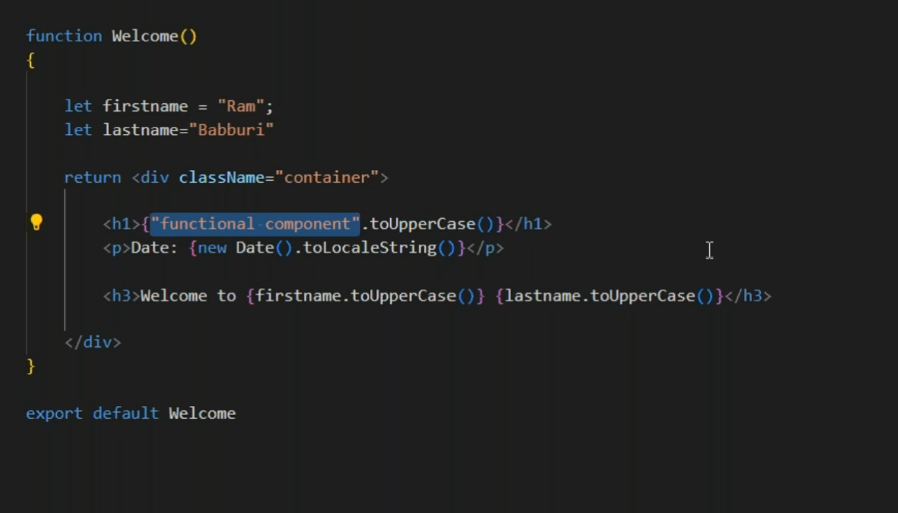
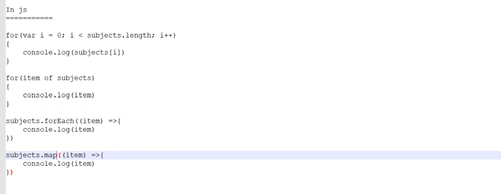
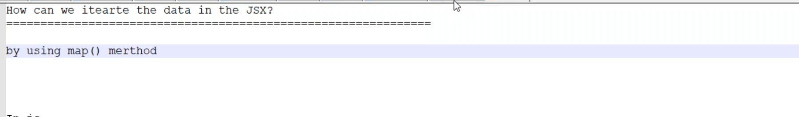

## How can we iterate data in JSX


```jsx
const Subjects = () => {
    
    var subjets = ['html', 'css', 'react', 'js', 'angular'];

    return(
        <div>
            <h1>Subjects List: </h1>
            <ul>
                {
                    subjets.map((subject, index) => {
                        return  <li key={index}>{subject}</li>;                       
                    })
                }
            </ul>
        </div>
    )
}
export default Subjects
```

```jsx
import { Component } from "react";

class SubjectsCls extends Component
{
    subjets = ['html', 'css', 'react', 'js', 'angular'];

    render(){
        return (
            <div>
                <h1>Subjects From Class Component</h1>
                <h2>Total no of subjects: {this.subjets.length}</h2> 
                <ol>
                    {
                        this.subjets.map((subject, index) => {
                            return <li key={index}>{subject}</li>
                        })
                    }
                </ol>
            </div>
        )
    }
}

export default SubjectsCls
```
# ChatGPT
Here's your `.md` (Markdown) notes version of the above React code and explanation, formatted clearly for study or documentation:

---

# 📘 How to Iterate Data in JSX

## ✅ Using Functional Component

```jsx
const Subjects = () => {
    
    var subjets = ['html', 'css', 'react', 'js', 'angular'];

    return (
        <div>
            <h1>Subjects List:</h1>
            <ul>
                {
                    subjets.map((subject, index) => {
                        return <li key={index}>{subject}</li>;                       
                    })
                }
            </ul>
        </div>
    )
}

export default Subjects;
```

### 🔍 Key Points:

* `subjets.map()` is used to loop over the array.
* Each `<li>` must have a unique `key` prop (here, using `index`).
* `return` is necessary when using `{}` inside `.map()`.

---

## ✅ Using Class Component

```jsx
import { Component } from "react";

class SubjectsCls extends Component
{
    subjets = ['html', 'css', 'react', 'js', 'angular'];

    render(){
        return (
            <div>
                <h1>Subjects From Class Component</h1>
                <h2>Total no of subjects: {this.subjets.length}</h2> 
                <ol>
                    {
                        this.subjets.map((subject, index) => {
                            return <li key={index}>{subject}</li>
                        })
                    }
                </ol>
            </div>
        )
    }
}

export default SubjectsCls;
```

### 🔍 Key Points:

* In class components, access array with `this.subjets`.
* Use `.map()` just like in functional components.
* You can also display array info like `length`.

---

## 🖼️ Screenshot References


---

Let me know if you'd like a downloadable `.md` file or want to add explanation for `key`, JSX syntax, or other features.
