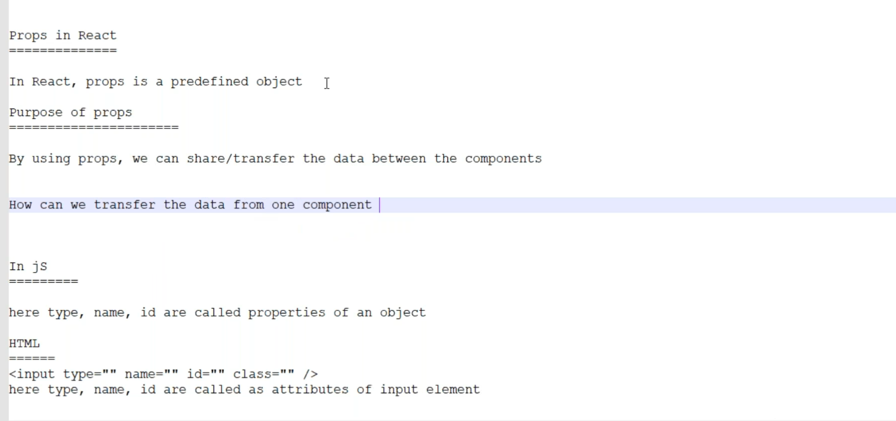
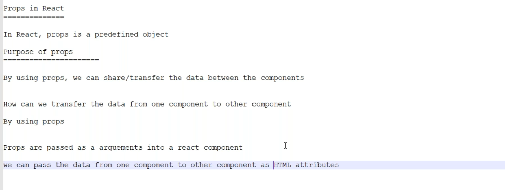
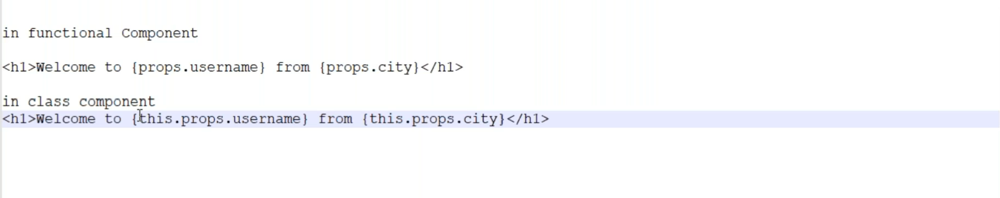

# Props in React


```jsx
import logo from './logo.svg';
import './App.css';
import WelcomeUser from './WelcomeUser';

var name = 'Akhil Konduri';
var city = 'Hyderabad';
var nationality = 'Indian'
const subjects = ['HTML', 'CSS', 'JS', 'React']

function App() {
  return (
    <div className="App" >
      <h1>Welcome to React</h1>
      <h2>My Name is {name} and I am from {city} </h2>
      <WelcomeUser username='Akhil' pincode='523301' state='AP' nation={nationality} subjects={subjects} />
    </div>
  );
}

export default App;
```
```jsx

const WelcomeUser = (props) =>{

    console.log(props)
    return <div>
        <h1>Welcome  {props.username} and your pincode is {props.pincode} and your state is {props.state} and your country is {props.nation}</h1>
        <h1>Subjects:</h1>
        <h2>{props.subjects.join(', ')}</h2>
    </div>
}
export default WelcomeUser 
```
```jsx

const WelcomeUser = (props) =>{

    console.log(props)
    return <div>
        <h1>Welcome  {props.username} and your pincode is {props.pincode} and your state is {props.state} and your country is {props.nation}</h1>
        <h1>Subjects:</h1>
        <ul>
            {
            props.subjects.map((item, index)=><li key={index}>
                {item}
            </li>)
            }
        </ul>
    </div>
}
export default WelcomeUser 
```
```jsx
import logo from './logo.svg';
import './App.css';
import WelcomeUser from './WelcomeUser';

var name = 'Akhil Konduri';
var city = 'Hyderabad';
var nationality = 'Indian'
const subjects = ['HTML', 'CSS', 'JS', 'React']
const users = [
  {firstname:"Ram", lastname: "Babburi", city: "Ongole", pincode:500032, dob: "07-25-1987"},
  {firstname:"Anand", lastname:"Pabbineedi", city: "Kakinada", pincode:533001, dob:"04-16-2000"},
  {firstname:"Vinod", lastname: "Katte", city: "Anantapur", pincode:515671, dob:"06-25-2002"},
  {firstname:"Lakshman", lastname:"D", city:"Kakinada", pincode:533006, dob:"02-16-1998"},
  {firstname:"Sri Raj", lastname: "Kamisetti", city: "Amalapuram", pincode:533249, dob:"09-09-1998"}
];

function App() {
  return (
    <div className="App" >
      <h1>Welcome to React</h1>
      <h2>My Name is {name} and I am from {city} </h2>
      <WelcomeUser userslist={users} username='Akhil' pincode='523301' state='AP' nation={nationality} subjects={subjects} />
    </div>
  );
}

export default App;
```

```jsx

const WelcomeUser = (props) =>{

    console.log(props)
    return <div>
        <h1>Welcome  {props.username} and your pincode is {props.pincode} and your state is {props.state} and your country is {props.nation}</h1>
        <h1>Subjects:</h1>
        <ul>
            {
            props.subjects.map((item, index)=><li key={index}>
                {item}
            </li>)
            }
        </ul>
        <table border={1} cellPadding={10}>
                <thead>
                    <tr>
                        <th>ID</th>
                        <th>Name</th>
                        <th>City</th>
                        <th>Pincode</th>
                        <th>dob</th>
                    </tr>
                </thead>
                <tbody>
                    {
                        props.userslist.map((item, index) => <tr key={index}>
                            <td >{index+1}</td>
                            <td >{item.firstname+' '+item.lastname}</td>
                            <td >{item.city}</td>
                            <td >{item.pincode}</td>
                            <td>{item.dob}</td>
                        </tr>)
                    }
                </tbody>
            </table>
    </div>
}
export default WelcomeUser 
```


```jsx
import logo from './logo.svg';
import './App.css';
import WelcomeUser from './WelcomeUser';
import WelcomeCls from './WelcomeCls';

var name = 'Akhil Konduri';
var city = 'Hyderabad';
var nationality = 'Indian'
const subjects = ['HTML', 'CSS', 'JS', 'React']
const users = [
  {firstname:"Ram", lastname: "Babburi", city: "Ongole", pincode:500032, dob: "07-25-1987"},
  {firstname:"Anand", lastname:"Pabbineedi", city: "Kakinada", pincode:533001, dob:"04-16-2000"},
  {firstname:"Vinod", lastname: "Katte", city: "Anantapur", pincode:515671, dob:"06-25-2002"},
  {firstname:"Lakshman", lastname:"D", city:"Kakinada", pincode:533006, dob:"02-16-1998"},
  {firstname:"Sri Raj", lastname: "Kamisetti", city: "Amalapuram", pincode:533249, dob:"09-09-1998"}
];

function App() {
  return (
    <div className="App" >
      <h1>App Heading</h1>
      {/* <WelcomeUser userslist={users} username='Akhil' pincode='523301' state='AP' nation={nationality} subjects={subjects} /> */}
      <WelcomeCls userslist={users} username='Akhil' pincode='523301' state='AP' nation={nationality} subjects={subjects} /> 
    </div>
  );
}

export default App;

```

```jsx
import { Component } from "react";

class WelcomeCls extends Component
{
    
    render()
    {
        return <div>
            <h1>Class Component</h1>
            <h2>Welcome {this.props.username}</h2>
            <table border={1} cellPadding={10}>
                <thead>
                    <tr>
                        <th>ID</th>
                        <th>Name</th>
                        <th>City</th>
                        <th>Pincode</th>
                        <th>dob</th>
                    </tr>
                </thead>
                <tbody>
                    {
                        this.props.userslist.map((item, index) => <tr key={index}>
                            <td >{index+1}</td>
                            <td >{item.firstname+' '+item.lastname}</td>
                            <td >{item.city}</td>
                            <td >{item.pincode}</td>
                            <td>{item.dob}</td>
                        </tr>)
                    }
                </tbody>
            </table>
        </div>
        
    }
}
export default WelcomeCls
```
## passing functions as props
```jsx
import logo from './logo.svg';
import './App.css';
import WelcomeUser from './WelcomeUser';
import WelcomeCls from './WelcomeCls';

var name = 'Akhil Konduri';
var city = 'Hyderabad';
var nationality = 'Indian'
const subjects = ['HTML', 'CSS', 'JS', 'React']
const users = [
  {firstname:"Ram", lastname: "Babburi", city: "Ongole", pincode:500032, dob: "07-25-1987"},
  {firstname:"Anand", lastname:"Pabbineedi", city: "Kakinada", pincode:533001, dob:"04-16-2000"},
  {firstname:"Vinod", lastname: "Katte", city: "Anantapur", pincode:515671, dob:"06-25-2002"},
  {firstname:"Lakshman", lastname:"D", city:"Kakinada", pincode:533006, dob:"02-16-1998"},
  {firstname:"Sri Raj", lastname: "Kamisetti", city: "Amalapuram", pincode:533249, dob:"09-09-1998"}
];

const calculateAge = (birthday) =>{
  birthday = new Date(birthday);
  return new Number((new Date().getTime() - birthday.getTime()) / 31536000000).toFixed(0);
}


function App() {
  return (
    <div className="App" >
      <h1>App Heading</h1>
      <WelcomeUser agecalculator={calculateAge} userslist={users} username='Akhil' pincode='523301' state='AP' nation={nationality} subjects={subjects} />
      <hr></hr>
      <WelcomeCls agecalculator={calculateAge} userslist={users} username='Akhil' pincode='523301' state='AP' nation={nationality} subjects={subjects} /> 
    </div>
  );
}

export default App;

```
```jsx
import { Component } from "react";

class WelcomeCls extends Component
{
    
    render()
    {
        console.log(this.props)
        return <div>
            <h1>Class Component</h1>
            <h2>Welcome {this.props.username}</h2>
            <table border={1} cellPadding={10}>
                <thead>
                    <tr>
                        <th>ID</th>
                        <th>Name</th>
                        <th>City</th>
                        <th>Pincode</th>
                        <th>dob</th>
                    </tr>
                </thead>
                <tbody>
                    {
                        this.props.userslist.map((item, index) => <tr key={index}>
                            <td >{index+1}</td>
                            <td >{item.firstname+' '+item.lastname}</td>
                            <td >{item.city}</td>
                            <td >{item.pincode}</td>
                            <td >{ this.props.agecalculator(item.dob)} years old</td>
                        </tr>)
                    }
                </tbody>
            </table>
        </div>
        
    }
}
export default WelcomeCls
```
```jsx
import { Component } from "react";

class WelcomeCls extends Component
{
    
    render()
    {
        console.log(this.props)
        return <div>
            <h1>Class Component</h1>
            <h2>Welcome {this.props.username}</h2>
            <table border={1} cellPadding={10}>
                <thead>
                    <tr>
                        <th>ID</th>
                        <th>Name</th>
                        <th>City</th>
                        <th>Pincode</th>
                        <th>dob</th>
                    </tr>
                </thead>
                <tbody>
                    {
                        this.props.userslist.map((item, index) => <tr key={index}>
                            <td >{index+1}</td>
                            <td >{item.firstname+' '+item.lastname}</td>
                            <td >{item.city}</td>
                            <td >{item.pincode}</td>
                            <td >{ this.props.agecalculator(item.dob)} years old</td>
                        </tr>)
                    }
                </tbody>
            </table>
        </div>
        
    }
}
export default WelcomeCls
```

# ChatGPT Notes

---

# 📘 React Props Notes

## ✅ What are Props in React?

- **Props** stands for **Properties**.
- Props are **read-only** and **immutable** data passed from a **parent component** to a **child component**.
- Props allow components to be **dynamic and reusable**.
- Props are received as **arguments** to a component function.
- They are similar to **HTML attributes** but in React, they can also include **objects**, **arrays**, and even **functions**.

---

## 🧠 Why are Props Used?

- **To transfer data** between components (typically parent → child).
- Enables **component reusability**.
- Helps in **separation of concerns** by keeping components modular.

---

## 💡 Props vs HTML Attributes

| Concept        | In JavaScript Object       | In HTML Input Element        |
|----------------|-----------------------------|------------------------------|
| `type`, `name`, `id` | Properties of an object     | Attributes of HTML elements  |

---

## 🔧 Passing Props in React (Functional Component)

### 📦 Parent Component (App.js)

```jsx
import WelcomeUser from './WelcomeUser';

function App() {
  const name = "Akhil Konduri";
  const city = "Hyderabad";
  const nationality = "Indian";
  const subjects = ['HTML', 'CSS', 'JS', 'React'];
  
  return (
    <div className="App">
      <h1>Welcome to React</h1>
      <h2>My Name is {name} and I am from {city}</h2>
      <WelcomeUser
        username="Akhil"
        pincode="523301"
        state="AP"
        nation={nationality}
        subjects={subjects}
      />
    </div>
  );
}
```

---

### 📥 Child Component (WelcomeUser.js)

```jsx
const WelcomeUser = (props) => {
  return (
    <div>
      <h1>
        Welcome {props.username}, your pincode is {props.pincode}, state is {props.state}, and country is {props.nation}
      </h1>
      <h2>Subjects:</h2>
      <ul>
        {props.subjects.map((item, index) => (
          <li key={index}>{item}</li>
        ))}
      </ul>
    </div>
  );
};

export default WelcomeUser;
```

---

## 📊 Passing Arrays of Objects via Props

```js
const users = [
  { firstname: "Ram", lastname: "Babburi", city: "Ongole", pincode: 500032, dob: "07-25-1987" },
  { firstname: "Anand", lastname: "Pabbineedi", city: "Kakinada", pincode: 533001, dob: "04-16-2000" },
  { firstname: "Vinod", lastname: "Katte", city: "Anantapur", pincode: 515671, dob: "06-25-2002" },
  { firstname: "Lakshman", lastname: "D", city: "Kakinada", pincode: 533006, dob: "02-16-1998" },
  { firstname: "Sri Raj", lastname: "Kamisetti", city: "Amalapuram", pincode: 533249, dob: "09-09-1998" }
];
```

---

## 🧑‍🏫 Props in Class Components

```jsx
import { Component } from "react";

class WelcomeCls extends Component {
  render() {
    return (
      <div>
        <h1>Class Component</h1>
        <h2>Welcome {this.props.username}</h2>
        <table border={1} cellPadding={10}>
          <thead>
            <tr>
              <th>ID</th>
              <th>Name</th>
              <th>City</th>
              <th>Pincode</th>
              <th>DOB</th>
            </tr>
          </thead>
          <tbody>
            {this.props.userslist.map((item, index) => (
              <tr key={index}>
                <td>{index + 1}</td>
                <td>{item.firstname + ' ' + item.lastname}</td>
                <td>{item.city}</td>
                <td>{item.pincode}</td>
                <td>{item.dob}</td>
              </tr>
            ))}
          </tbody>
        </table>
      </div>
    );
  }
}

export default WelcomeCls;
```

* Use `this.props` in class components instead of `props`.
* Logic and rendering remain the same.

---

## 🧪 Passing Functions as Props

You can pass JavaScript functions as props and call them in child components.

### 🎯 Example: Calculate Age

```js
const calculateAge = (dob) => {
  dob = new Date(dob);
  return new Number((new Date().getTime() - dob.getTime()) / 31536000000).toFixed(0);
};
```

### ✅ Usage in Functional or Class Component

```jsx
<td>{props.agecalculator(user.dob)} years old</td>
```

Or in class component:

```jsx
<td>{this.props.agecalculator(user.dob)} years old</td>
```

---

## ⚠️ Important Notes

* Props are **read-only**; they cannot be modified in the child component.
* You can destructure `props` like:

  ```jsx
  const WelcomeUser = ({ username, pincode, state }) => { ... }
  ```
* Props are **unidirectional** (parent → child). For child → parent communication, use **callback functions** passed via props.
* Arrays, objects, strings, numbers, booleans, and functions can all be passed as props.

---

## 📌 Summary

| Feature             | Functional Component | Class Component           |
| ------------------- | -------------------- | ------------------------- |
| Access props        | `props.propName`     | `this.props.propName`     |
| Pass props          | As HTML attributes   | Same                      |
| Handle functions    | Via `props.fnName()` | Via `this.props.fnName()` |
| Render list of data | Use `.map()`         | Use `.map()`              |
| Reusability         | Highly encouraged    | Encouraged                |

---

```

---
